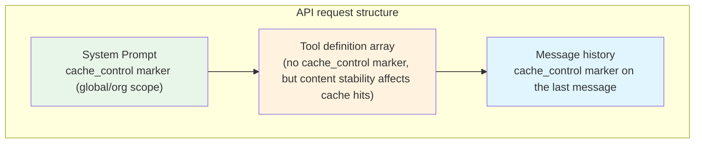

# Chapter 8: Prompt Cache Cross-Cutting — How Cross-Module Caching Strategy Reduces API Cost

> This chapter is chapter 8 of the *Deep Dive into Claude Code Source* series. From a cross-cutting (横切) perspective, we will examine how the Prompt Cache mechanism runs through the three major modules of System Prompt, the conversation main loop (对话主循环), and context management, and how Fork Agent enables cross-process cache sharing through precise parameter alignment.

## Why Understand Prompt Cache?

The largest cost in calling large-model APIs comes from **input tokens**. In a typical interactive Claude Code session, each user question sends the full System Prompt (roughly 20,000 tokens), tool definitions (several thousand tokens), and the entire previous conversation history to the API. If a conversation runs for 50 turns and each turn averages 50,000 input tokens, one session consumes 2.5 million input tokens.

Anthropic's Prompt Caching mechanism can reduce the cost of **repeated prefixes** by 90%. The server caches the request prefix (System Prompt + tool definitions + message-history prefix). As long as the next request's prefix is byte-for-byte identical, it can be read from the cache instead of being processed again.

But the "byte-for-byte identical" requirement is extremely strict: **one extra space, a different JSON field order, or a changed `cache_control` scope is enough to invalidate the entire cache.** Claude Code's source is full of defensive designs around this constraint. This chapter reveals the full picture of those designs.

This chapter answers three core questions:

1. **How is the cache marked?** The placement strategy and scope choice for `cache_control` markers.
2. **How is the cache protected?** From System Prompt segmentation to Cached Microcompact, how Claude Code avoids cache invalidation.
3. **How is the cache shared?** How Fork Agent uses `CacheSafeParams` to achieve cross-thread cache hits.

---

> **In-chapter guide**: §1 Cache basics and marker strategy → §2 System Prompt chunking → §3 Cached Microcompact → §4 Fork Agent's `CacheSafeParams` → §5 Cache break detection → §6 Full picture → §7 Transferable patterns. The first five sections follow the cache "lifecycle" (establish → chunk → protect → share → invalidate), the sixth gives a cross-cutting overview, and the seventh extracts reusable patterns.

## 1. Prompt Cache Basics and Marker Strategy

### 1.1 `cache_control` Markers: Telling the API "Cache Up to Here"

Anthropic Prompt Caching works by placing `cache_control: { type: 'ephemeral' }` markers at specific positions in the request. The API server caches all content from the start of the request through the last `cache_control` marker.

Claude Code places cache markers at two levels:



> **Note**: The `toolToAPISchema()` interface supports a `cacheControl` option (`utils/api.ts:129`), but the current main query path **does not pass `cacheControl`** when calling it (`services/api/claude.ts:1235-1245`). The source contains a legacy comment, "toolSchemas (which carries the cache_control marker)" (`claude.ts:1388`), but that no longer matches current behavior: the tool array currently has no `cache_control` marker. Even so, byte stability of tool definitions remains critical. They are part of the API request prefix, and any change invalidates the cache. This is also why `toolSchemaCache` exists (see section 5).

**Layer 1: markers on System Prompt blocks**

```typescript
// services/api/claude.ts:3213-3237
export function buildSystemPromptBlocks(
  systemPrompt: SystemPrompt,
  enablePromptCaching: boolean,
  options?: {
    skipGlobalCacheForSystemPrompt?: boolean
    querySource?: QuerySource
  },
): TextBlockParam[] {
  return splitSysPromptPrefix(systemPrompt, {
    skipGlobalCacheForSystemPrompt: options?.skipGlobalCacheForSystemPrompt,
  }).map(block => {
    return {
      type: 'text' as const,
      text: block.text,
      ...(enablePromptCaching &&
        block.cacheScope !== null && {
          cache_control: getCacheControl({
            scope: block.cacheScope,
            querySource: options?.querySource,
          }),
        }),
    }
  })
}
```

Each System Prompt block can set its own `cacheScope` (`'global'`, `'org'`, or `null`), and different scopes have different cache-sharing ranges.

**Layer 2: markers on message history**

```typescript
// services/api/claude.ts:3063-3106
export function addCacheBreakpoints(
  messages: (UserMessage | AssistantMessage)[],
  enablePromptCaching: boolean,
  querySource?: QuerySource,
  useCachedMC = false,
  newCacheEdits?: CachedMCEditsBlock | null,
  pinnedEdits?: CachedMCPinnedEdits[],
  skipCacheWrite = false,
): MessageParam[] {
  // Place the cache_control marker only on the last message.
  // In skipCacheWrite mode, place it on the second-to-last message
  // to avoid contaminating the cache with the fork child process's tail message.
  const markerIndex = skipCacheWrite ? messages.length - 2 : messages.length - 1
  const result = messages.map((msg, index) => {
    const addCache = index === markerIndex
    if (msg.type === 'user') {
      return userMessageToMessageParam(msg, addCache, enablePromptCaching, querySource)
    }
    return assistantMessageToMessageParam(msg, addCache, enablePromptCaching, querySource)
  })
  // ...
}
```

The key design is: **each request has only one message-level `cache_control` marker**. The comment explains why: the API server's KV cache page manager (`page_manager/index.rs`) keeps only the local-attention KV pages at the last `cache_control` position. If two markers are placed, the pages at the second-to-last position are protected for one extra turn but are never restored, wasting cache space.

### 1.2 Cache Scope: Global vs Org vs No Marker

The `getCacheControl()` function returns different cache-control parameters depending on the conditions:

```typescript
// services/api/claude.ts:358-374
export function getCacheControl({
  scope,
  querySource,
}: {
  scope?: CacheScope
  querySource?: QuerySource
} = {}): {
  type: 'ephemeral'
  ttl?: '1h'
  scope?: CacheScope
} {
  return {
    type: 'ephemeral',
    ...(should1hCacheTTL(querySource) && { ttl: '1h' }),
    ...(scope === 'global' && { scope }),
  }
}
```

The three scopes mean:

| Scope | Meaning | Wire representation | Applicable content |
|--------|------|--------------|---------|
| `global` | Cache shared by all users | `{ type: 'ephemeral', scope: 'global' }` | Immutable static parts of the System Prompt |
| `org` | Shared by users in the same organization | `{ type: 'ephemeral' }` (omits the `scope` field) | Organization-level identical parts of the System Prompt |
| `null` (no marker) | Do not set cache | No `cache_control` added | Dynamic content that differs on every request |

Note that `getCacheControl()` explicitly sends the `scope` field on the wire only when `scope === 'global'` (`claude.ts:372`). `org` is an internal Claude Code abstraction (`cacheScope: 'org'`). In actual API requests, it is represented by omitting `scope`, which is Anthropic API's default cache behavior: organization-level isolation.

### 1.3 Cache TTL: 5 Minutes vs 1 Hour

The default `ephemeral` cache TTL is 5 minutes. Eligible users (Anthropic internal employees, or paid subscribers who are not in overage) can get a 1-hour TTL:

```typescript
// services/api/claude.ts:393-434
function should1hCacheTTL(querySource?: QuerySource): boolean {
  // 3P Bedrock users opt in through an environment variable.
  if (getAPIProvider() === 'bedrock' &&
      isEnvTruthy(process.env.ENABLE_PROMPT_CACHING_1H_BEDROCK)) {
    return true
  }

  // Latch eligibility at the session level to prevent a mid-session TTL flip
  // from invalidating the cache.
  let userEligible = getPromptCache1hEligible()
  if (userEligible === null) {
    userEligible = process.env.USER_TYPE === 'ant' ||
      (isClaudeAISubscriber() && !currentLimits.isUsingOverage)
    setPromptCache1hEligible(userEligible)  // latch; do not recompute
  }
  if (!userEligible) return false

  // The GrowthBook-configured allowlist is also latched.
  let allowlist = getPromptCache1hAllowlist()
  if (allowlist === null) {
    const config = getFeatureValue_CACHED_MAY_BE_STALE<{
      allowlist?: string[]
    }>('tengu_prompt_cache_1h_config', {})
    allowlist = config.allowlist ?? []
    setPromptCache1hAllowlist(allowlist)  // latch
  }
  // ...
}
```

Notice the **latch mode**: TTL-related decisions are locked at the session level. Even if the user later exceeds quota or the GrowthBook configuration changes, the TTL that has already taken effect does not change. This prevents mid-session TTL flips (from `1h` to `5m`, or the reverse), because a TTL flip changes the serialized bytes of `cache_control` and invalidates the cache.

---

## 2. System Prompt Cache Chunking Strategy

### 2.1 `SYSTEM_PROMPT_DYNAMIC_BOUNDARY`: The Boundary Between Static and Dynamic Content

The System Prompt consists of multiple sections (see chapter 6). Some are shared by all users, such as core instructions and tool-use rules. Others are session-specific, such as Git status, `CLAUDE.md` content, and language settings. If they were merged into one block and marked for caching, any change in the dynamic part would invalidate the entire System Prompt cache.

Claude Code's solution is to insert a **boundary marker**:

```typescript
// constants/prompts.ts:114-115
export const SYSTEM_PROMPT_DYNAMIC_BOUNDARY =
  '__SYSTEM_PROMPT_DYNAMIC_BOUNDARY__'
```

This marker is inserted between the static sections and dynamic sections of the System Prompt:

```typescript
// constants/prompts.ts:568-577
  getActionsSection(),
  getUsingYourToolsSection(enabledTools),
  getSimpleToneAndStyleSection(),
  getOutputEfficiencySection(),
  // === BOUNDARY MARKER - DO NOT MOVE OR REMOVE ===
  ...(shouldUseGlobalCacheScope() ? [SYSTEM_PROMPT_DYNAMIC_BOUNDARY] : []),
  // --- Dynamic content (registry-managed) ---
  ...resolvedDynamicSections,
```

### 2.2 `splitSysPromptPrefix()`: Split into Cache Blocks by Boundary

`splitSysPromptPrefix()` splits the System Prompt into at most four blocks based on the boundary marker, and assigns each block a different `cacheScope`:

```typescript
// utils/api.ts:321-435
export function splitSysPromptPrefix(
  systemPrompt: SystemPrompt,
  options?: { skipGlobalCacheForSystemPrompt?: boolean },
): SystemPromptBlock[] {
  // ...
```

Depending on the conditions, there are two main splitting strategies, plus a degraded MCP branch:

| Mode | Condition | Block layout |
|------|------|--------|
| **Global cache mode** | 1P user + boundary marker present + no non-deferred MCP tools | Attribution (`null`) → Prefix (`null`) → static content (`global`) → dynamic content (`null`) |
| **With MCP tools** | 1P + non-deferred MCP tools present | `skipGlobalCacheForSystemPrompt=true`, degraded to Attribution (`null`) → Prefix (`org`) → remaining content (`org`) |
| **Default mode** | 3P user or no boundary | Attribution (`null`) → Prefix (`org`) → remaining content (`org`) |

The core idea of global cache mode is: **mark the static part with `global` scope, so it can be shared across all users**. When 100,000 users send the same static System Prompt prefix, only one cached copy is needed. The dynamic part has no cache marker (`null`), because it differs for each user.

When non-deferred MCP tools are present, the main query path sets `globalCacheStrategy` to `'none'` (`claude.ts:1225-1229`), and uses `skipGlobalCacheForSystemPrompt` to degrade the System Prompt to `org` scope. The reason is that MCP tool definitions are user-level: different users configure different MCP servers. If the System Prompt uses `global` scope while the tool definitions differ, the overall prefix cannot match.

> **Source archaeology (dead-code path)**: The `GlobalCacheStrategy` type definition still retains the value `'tool_based'` (`services/api/logging.ts:46`), but the current main query path can only produce `'system_prompt'` or `'none'`. **`'tool_based'` never appears at runtime.** It is a legacy enum value from an earlier design, or a placeholder reserved for future tool-level caching. Readers only need to know it is dead code; there is no need to spend effort relating it to the current cache strategy.

### 2.3 `systemPromptSection()` vs `DANGEROUS_uncachedSystemPromptSection()`

Each System Prompt section is managed through a registry mechanism that controls caching behavior:

```typescript
// constants/systemPromptSections.ts:20-38
export function systemPromptSection(
  name: string,
  compute: ComputeFn,
): SystemPromptSection {
  return { name, compute, cacheBreak: false }  // cached; computed only once
}

export function DANGEROUS_uncachedSystemPromptSection(
  name: string,
  compute: ComputeFn,
  _reason: string,  // must explain why the cache has to be broken
): SystemPromptSection {
  return { name, compute, cacheBreak: true }  // recomputed every time
}
```

Sections created with `systemPromptSection()` are evaluated only on first use, then cached in bootstrap state and reused. `DANGEROUS_uncachedSystemPromptSection()` is recomputed every time. The `DANGEROUS_` prefix in the function name is intentional: **if the computed result changes, it breaks Prompt Cache**. The caller is required to pass a `_reason` parameter explaining why this is necessary.

```typescript
// constants/systemPromptSections.ts:43-58
export async function resolveSystemPromptSections(
  sections: SystemPromptSection[],
): Promise<(string | null)[]> {
  const cache = getSystemPromptSectionCache()
  return Promise.all(
    sections.map(async s => {
      if (!s.cacheBreak && cache.has(s.name)) {
        return cache.get(s.name) ?? null  // cache hit; do not recompute
      }
      const value = await s.compute()
      setSystemPromptSectionCacheEntry(s.name, value)
      return value
    }),
  )
}
```

---

## 3. Cached Microcompact: Cleaning Context While Protecting Cache

### 3.1 The Problem: Cleaning Old Tool Results vs Protecting the Cached Prefix

In long conversations, early tool-call results, such as file contents read by `FileRead` or command output from `Bash`, occupy many tokens but become less useful as the conversation progresses. Chapter 7 introduced the Microcompact mechanism for cleaning them.

Traditional Microcompact has a problem, however: **modifying message content changes the bytes of the request prefix and invalidates the cache**. Suppose the server has cached the prefix `[sysprompt, msg1, msg2(tool_result="file content..."), msg3]`. If we replace `msg2`'s `tool_result` with `"[Old tool result content cleared]"`, the prefix no longer matches.

### 3.2 Two Paths: Time-Based vs Cached Microcompact

The `microcompactMessages()` function implements two mutually exclusive paths:

```typescript
// services/compact/microCompact.ts:253-293
export async function microcompactMessages(
  messages: Message[],
  toolUseContext?: ToolUseContext,
  querySource?: QuerySource,
): Promise<MicrocompactResult> {
  // Path 1: Time-based (cache has expired; clean directly).
  const timeBasedResult = maybeTimeBasedMicrocompact(messages, querySource)
  if (timeBasedResult) {
    return timeBasedResult
  }

  // Path 2: Cached MC (cache is still hot; clean through the cache_edits API).
  if (feature('CACHED_MICROCOMPACT')) {
    const mod = await getCachedMCModule()
    const model = toolUseContext?.options.mainLoopModel ?? getMainLoopModel()
    if (mod.isCachedMicrocompactEnabled() &&
        mod.isModelSupportedForCacheEditing(model) &&
        isMainThreadSource(querySource)) {
      return await cachedMicrocompactPath(messages, querySource)
    }
  }

  return { messages }
}
```

**Time-based path** (cold cache):

When the time since the last API response exceeds the configured threshold (5 minutes by default, meaning the cache has expired), the message content is modified directly:

```typescript
// services/compact/microCompact.ts:446-529
function maybeTimeBasedMicrocompact(
  messages: Message[],
  querySource: QuerySource | undefined,
): MicrocompactResult | null {
  const trigger = evaluateTimeBasedTrigger(messages, querySource)
  if (!trigger) return null

  // The cache is cold; replace content directly.
  const result: Message[] = messages.map(message => {
    // ...replace tool_result content with TIME_BASED_MC_CLEARED_MESSAGE
  })

  // Reset Cached MC state, because the cache is invalid and old state is useless.
  resetMicrocompactState()
  return { messages: result }
}
```

**Cached MC path** (hot cache):

When the cache is still valid, Claude Code does not modify message content. Instead, it uses Anthropic's `cache_edits` API to tell the server: "delete the content of these tool_results in the cache."

```typescript
// services/compact/microCompact.ts:305-399
async function cachedMicrocompactPath(
  messages: Message[],
  querySource: QuerySource | undefined,
): Promise<MicrocompactResult> {
  const mod = await getCachedMCModule()
  const state = ensureCachedMCState()

  // Register newly discovered tool results.
  for (const message of messages) {
    if (message.type === 'user' && Array.isArray(message.message.content)) {
      for (const block of message.message.content) {
        if (block.type === 'tool_result' && compactableToolIds.has(block.tool_use_id)) {
          mod.registerToolResult(state, block.tool_use_id)
        }
      }
    }
  }

  // Compute which tool results should be deleted.
  const toolsToDelete = mod.getToolResultsToDelete(state)

  if (toolsToDelete.length > 0) {
    // Create a cache_edits block, which will be injected later in addCacheBreakpoints.
    const cacheEdits = mod.createCacheEditsBlock(state, toolsToDelete)
    pendingCacheEdits = cacheEdits  // store in a module-level variable for the API layer to consume

    // Return messages unchanged; cache_edits is injected at the API layer.
    return {
      messages,  // note: message content is not modified!
      compactionInfo: {
        pendingCacheEdits: { trigger: 'auto', deletedToolIds: toolsToDelete, ... }
      },
    }
  }
  return { messages }
}
```

### 3.3 Injecting `cache_edits` and `cache_reference`

Cached MC centers on two API extension fields:

- **`cache_reference`**: marked on `tool_result` blocks, telling the API "this result can be referenced for deletion."
- **`cache_edits`**: placed in a user message, instructing the API to "delete the content corresponding to these `cache_reference` values."

These fields are injected in `addCacheBreakpoints()`:

```typescript
// services/api/claude.ts:3141-3208
// 1. Insert new cache_edits into the last user message.
if (newCacheEdits && result.length > 0) {
  const dedupedNewEdits = deduplicateEdits(newCacheEdits)
  if (dedupedNewEdits.edits.length > 0) {
    for (let i = result.length - 1; i >= 0; i--) {
      const msg = result[i]
      if (msg && msg.role === 'user') {
        insertBlockAfterToolResults(msg.content, dedupedNewEdits)
        pinCacheEdits(i, newCacheEdits)  // record position; future requests must resend at the same position
        break
      }
    }
  }
}

// 2. Add cache_reference to tool_results in the cached prefix.
if (enablePromptCaching) {
  for (let i = 0; i < lastCCMsg; i++) {
    // ...add cache_reference: tool_use_id to each tool_result block
    msg.content[j] = Object.assign({}, block, {
      cache_reference: block.tool_use_id,
    })
  }
}
```

**Pinned edits mechanism**: once a `cache_edits` block is sent at a certain position, every subsequent request must resend it at the **same message index**. This is an API requirement. The `cache_edits` block itself is part of the request prefix; if it appears in only one request, the prefix becomes inconsistent.

```typescript
// services/compact/microCompact.ts:100-118
export function getPinnedCacheEdits(): PinnedCacheEdits[] {
  if (!cachedMCState) return []
  return cachedMCState.pinnedEdits
}

export function pinCacheEdits(
  userMessageIndex: number,
  block: CacheEditsBlock,
): void {
  if (cachedMCState) {
    cachedMCState.pinnedEdits.push({ userMessageIndex, block })
  }
}
```

---

## 4. Fork Agent Cache Sharing: `CacheSafeParams`

### 4.1 Why Does Fork Agent Need to Share Cache?

Claude Code forks background child agents for many tasks: session memory extraction, prompt suggestion generation, post-turn summaries, and more. Each fork initiates an independent API request. If every fork has a different request prefix, it cannot reuse the cache already created by the main thread. That means every fork has to reprocess tens of thousands of prefix tokens, which is a major waste.

### 4.2 `CacheSafeParams`: Parameters That Must Match the Parent Thread

The `CacheSafeParams` type precisely defines which parameters must stay identical to the parent thread in order to share cache:

```typescript
// utils/forkedAgent.ts:46-68
/**
 * Parameters that must be identical between the fork and parent API requests
 * to share the parent's prompt cache. The Anthropic API cache key is composed of:
 * system prompt, tools, model, messages (prefix), and thinking config.
 */
export type CacheSafeParams = {
  /** System prompt - must match parent for cache hits */
  systemPrompt: SystemPrompt
  /** User context - prepended to messages, affects cache */
  userContext: { [k: string]: string }
  /** System context - appended to system prompt, affects cache */
  systemContext: { [k: string]: string }
  /** Tool use context containing tools, model, and other options */
  toolUseContext: ToolUseContext
  /** Parent context messages for prompt cache sharing */
  forkContextMessages: Message[]
}
```

The API cache key consists of five elements: **system prompt + tools + model + messages prefix + thinking config**. `CacheSafeParams` explicitly carries the first four. The thinking config is inherited from `toolUseContext.options.thinkingConfig`.

### 4.3 `saveCacheSafeParams()` / `getLastCacheSafeParams()`: Reusing Parameters Across Turns

After each main-thread turn finishes, `handleStopHooks` saves the current `CacheSafeParams`:

```typescript
// utils/forkedAgent.ts:70-81
// Slot written by handleStopHooks after each turn so post-turn forks
// (promptSuggestion, postTurnSummary, /btw) can share the main loop's
// prompt cache without each caller threading params through.
let lastCacheSafeParams: CacheSafeParams | null = null

export function saveCacheSafeParams(params: CacheSafeParams | null): void {
  lastCacheSafeParams = params
}

export function getLastCacheSafeParams(): CacheSafeParams | null {
  return lastCacheSafeParams
}
```

Later post-turn forks, such as prompt suggestion and session memory, read this slot directly, without every caller having to thread the parameters manually.

### 4.4 `runForkedAgent()`: Sending Requests with Cache-Safe Parameters

```typescript
// utils/forkedAgent.ts:489-556
export async function runForkedAgent({
  promptMessages,
  cacheSafeParams,
  // ...
}: ForkedAgentParams): Promise<ForkedAgentResult> {
  const {
    systemPrompt,
    userContext,
    systemContext,
    toolUseContext,
    forkContextMessages,
  } = cacheSafeParams

  // Create an isolated context: mutable state is isolated, but options remain unchanged,
  // so the model and tools stay the same.
  const isolatedToolUseContext = createSubagentContext(toolUseContext, overrides)

  // Message prefix = full parent history + the fork's new prompt.
  const initialMessages: Message[] = [...forkContextMessages, ...promptMessages]

  // Query with the same systemPrompt, userContext, and systemContext as the parent.
  for await (const message of query({
    messages: initialMessages,
    systemPrompt,
    userContext,
    systemContext,
    canUseTool,
    toolUseContext: isolatedToolUseContext,
    querySource,
    maxOutputTokensOverride: maxOutputTokens,
    // ...
  })) {
    // collect results...
  }
}
```

### 4.5 Byte-Exact Prompt Threading in Fork Subagent

Fork child agents have an even more aggressive cache optimization: **they directly reuse the parent thread's already rendered System Prompt bytes**, instead of calling `getSystemPrompt()` again to regenerate them.

```typescript
// tools/AgentTool/forkSubagent.ts:44-71
/**
 * The getSystemPrompt here is unused: the fork path passes
 * `override.systemPrompt` with the parent's already-rendered system prompt
 * bytes, threaded via `toolUseContext.renderedSystemPrompt`. Reconstructing
 * by re-calling getSystemPrompt() can diverge (GrowthBook cold→warm) and
 * bust the prompt cache; threading the rendered bytes is byte-exact.
 */
export const FORK_AGENT = {
  // ...
  getSystemPrompt: () => '',  // never called
} satisfies BuiltInAgentDefinition
```

Why not regenerate the System Prompt? Because GrowthBook, the A/B testing framework, may have moved from "cold" (uninitialized) to "warm" (loaded) by the time the fork runs. That can cause the generated System Prompt to include different feature-flag branches. Even when the semantics are identical, byte-level differences invalidate the cache.

### 4.6 Cloning `contentReplacementState`: Keeping Tool-Result Replacement Decisions Consistent

There is a subtle detail in `forkedAgent.ts`'s `createSubagentContext()`: the replacement state for tool results (`contentReplacementState`) is **cloned** by default rather than recreated from scratch.

```typescript
// utils/forkedAgent.ts:389-403
// Clone by default (not fresh): cache-sharing forks process parent
// messages containing parent tool_use_ids. A fresh state would see
// them as unseen and make divergent replacement decisions → wire
// prefix differs → cache miss. A clone makes identical decisions →
// cache hit.
contentReplacementState:
  overrides?.contentReplacementState ??
  (parentContext.contentReplacementState
    ? cloneContentReplacementState(parentContext.contentReplacementState)
    : undefined),
```

Background: Claude Code has a tool-result budget management mechanism that replaces oversized tool results, such as a 10,000-line file read, with summarized versions stored on disk. The replacement decision is recorded in `contentReplacementState`. If a fork child process used fresh state, it could make different replacement decisions while processing the parent thread's message prefix. Some results replaced in the parent thread might remain as original text in the fork. That would change the serialized message bytes and cause a cache miss.

```typescript
// utils/toolResultStorage.ts:399-412
/**
 * Clone replacement state for a cache-sharing fork.
 * The fork needs state identical to the source at fork time so
 * enforceToolResultBudget makes the same choices → same wire prefix →
 * prompt cache hit.
 */
export function cloneContentReplacementState(
  source: ContentReplacementState,
): ContentReplacementState {
  return {
    seenIds: new Set(source.seenIds),
    replacements: new Map(source.replacements),
  }
}
```

### 4.7 Byte-Identical Construction of Fork Messages

The fork child process's message prefix must also be constructed carefully to maximize cache sharing:

```typescript
// tools/AgentTool/forkSubagent.ts:95-105
/**
 * For prompt cache sharing, all fork children must produce byte-identical
 * API request prefixes. This function:
 * 1. Keeps the full parent assistant message (all tool_use blocks, thinking, text)
 * 2. Builds a single user message with tool_results for every tool_use block
 *    using an identical placeholder, then appends a per-child directive text block
 *
 * Result: [...history, assistant(all_tool_uses), user(placeholder_results..., directive)]
 * Only the final text block differs per child, maximizing cache hits.
 */
```

All fork child processes share the same `tool_result` placeholder text (`'Fork started — processing in background'`). Only the final directive text block differs. Because the `cache_control` marker is placed on the last block of the last message, and the directive is exactly that last block, all identical content before it can hit the cache.

```typescript
// tools/AgentTool/forkSubagent.ts:91-93
/** Placeholder text used for all tool_result blocks in the fork prefix.
 * Must be identical across all fork children for prompt cache sharing. */
const FORK_PLACEHOLDER_RESULT = 'Fork started — processing in background'
```

### 4.8 `skipCacheWrite`: Avoiding Cache Pollution from Forks

Fork child processes are usually fire-and-forget: once they finish, their tail messages are discarded. Their tail messages do not need to be cached.

```typescript
// services/api/claude.ts:3084-3089
// For fire-and-forget forks (skipCacheWrite) we shift the
// marker to the second-to-last message: that's the last shared-prefix
// point, so the write is a no-op merge on mycro (entry already exists)
// and the fork doesn't leave its own tail in the KVCC.
const markerIndex = skipCacheWrite ? messages.length - 2 : messages.length - 1
```

In `skipCacheWrite` mode, the `cache_control` marker is moved to the second-to-last message. This is exactly the last shared prefix point between the parent thread and the fork. Writing cache at this point is a no-op, because the parent thread has already cached it, while the fork's own tail message is not written into KVCC (Key-Value Cache Collection). This avoids cache pollution.

---

## 5. Prompt Cache Break Detection: When Cache Is Invalidated

### 5.1 Two-Stage Detection Mechanism

Even with all the protections above, the cache can still be invalidated unexpectedly. Claude Code implements a complete **cache break detection system** to help the team track and diagnose cache problems:

```typescript
// services/api/promptCacheBreakDetection.ts:247-430
// Stage 1 (pre-call): record a snapshot of the current request's prompt state.
export function recordPromptState(snapshot: PromptStateSnapshot): void {
  // Compute systemPrompt hash, tools hash, model, betas, and so on.
  // Compare them with the previous request snapshot and record what changed.
}

// Stage 2 (post-call): inspect cache tokens in the API response.
export async function checkResponseForCacheBreak(
  querySource, cacheReadTokens, cacheCreationTokens, messages, agentId, requestId
): Promise<void> {
  // If cache_read_tokens drops by more than 5%, classify it as a cache break.
  // Combine this with pending changes from stage 1 to generate a reason analysis.
}
```

The detector tracks **12 dimensions that can cause cache breaks**:

| Dimension | Description |
|------|------|
| `systemPromptChanged` | System Prompt text changed (hash after removing `cache_control`) |
| `toolSchemasChanged` | Tool definitions changed (per-tool hash comparison) |
| `modelChanged` | Model switched |
| `fastModeChanged` | Fast mode toggled |
| `cacheControlChanged` | `cache_control` scope or TTL changed |
| `globalCacheStrategyChanged` | Global cache strategy changed (currently only `system_prompt` / `none` are used) |
| `betasChanged` | Beta header list changed |
| `autoModeChanged` | Auto mode toggled |
| `overageChanged` | Usage overage status changed |
| `cachedMCChanged` | Cached microcompact toggled |
| `effortChanged` | Effort level changed |
| `extraBodyChanged` | Extra API body parameters changed |

### 5.2 Latch Mode: Preventing State Flips from Breaking Cache

The source uses **latch mode** in multiple places to prevent mid-session state flips from breaking the cache:

```typescript
// services/api/claude.ts:117-132 (latch state in bootstrap/state.ts)
import {
  getAfkModeHeaderLatched,
  getCacheEditingHeaderLatched,
  getFastModeHeaderLatched,
  // ...
  setAfkModeHeaderLatched,
  setCacheEditingHeaderLatched,
  setFastModeHeaderLatched,
  // ...
} from 'src/bootstrap/state.js'
```

Take AFK mode as an example. Once auto mode is first activated in a session, the AFK beta header is latched to `true`. Even if auto mode is later disabled, the header is not removed. This ensures the beta header list remains stable throughout the session and does not invalidate the cache because the header list changed.

The same pattern is applied to the cache editing header, fast mode header, and others: **once enabled, they are not disabled until the session ends, `/clear`, or `/compact`.** In the source, `clearSystemPromptSections()` explicitly clears both section cache and beta header latches on `/clear` and `/compact` (`systemPromptSections.ts:60-68`), because after compaction the conversation has been re-summarized, which is equivalent to starting a new cached prefix.

### 5.3 Tool Schema Cache: Preventing Tool Definition Jitter

Tool definitions are an important part of the cache key. If a tool's `description` (from `tool.prompt()`) differs subtly on every request, the cache is repeatedly invalidated.

```typescript
// utils/api.ts:139-209
export async function toolToAPISchema(tool: Tool, options): Promise<BetaToolUnion> {
  // Session-stable base schema: name, description, input_schema, strict,
  // eager_input_streaming. These are computed once per session and cached to
  // prevent mid-session GrowthBook flips or tool.prompt() drift from churning
  // the serialized tool array bytes.
  const cache = getToolSchemaCache()
  let base = cache.get(cacheKey)
  if (!base) {
    base = {
      name: tool.name,
      description: await tool.prompt({ ... }),
      input_schema,
    }
    cache.set(cacheKey, base)
  }
  // ...
}
```

A tool's `name`, `description`, and `input_schema` are computed once per session and cached. Even if a GrowthBook feature flag flips mid-session, for example `tengu_tool_pear` changing from false to true, it does not alter the already cached tool schema.

---

## 6. Cache Strategy Overview Diagram

```mermaid
graph TD
    subgraph "System Prompt layer"
        SP_STATIC["Static part<br/>scope: global / org"]
        SP_BOUNDARY["DYNAMIC_BOUNDARY<br/>boundary marker"]
        SP_DYNAMIC["Dynamic part<br/>scope: null (not cached)"]
        SP_STATIC --> SP_BOUNDARY --> SP_DYNAMIC
    end

    subgraph "Tool definition layer"
        TOOL_CACHE["toolSchemaCache<br/>session-level cache"]
        TOOL_SCHEMA["Serialized tool array<br/>no cache_control marker<br/>but byte stability affects cache"]
        TOOL_CACHE --> TOOL_SCHEMA
    end

    subgraph "Message layer"
        MSG_PREFIX["Message-history prefix<br/>shared with the previous request"]
        MSG_LAST["Last message<br/>marked with cache_control"]
        MC_TIME["Time-based MC<br/>cold cache → clean content directly"]
        MC_CACHED["Cached MC<br/>hot cache → cache_edits API"]
        MSG_PREFIX --> MSG_LAST
        MSG_PREFIX --> MC_TIME
        MSG_PREFIX --> MC_CACHED
    end

    subgraph "Fork Agent layer"
        CSP["CacheSafeParams<br/>5 elements aligned"]
        BYTE_EXACT["byte-exact prompt<br/>reuse rendered bytes"]
        CRS["contentReplacementState<br/>clone replacement decisions"]
        SKIP_WRITE["skipCacheWrite<br/>avoid fork cache pollution"]
        CSP --> BYTE_EXACT
        CSP --> CRS
        CSP --> SKIP_WRITE
    end

    subgraph "Defense layer"
        LATCH["Latch mode<br/>TTL/header/flag latched"]
        SECTION_CACHE["Section Cache<br/>System Prompt section cache"]
        DETECT["Cache Break Detection<br/>12-dimension monitoring"]
        LATCH --> DETECT
        SECTION_CACHE --> DETECT
    end

    style SP_STATIC fill:#e8f5e9
    style MC_CACHED fill:#e1f5fe
    style CSP fill:#fff3e0
    style LATCH fill:#fce4ec
```



---

## 7. Transferable Design Patterns

### Pattern 1: Layered Cache Markers + Static/Dynamic Boundary

Divide request content into "static parts shared by all users" and "user-specific dynamic parts," and mark them with different cache scopes. Use the broadest scope (global or organization-level) for static parts, and leave dynamic parts unmarked or mark them with a narrower scope. This pattern applies to any LLM API that supports prompt caching.

**Applicable scenario**: applications calling any LLM API with prompt caching, especially SaaS products where multiple users share a base prompt.

### Pattern 2: Latch to Prevent Mid-Session Flips

For configuration that affects the cache key, such as TTL, beta headers, and feature flags, evaluate it once at the start of the session and latch it. Do not re-evaluate it during the session. This avoids cache invalidation caused by hot configuration updates or user-state changes.

**Applicable scenario**: any system that uses feature flags / A/B testing and cares about cache consistency.

### Pattern 3: Byte-Exact Parameter Passing for Fork Child Processes

In fork child processes, do not recompute or rerender data the parent thread already has, such as the System Prompt. Instead, pass the bytes already serialized by the parent thread. Recomputing can produce different results because of tiny differences in environment state, breaking cached-prefix consistency.

**Applicable scenario**: any scenario that needs to run multiple API requests in parallel and wants to share a cached prefix, such as agent swarms or concurrent search.

---

---

## Next Chapter Preview

[Chapter 9: Thinking, Effort, and Advisor — Controlling How Much the Model "Thinks"](./09-thinking-effort-and-advisor.md)

We will explore how Claude Code uses `ThinkingConfig`, Effort levels, `ultrathink` keywords, and the Advisor mechanism to precisely control the model's reasoning depth.

---
*For the full series, follow https://github.com/luyao618/Claude-Code-Source-Study (a free star would be appreciated)*
