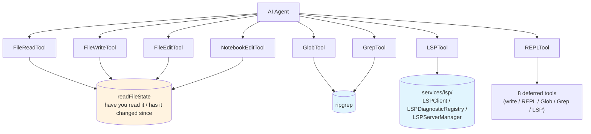

# Chapter 12: The File, Code, and LSP Collaboration Family — Engineering Consistency from `Read` to LSP

> This chapter is the second deep dive into the tool families in *Deep Dive into Claude Code Source*. The previous chapter dissected the abstract skeleton — the `Tool` interface, `buildTool()`, and `ToolSearch`. This one zooms in on eight concrete tools: `FileRead` / `FileWrite` / `FileEdit` / `NotebookEdit` / `Glob` / `Grep` / `LSPTool` / `REPLTool` — plus the stack of services under `services/lsp/` that `LSPTool` sits directly on top of. Together they answer a single question: when an agent wants to "read and modify a code repository", how many quiet rules has Claude Code's source actually laid down?

## Why bundle files, code, and LSP into one chapter?

If you only look at tool names it is easy to assume the eight tools are parallel: four for file I/O, two for search, one for language services, one for the REPL. But in the source they share the same hidden spine — **any tool that wants to mutate a file is forced through the same "have you read it yet / has it changed since you read it" bookkeeping**; any tool that wants to look at code ultimately routes through either `ripGrep` or LSP; any entrypoint that wants to shrink the deferred tool surface funnels into the same REPL sandbox.

Precisely because they are engineered as a single contract shared by one team, splitting them into eight separate chapters would be tedious: the per-tool README content overlaps heavily, but **they work by virtue of the invariants each tool leaves for the others**. So this chapter walks through them in the order "read → write → search → look at code → funnel into REPL", with the focus not on each tool's API surface but on the seams they leave between one another.

By the end you should be able to answer: why does `FileEdit` need to see `FileRead`'s receipt first? What is `Grep`'s `--max-columns 500` actually defending against? Why is `LSPTool` a deferred tool rather than always-on? Why do LSP diagnostics "refresh themselves" after a file write? Where do those eight high-frequency tools go once REPL mode is on?

---

## The big picture: eight tools + LSP/REPL services and how they cooperate



---

## 1. Read: `FileReadTool` and the unwritten "read-before-write" rule

`tools/FileReadTool/FileReadTool.ts:1-1183` is the longest file in this family — not because it does anything complicated, but because reading a file inside Claude Code has too many shapes: plain text, binary images, PDFs, Jupyter notebooks, gigantic log files. Each form has to walk the same "path resolution → encoding detection → truncation → receipt" pipeline inside one tool.

The tool definition itself is restrained: `searchHint: 'read files, images, PDFs, notebooks'`, both `isReadOnly` and `isConcurrencySafe` are `true`, and `maxResultSizeChars` at `FileReadTool.ts:342` is set to `Infinity`.

`maxResultSizeChars: Infinity` is the exception in this tool family — `BashTool`, `Grep`, and `Glob` all set explicit character caps. `FileRead` leaves it open because it truncates internally by lines: by default it returns at most 2000 lines per call, and tells you "use `offset` / `limit` to keep reading" beyond that. In other words it picked "let the caller paginate" rather than "let the outer layer chop the tail", so the model knows **there is content it has not read yet** instead of silently receiving a truncated string.

The genuinely interesting part is the contract it has with the write tools — `readFileState`. Every time `FileReadTool` succeeds, it writes a record into the `readFileState` Map shared via `ToolUseContext` at `FileReadTool.ts:830-846`: `{ content, timestamp: getFileModificationTime(...), offset, limit }`. This sets up everything for the write tools. If you skip `FileRead` and go straight to `FileWrite`, the `validateInput` stage rejects you; if you read the file and then a linter or the user mutates it externally, the next write is also rejected. That rule is not documented in any single file — it is reimplemented inside each write tool's `validateInput`, with its own error codes: `FileWrite` uses `errorCode: 2 / 3` (`FileWriteTool.ts:198-218`), `FileEdit` uses `errorCode: 6 / 7` (`FileEditTool.ts:275-307`), `NotebookEdit` uses `errorCode: 9 / 10` (`NotebookEditTool.ts:218-237`); the former means "not read yet", the latter means "modified externally since the read".

`FileRead` also hides a small detail: a UNC path short-circuit. `FileReadTool.ts:458-465` returns `{ result: true }` without doing any I/O when it sees `\\host\share\file` or `//…`-shaped paths, before any `stat` / `readFile`. On Windows, calling `fs.existsSync()` against a UNC path triggers an SMB / NTLM handshake automatically; if the host is attacker-controlled, that hands the current user's hash to the attacker (the source comment reads verbatim: "Skip filesystem operations for UNC paths to prevent NTLM credential leaks"). So this short-circuit is not "treat UNC specially" — it is **let `validate` pass unconditionally and do no filesystem I/O against UNC paths until permission is granted**, deferring the real `stat`/`read` to the `call` phase after authorization. You will see the same two lines repeated inside `NotebookEdit`, `FileEdit`, and `FileWrite`'s `validateInput`. There is no shared helper at the family level because each tool has a different "pass-through return value" shape, and forcing a helper would require external parameters. This is a textbook example of the source's "duplication beats the wrong abstraction" stance.

Once a read completes, the result block goes through `mapToolResultToToolResultBlockParam` to decide what gets returned to the model. If it is the internal `file_unchanged` stub (the same file is read twice in the same moment, the second time short-circuits to "unchanged"), the return is a fixed `FILE_UNCHANGED_STUB` instead of the entire file content being shoved back into context — context-window deduplication.

---

## 2. Write: the three-piece set and one shared `readFileState`

`FileWrite`, `FileEdit`, and `NotebookEdit` are the write trio. Each addresses a different sub-problem: `FileWrite` overwrites the whole file, `FileEdit` does old-string → new-string local substitution, `NotebookEdit` specifically modifies cells inside `.ipynb`. But all three share the same `validateInput` template:

```typescript
// tools/NotebookEditTool/NotebookEditTool.ts:218-237
// Require Read-before-Edit — silent data loss is unacceptable.
const readTimestamp = toolUseContext.readFileState.get(fullPath)
if (!readTimestamp) {
  return { result: false, message: 'File has not been read yet...', errorCode: 9 }
}
if (getFileModificationTime(fullPath) > readTimestamp.timestamp) {
  return { result: false, message: 'File has been modified since read...', errorCode: 10 }
}
```

That snippet is the entire "read-before-write" baseline: all three rely on `readFileState` to defend against stale views. After an mtime mismatch, however, the three diverge. `FileWrite` (`FileWriteTool.ts:279-293`) and `FileEdit` (`FileEditTool.ts:289-309`) both add an "identical-content fallback" on the full-read path — even if `getFileModificationTime` is newer than the read, as long as the current on-disk content byte-for-byte matches the cached `content` in `readFileState`, the write is allowed through and no `errorCode: 10` is thrown. This tolerates scenarios like Prettier or IDE autosave that "rewrite the file without changing its content". `NotebookEdit` (`NotebookEditTool.ts:230-237`) has no such fallback — it is pure mtime checking. As long as the mtime increases, it conservatively rejects, with the source comment stating bluntly that "silent data loss" is unacceptable while "read it again" is cheap; for a `.ipynb` JSON container, byte-comparing content is unreliable anyway, so erring on the strict side wins.

After writing, all three do one thing in common: stamp the `readFileState` timestamp in place with the post-write mtime. The comment inside `NotebookEditTool` makes the hidden bug behind it explicit:

```typescript
// tools/NotebookEditTool/NotebookEditTool.ts:433-442
// offset:undefined breaks FileReadTool's dedup match —
// without this, Read→NotebookEdit→Read in the same millisecond would
// return the file_unchanged stub against stale in-context content.
readFileState.set(fullPath, {
  content: updatedContent,
  timestamp: getFileModificationTime(fullPath),
  offset: undefined, limit: undefined,
})
```

`offset: undefined` is not a typo — it deliberately breaks `FileReadTool`'s dedup key, because the next `Read` must see the new content rather than be turned away by the stub. This kind of design — "two tools cooperate via the exact shape of a single key" — is common in the source: the contract does not live in a README, it lives in the field value's shape.

`NotebookEdit` has one more problem to solve: a notebook is JSON, but `cell.source` is a field meant to be mutated in place, which means it must steer clear of the memoized version of `safeParseJSON`:

The source comment (`NotebookEditTool.ts:326-333`) is direct: it must use the non-memoized `jsonParse` — `safeParseJSON` caches by content string and returns a shared object reference, and since the code below mutates the notebook in place (`cells.splice`, `targetCell.source = …`), the memoized version would pollute the cached view shared by `validateInput()` and the subsequent `call()`.

`safeParseJSON` is the project-wide memoized version, keyed by content string. Notebooks mutate the same object reference, so a cache hit followed by in-place mutation poisons the views held by other callers. The fix the source picks is not "clone a copy" but "switch to the non-memoized version" — cheaper than cloning, and more direct: whichever path will mutate uses the uncached version.

The write tools also do one easily-missed thing at cleanup: they clear this file's dedup stamp from the LSP diagnostics LRU:

```text
LSPDiagnosticRegistry.clearDeliveredDiagnosticsForFile(fullPath)
```

Why this is needed is deferred to §4.

---

## 3. Search: trade-offs between `Glob` and `Grep`

`GlobTool` and `GrepTool` look like two search tools on the surface, but the responsibility split is clean: `Glob` finds filenames, `Grep` searches file contents.

`GlobTool` is short: `tools/GlobTool/GlobTool.ts:1-198`, under 200 lines total. Its `maxResultSizeChars` is set to 100,000:

```typescript
// tools/GlobTool/GlobTool.ts:57-80
export const GlobTool = buildTool({
  name: GLOB_TOOL_NAME,
  searchHint: 'find files by name pattern or wildcard',
  maxResultSizeChars: 100_000,
  isConcurrencySafe() { return true },
  isReadOnly() { return true },
})
```

100K characters fits several thousand file path matches. `Glob`'s output is sorted by mtime descending (in test mode it sorts stably by name), so when the model browses a repository the first screenful looks like "the files changed most recently" rather than "the files that happen to come first alphabetically".

`GrepTool` is much heavier — it has to wrap an actual `ripGrep` invocation:

```typescript
// tools/GrepTool/GrepTool.ts:108-119
const DEFAULT_HEAD_LIMIT = 250
// ...
const effectiveLimit = limit ?? DEFAULT_HEAD_LIMIT
```

```typescript
// tools/GrepTool/GrepTool.ts:160-170
maxResultSizeChars: 20_000,
```

```typescript
// tools/GrepTool/GrepTool.ts:328-340
const args = ['--hidden']
// ...
args.push('--max-columns', '500')
```

A 20K-character `maxResultSizeChars` combined with a 250-line default head limit and `--max-columns` of 500 per line — these three numbers reflect the same judgment: **search results are working memory for the model, not a `grep` session for a human reader**. Letting the model swallow a multi-thousand-column line out of a minified file does nothing for reasoning and burns half the context window. So `GrepTool` enables `--hidden` by default (dotfiles are searched too) while proactively capping the per-line character count — not because `ripgrep` cannot output long lines, but because long lines are harmful to the model.

`Grep` also excludes a specific list of version-control directories: `.git / .svn / .hg / .bzr / .jj / .sl`. The presence of `.jj` and `.sl` in that list reflects the real-world Claude Code user base — Jujutsu and Sapling, two experimental VCSes, are included to avoid pointless full-text searches across their internal object stores.

Both `Glob` and `Grep` set `isConcurrencySafe` and `isReadOnly` to `true`. This means when the model returns three consecutive `Grep` calls in one turn, `partitionToolCalls` can pack them into a single concurrent batch and fire them in parallel — the highest-frequency hit for the concurrency-safe partitioning discussed in the previous chapter.

---

## 4. Looking at code: `LSPTool` in concert with `services/lsp/`

If the previous six tools "look at code at the filesystem level", `LSPTool` and the `services/lsp/` stack behind it "understand code at the programming-language level". The tool definition lives at `tools/LSPTool/LSPTool.ts:1-860`; adding the seven service-side files brings the total to nearly 3,000 lines — heavier than any single one of the eight tools.

### Nine supported operations

`tools/LSPTool/prompt.ts:1-21` is blunt about what the tool can do:

> goToDefinition / findReferences / hover / documentSymbol / workspaceSymbol / goToImplementation / prepareCallHierarchy / incomingCalls / outgoingCalls

Nine operations cover "find a definition, find references, see documentation, list symbols, jump to implementation, walk the call graph" — the most basic things an IDE can do. `LSPTool` does not try to reinvent semantic analysis; it just translates LSP protocol frames into tool calls and translates the responses back into something the model can read.

There is one alignment detail worth calling out — LSP positions are 0-based, but the interface the tool exposes to the model is deliberately 1-based:

```typescript
// tools/LSPTool/LSPTool.ts:79-84
.describe('The line number (1-based, as shown in editors)'),
// ...
.describe('The character offset (1-based, as shown in editors)'),
```

```typescript
// tools/LSPTool/LSPTool.ts:432
// Convert from 1-based (user-friendly) to 0-based (LSP protocol)
```

Every line number the model encounters in normal use is 1-based — the editor UI, `file:line` references, error stack traces. Forcing it to switch to 0-based for this one tool would be unnecessary cognitive overhead. So the conversion happens inside the tool and the model never sees the difference — another quiet rule of the tool family: **the tool's input semantics follow the model's expectations; do not leak protocol details outward**.

### Three gatekeepers

`LSPTool` is not on by default. Its tool metadata has three gatekeepers that take effect together:

```typescript
// tools/LSPTool/LSPTool.ts:131-138
isLsp: true,
// ...
shouldDefer: true,
isEnabled() {
  return isLspConnected()
},
```

`shouldDefer: true` routes it through the deferred-tool channel — normally the model only sees its name in the `<available-deferred-tools>` list, not its parameter schema, and can only use it once it has actually been pulled out via `ToolSearch`. `isEnabled` adds another layer: it is only registered when there is an LSP connection. The combined effect is that **in a project without an LSP server configured, the model does not know this tool exists at all**; in one where it is configured, it only appears on demand and never occupies prompt budget for nothing.

`LSPTool` also has a file-size guardrail:

```typescript
// tools/LSPTool/LSPTool.ts:53
const MAX_LSP_FILE_SIZE_BYTES = 10_000_000
```

```typescript
// tools/LSPTool/LSPTool.ts:263-267
if (stats.size > MAX_LSP_FILE_SIZE_BYTES) {
  // reject
}
```

10MB is an empirical line — letting the TypeScript service run symbol resolution against a 50MB bundle pegs both CPU and memory, and the file is rarely meaningful to the model anyway: it is usually a build artifact, not source.

### After finding, still filter through `.gitignore`

LSP workspace symbol search will happily spit out symbols from build artifacts, so `LSPTool` adds another pass at cleanup:

At cleanup time, `LSPTool.ts:577-588` does one more filtering pass — it sends the paths returned by the workspace symbol search through `git check-ignore` in batches of 50, drops the ignore hits, and returns the rest. This is not the LSP service's job, but doing it at the `LSPTool` layer is the most reasonable placement — "which files are source files" is a judgment made from the git workspace perspective, and the LSP server itself cannot see `.gitignore`.

### Singleton plus algebraic state machine

`services/lsp/manager.ts:1-289` is the entrypoint to the whole LSP subsystem, and what it does fits in one sentence: ensure there is exactly one `LSPServerManager` instance per process to avoid duplicate initialization and duplicate child-process spawning. But the implementation does not use the naive approach of "one Promise as the global lock" — it introduces an explicit initialization state machine:

```text
initializationState: 'not-started' | 'pending' | 'success' | 'failed'
```

In `isBareMode()` (minimal startup with no plugins) it short-circuits directly; on the normal path, the first call to `getLspServerManager()` flips state to `pending` and starts an init Promise; all subsequent concurrent calls `await` the same Promise; when plugin hot-reload triggers `reinitializeLspServerManager()`, state flips back to `not-started` and a generation counter increments, invalidating any still-in-flight old init Promise — this exists to handle the race reported in issue #15521, where the handle the old init grabbed no longer corresponds to the current plugin set.

`isLspConnected()` — the function powering that one line of `isEnabled` on `LSPTool` — eventually asks the manager: "Do you currently have at least one live language server?"

### Server instance lifecycle

`services/lsp/LSPServerInstance.ts:1-511` manages the lifecycle of a single language server child process. The state machine is tight:

```text
stopped → starting → running → stopping → stopped
any → error
```

When declaring capabilities, it does three things worth noting:

```typescript
// services/lsp/LSPServerInstance.ts:193-234 (excerpt)
configuration: false,
workspaceFolders: false,
// ...
didSave: true,
// ...
positionEncodings: ['utf-16'],
```

`configuration` and `workspaceFolders` are turned off because Claude Code does not intend to play the role of a "full IDE client": many language servers will turn around and ask for project-level configuration, but in this tool family the LSP is treated as an "on-demand query" interface, and there is no need to expose the entire configuration surface. `didSave: true` is the opposite — it is necessary because the LSP server relies on `didSave` to know it should re-run diagnostics. `positionEncodings: ['utf-16']` chooses UTF-16 purely to align with the LSP spec default, sparing a handful of servers from edge-case crashes on encoding mismatch.

It also treats `-32801` (LSP protocol's `ContentModified`) as a class of transient error in its own right:

```typescript
// services/lsp/LSPServerInstance.ts:17
const LSP_ERROR_CONTENT_MODIFIED = -32801
```

```typescript
// services/lsp/LSPServerInstance.ts:378-390 (excerpt)
errorCode === LSP_ERROR_CONTENT_MODIFIED
// ...exponential backoff retry, base 500ms × 2^attempt, up to three times
```

"Content was modified, please re-send" is a very common error class in the LSP protocol — you just asked for a hover, before the server responds the editor changes another character, and the previous query is invalidated. The retry logic itself is not complex, but placing it at the server-instance layer rather than the tool layer means `LSPTool` receives results that have already been backed off, and the tool layer does not need to deal with protocol details.

Crash recovery follows the same idea: `maxRestarts` defaults to 3; past that, it reports "restart limit exceeded" and stops looping forever.

### `LSPClient`: a thin wrapper around `vscode-jsonrpc`

`services/lsp/LSPClient.ts:1-447` is the layer beneath `LSPServerInstance` — it wires `vscode-jsonrpc`'s `StreamMessageReader / StreamMessageWriter` onto the child process's stdio, then wraps notification/request send-and-receive as an async API.

Two details at this layer are worth noting:

First, **wait for the `spawn` event before touching stdio**. In Node.js, the object returned by `child_process.spawn()` does not have stable stdio handles at first; you must wait until the `spawn` event fires before reading or writing, otherwise when the binary cannot actually be found you get `ENOENT` rather than a spawn error. So `LSPClient` awaits a spawn at the outer level before attaching the stream to the jsonrpc reader/writer.

Second, **the connection is not ready yet, so handlers queue first**. The `pendingHandlers` queue holds "notification / request handlers to register after the connection is established" — this lets upper layers declare "I want to listen on diagnostics" before spawn, without worrying about when the actual connection will be up. Once the connection is ready, the queue is flushed in one pass. This design makes the `LSPServerInstance` layer easier to write: the state machine does not have to bake in "connected vs not-connected" checks.

The `onCrash` callback fires when the child process exits non-zero and was not stopped intentionally — this is the entry point for `LSPServerInstance`'s crash recovery.

### `LSPDiagnosticRegistry`: collecting diagnostics into "just enough"

Diagnostics are the one part of the LSP subsystem most likely to blow up context: a medium-sized repository can easily emit several thousand hints. `services/lsp/LSPDiagnosticRegistry.ts:1-386` flattens that with three numbers:

```typescript
// services/lsp/LSPDiagnosticRegistry.ts:42-46
const MAX_DIAGNOSTICS_PER_FILE = 10
const MAX_TOTAL_DIAGNOSTICS = 30
const MAX_DELIVERED_FILES = 500
```

Up to 10 diagnostics per file, and 30 total per delivery — anything above that is sorted by severity (Error < Warning < Info < Hint) and the low-priority entries are dropped, with the delivery summary stating "N diagnostics dropped due to capacity limits". `MAX_DELIVERED_FILES = 500` is an LRU that tracks "which files have recently had their diagnostics shown to the model"; the next time identical diagnostics come in, they are skipped — this addresses the fact that LSP servers re-send the same diagnostics after every small edit.

This LRU pairs with `clearDeliveredDiagnosticsForFile()`, the cleanup call made by the write tools: after a write the file's diagnostics usually change (you just edited the code), so it is cleared from the LRU so that the new diagnostics can be delivered to the model immediately. Without this, the model would edit the code, the LSP would publish new diagnostics, and the new errors would be swallowed by "just delivered". This is another unwritten contract between the write family and the LSP family, symmetric with the `readFileState` rule.

### `passiveFeedback`: how diagnostics actually get delivered

`services/lsp/passiveFeedback.ts:1-328` is the diagnostic return channel. `registerLSPNotificationHandlers()` registers a `textDocument/publishDiagnostics` handler on every LSP server, routing diagnostics the LSP pushes proactively into the registry.

It quietly does two things: first, it maps the four `severity` integers in the LSP protocol (1/2/3/4) to the strings `Error` / `Warning` / `Info` / `Hint`, so upper layers do not need to remember the encoding; second, it counts the "consecutive diagnostic-handling failures" per server and starts alerting after 3 — once an LSP server enters a bad state it tends to keep emitting malformed data, and if you do not count, you get the silent failure mode "diagnostics are delivered but the model never sees any errors".

`HandlerRegistrationResult` returns the fields `totalServers / successCount / registrationErrors / diagnosticFailures`, so the manager layer can distinguish "all 7 servers are healthy" from "7 servers but 1 was never even registered".

### Configuration comes from plugins only

`services/lsp/config.ts:1-79` is only 79 lines and does one thing: the LSP server list is read only from plugins, never from user settings, project settings, or env vars.

```typescript
// services/lsp/config.ts
getAllLspServers() // sources only from loadAllPluginsCacheOnly()
```

The meaning of this choice is not in the code but in the product strategy: language server startup behavior has a strong impact on the user's machine (spawning child processes, eating memory, possibly writing caches), so the decision of "which LSPs to run" is funneled through the plugin channel — plugins are explicitly installed, unlike settings which can be silently changed by an IDE. This is not in conflict with the 7-layer merge order discussed in chapter §3 on the configuration system: LSP is not a regular config item, it is a "feature registration", and goes through the plugin channel rather than the settings channel.

---

## 5. Funneling: `REPLTool` and the eight tools it hides

`tools/REPLTool/constants.ts:1-46` — under 50 lines — describes a quiet rule that few people notice but that runs every day:

```typescript
// tools/REPLTool/constants.ts:13-30
export function isReplModeEnabled(): boolean {
  if (isEnvDefinedFalsy(process.env.CLAUDE_CODE_REPL)) return false
  if (isEnvTruthy(process.env.CLAUDE_REPL_MODE)) return true
  return process.env.USER_TYPE === 'ant' &&
         process.env.CLAUDE_CODE_ENTRYPOINT === 'cli'
}
```

REPL mode is on by default when Anthropic-internal users run the interactive CLI — the comment is explicit about why it is not enabled by default at the SDK entrypoint: SDK callers are people writing scripts, and their code calls `client.tools.read(...)` directly. REPL mode would hide tools like `Read` / `Write` / `Edit` from the visible list, which is invisible breakage for scripts. So the condition deliberately requires both "user type is `ant`" and "entrypoint is `cli`" to be true simultaneously.

What happens when REPL mode is on?

```typescript
// tools/REPLTool/constants.ts:37-46
export const REPL_ONLY_TOOLS = new Set([
  FILE_READ_TOOL_NAME, FILE_WRITE_TOOL_NAME, FILE_EDIT_TOOL_NAME,
  GLOB_TOOL_NAME, GREP_TOOL_NAME, BASH_TOOL_NAME,
  NOTEBOOK_EDIT_TOOL_NAME, AGENT_TOOL_NAME,
])
```

These eight names are pulled from the tool list. The model calling `Read` directly will not find that tool — instead, it must send a piece of JS/TS through the `REPL` tool, which calls `Read(...)` / `Bash(...)` inside the REPL's VM context, and the REPL returns all results in one go.

Why the indirection? Because in the interactive CLI the model often fires off seven or eight `Read`/`Grep` calls per turn — packing them into a single piece of JS that the REPL executes once saves round trips and the token overhead of `tool_use` blocks. But this funnel must not lose the tools' actual usability, so the same eight tools are still available inside the REPL VM through a separate entrypoint:

```typescript
// tools/REPLTool/primitiveTools.ts:11-39 (excerpt) — lazy getter to dodge circular dependency
let _primitiveTools: readonly Tool[] | undefined
export function getReplPrimitiveTools(): readonly Tool[] {
  return (_primitiveTools ??= [
    FileReadTool, FileWriteTool, FileEditTool, GlobTool,
    GrepTool, BashTool, NotebookEditTool, AgentTool,
  ])
}
```

The TDZ explanation in the comment is worth quoting: `collapseReadSearch.ts → primitiveTools.ts → FileReadTool.tsx → …` — this import chain eventually loops back to the tool registry, so you cannot evaluate at module top level with `const`; you must push evaluation to the first call via a lazy getter — otherwise it triggers "Cannot access before initialization". This is the inevitable circular-dependency problem once the tool family scales this big, and the source picks the lazy cut rather than redesigning the module graph.

Why not `getAllBaseTools()` rather than hardcoding these eight? The comment explains that too: `getAllBaseTools()` strips out `Glob`/`Grep` when `hasEmbeddedSearchTools()` is `true`, but inside the REPL VM both are necessary, so this path bypasses that layer and assembles its own list directly.

The REPL section looks like a separate topic from "files, code, LSP", but it is actually the final funnel of this tool family — what the model sees as the "tool surface" in the interactive CLI is compressed into one `REPL` + a few non-primitive tools + one `ToolSearch`, while the eight tools we spent the whole chapter on retreat to the inner layer of the REPL VM.

---

## 6. Looking back: what this family leaves us with

Reading these eight tools plus `services/lsp/` end-to-end, you can see a few recurring judgments at the tool-family layer:

1. **Contracts travel through the shape of field values, not through documentation**. `offset: undefined` inside `readFileState` is essentially a protocol between `FileRead` and `NotebookEdit` that only the source comment explains. Similarly, the `LSPDiagnosticRegistry` LRU and the write tools' `clearDeliveredDiagnosticsForFile()` are an action-at-a-distance pairing.
2. **Conservative beats clever**: an mtime mismatch means the read view is stale, and even if the content might be unchanged the model is asked to read again; UNC paths are passed through rather than handled; an LSP file over 10MB is rejected outright.
3. **Protocol details are wrapped inside the tool**: LSP 0-based positions are translated to 1-based at the tool boundary; the `ContentModified` backoff retry happens in `LSPServerInstance`, not at the tool layer; capabilities like `configuration` / `workspaceFolders` that a full IDE client must handle are turned off.
4. **Duplication > the wrong abstraction**: the UNC short-circuit is repeated in four `validateInput`s; the `readFileState` refresh in `Read`/`Write` is also written separately in each; the source does not extract a helper, because each tool's "pass-through return value" shape is different.
5. **Deferred is not throttling, it is funneling**: `LSPTool` is deferred because its tool description is heavy and most of the time it is not used at all; REPL mode hides eight high-frequency tools inside the VM with the same intent — shrink the model's prompt surface and redirect execution into a batch channel.

The next chapter jumps from the tool family to the third-party protocol layer — chapter 13 covers the tools "for scheduling and communication outside the conversation" (`WebFetch` / `WebSearch` / `ScheduleCron` / `RemoteTrigger` / `SendMessage` / `SleepTool` / `AskUserQuestion` / `SyntheticOutput` / `Brief` / `Config`). They are unlike this chapter's eight-piece set: the tools here are "duplicates and views of the code itself", while next chapter's tools are "the world outside the conversation loop".

---

## Next chapter preview

[Chapter 13: Communication, Scheduling, Questioning, and Synthetic Tools — The Ten Narrow Channels Between Agent and the Outside World](./13-communication-scheduling-questioning-and-synthetic-tools.md)

We turn the camera 180°. Instead of watching the agent move local code, we watch it speak — the ten tools `WebFetch` / `WebSearch` / `ScheduleCron` / `RemoteTrigger` / `SendMessage` / `SleepTool` / `AskUserQuestion` / `SyntheticOutput` / `Brief` / `Config`, the world outside the conversation loop.
