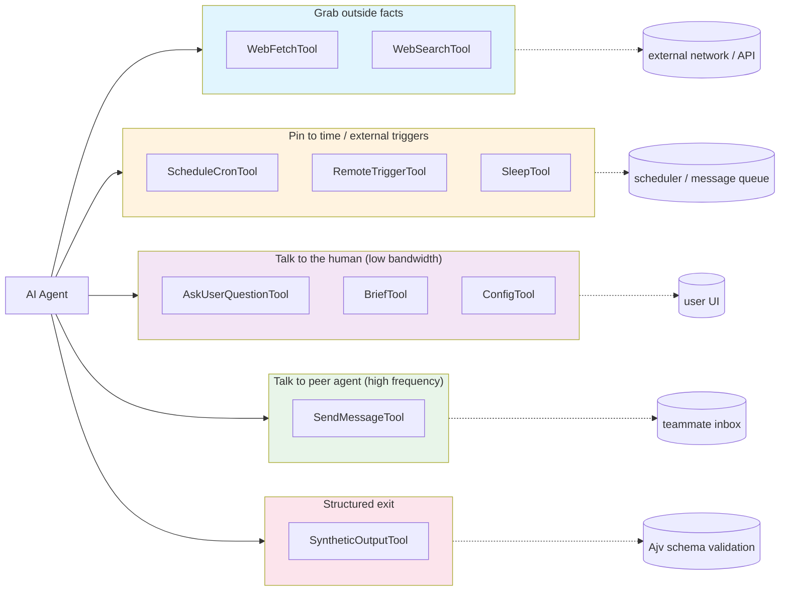

# Chapter 13: Communication, Scheduling, Questioning, and Synthetic Tools (合成工具) — The Ten Narrow Channels Between the Agent and the Outside World

> This chapter is the third deep dive into the tool family in the *Deep Dive into Claude Code Source* series. The previous two covered the `Tool` protocol skeleton, and the engineering consistency that the file, code, and LSP family share around the unwritten rule of "read before write". This one rotates the camera 180°: instead of watching the agent move local code, we watch it speak — how it reaches out to grab a web page, how it pins itself to cron, how it talks to another agent, how it puts a multiple-choice question to the user, and how it hands in a machine-readable final answer.

## Why discuss these ten tools in a single chapter?

Looking at the `tools/` directory, these ten tools appear to have nothing in common: `WebFetchTool` sits at the outermost layer of the network stack, `SleepTool` is just a `setTimeout` wrapper, `SyntheticOutputTool` is an Ajv schema validator, and `SendMessageTool` is a single file weighing in at 917 lines. Cramming them into one chapter at first glance feels like throwing items into the "junk drawer" labelled "not a file tool".

But reading the source reveals a shared underlying thread — **every one of these tools cuts a narrow channel that lets the agent reach beyond the conversation**. `BashTool` mutates local state, `FileEdit` mutates files, `LSPTool` reads diagnostics — these are all the agent acting in the world at its feet. The ten tools in this chapter are different: they either project the agent's attention into places the agent cannot see — behind a URL, at a future moment, inside another agent's inbox, on some UI tile in the user's field of view — or compress the agent's "voice" into a fixed format the receiver can consume. Each channel is narrow — too narrow for the tool signature to carry much freedom, narrow enough that the tool protocol's return value has to be used to reconcile the exchange.

Because they are all cutting narrow channels, the same set of engineering restraints recurs across all ten: explicit timeout ceilings, explicit cache policies, preapproval lists that are never exposed externally, security-conscious prompts written for the secondary model to read. Discussing them together is meant to make that thread visible — rather than giving every tool its own section, by which point the reader will have lost track of the differences between the first six and the eighth.

This chapter follows four narrative groupings:

1. **Grabbing a piece of fact from outside** — `WebFetchTool` and `WebSearchTool`
2. **Pinning yourself to time or external triggers** — the `ScheduleCron` trio, `RemoteTriggerTool`, `SleepTool`
3. **Low-bandwidth channels to the human** — `AskUserQuestionTool`, `BriefTool`, `ConfigTool`
4. **High-frequency channel to peer agents and structured wind-down** — `SendMessageTool`, `SyntheticOutputTool`

By the end you should be able to answer: why does `WebFetch` hit `anthropic.com` before making the actual HTTP call? Why does the cron tool advise you to avoid the top and half of the hour? Why does `AskUserQuestion` cap at four questions with at most four options each? Why does `SyntheticOutput` cache compiled schemas in a WeakMap?

---

## The big picture: ten tools sorted into four groups by "channel direction"



---

## 1. Grabbing a piece of fact: WebFetch and WebSearch

### 1.1 WebFetch: the chain behind a URL is longer than you think

`tools/WebFetchTool/WebFetchTool.ts` reads plainly: `searchHint: 'fetch a URL and process its contents'`, `maxResultSizeChars: 100_000`, `shouldDefer: true`, with permission memorized at the `domain:${hostname}` granularity. An outside observer reading "input a URL, return its content" in the tool description would assume this is a two-step pipeline of fetch plus turndown. But `getURLMarkdownContent` at `tools/WebFetchTool/utils.ts:347-481` reveals an entirely different chain.

Walked end-to-end, a "seemingly simple URL fetch" goes through: a URL-length allowlist (≤ 2000 characters), rejection of username/password fields, a domain shape check requiring a dot (`utils.ts:139-169`), and then a **preflight domain allowlist query** against `https://api.anthropic.com/api/web/domain_info?domain=...`.

The preflight implementation is deliberately restrained:

```typescript
// tools/WebFetchTool/utils.ts:176-203
export async function checkDomainBlocklist(
  domain: string,
): Promise<DomainCheckResult> {
  if (DOMAIN_CHECK_CACHE.has(domain)) {
    return { status: 'allowed' }
  }
  try {
    const response = await axios.get(
      `https://api.anthropic.com/api/web/domain_info?domain=${encodeURIComponent(domain)}`,
      { timeout: DOMAIN_CHECK_TIMEOUT_MS },
    )
    if (response.status === 200) {
      if (response.data.can_fetch === true) {
        DOMAIN_CHECK_CACHE.set(domain, true)
        return { status: 'allowed' }
      }
      return { status: 'blocked' }
    }
    return { status: 'check_failed', error: ... }
  } catch (e) {
    return { status: 'check_failed', error: e as Error }
  }
}
```

Note that `DOMAIN_CHECK_CACHE` only caches `allowed`, not `blocked` — getting the former wrong is harmless, while getting the latter wrong becomes a real security bypass. This is a recurring security design pattern: fail fast, allow stably.

Only after the preflight passes does the real HTTP request happen — `getWithPermittedRedirects` at `utils.ts:262-329`: at most 10 MB, 60-second timeout, `maxRedirects: 0`, with redirects implemented recursively by the function itself for up to ten hops. The `Accept` header lists both `text/markdown` and `text/html`; the `User-Agent` runs through a custom function.

The most critical piece is the same-origin redirect check:

```typescript
// tools/WebFetchTool/utils.ts:212-243 (excerpt)
function isPermittedRedirect(from: URL, to: URL): boolean {
  if (from.protocol !== to.protocol) return false
  if (from.port !== to.port) return false
  if (to.username || to.password) return false
  // hostname must match after stripping leading "www."
  const stripWWW = (h: string) => h.replace(/^www\./, '')
  return stripWWW(from.hostname) === stripWWW(to.hostname)
}
```

The comment gives a direct rationale: silently following redirects effectively delegates the decision of "trust example.com" to example.com itself, and example.com could host an open redirect that lets Claude Code go fetch attacker.com. So the code picks an uncomfortable but safe compromise — only same-origin redirects with optional `www.` prefix differences are followed silently; everything else returns `RedirectInfo`, handing control back to the tool layer so the user must approve the new URL anew.

#### Two details about resource reclamation

After fetching, the response passes through two invisible reclamation points:

- **rawBuffer release**: once the response is obtained, the axios-held `ArrayBuffer` is immediately set to null so GC can reclaim those 10 MB before turndown builds the DOM tree. The comment at `utils.ts:428-432` explains that turndown's DOM tree is 3–5× the HTML size.
- **turndown service as a lazy singleton**: held in a Promise; the first HTML fetch pulls in the `@mixmark-io/domino` dependency (about 1.4 MB) into the heap, and all subsequent pages reuse the same instance.

Neither of these details is on the tool's surface, but together they explain why `WebFetch` can be invoked repeatedly inside an IDE-embedded process without exploding resident memory.

#### Feed the small model, not the main model

The fetched Markdown is not handed directly to the main model. It is first truncated to within `MAX_MARKDOWN_LENGTH = 100_000` (`utils.ts:128`), then handed to Haiku as the secondary model, which extracts an answer driven by the natural-language `prompt` the user supplied in the tool call. `makeSecondaryModelPrompt` emits different system prompts depending on whether the host is on the preapproval list — preapproved hosts may quote the original verbatim; unpreapproved hosts force the small model to cap every quote at 125 characters. This 125-character red line is a security design: an unpreapproved domain might inject a prompt payload into the content, so by squeezing the secondary model's quoting width, the injection payload cannot survive truncation.

#### The preapproval list itself is an attack surface

The preapproval list (`tools/WebFetchTool/preapproved.ts`) deserves a note: it is not a flat string set, but split by "bare hostname" and "hostname + path prefix" for O(1) lookups. Path-prefix matching is aligned to path-segment boundaries, so `github.com/foo` does not accidentally cover `github.com/foobar`. This care is common at the tool layer — once a host is preapproved, `checkPermissions` auto-allows it without user approval:

```typescript
// tools/WebFetchTool/WebFetchTool.ts:108-118
const parsedUrl = new URL(url)
if (isPreapprovedHost(parsedUrl.hostname, parsedUrl.pathname)) {
  return {
    behavior: 'allow',
    updatedInput: input,
    decisionReason: { type: 'other', reason: 'Preapproved host' },
  }
}
```

And the 125-character quote cap is also lifted in the secondary-model prompt. Every inch of looser matching is attack surface. **Note**: whether the domain preflight is skipped depends only on the `skipWebFetchPreflight` setting (`utils.ts:386-398`); it is not bypassed simply because the host is on the preapproval list.

#### Avoid degrading silently to "nothing works but nobody knows why" inside enterprise networks

`WebFetch` also handles "the network just won't let me through" at multiple layers. For example, the domain preflight goes through `api.anthropic.com`, and an enterprise egress firewall might block even that endpoint. In that case `checkDomainBlocklist` returns `check_failed`, the tool layer throws `DomainCheckFailedError`, and the return value says "could not verify safety" — rather than silently letting the fetch through. Enterprise users who confirm their internal network is safe and want to force the call can set `skipWebFetchPreflight` in settings, but that is opt-out rather than opt-in.

Likewise, some egress proxies attach `X-Proxy-Error: blocked-by-allowlist` on 403 responses; the tool layer specifically sniffs for that header and throws `EgressBlockedError` (`utils.ts:316-325`), so the return value clearly says "egress was blocked, not a site 404".

A final piece of unobtrusive engineering restraint: the URL cache is keyed by the raw URL, not by the upgraded-to-HTTPS URL or by the final redirect landing URL (`utils.ts:468-481`). An agent that repeatedly fetches the same site with the same `http://` spelling will not bypass the 15-minute cache. Additionally, the domain preflight gets its own cache — because the URL cache is keyed by the full URL, two different paths under the same domain would trigger two identical preflights, and merging them saves not bandwidth but latency.

### 1.2 WebSearch: let the model open its own search

The implementation path of `WebSearchTool` is a mirror image of `WebFetchTool`. `WebFetch` decomposes "the web" into local axios + turndown and only routes through the model after the result; `WebSearch` takes the opposite path: it embeds the `web_search_20250305` beta tool directly into a conversation with the Anthropic API, letting the upstream server run the search, while the local side merely assembles a user message and parses the returned content blocks.

The tool schema hardcodes an 8:

```typescript
// tools/WebSearchTool/WebSearchTool.ts:76-83
function makeToolSchema(input: Input): BetaWebSearchTool20250305 {
  return {
    type: 'web_search_20250305',
    name: 'web_search',
    allowed_domains: input.allowed_domains,
    blocked_domains: input.blocked_domains,
    max_uses: 8, // Hardcoded to 8 searches maximum
  }
}
```

`max_uses: 8` is not in the constants table and the source has no explanatory comment. From context it can be inferred: this caps the number of searches a single tool call may spend — preventing the model from spiraling into "maybe one more search will do it" loops, and pinning down the cost of a single tool call.

`isEnabled` is another piece of restraint (`WebSearchTool.ts:168-193`): firstParty providers turn it on unconditionally; Vertex AI enables it only when the model name contains `claude-opus-4` / `claude-sonnet-4` / `claude-haiku-4` (earlier models on Vertex did not yet have web search capability); Foundry enables it fully. This double check — "look at the provider plus look at the model family" — is a recurring pattern in the `tools/` directory: the same Tool object is not necessarily registered into ToolSearch under every deployment shape.

A streaming-progress extraction piece inside `call` is worth singling out. `web_search_20250305` is a server-side tool whose `query` field arrives piece by piece through streaming `input_json_delta` events. `WebSearchTool.ts:320-360` uses a hand-written regex to pull `query` out of the half-assembled JSON — the only purpose is to display "Claude is searching: …" in the UI as early as possible, rather than waiting for the JSON to be fully assembled. The regex is followed by `jsonParse('"' + queryMatch[1] + '"')` to do real JSON parsing for escape characters, but the failure path is swallowed with try/ignore — progress is an optimization, not a contract, so being wrong is fine.

Result formatting (`makeOutputFromSearchResponse`, `WebSearchTool.ts:86-150`) splits the streamed content blocks into segments by `text → server_tool_use → web_search_tool_result → text+citations`. Finally, `mapToolResultToToolResultBlockParam` appends a fixed REMINDER to the `tool_result` it ships back to the main model:

```typescript
// tools/WebSearchTool/WebSearchTool.ts:426-427 (excerpt)
content: results +
  '\n\nREMINDER: You MUST include the sources above in your response ' +
  'to the user using markdown hyperlinks.'
```

This echoes the `CRITICAL REQUIREMENT` segment in `prompt.ts`. The two reminders are not redundant — one is read by the model when it reads the tool description, the other slaps the model in the face at the tail of the tool's return value — and together they keep the model from dropping the Sources links from the final reply.

---

## 2. Pinning yourself to time and external triggers: ScheduleCron, RemoteTrigger, Sleep

### 2.1 The ScheduleCron trio: treat cron as a kind of agent communication

`tools/ScheduleCronTool/` is not one tool but three: `CronCreate`, `CronDelete`, `CronList`, plus a shared `prompt.ts`. In shape they follow the standard Tool family structure (three leaves sharing one prompt), yet they handle something far more complex than "schedule a cron job".

The key piece is the switch function at the top of `prompt.ts`:

```typescript
// tools/ScheduleCronTool/prompt.ts:36-45
export function isKairosCronEnabled(): boolean {
  return feature('AGENT_TRIGGERS')
    ? !isEnvTruthy(process.env.CLAUDE_CODE_DISABLE_CRON) &&
        getFeatureValue_CACHED_WITH_REFRESH(
          'tengu_kairos_cron',
          true,
          KAIROS_CRON_REFRESH_MS,
        )
    : false
}
```

`feature('AGENT_TRIGGERS')` is a **build-time** flag that decides whether the whole cron module graph is bundled in. `tengu_kairos_cron` is a **runtime** GrowthBook flag acting as a fleet-wide kill switch; it is cached for 5 minutes, meaning that after the flag flips, the local side may still run with the old value for up to 5 minutes — avoiding a GrowthBook hit on every tool enumeration. `CLAUDE_CODE_DISABLE_CRON` is the highest-priority local environment-variable escape hatch. `isDurableCronEnabled()` layers another runtime switch controlling the more sensitive capability of "can a task be written to disk and live past the current session".

`CronCreate` itself handles three things: the cron expression (standard 5 fields — minute, hour, day, month, weekday), the `recurring` boolean (one-shot vs. persistent), and the `durable` boolean (whether to write to `.claude/scheduled_tasks.json`). The maximum number of jobs is hardcoded at 50 (`MAX_JOBS`) — a hard ceiling; going over it is rejected, the rationale being that more than that starts competing with a real cron daemon and exceeds the granularity the hooks UI can manage.

For the teammate role there is an additional constraint: teammates cannot create durable tasks, only ephemeral session-scoped ones. `CronList` and `CronDelete` have parallel rules — teammates can only see and delete tasks they created themselves; the main controller can see globally and delete anyone's. The cron capability is tiered by role: standalone self-use is full permissions; in multi-agent collaboration it is automatically downgraded.

#### That "avoid the top of the hour" prompt

`prompt.ts` contains an engineering detail that makes you laugh on reading:

```text
// tools/ScheduleCronTool/prompt.ts:103-110 (excerpt)
## Avoid the :00 and :30 minute marks when the task allows it

Every user who asks for "9am" gets `0 9`, and every user who asks for
"hourly" gets `0 *` — which means requests from across the planet land
on the API at the same instant. When the user's request is approximate,
pick a minute that is NOT 0 or 30:
  "every morning around 9" → "57 8 * * *" or "3 9 * * *"
  "hourly" → "7 * * * *"
```

The top and half of the hour are the cron timestamps human intuition reaches for first; agents across the planet piling onto them produces a thundering herd. This advice is not hard-enforced at a lower layer (writing `0 * * * *` is not rejected); but as a soft hint that "teaches the model how to use this tool", it preempts a distributed-systems textbook failure mode.

This tool family is a clear counter-example to the misconception that prompt engineering is just "write a System Prompt for the main model" — writing tool descriptions is the larger part: the model is not going to read the cron(5) man page; it reads the hundred or so lines in `prompt.ts`.

### 2.2 RemoteTriggerTool: let claude.ai tap me on the shoulder

`tools/RemoteTriggerTool/RemoteTriggerTool.ts` is a narrower tool. Its job: let the local Claude Code process operate "remote triggers" on the claude.ai server side. The allowed actions are 5: `list`, `get`, `create`, `update`, `run`.

The implementation path is restrained: use the OAuth token to call the `claude.ai` beta endpoint `ccr-triggers-2026-01-30` (the constant string itself carries the beta gate), 20-second timeout, written directly at the call site:

```typescript
// tools/RemoteTriggerTool/RemoteTriggerTool.ts:135-141
const res = await axios.request({
  method,
  url,
  headers,
  data,
  timeout: 20_000,
  signal: context.abortController.signal,
  validateStatus: () => true,
})
```

`isEnabled` is a double-gate: `tools/RemoteTriggerTool/RemoteTriggerTool.ts:57-62` requires both that the `tengu_surreal_dali` GrowthBook flag be true, and that `isPolicyAllowed('allow_remote_sessions')` pass — the former is "product not yet GA, gated by user-cohort rollout", the latter is the enterprise / MDM policy-side hard switch. Both must be open for the tool to go live.

This tool is worth calling out separately because it is the first entry point that lets the agent "hand a task off to another Claude instance outside itself". `SendMessage` earlier is peer communication inside the same multi-agent session; `RemoteTrigger` is truly cross-session, cross-machine, delegating a task to the claude.ai backend to run. Once this channel is open, the local agent can have another agent doing work for it after its own process has ended.

### 2.3 SleepTool: even the simplest tool must spell out "why is it this one"

`tools/SleepTool/prompt.ts` is a 17-line file in total; the tool itself is a `setTimeout` wrapper, but the prompt is even more restrained than the tool:

```typescript
// tools/SleepTool/prompt.ts:7-17
export const SLEEP_TOOL_PROMPT = `Wait for a specified duration. The user can interrupt the sleep at any time.

Use this when the user tells you to sleep or rest, when you have nothing to do, or when you're waiting for something.

You may receive <${TICK_TAG}> prompts — these are periodic check-ins. Look for useful work to do before sleeping.

You can call this concurrently with other tools — it won't interfere with them.

Prefer this over \`Bash(sleep ...)\` — it doesn't hold a shell process.

Each wake-up costs an API call, but the prompt cache expires after 5 minutes of inactivity — balance accordingly.`
```

Why emphasize concurrent-safe? Because long-running tools like `BashTool` are invoked concurrently; if `SleepTool` were not concurrent-safe, calling sleep while waiting for a build to finish would jam the entire tool stack. The `isConcurrencySafe() => true` declaration lets sleep occupy only its own slot.

Why prefer it over `Bash(sleep ...)`? Because the latter holds a shell process; the former is just a `setTimeout`.

Why emphasize "each wake-up costs an API call, and the prompt cache expires after 5 minutes"? Because these two together determine sleep's hidden cost: waking up once after a one-minute sleep versus once after a six-hour sleep differ in price by orders of magnitude, and once the cache expires, the next wake-up forces the main model to rebuild the context. Putting them on the table for the model to weigh is more precise than stuffing a "be careful with sleep" reminder into the system prompt.

---

## 3. Low-bandwidth channels to the human: AskUserQuestion, Brief, Config

### 3.1 AskUserQuestionTool: at most four questions, each with at most four options

`tools/AskUserQuestionTool/AskUserQuestionTool.tsx` is the tool in this family closest to the UI. It draws 1–4 questions as chip-style UI, gives the user 2–4 options per question plus an always-present "free text" exit, with an optional `multiSelect` field. The input schema (`AskUserQuestionTool.tsx:62-67`) has only four entries — `questions`, `answers`, `annotations`, `metadata` — and **no** `previewFormat` call parameter: the preview rendering format is read out from external configuration by `getQuestionPreviewFormat()` (`AskUserQuestionTool.tsx:117-124`), and can be `markdown` or `html`; the `html` branch is checked by an HTML fragment validator that explicitly rejects sandbox-escaping tags like `<html>`, `<body>`, `<script>`, `<style>`.

The easiest way to misuse this tool is to treat it as "a menu". The prompt corrects the direction: this is not for putting multiple-choice questions to the user; it is for the agent to actively "ask a question" when it really does not know the user's preference — like UI color A vs. B, copy variant A vs. B, whether to continue down a line of thought. Sending 4 questions at once with 4 answers each already breaks conversational rhythm enough to make the user swear, so the hard ceiling baked into the tool signature is 4 × 4.

#### A tool disabled by session topology

`AskUserQuestion` is automatically disabled in channels scenarios:

```typescript
// tools/AskUserQuestionTool/AskUserQuestionTool.tsx:135-145
isEnabled() {
  // When --channels is active the user is likely on Telegram/Discord, not
  // watching the TUI. The multiple-choice dialog would hang with nobody at
  // the keyboard. Channel permission relay already skips
  // requiresUserInteraction() tools (interactiveHandler.ts) so there's
  // no alternate approval path.
  if ((feature('KAIROS') || feature('KAIROS_CHANNELS'))
      && getAllowedChannels().length > 0) {
    return false;
  }
  return true;
}
```

The source comment is blunt about the reason: channels being active means the user is on the far end of a Telegram / Discord / TUI relay, with nobody sitting at the terminal to click chips, so the multi-select dialog hangs unanswered. This is an example of "whether a tool is exposed is not just `isEnabled`, but `isEnabled` × current session topology" — judged by whether channels are active, not by whether the session is multi-agent.

#### Don't say "the plan" in plan mode

The prompt also includes a small detail specifically about plan mode:

```text
// tools/AskUserQuestionTool/prompt.ts:43 (excerpt)
IMPORTANT: Do not reference "the plan" in your questions
(e.g., "Do you have feedback about the plan?",
 "Does the plan look good?") because the user cannot see the plan
in the UI until you call ExitPlanMode.
```

Because the plan is not yet displayed in the UI to the user, saying "the plan" again drags the context onto a placeholder that does not exist on screen. Switch to a concrete verb like "should we move to implementation". This is the kind of detail you only understand the *why* of after reading the source.

### 3.2 BriefTool: the agent's "loudspeaker"

`tools/BriefTool/BriefTool.ts` exports a tool named `SendUserMessage`, aliased `Brief`. The comment opens by emphasizing: this is the primary visible output channel. Meaning that the agent normally types back to the user via an assistant message, but in certain scenarios — typically a proactive task started by cron / hook / remote trigger — the agent has no ongoing conversation turn, and its output gets dropped. `SendUserMessage` is the only channel in such scenarios that genuinely pushes a message into the user's field of view.

Beyond `message` itself, the input field includes `status` selecting `normal` or `proactive`. `normal` is the agent actively responding to an in-flight request; `proactive` is the agent's first speech after waking on a schedule or being kicked off by a hook. The two render differently in the UI: proactive usually has an icon plus a tinted background, reminding the user "this is not something you asked for".

`BRIEF_PROACTIVE_SECTION` in `prompt.ts` defines a four-segment ack → work → checkpoint → result structure specifically for proactive use — so that a user surprised by a notification can see at a glance "what is it about to do, what did it do, what came of it" rather than a headless tail of a work log.

#### The two-layer judgment of entitlement plus flag

`isBriefEntitled` and `isBriefEnabled` are judged separately as two layers: the former is the account-level entitlement; the latter overlays a runtime flag. This "entitlement + flag" is the unified pattern across the Kairos feature family — entitlement decides whether a user *can* be enabled, and the flag decides whether to roll the feature out within that user cohort. `KAIROS_BRIEF_REFRESH_MS = 5 * 60 * 1000` is the same constant the cron tool uses; the 5-minute cache cuts how often the entitlement endpoint is hit.

Every `Brief` call emits a `tengu_brief_send` analytics event, letting the operations side track abuse of this "loudspeaker" — an implicit governance signal: if an agent sends 30 Briefs in an hour, ops will go look at whether the trigger is misconfigured.

### 3.3 ConfigTool: the only tool where "read auto-allows, write requires approval"

`tools/ConfigTool/ConfigTool.ts` reads and writes Claude Code's own settings — the `SUPPORTED_SETTINGS` table lists dozens of entries, from cosmetic `theme` to voice input to MCP behavior switches. This tool has an uncommon asymmetric permission policy: the `get` subcommand auto-allows; the `set` subcommand always requires approval. Reading settings is not sensitive; writing settings may change the agent's own behavior, so user confirmation is required.

#### The real path of voice mode

If the model tries to set `voiceEnabled` to true, before actually writing settings, the tool runs through a chain of capability checks:

```typescript
// tools/ConfigTool/ConfigTool.ts:254-291 (excerpt)
const {
  checkRecordingAvailability,
  checkVoiceDependencies,
  requestMicrophonePermission,
} = await import('../../services/voice.js')

const recording = await checkRecordingAvailability()
if (!recording.available) {
  return { data: { success: false, error: recording.reason ?? '...' } }
}
if (!isVoiceStreamAvailable()) {
  return { data: { success: false, error: '... requires Claude.ai account ...' } }
}
const deps = await checkVoiceDependencies()
if (!deps.available) {
  return { data: { success: false,
    error: 'No audio recording tool found.' +
      (deps.installCommand ? ` Run: ${deps.installCommand}` : '') } }
}
if (!(await requestMicrophonePermission())) {
  // ...writes a platform-specific "where to grant permission" guide
}
```

The actual implementation lives in `services/voice.ts:236-327`: native `audio-capture-napi` (based on cpal, cross macOS / Windows / Linux) is preferred; if missing, Linux probes `arecord` (with separate branches for WSL2+WSLg, WSL1, and pure headless Linux), then falls back to SoX `rec`, emitting install guidance by package manager; Windows without the native module is rejected outright; macOS uses "actually record a clip" detection in place of the unreliable TCC API; remote environments (`isRunningOnHomespace()` or `CLAUDE_CODE_REMOTE` truthy) are unconditionally marked as device-less. Any failed step writes no settings and instead returns a clearly diagnostic message.

This is the tool layer's standard move of "I'd rather take one extra step than let the user fall into the pit of 'settings say it's on but it doesn't actually work'".

#### Three values shared via a sentinel

The default value of the `remoteControlAtStartup` field is not `false` but the string `"default"`, because `false` / `true` would be taken as explicit user preferences and take effect, while `"default"` means "decide at runtime". This is the common technique in settings systems of leaving a sentinel for "unset" rather than using null.

`generatePrompt` (`ConfigTool/prompt.ts`) dynamically generates the prompt from the `SUPPORTED_SETTINGS` table. Adding a new setting requires no edits to the prompt file; adding a row in `SUPPORTED_SETTINGS` is enough for the tool description to follow along. This "prompt derived from source metadata" approach is common in the `tools/` directory and is the local mechanism that prevents documentation drift.

---

## 4. The high-frequency channel to peer agents: SendMessageTool

`tools/SendMessageTool/SendMessageTool.ts` is the largest file in this family, at 917 lines. Its job is simple: deliver a message to another agent's inbox. The hard part is that "another agent" has four possible addresses in a multi-agent topology.

#### Four address schemes

The `to` field is required:

```typescript
// tools/SendMessageTool/SendMessageTool.ts:67-86 (excerpt)
const inputSchema = lazySchema(() =>
  z.object({
    to: z.string().describe(
      feature('UDS_INBOX')
        ? 'Recipient: teammate name, "*" for broadcast, ' +
          '"uds:<socket-path>" for a local peer, or ' +
          '"bridge:<session-id>" for a Remote Control peer (use ListPeers to discover)'
        : 'Recipient: teammate name, or "*" for broadcast to all teammates',
    ),
    summary: z.string().optional(),
    message: z.union([z.string(), StructuredMessage()]),
  }),
)
```

The four addresses are routed by `validateInput` and `call` into different branches: bridge goes through `postInterClaudeMessage`, uds through `sendToUdsSocket`, and a name or `"*"` through the in-team mailbox.

#### Broadcast charges linear cost

Broadcast (`to: "*"`) is explicitly cost-tagged in the tool description:

```text
// tools/SendMessageTool/prompt.ts:34
| `"*"` | Broadcast to all teammates — expensive (linear in team size),
          use only when everyone genuinely needs it |
```

N peers means N deliveries and N wake-ups, so the tool description constrains it to "use only when everyone genuinely needs to know". Structured messages add one more constraint: `SendMessageTool.ts:678-683` flatly rejects `to: "*"` for structured messages — protocol messages are by definition point-to-point request/response and have no "broadcast a shutdown_response" semantics.

#### Structured messages upgrade "agent-to-agent communication"

`StructuredMessage` is a discriminated union. Beyond ordinary free-text messages, `SendMessage` can carry three classes of structured message:

- `shutdown_request` / `shutdown_response` — request a peer to shut down gracefully plus its acknowledgement
- `plan_approval_response` — the team-lead's approval / rejection to a teammate in plan mode (the matching `plan_approval_request` does not flow through the `SendMessageTool` input schema: it is written directly into the team-lead mailbox by `tools/ExitPlanModeTool/ExitPlanModeV2Tool.ts:263-295` in the teammate plan-mode-required scenario)

These three classes have their own JSON schemas, and the receiving agent responds per protocol rather than continuing as ordinary conversation. This upgrades "agent-to-agent communication" from plain text to "protocol message + free text" dual-track.

In multi-agent mode, the subagent has an additional invisible rule: if an in-process subagent goes idle because it has nothing to do, a `SendMessage` from the main controller automatically resumes it from idle. This auto-resume means that the workflow "spawn subagent → subagent finishes and sleeps → main controller finds more work" does not need an extra state machine outside.

#### Three layers of safety rails for cross-session bridge

The cross-session tier has an extra layer of checking: `SendMessageTool.ts:631-654` already rejects sending structured messages over a bridge in the `validateInput` stage — protocol messages are only meaningful within a team, and cross-session traffic is plain text only; it also explicitly checks `getReplBridgeHandle()` and `isReplBridgeActive()`, so cases like "bridge not connected / in outbound-only mode" error out immediately instead of being silently dispatched.

`call` re-checks bridge status one more time before actually sending (`SendMessageTool.ts:741-774`); the comment notes this is to plug the time window where the bridge could drop while `checkPermissions` is blocked awaiting approval. Once it passes, it calls `postInterClaudeMessage(addr.target, input.message)` directly. There is no special "scan the message body for local sensitive paths" logic in the source — the bridge's safety rails are built on three layers: structured-message blocking, connection-state checking, and user approval, rather than a path blocklist.

---

## 5. Closing: the structured exit of SyntheticOutputTool

`tools/SyntheticOutputTool/SyntheticOutputTool.ts` is the most distinctive of the ten — it is not about "going out" but about "coming back". The tool name constant is `StructuredOutput`; the input is arbitrary JSON:

```typescript
// tools/SyntheticOutputTool/SyntheticOutputTool.ts:11-26
const inputSchema = lazySchema(() => z.object({}).passthrough())
// ...
export function isSyntheticOutputToolEnabled(opts: {
  isNonInteractiveSession: boolean
}): boolean {
  return opts.isNonInteractiveSession
}
```

`passthrough()` means the tool itself does not constrain fields. The agent must tell the tool a dynamic JSON schema beforehand; the tool uses Ajv to validate the input against the schema. If it validates, the JSON is returned as the final answer; if not, it is rejected.

#### Why only enabled in non-interactive mode?

`isSyntheticOutputToolEnabled` returns true only when `isNonInteractiveSession` — that is, the agent was launched from a one-shot CLI `--print` invocation, with no human in front watching the conversation.

In interactive mode the agent's "final answer" is prose for someone in front of a screen; in scripted invocation, the caller needs a string the outer program can `JSON.parse` to take the next step. `SyntheticOutput` explicitly declares this "machine-readable exit".

#### WeakMap caching schema compile

The most worthwhile read in the implementation is that the Ajv compile of the schema does not run every time. `SyntheticOutputTool` uses a `WeakMap<object, ValidateFunction>` to cache compile results, keyed by the schema object's reference. A scripted run might invoke `StructuredOutput` 30 to 80 times (the typical evaluation-harness pattern); recompiling the same schema each time is a nonzero cost. The WeakMap's benefit is that it does not prevent the schema object from being garbage-collected, which is friendlier to memory bounds.

`SyntheticOutput` appears this late in the chapter not because it is peripheral but because, philosophically, it is the chapter's closing: every previous tool was the agent cutting a narrow channel to the outside world; `SyntheticOutput` is the last narrow channel the agent cuts back outward itself — a structured, script-consumable acknowledgement.

---

## 6. The shared shape of this family

Looking back at these ten tools, five common engineering textures can be extracted.

#### Texture 1: at least two layers of feature gate

| Tool | Gate 1 | Gate 2 |
|---|---|---|
| ScheduleCron trio | `feature('AGENT_TRIGGERS')` build-time | `tengu_kairos_cron` runtime |
| Brief | `isBriefEntitled` account entitlement | `isBriefEnabled` runtime |
| RemoteTrigger | `tengu_surreal_dali` GrowthBook flag | `allow_remote_sessions` policy gate |
| AskUserQuestion | Tool always exposed | `isEnabled() => false` when channels active and there is an allowed channel |
| SyntheticOutput | Non-interactive-mode check | — |

No channel beyond the conversation is enabled just because the code is present. `WebFetch` does not go through a feature gate but through a finer "safety preflight that can be opted out via settings": by default it does the domain blocklist precheck, but `tools/WebFetchTool/utils.ts:383-398` allows skipping that step via the `skipWebFetchPreflight` setting, handing the "trust the source" decision back to the deployer.

#### Texture 2: timeouts and caches mostly go through explicit constants

`WebFetch`'s `FETCH_TIMEOUT_MS = 60_000`, `DOMAIN_CHECK_TIMEOUT_MS = 10_000`, `CACHE_TTL_MS = 15min`, `MAX_HTTP_CONTENT_LENGTH = 10MB`, `MAX_REDIRECTS = 10`; `ScheduleCron`'s `MAX_JOBS = 50`, `KAIROS_CRON_REFRESH_MS = 5min`; Brief's `KAIROS_BRIEF_REFRESH_MS = 5min`. Most of the key thresholds in this family are grep-able to a named constant, making it easy for ops to know what to tune and what that change affects.

A few spots still inline numbers at the call site — for example `timeout: 20_000` at `RemoteTriggerTool.ts:135-141`, `max_uses: 8` at `WebSearchTool.ts:76-83` — which can be seen as candidate locations for future "promotion to constants".

#### Texture 3: prompts not only say how to use it but also why not to use it that way

- `AskUserQuestion` prompt: "do not reference 'the plan' in question text"
- `ScheduleCron` prompt: "avoid :00 and :30"
- `WebSearch` prompt and return value: "MUST include Sources"
- `Brief` prompt: the proactive four-segment structure
- `SleepTool` prompt: "each wake-up costs an API call, prompt cache expires after 5 minutes"

Each one is a "counter-example lesson" that becomes visible only when reading the source. These caveats are more important than the tool signatures themselves — the model can call the tool by signature, but only by caveat can it call it *correctly*.

#### Texture 4: permission tiering follows the session topology

- `AskUserQuestion` automatically disappears when channels are active and there is an allowed channel, preventing unanswered questions at the far end of Telegram / Discord / TUI relay
- The cron tools downgrade the teammate role: no durable tasks, no seeing others' tasks, no deleting others' tasks
- `SendMessage`'s broadcast is explicitly tagged with "linear cost" as a caution, and structured messages further forbid `to: "*"` and cross-session bridge
- `ConfigTool`'s `set` requires approval; `get` auto-allows

"The same tool behaves differently in different topologies" is handled at the tool layer, not at the permission layer — reading `Tool.ts` is not enough; you must read the implementations of `isEnabled()`, `validateInput()`, and `checkPermissions()` to see it.

#### Texture 5: tuck a sentence into the return value

`WebSearch`'s tool_result tail appends "REMINDER: include sources"; `WebFetch` forces a 125-character quote cap on unpreapproved domains via the secondary model; `SyntheticOutput`'s rejection message states the exact location of the schema error. None of these are "return values" — they are the tool's secret channel for injecting constraints into the next-turn main-model context via the return value. Compared to stuffing another warning into the system prompt, "attaching the constraint to the tool result" lands more accurately, because it appears only after the tool has actually been used.

---

Taken together, these five textures show that the ten tools in this chapter are not as scattered as they look — they all solve the same engineering problem: **how to give the agent an outward-reaching narrow channel without letting it fly off**. Every channel's narrow width has been calibrated; every channel tucks a little "if you abuse me, here is how I will block you" engineering safety net into the seam. Reading only the tool descriptions, only the source constants, or only their combinations — any single vantage point misses the whole; only by stacking all three can you see the tool family's real design trade-offs — which is also why they belong in the same chapter.

---

## 7. Transferable design patterns

Distilled from these ten tools, the four patterns below apply to any "AI agent cutting an outward channel" scenario.

### Pattern 1: dual-layer feature gate — block once at build time and once at runtime

Don't decide whether a tool is enabled by a single flag. Claude Code's approach is: build-time `feature('AGENT_TRIGGERS')` decides whether code goes into the bundle, and runtime `tengu_kairos_cron` GrowthBook decides whether it is actually exposed to the model — both must pass before release. Account entitlement (`isBriefEntitled`) and session topology (channels-active makes `AskUserQuestion`'s `isEnabled()` return `false`) follow the same line of thought.

**Key takeaways**:
- Build-time gates govern code size and attack surface; runtime gates govern rollout and rollback.
- Topology-related gates belong in `isEnabled()` rather than `validateInput()` — so the tool disappears in environments where it should not be used, and the model never sees a tool that "looks callable but errors when called".

**Applicable scenarios**: any SaaS-ified or gradually rolled-out agent platform; multi-tenant agent systems that need to trim the tool set dynamically by user role / session type.

### Pattern 2: attach the constraint to the tool_result, not pile it into the system prompt

`WebSearch`'s return value tail carries "REMINDER: include sources"; `WebFetch` forces a 125-character quote cap on unpreapproved domains; `SyntheticOutput`'s rejection message states the exact location of the schema error. None of these are return values — they are the tool's secret channel for injecting constraints into the next-turn main-model context via the return value. More precise than "add one more warning in the system prompt" — because it only appears after the tool has actually been used, landing right where the model's short-term memory is hottest.

**Concrete example**: building your own `QueryDatabaseTool`, instead of writing "if the call result exceeds 50 rows please paginate" in the system prompt, append `"NOTE: result truncated to 50 rows, call with offset=50 to continue"` at the end of tool_result. The model is far more sensitive to the return value of a tool it just called than to a system prompt thousands of tokens away.

**Applicable scenarios**: any agent that needs to remind the model continuously across multi-turn conversation; especially when the constraint depends on the specific call result ("paginate beyond N rows", "limit quote length for unpreapproved sources").

### Pattern 3: dual track of preapproval list + settings opt-out

`WebFetch` maintains two independent safety mechanisms in parallel: the preapproved host list (`tools/WebFetchTool/WebFetchTool.ts:108-118` auto-allows at the permission stage to reduce user friction), and the `skipWebFetchPreflight` setting (`tools/WebFetchTool/utils.ts:383-398` lets the deployer skip the domain-blocklist precheck altogether). Each track owns its own concern: the list governs "what we have nodded to in advance"; the setting governs "whether the trust decision is handed back to the deployer".

**Concrete example**: when deploying an agent inside an enterprise network that calls external APIs, you can adopt the same structure — bake in a default allowlist (company-standard domains) and give ops a `skipAllowlistEnforcement` setting. The default both reduces collateral damage and preserves the ability to break through the wall.

**Applicable scenarios**: any agent that calls external resources (HTTP, filesystem, database connections), especially when the same tool code needs to be reusable across intranet / external network / sandbox environments.

### Pattern 4: linear broadcast cost should be visible to the model

`SendMessage`'s prompt (`tools/SendMessageTool/prompt.ts:34`) writes the cost of broadcast `to: "*"` explicitly as "O(N) where N is the number of agents", and adds "prefer targeted messages when possible". This is not a runtime restriction; it is writing the cost curve into a position the model can read, so the model treats "I shout out loud" and "I name one person" differently at decision time.

**Concrete example**: building your own `BroadcastNotificationTool`, instead of only writing "broadcast is expensive" in the docs, put a concrete number like `"Cost: 1 unit per recipient. Default recipient list has 47 entries."` in the prompt. The model adjusts its call frequency by the numbers.

**Applicable scenarios**: any tool that offers "group send / full-table scan / fanout scheduling" semantics — as long as there is a "cheap point operation vs. expensive broadcast" contrast, it is worth writing the cost into the prompt rather than the docs.

---

---

## Next chapter preview

[Chapter 14: The Agent System and SubAgent Invocation — From Monolith to Multi-Agent Collaboration](./14-agent-system-and-subagent-invocation.md)

We enter the agent subsystem, looking at the data structure and loading mechanism of `AgentDefinition`, the full lifecycle of `runAgent()`, and how `createSubagentContext()` implements context isolation with selective sharing.

---
*For the full series, follow https://github.com/luyao618/Claude-Code-Source-Study (a free star is appreciated)*
