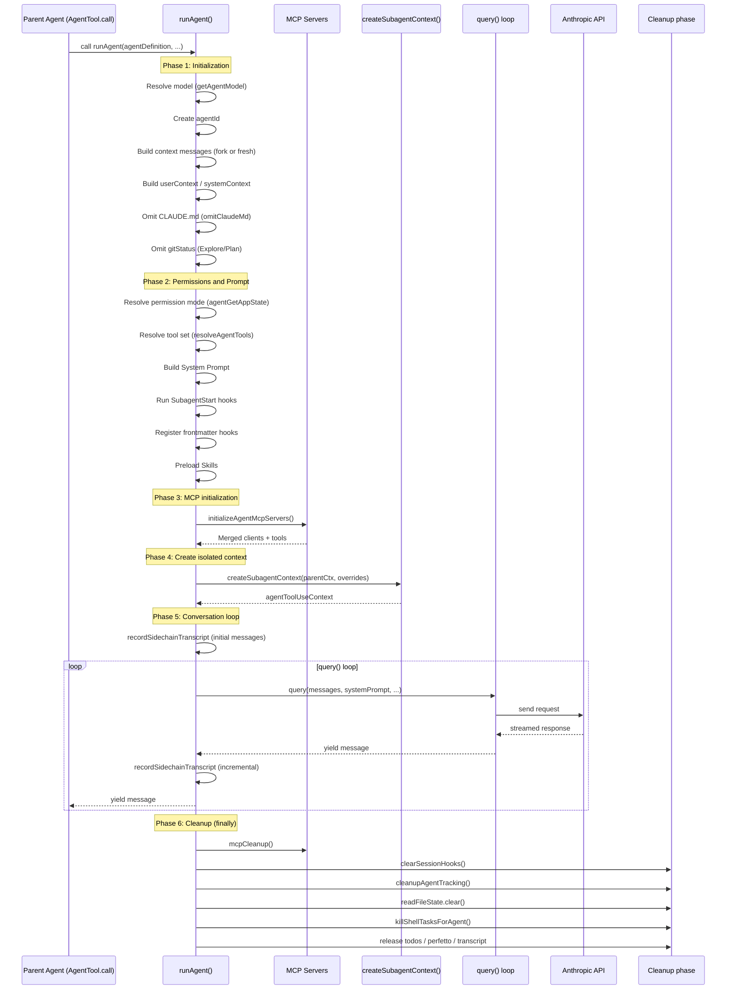

# Chapter 14: The Agent System and Sub-Agent Invocation — From Monolith to Multi-Agent Collaboration

> This is Chapter 14 of *Deep Dive into Claude Code Source*. We dissect the full architecture of the Agent subsystem: from the data structures and loading mechanism of agent definitions, through the complete lifecycle of `runAgent()`, to how `createSubagentContext()` implements context isolation with selective sharing.

## Why multiple agents?

When you ask Claude Code to "refactor the test suite for an entire module," what does a monolithic agent do? It searches files, reads code, writes tests, runs verification — every step executed serially, and the context window swells fast. Worse, the mountain of intermediate output produced during search (grep results, file contents) permanently occupies the context and squeezes out the genuinely valuable information.

Claude Code's answer is **multi-agent collaboration**: the main agent can spawn sub-agents on demand, each with its own independent context window and conversation loop, and only a distilled result flows back when the task is done. It is exactly like a team lead handing tasks to specialists, each of whom works in isolation and then reports a conclusion.

This design solves three core problems:
1. **Context pollution**: the massive intermediate output of search-style tasks never enters the main agent's context.
2. **Specialization**: different kinds of sub-agents can carry different tool sets, permissions, and System Prompts.
3. **Parallel execution**: multiple sub-agents can run in the background simultaneously without interference.

This chapter answers the following questions:
- What does the Agent definition data structure look like? How is it loaded from multiple sources?
- What phases does the full lifecycle of `runAgent()` go through?
- How is context isolation implemented for a sub-agent? Which state is shared, which is isolated?
- Which problems do the built-in agents (Explore, Plan, Verification) each solve?

---

> **Chapter map**: §1 The `AgentDefinition` data blueprint → §2 The full lifecycle of `runAgent()` → §3 Tool resolution (the capability boundary) → §4 Built-in agent types → §5 Fork SubAgent (shared-context branching) → §6 Async agent lifecycle → §7 Agent memory → §8 `AgentSummary` background summarization → §9 Transferable patterns. §1–§3 answer the three questions "what is an agent, how does it run, and what tools can it use"; §4–§5 cover two distinct agent shapes; §6–§8 are cross-cutting services that surround the agent.

## 1. `AgentDefinition`: the agent's data blueprint

### 1.1 Three agent kinds

Claude Code's agent system has a clean type hierarchy, defined in `tools/AgentTool/loadAgentsDir.ts`:

```typescript
// tools/AgentTool/loadAgentsDir.ts:136-165
export type BuiltInAgentDefinition = BaseAgentDefinition & {
  source: 'built-in'
  baseDir: 'built-in'
  callback?: () => void
  getSystemPrompt: (params: {
    toolUseContext: Pick<ToolUseContext, 'options'>
  }) => string
}

export type CustomAgentDefinition = BaseAgentDefinition & {
  getSystemPrompt: () => string
  source: SettingSource
  filename?: string
  baseDir?: string
}

export type PluginAgentDefinition = BaseAgentDefinition & {
  getSystemPrompt: () => string
  source: 'plugin'
  filename?: string
  plugin: string
}

export type AgentDefinition =
  | BuiltInAgentDefinition
  | CustomAgentDefinition
  | PluginAgentDefinition
```

The three kinds correspond to three sources:
- **Built-in**: built-in agents hard-coded into the source (Explore, Plan, general-purpose, etc.).
- **Custom**: user-defined agents declared via `.claude/agents/*.md` files.
- **Plugin**: agents supplied by plugins.

A subtle design detail: the signature of `getSystemPrompt` is **not uniform** across the three kinds. A built-in agent accepts a `toolUseContext` argument (so the prompt can adapt to whichever tools are currently available), while custom and plugin agents bake their prompt in as static content captured via a closure.

### 1.2 `BaseAgentDefinition`: the core fields

`BaseAgentDefinition` carries every dimension an agent can configure (`loadAgentsDir.ts:106-133`):

```typescript
// tools/AgentTool/loadAgentsDir.ts:106-133
export type BaseAgentDefinition = {
  agentType: string            // unique identifier for the agent
  whenToUse: string            // describes when to use this agent (shown to the model)
  tools?: string[]             // allowed tools; undefined or ['*'] means all
  disallowedTools?: string[]   // explicitly forbidden tools
  skills?: string[]            // preloaded Skill names
  mcpServers?: AgentMcpServerSpec[]  // dedicated MCP servers
  hooks?: HooksSettings        // session-scoped hook registrations
  color?: AgentColorName       // color tag shown in the UI
  model?: string               // model to use ('inherit' = inherit from parent)
  effort?: EffortValue          // reasoning effort
  permissionMode?: PermissionMode  // permission-mode override
  maxTurns?: number            // maximum conversation turns
  background?: boolean         // always run as a background task
  initialPrompt?: string       // extra first-turn prompt
  memory?: AgentMemoryScope    // persistent-memory scope (user/project/local)
  isolation?: 'worktree' | 'remote'  // isolation mode
  omitClaudeMd?: boolean       // omit CLAUDE.md (saves tokens for read-only agents)
  criticalSystemReminder_EXPERIMENTAL?: string  // critical constraint reinjected on every user turn
  requiredMcpServers?: string[]  // required MCP-server patterns (agent unavailable if absent)
  pendingSnapshotUpdate?: { snapshotTimestamp: string }  // memory-snapshot update pending
}
```

A handful of fields deserve special attention:
- `criticalSystemReminder_EXPERIMENTAL` — the Verification Agent uses this to reinject the hard "must not modify files" constraint on every user turn, so the model cannot forget it during a long conversation.
- `requiredMcpServers` — checked by `hasRequiredMcpServers()` via a case-insensitive `includes` match against currently available MCP-server names; if unsatisfied, the agent is filtered out of the active list.

Note the `omitClaudeMd` field — a textbook large-scale operational optimization. The source comment reads:

> Read-only agents (Explore, Plan) don't need commit/PR/lint guidelines from CLAUDE.md. Saves ~5-15 Gtok/week across 34M+ Explore spawns.

5–15 gigatokens saved per week — that is the engineering mindset of a product operating at scale.

### 1.3 Multi-source loading of agent definitions

Agent loading is orchestrated by `getAgentDefinitionsWithOverrides()`, a `memoize`-wrapped async function:

```typescript
// tools/AgentTool/loadAgentsDir.ts:296-393
export const getAgentDefinitionsWithOverrides = memoize(
  async (cwd: string): Promise<AgentDefinitionsResult> => {
    // Slim mode: only return built-in agents
    if (isEnvTruthy(process.env.CLAUDE_CODE_SIMPLE)) {
      return { activeAgents: getBuiltInAgents(), allAgents: getBuiltInAgents() }
    }

    // 1. Load Markdown files from .claude/agents/
    const markdownFiles = await loadMarkdownFilesForSubdir('agents', cwd)
    const customAgents = markdownFiles
      .map(({ filePath, baseDir, frontmatter, content, source }) =>
        parseAgentFromMarkdown(filePath, baseDir, frontmatter, content, source)
      )
      .filter(agent => agent !== null)

    // 2. Load plugin agents (memoized, independent of cwd).
    //    With the AGENT_MEMORY_SNAPSHOT feature and auto-memory enabled,
    //    this runs concurrently with memory-snapshot initialization.
    const pluginAgents = await loadPluginAgents()

    // 3. Fetch built-in agents
    const builtInAgents = getBuiltInAgents()

    // 4. Merge all sources and dedupe by priority
    const allAgentsList = [...builtInAgents, ...pluginAgents, ...customAgents]
    const activeAgents = getActiveAgentsFromList(allAgentsList)

    return { activeAgents, allAgents: allAgentsList }
  }
)
```

The dedupe policy in `getActiveAgentsFromList()` is worth noting — it walks `[built-in, plugin, user, project, flag, managed]` in order, with later groups **overriding** earlier same-named agents:

```typescript
// tools/AgentTool/loadAgentsDir.ts:193-221
export function getActiveAgentsFromList(allAgents: AgentDefinition[]): AgentDefinition[] {
  const agentGroups = [
    builtInAgents, pluginAgents, userAgents,
    projectAgents, flagAgents, managedAgents,
  ]
  const agentMap = new Map<string, AgentDefinition>()
  for (const agents of agentGroups) {
    for (const agent of agents) {
      agentMap.set(agent.agentType, agent)
    }
  }
  return Array.from(agentMap.values())
}
```

This means managed (enterprise-administered) agent definitions hold the highest priority and can override any same-named agent from every other source.

### 1.4 Markdown frontmatter: the user-defined agent format

Users define agents by creating Markdown files in `.claude/agents/`. `parseAgentFromMarkdown()` parses the configuration fields in the frontmatter; the Markdown body becomes the System Prompt:

```markdown
---
name: my-researcher
description: "Deep codebase researcher for complex architectural questions"
tools:
  - FileRead
  - Glob
  - Grep
  - Bash
model: inherit
permissionMode: plan
maxTurns: 30
memory: project
---

You are a deep research specialist. Your job is to thoroughly
investigate complex codebase questions...
```

`parseAgentFromMarkdown()` (`loadAgentsDir.ts:541-755`) validates every frontmatter field strictly and degrades gracefully — an invalid value does not fail the entire agent load; it logs a warning and ignores that field.

### 1.5 `/agents`: the interactive management entry

Users do not have to hand-author Markdown. `commands/agents/agents.tsx` registers a very thin slash command — its React component just renders an `<AgentsMenu>`, and the rest of the logic delegates to `components/agents/AgentsMenu.tsx` (along with sibling components `AgentDetail`, `AgentEditor`, `ToolSelector`, `ModelSelector`, `ColorPicker`, `generateAgent`, etc.).

The point of this entry is that it **reverse-exposes** the loading, override, and frontmatter-validation rules from `tools/AgentTool/` as a set of visual editors — users pick tool sets, models, and colors in the UI, the result lands as `.claude/agents/*.md` on disk, and the next `getAgentDefinitionsWithOverrides()` call reads it back. In other words, `/agents` is not a new data path; it is the write side of the same data blueprint.

---

## 2. `runAgent()`: the full sub-agent lifecycle

`runAgent()` is the core engine of the agent system, defined at `tools/AgentTool/runAgent.ts:248-860`. It is an `AsyncGenerator` that yields messages produced by the sub-agent incrementally.

### 2.1 Lifecycle sequence diagram



### 2.2 Phases 1–2: initialization and preparation

The first half of `runAgent()` is a sequence of careful preparation steps.

**Model resolution** — the agent's model goes through a multi-level fallback:

```typescript
// tools/AgentTool/runAgent.ts:340-345
const resolvedAgentModel = getAgentModel(
  agentDefinition.model,      // model declared by the agent
  toolUseContext.options.mainLoopModel,  // parent's main-loop model
  model,                       // override passed at call time
  permissionMode,              // permission mode affects model choice
)
```

**Message construction** — the sub-agent's initial messages come in two shapes:
1. **Fork mode**: `forkContextMessages` is non-empty, so the sub-agent inherits the parent's conversation history (filtering out incomplete `tool_use` entries).
2. **Fresh mode**: starts from scratch with only `promptMessages`.

```typescript
// tools/AgentTool/runAgent.ts:370-378
const contextMessages: Message[] = forkContextMessages
  ? filterIncompleteToolCalls(forkContextMessages)
  : []
const initialMessages: Message[] = [...contextMessages, ...promptMessages]

// Fork mode reuses the parent's file-state cache; fresh mode creates a new one.
const agentReadFileState = forkContextMessages !== undefined
  ? cloneFileStateCache(toolUseContext.readFileState)
  : createFileStateCacheWithSizeLimit(READ_FILE_STATE_CACHE_SIZE)
```

**Token-saving optimization** — two targeted context trims for read-only agents:

```typescript
// tools/AgentTool/runAgent.ts:390-410
// 1. Omit CLAUDE.md (Explore/Plan do not need commit/PR/lint rules)
const shouldOmitClaudeMd = agentDefinition.omitClaudeMd
  && !override?.userContext
  && getFeatureValue_CACHED_MAY_BE_STALE('tengu_slim_subagent_claudemd', true)

// 2. Omit gitStatus (Explore/Plan can run git status themselves if needed)
const resolvedSystemContext =
  agentDefinition.agentType === 'Explore' || agentDefinition.agentType === 'Plan'
    ? systemContextNoGit
    : baseSystemContext
```

**Permission-mode override** — `agentGetAppState` is a carefully constructed closure that, on every invocation, dynamically returns an `AppState` carrying the overridden permissions:

```typescript
// tools/AgentTool/runAgent.ts:415-498
const agentGetAppState = () => {
  const state = toolUseContext.getAppState()
  let toolPermissionContext = state.toolPermissionContext

  // Override permission mode (but bypassPermissions/acceptEdits/auto outrank this)
  if (agentPermissionMode && state.toolPermissionContext.mode !== 'bypassPermissions' ...) {
    toolPermissionContext = { ...toolPermissionContext, mode: agentPermissionMode }
  }

  // Async agents auto-deny permission prompts
  if (shouldAvoidPrompts) {
    toolPermissionContext = {
      ...toolPermissionContext,
      shouldAvoidPermissionPrompts: true,
    }
  }

  // Scope isolation: when allowedTools is provided, replace session-level rules
  if (allowedTools !== undefined) {
    toolPermissionContext = {
      ...toolPermissionContext,
      alwaysAllowRules: {
        cliArg: state.toolPermissionContext.alwaysAllowRules.cliArg, // preserve SDK-level permissions
        session: [...allowedTools],  // replace session-level permissions
      },
    }
  }

  return { ...state, toolPermissionContext, effortValue }
}
```

Note that the `cliArg` rules are preserved — this guarantees that permissions passed in via the SDK's `--allowedTools` remain in effect inside the sub-agent, while the parent agent's session-level permissions do not leak into the sub-agent.

### 2.3 Phase 3: agent-dedicated MCP servers

An agent can declare its own MCP servers via frontmatter; these servers are **incremental extensions to the parent's set**:

```typescript
// tools/AgentTool/runAgent.ts:95-218
async function initializeAgentMcpServers(
  agentDefinition: AgentDefinition,
  parentClients: MCPServerConnection[],
) {
  for (const spec of agentDefinition.mcpServers) {
    if (typeof spec === 'string') {
      // Reference an existing MCP server by name — memoized connection, shared with parent
      config = getMcpConfigByName(spec)
    } else {
      // Inline definition — agent-dedicated server, must be cleaned up when the agent ends
      isNewlyCreated = true
    }
    const client = await connectToServer(name, config)
    agentClients.push(client)
  }

  // cleanup only tears down newly created servers; shared references are left alone
  const cleanup = async () => {
    for (const client of newlyCreatedClients) {
      await client.cleanup()
    }
  }

  // Return merged clients and tools
  return {
    clients: [...parentClients, ...agentClients],
    tools: agentTools,
    cleanup,
  }
}
```

The subtlety here is that an MCP server referenced by name does not reconnect — `connectToServer` is memoized — while cleanup only closes the agent's inline-defined servers, leaving the parent's shared connections untouched.

### 2.4 Phase 4: the core of context isolation

`createSubagentContext()` lives at `utils/forkedAgent.ts:345-462` and is one of the most important functions in the whole agent system. It creates a `ToolUseContext` for the sub-agent that is **fully isolated by default, with explicit opt-in sharing**:

```typescript
// utils/forkedAgent.ts:345-462
export function createSubagentContext(
  parentContext: ToolUseContext,
  overrides?: SubagentContextOverrides,
): ToolUseContext {
  // AbortController: explicit override > shared parent > new child linked to parent
  const abortController = overrides?.abortController
    ?? (overrides?.shareAbortController
      ? parentContext.abortController
      : createChildAbortController(parentContext.abortController))

  // getAppState: use override if provided; if AbortController is shared, this is an
  // interactive agent, inherit parent directly; otherwise wrap to inject
  // shouldAvoidPermissionPrompts: true.
  const getAppState = overrides?.getAppState
    ? overrides.getAppState
    : overrides?.shareAbortController
      ? parentContext.getAppState
      : () => {
          const state = parentContext.getAppState()
          if (state.toolPermissionContext.shouldAvoidPermissionPrompts) return state
          return { ...state, toolPermissionContext: {
            ...state.toolPermissionContext, shouldAvoidPermissionPrompts: true,
          }}
        }

  return {
    // ===== Isolated mutable state =====
    readFileState: cloneFileStateCache(
      overrides?.readFileState ?? parentContext.readFileState
    ),
    nestedMemoryAttachmentTriggers: new Set<string>(),
    loadedNestedMemoryPaths: new Set<string>(),
    dynamicSkillDirTriggers: new Set<string>(),
    discoveredSkillNames: new Set<string>(),
    toolDecisions: undefined,
    // Clone rather than create fresh — fork sub-agents must make the same
    // replacement decisions on the parent's tool_use_ids
    contentReplacementState: overrides?.contentReplacementState
      ?? (parentContext.contentReplacementState
        ? cloneContentReplacementState(parentContext.contentReplacementState)
        : undefined),

    // ===== AbortController and AppState =====
    abortController,
    getAppState,
    setAppState: overrides?.shareSetAppState
      ? parentContext.setAppState : () => {},
    // Task registration must always reach the root store (even when setAppState is a no-op)
    setAppStateForTasks:
      parentContext.setAppStateForTasks ?? parentContext.setAppState,
    // setAppState is a no-op for async sub-agents, so denial tracking must be local —
    // otherwise the denial counter would not accumulate across retries
    localDenialTracking: overrides?.shareSetAppState
      ? parentContext.localDenialTracking
      : createDenialTrackingState(),

    // ===== Selectively shared metric callbacks =====
    setInProgressToolUseIDs: () => {},
    setResponseLength: overrides?.shareSetResponseLength
      ? parentContext.setResponseLength : () => {},
    pushApiMetricsEntry: overrides?.shareSetResponseLength
      ? parentContext.pushApiMetricsEntry : undefined,
    updateFileHistoryState: () => {},
    // Attribution is functional (prev => next); concurrent calls compose via the React
    // state queue, so this is safe even when setAppState is stubbed.
    updateAttributionState: parentContext.updateAttributionState,

    // ===== UI callbacks the sub-agent does not need =====
    addNotification: undefined,
    setToolJSX: undefined,
    setStreamMode: undefined,
    setSDKStatus: undefined,
    openMessageSelector: undefined,

    // ===== Inherited or overridden properties =====
    options: overrides?.options ?? parentContext.options,
    messages: overrides?.messages ?? parentContext.messages,
    agentId: overrides?.agentId ?? createAgentId(),
    agentType: overrides?.agentType,
    fileReadingLimits: parentContext.fileReadingLimits,
    userModified: parentContext.userModified,
    criticalSystemReminder_EXPERIMENTAL:
      overrides?.criticalSystemReminder_EXPERIMENTAL,
    requireCanUseTool: overrides?.requireCanUseTool,

    // ===== The sub-agent's own tracking chain =====
    queryTracking: {
      chainId: randomUUID(),
      depth: (parentContext.queryTracking?.depth ?? -1) + 1,
    },
  }
}
```

This code embodies one core principle: **isolate by default, share explicitly**. The table below summarizes the isolation strategy for each category of state:

| State category | Isolation strategy | Why |
|---|---|---|
| `readFileState` | Cloned (deep copy) | A sub-agent's file reads must not pollute the parent's cache. |
| `getAppState` | Conditionally wrapped | Non-interactive agents auto-inject `shouldAvoidPermissionPrompts: true`. |
| `setAppState` | No-op by default, opt-in share | Synchronous sub-agents need to update shared state; async ones do not. |
| `setAppStateForTasks` | Always shared | Background bash task registration/cleanup must reach the root store. |
| `localDenialTracking` | New instance when isolated | Async agents need to accumulate denial counts across retries locally. |
| `abortController` | New child (linked to parent) | A parent abort propagates to the child, but a child abort does not affect the parent. |
| `contentReplacementState` | Cloned | Fork sub-agents must make consistent replacement decisions to hit the prompt cache. |
| `pushApiMetricsEntry` | Coupled with `setResponseLength` | Sub-agents that share metrics must report API metrics back to the parent. |
| `updateAttributionState` | Always shared | Functional callback, concurrency-safe, unaffected by setAppState (attribution refers to the "ownership" of token usage, API counts, and similar metrics — a sub-agent's consumption is backfilled to the root session that originated it for billing). |
| `queryTracking` | New (depth+1) | Every sub-agent gets its own call-chain trace. |
| UI callbacks (5 of them) | undefined | The sub-agent cannot manipulate the parent's UI. |

Take special note of the `setAppStateForTasks` comment:

> Task registration/kill must always reach the root store, even when setAppState is a no-op — otherwise async agents' background bash tasks are never registered and never killed (PPID=1 zombie).

This is a real bug lesson: if a background agent's bash tasks are never registered with the root store, they become orphan processes (PPID=1 zombies) after the agent exits.

### 2.5 Phase 5: the conversation loop

Once preparation is done, `runAgent()` enters the core `query()` loop:

```typescript
// tools/AgentTool/runAgent.ts:747-806
try {
  for await (const message of query({
    messages: initialMessages,
    systemPrompt: agentSystemPrompt,
    userContext: resolvedUserContext,
    systemContext: resolvedSystemContext,
    canUseTool,
    toolUseContext: agentToolUseContext,
    querySource,
    maxTurns: maxTurns ?? agentDefinition.maxTurns,
  })) {
    onQueryProgress?.()

    // Forward API request metrics to the parent (TTFT/OTPS update)
    if (message.type === 'stream_event' && message.event.type === 'message_start') {
      toolUseContext.pushApiMetricsEntry?.(message.ttftMs)
      continue
    }

    // Handle the max_turns_reached signal
    if (message.type === 'attachment' && message.attachment.type === 'max_turns_reached') {
      break
    }

    // Record into the sidechain and yield up to the parent
    if (isRecordableMessage(message)) {
      await recordSidechainTranscript([message], agentId, lastRecordedUuid)
      yield message
    }
  }
}
```

Every message is incrementally recorded to a sidechain transcript on disk, which lets the agent resume execution after a crash (`resumeAgent.ts`).

### 2.6 Phase 6: cleanup — leave no trace

The cleanup work in the `finally` block is the last line of defense against resource leaks:

```typescript
// tools/AgentTool/runAgent.ts:816-858
finally {
  await mcpCleanup()                              // close agent-dedicated MCP servers
  if (agentDefinition.hooks) {                     // only clear if hooks were registered
    clearSessionHooks(rootSetAppState, agentId)
  }
  if (feature('PROMPT_CACHE_BREAK_DETECTION')) {   // gated by feature flag
    cleanupAgentTracking(agentId)
  }
  agentToolUseContext.readFileState.clear()         // free file-state cache memory
  initialMessages.length = 0                       // free fork-context messages
  unregisterPerfettoAgent(agentId)                 // free performance-tracking entries
  clearAgentTranscriptSubdir(agentId)              // free transcript subdir mapping

  // Release the todos entry in AppState — prevents memory leaks
  rootSetAppState(prev => {
    if (!(agentId in prev.todos)) return prev
    const { [agentId]: _removed, ...todos } = prev.todos
    return { ...prev, todos }
  })

  // Kill background bash tasks spawned by the agent — prevents orphan processes
  killShellTasksForAgent(agentId, toolUseContext.getAppState, rootSetAppState)

  // Gated by feature flag: clean up monitor MCP tasks
  if (feature('MONITOR_TOOL')) {
    mcpMod.killMonitorMcpTasksForAgent(agentId, ...)
  }
}
```

The comments in this cleanup block expose a real operational problem at scale:

> Whale sessions spawn hundreds of agents; each orphaned key is a small leak that adds up.

A whale-user session can spawn hundreds of agents, each leaving an empty entry behind in `AppState.todos` — seemingly harmless `{}` entries that add up to a meaningful memory leak.

---

## 3. Tool resolution: the agent's capability boundary

### 3.1 The three-layer tool filter

The tools available to a sub-agent are filtered through three layers, defined in `tools/AgentTool/agentToolUtils.ts:70-225`. The overall trend is progressive narrowing, but each layer has **clear exception channels**.

**Layer 1: global denial** — tools no agent can use:

```typescript
// constants/tools.ts:36-46
export const ALL_AGENT_DISALLOWED_TOOLS = new Set([
  TASK_OUTPUT_TOOL_NAME,
  EXIT_PLAN_MODE_V2_TOOL_NAME,
  ENTER_PLAN_MODE_TOOL_NAME,
  // external builds forbid agent nesting
  ...(process.env.USER_TYPE === 'ant' ? [] : [AGENT_TOOL_NAME]),
  ASK_USER_QUESTION_TOOL_NAME,
  TASK_STOP_TOOL_NAME,
])
```

But before applying global denial, `filterToolsForAgent()` has two higher-priority passthrough channels:

```typescript
// tools/AgentTool/agentToolUtils.ts:81-93
// Exception 1: MCP tools pass unconditionally — anything prefixed with mcp__ skips all filters
if (tool.name.startsWith('mcp__')) return true
// Exception 2: in plan mode, let ExitPlanMode through (in-process teammates need to exit plan)
if (toolMatchesName(tool, EXIT_PLAN_MODE_V2_TOOL_NAME) && permissionMode === 'plan') return true
```

**Layer 2: async-agent restriction** — agents running in the background can only use tools on a whitelist:

```typescript
// constants/tools.ts:55-71
export const ASYNC_AGENT_ALLOWED_TOOLS = new Set([
  FILE_READ_TOOL_NAME, WEB_SEARCH_TOOL_NAME, TODO_WRITE_TOOL_NAME,
  GREP_TOOL_NAME, WEB_FETCH_TOOL_NAME, GLOB_TOOL_NAME,
  ...SHELL_TOOL_NAMES,
  FILE_EDIT_TOOL_NAME, FILE_WRITE_TOOL_NAME, NOTEBOOK_EDIT_TOOL_NAME,
  SKILL_TOOL_NAME, SYNTHETIC_OUTPUT_TOOL_NAME, TOOL_SEARCH_TOOL_NAME,
  ENTER_WORKTREE_TOOL_NAME, EXIT_WORKTREE_TOOL_NAME,
])
```

This layer has its own exceptions — when Agent Swarms is enabled and the current agent is an in-process teammate, an async agent can additionally use `AgentTool` (to spawn synchronous sub-agents) and the `IN_PROCESS_TEAMMATE_ALLOWED_TOOLS` set (coordination tools like `TaskCreate/Get/List/Update`, `SendMessage`).

**Layer 3: agent-definition level** — each agent's `tools` and `disallowedTools` fields:

```typescript
// tools/AgentTool/agentToolUtils.ts:122-225
export function resolveAgentTools(agentDefinition, availableTools, isAsync) {
  // First apply the global filter
  const filteredAvailableTools = filterToolsForAgent({ tools, isBuiltIn, isAsync })

  // Then apply disallowedTools
  const allowedAvailableTools = filteredAvailableTools.filter(
    tool => !disallowedToolSet.has(tool.name)
  )

  // tools undefined or ['*'] means allow everything
  const hasWildcard = agentTools === undefined
    || (agentTools.length === 1 && agentTools[0] === '*')
  if (hasWildcard) {
    return { hasWildcard: true, resolvedTools: allowedAvailableTools }
  }

  // Otherwise allow only the explicitly listed tools
  // ...name-matching...
}
```

These three layers form a **broadly narrowing permission model with explicit exception channels**. The overall trend is that each layer can only shrink further, but MCP tools (`mcp__` prefix) pierce every layer unconditionally, plan-mode `ExitPlanMode` bypasses the global denial, and in-process teammates pick up extra tools in the async-restriction layer. All these exceptions are **hard-coded whitelists** — they cannot be expanded by an agent definition, so the security boundary remains under control.

---

## 4. Anatomy of the built-in agents

### 4.1 Built-in agent registration

`builtInAgents.ts` assembles the built-in agent list conditionally:

```typescript
// tools/AgentTool/builtInAgents.ts:22-72
export function getBuiltInAgents(): AgentDefinition[] {
  // SDK users can disable all built-in agents via an env var
  if (isEnvTruthy(process.env.CLAUDE_AGENT_SDK_DISABLE_BUILTIN_AGENTS)
      && getIsNonInteractiveSession()) {
    return []
  }

  // In Coordinator Mode, return a completely different agent set
  if (feature('COORDINATOR_MODE') && isEnvTruthy(process.env.CLAUDE_CODE_COORDINATOR_MODE)) {
    return getCoordinatorAgents()  // lazy require to avoid circular dependency
  }

  const agents: AgentDefinition[] = [
    GENERAL_PURPOSE_AGENT,
    STATUSLINE_SETUP_AGENT,
  ]

  if (areExplorePlanAgentsEnabled()) {
    agents.push(EXPLORE_AGENT, PLAN_AGENT)
  }

  // Non-SDK entrypoints include the Claude Code Guide Agent
  if (isNonSdkEntrypoint) {
    agents.push(CLAUDE_CODE_GUIDE_AGENT)
  }

  // Verification Agent gated by feature flag and A/B test
  if (feature('VERIFICATION_AGENT')
      && getFeatureValue_CACHED_MAY_BE_STALE('tengu_hive_evidence', false)) {
    agents.push(VERIFICATION_AGENT)
  }

  return agents
}
```

Two important details:
- **Coordinator Mode short-circuit**: when Coordinator Mode is on, `getBuiltInAgents()` returns the coordinator-specific agent set directly, completely replacing the normal built-ins. The lazy `require` here breaks the circular dependency `coordinatorMode → tools → AgentTool → builtInAgents`.
- **Entrypoint and feature-flag gating**: `CLAUDE_CODE_GUIDE_AGENT` is only registered for non-SDK entrypoints (i.e. real CLI sessions); `VERIFICATION_AGENT` is gated by both a feature flag and a GrowthBook check. The §4.2–§4.6 sections below unpack each of these agents' design trade-offs in turn.

### 4.2 Explore Agent: the read-only search specialist

```typescript
// tools/AgentTool/built-in/exploreAgent.ts:64-83
export const EXPLORE_AGENT: BuiltInAgentDefinition = {
  agentType: 'Explore',
  disallowedTools: [AGENT_TOOL_NAME, FILE_EDIT_TOOL_NAME, FILE_WRITE_TOOL_NAME, ...],
  model: process.env.USER_TYPE === 'ant' ? 'inherit' : 'haiku',
  omitClaudeMd: true,
  getSystemPrompt: () => getExploreSystemPrompt(),
}
```

The Explore Agent's design philosophy is **fast, cheap, read-only**:
- **Read-only lockdown**: `disallowedTools` explicitly forbids every write tool, and the System Prompt drives the point home with `=== CRITICAL: READ-ONLY MODE ===`.
- **Smaller model**: external users default to `haiku` (faster and cheaper); internal users use `inherit` (still subject to a GrowthBook A/B test).
- **Omits CLAUDE.md**: `omitClaudeMd: true` saves tens of billions of tokens a week.
- **Parallel-search guidance**: the System Prompt explicitly asks the agent to "try to spawn multiple parallel tool calls".

### 4.3 Plan Agent: the read-only architect

```typescript
// tools/AgentTool/built-in/planAgent.ts:73-92
export const PLAN_AGENT: BuiltInAgentDefinition = {
  agentType: 'Plan',
  disallowedTools: [AGENT_TOOL_NAME, FILE_EDIT_TOOL_NAME, FILE_WRITE_TOOL_NAME, ...],
  model: 'inherit',
  omitClaudeMd: true,
  getSystemPrompt: () => getPlanV2SystemPrompt(),
}
```

The Plan Agent shares the same read-only constraints as Explore, but its System Prompt steers in a different direction:
- It is steered toward "architectural design" rather than search.
- It is required to output a structured implementation plan including a "Critical Files for Implementation" list.
- It uses the `inherit` model (planning needs stronger reasoning).

### 4.4 Verification Agent: the adversarial verifier

The Verification Agent is the most interesting built-in — its System Prompt uses an **adversarial design**:

```typescript
// tools/AgentTool/built-in/verificationAgent.ts:10-12
const VERIFICATION_SYSTEM_PROMPT = `You are a verification specialist.
Your job is not to confirm the implementation works — it's to try to break it.

You have two documented failure patterns. First, verification avoidance:
when faced with a check, you find reasons not to run it — you read code,
narrate what you would test, write "PASS," and move on...`
```

The System Prompt directly enumerates the model's common "shortcut modes" and asks the model to fight itself. Note that while the Verification Agent cannot modify files **inside the project directory**, it is explicitly allowed to write temporary test scripts under `/tmp` or `$TMPDIR` (multi-step race-condition scripts, Playwright tests, and so on) and clean them up afterwards. It is also steered to check whether it has browser-automation tools available (`mcp__claude-in-chrome__*`, `mcp__playwright__*`) — these MCP tools pierce every layer of the tool filter.

It also uses `criticalSystemReminder_EXPERIMENTAL` to reinject the critical constraint on every user turn:

```typescript
// tools/AgentTool/built-in/verificationAgent.ts:150-151
criticalSystemReminder_EXPERIMENTAL:
  'CRITICAL: This is a VERIFICATION-ONLY task. You CANNOT edit, write, or create files...',
```

The output format is constrained too — it must include the actual commands executed and their output, and must end with `VERDICT: PASS/FAIL/PARTIAL`.

### 4.5 General-purpose Agent: the all-tools workhorse

```typescript
// tools/AgentTool/built-in/generalPurposeAgent.ts:25-34
export const GENERAL_PURPOSE_AGENT: BuiltInAgentDefinition = {
  agentType: 'general-purpose',
  tools: ['*'],          // every tool available
  source: 'built-in',
  // model deliberately omitted — uses getDefaultSubagentModel()
  getSystemPrompt: getGeneralPurposeSystemPrompt,
}
```

The general-purpose agent is the universal all-tools agent. In the traditional mode, it is the default when the user does not specify a `subagent_type`. But note: **when the Fork Subagent experiment is on** (`isForkSubagentEnabled()` returns `true`), omitting `subagent_type` follows the implicit fork path (inheriting the parent context) rather than spawning a fresh general-purpose agent. In that case only an explicit `subagent_type: "general-purpose"` will use it.

### 4.6 Claude Code Guide Agent: self-serve user help

`CLAUDE_CODE_GUIDE_AGENT` is the "non-SDK entrypoint only" agent flagged in the registration logic in §4.1. What makes it special is that it is the only built-in whose `getSystemPrompt()` uses the `toolUseContext` parameter — it can dynamically inject the user's currently configured skills, agents, MCP servers, and settings, so that answers to "How do I..." questions reflect the user's actual environment. Configuration-wise it uses the `haiku` model with the `dontAsk` permission mode (auto-deny operations that need confirmation), which makes it both fast and safe. This agent is exposed only to real CLI users — in SDK-embedding scenarios the host application usually has its own help channel.

---

## 5. Fork SubAgent: an efficient branch with shared context

Fork is a special sub-agent mode in the agent system, defined in `tools/AgentTool/forkSubagent.ts`. Unlike a fresh agent (which starts from zero), a fork sub-agent **inherits the full conversation history and System Prompt of the parent agent**.

### 5.1 Why Fork?

The core problem Fork solves is **prompt cache reuse**. A fresh agent has to retransmit the entire System Prompt and context, whereas a fork sub-agent reuses the parent's cache and only transmits the fork directive incrementally. As the source comment puts it:

> A fork beats a fresh subagent for this — it inherits context and shares your cache.

### 5.2 Fork message construction

`buildForkedMessages()` is designed so that every fork sub-agent produces **byte-identical** API request prefixes:

```typescript
// tools/AgentTool/forkSubagent.ts:107-169
export function buildForkedMessages(
  directive: string,
  assistantMessage: AssistantMessage,
): MessageType[] {
  // Preserve the full assistant message (all tool_use, thinking, text)
  const fullAssistantMessage = { ...assistantMessage, uuid: randomUUID() }

  // For every tool_use, emit a tool_result with the same placeholder
  const toolResultBlocks = toolUseBlocks.map(block => ({
    type: 'tool_result',
    tool_use_id: block.id,
    content: [{ type: 'text', text: 'Fork started — processing in background' }],
  }))

  // Only the trailing directive text block differs
  const toolResultMessage = createUserMessage({
    content: [
      ...toolResultBlocks,           // identical across all fork sub-agents
      { type: 'text', text: buildChildMessage(directive) },  // unique per child
    ],
  })

  return [fullAssistantMessage, toolResultMessage]
}
```

The structure is `[...history, assistant(all_tool_uses), user(placeholder_results..., directive)]`. Only the final `directive` differs, maximizing cache-hit rate.

### 5.3 Preventing recursive forks

The Fork sub-agent keeps the Agent tool in its tool pool (for cache consistency), but it blocks nested forks at runtime through a **double mechanism**.

**Mechanism 1: message scan** — `isInForkChild()` scans the conversation history for a tag:

```typescript
// tools/AgentTool/forkSubagent.ts:78-89
export function isInForkChild(messages: MessageType[]): boolean {
  return messages.some(m => {
    if (m.type !== 'user') return false
    return content.some(
      block => block.type === 'text'
        && block.text.includes(`<${FORK_BOILERPLATE_TAG}>`)
    )
  })
}
```

**Mechanism 2: `querySource` persistence** — because autocompact rewrites message content (potentially deleting the `<fork-boilerplate>` tag), message scanning alone is not reliable. `runAgent()` injects `querySource` into the fork sub-agent's `context.options`:

```typescript
// tools/AgentTool/runAgent.ts:688-695
// Fork children need querySource on context.options for the recursive-fork
// guard — it checks options.querySource === 'agent:builtin:fork'.
// This survives autocompact (which rewrites messages, not context.options).
...(useExactTools && { querySource }),
```

`AgentTool.call()` checks both at execution time: first `options.querySource === 'agent:builtin:fork'` (autocompact-proof), then `isInForkChild()` as a fallback (covers the non-`useExactTools` path).

---

## 6. Async-agent lifecycle management

A synchronous agent runs in the foreground while the parent waits for it to finish. An async agent runs in the background, freeing the parent agent to keep working on other tasks. The full lifecycle of an async agent is driven by `runAsyncAgentLifecycle()` (`agentToolUtils.ts:508-686`):

```typescript
// tools/AgentTool/agentToolUtils.ts:508-686
export async function runAsyncAgentLifecycle({
  taskId, abortController, makeStream, metadata, description,
  toolUseContext, rootSetAppState, agentIdForCleanup, enableSummarization,
}) {
  const tracker = createProgressTracker()
  const resolveActivity = createActivityDescriptionResolver(tools)

  // Optionally: start background summarization
  const onCacheSafeParams = enableSummarization
    ? (params) => { stopSummarization = startAgentSummarization(...) }
    : undefined

  try {
    for await (const message of makeStream(onCacheSafeParams)) {
      agentMessages.push(message)
      // Update task messages in AppState in real time (visible in the UI)
      rootSetAppState(prev => { /* append message to task */ })
      // Update progress metrics
      updateProgressFromMessage(tracker, message, resolveActivity, tools)
      updateAsyncAgentProgress(taskId, getProgressUpdate(tracker), rootSetAppState)
    }

    // Mark the task complete
    completeAsyncAgent(agentResult, rootSetAppState)
    // Send completion notification
    enqueueAgentNotification({ taskId, description, status: 'completed', ... })
  } catch (error) {
    if (error instanceof AbortError) {
      killAsyncAgent(taskId, rootSetAppState)
      enqueueAgentNotification({ status: 'killed', ... })
    } else {
      failAsyncAgent(taskId, msg, rootSetAppState)
      enqueueAgentNotification({ status: 'failed', ... })
    }
  }
}
```

Key design point: **update state first, then send the notification**. The comment spells out why:

> Mark task completed FIRST so TaskOutput(block=true) unblocks immediately. classifyHandoffIfNeeded (API call) and getWorktreeResult (git exec) are notification embellishments that can hang.

This avoids deadlocks caused by API calls or git operations — even if notification enrichment fails, the task's state transition has already happened correctly. In the comment, `TaskOutput(block=true)` refers to the `TaskOutput` tool waiting for the async task to finish in blocking mode (see Chapter 13), and `classifyHandoffIfNeeded` is an additional-API-call classifier that decides "does this need to be handed off to the next agent"; both can hang on external dependencies, so they have to run after the state transition.

---

## 7. The agent memory system

An agent can have persistent memory that spans sessions, defined in `tools/AgentTool/agentMemory.ts`:

```typescript
// tools/AgentTool/agentMemory.ts:12-13
export type AgentMemoryScope = 'user' | 'project' | 'local'
```

The three memory scopes map to different storage paths:
- **user**: `~/.claude/agent-memory/<agentType>/` — shared across projects.
- **project**: `<cwd>/.claude/agent-memory/<agentType>/` — project-scoped, can be committed to VCS.
- **local**: `<cwd>/.claude/agent-memory-local/<agentType>/` — project-scoped but not committed.

Memory content is injected at the tail of the agent's System Prompt via `loadAgentMemoryPrompt()`:

```typescript
// tools/AgentTool/agentMemory.ts:138-177
export function loadAgentMemoryPrompt(agentType, scope) {
  const memoryDir = getAgentMemoryDir(agentType, scope)
  void ensureMemoryDirExists(memoryDir) // Fire-and-forget
  return buildMemoryPrompt({ displayName: 'Persistent Agent Memory', memoryDir })
}
```

Note that `ensureMemoryDirExists` is fire-and-forget — because `getSystemPrompt()` is invoked synchronously (inside a React render) and cannot `await`. The agent's first API request always involves at least one network round-trip, by which point directory creation has long since completed.

---

## 8. `AgentSummary`: background progress summarization

Once an async agent is running, a single "in progress" line in the UI is enough to drain a user's patience. Claude Code's answer is not to redesign the UI but to spawn another agent — `services/AgentSummary/agentSummary.ts` implements a background summarizer that ticks every 30 seconds, periodically forking the current conversation and asking the model to describe "what am I doing right now" in 3–5 English words, then writing the sentence back into `AgentProgress` for the frontend.

```typescript
// services/AgentSummary/agentSummary.ts:26
const SUMMARY_INTERVAL_MS = 30_000
```

The most quotable part of the implementation is not the fork itself but the **way it protects the prompt cache**. Every tick generates a summary, and the child request must share the same cache key as the parent request — otherwise every 30 seconds the entire history would be billed at full price. `startAgentSummarization` therefore does three mutually reinforcing things:

```typescript
// services/AgentSummary/agentSummary.ts:55
const { forkContextMessages: _drop, ...baseParams } = cacheSafeParams
```

Step one: immediately drop the lingering `forkContextMessages` from the closure. That field is real at the moment the timer starts but stale 30 seconds later — keeping it around would pin an obsolete conversation into every tick of the fork. Each `runSummary()` instead re-reads the live transcript via `getAgentTranscript(agentId)`, then uses `filterIncompleteToolCalls` to clean up any `tool_use` entries with no matching result.

```typescript
// services/AgentSummary/agentSummary.ts:94-98
const canUseTool = async () => ({
  behavior: 'deny' as const,
  message: 'No tools needed for summary',
  decisionReason: { type: 'other' as const, reason: 'summary only' },
})
```

Step two is the one "counter-intuitive" detail explicitly called out in the comments: **disabling tools must go through the `canUseTool` callback, and you must never set `tools: []`**. The latter changes the request's cache key (the tool list is part of the key), instantly invalidating the entire historical cache; the former rejects only at call time while the request itself still ships the full tool set, so the cache can keep hitting.

Step three is what it **does not** do — the source spends eight lines explaining why `maxOutputTokens` must not be set:

```typescript
// services/AgentSummary/agentSummary.ts:100-104
// DO NOT set maxOutputTokens here. The fork piggybacks on the main
// thread's prompt cache by sending identical cache-key params (system,
// tools, model, messages prefix, thinking config). Setting maxOutputTokens
// would clamp budget_tokens, creating a thinking config mismatch that
// invalidates the cache.
```

`maxOutputTokens` propagates down to the thinking config's `budget_tokens`, and the thinking config itself participates in the cache key — a seemingly harmless "save some output" call invalidates every cached prefix. Put the three together (drop the closure, deny via callback, never touch the token cap) and you see why a forked one-sentence sub-agent does not turn every wake-up into a full-history bill.

Finally, `runSummary` schedules the next tick inside its `finally` block via `scheduleNext()`, rather than using `setInterval` — this guarantees that two summaries can never overlap: even if a tick takes 50 seconds due to a slow network, the next tick starts its 30-second timer only after that one finishes. The summary itself uses `runForkedAgent` rather than `runAgent`, paired with `skipTranscript: true`, so the temporary fork conversation never pollutes the sidechain.

The whole file is under 180 lines, yet it simultaneously demonstrates three things: how to periodically reuse an expensive conversation, how to temporarily tighten tool permissions while sharing the cache, and how to deliberately "forget" stale data inside a closure. The next time you need to add a "what is it doing right now" side channel to any long-running agent, those three principles will keep you out of trouble.

---

## 9. Transferable design patterns

### Pattern 1: context clone with isolation by default, sharing on demand

The design principle behind `createSubagentContext()` — all mutable state is isolated by default, anything shared must be enabled explicitly through an opt-in parameter. This is far safer than "shared by default, isolate by hand," because a missed isolation causes bugs, while a missed share at worst causes incomplete functionality (easy to spot and fix).

**Where it applies**: any system that needs to fork sub-tasks from a parent context — Web Workers, microservice-to-microservice calls, multi-threaded task dispatch.

### Pattern 2: broadly narrowing permission filter with hard-coded exception channels

The three-layer tool filter (global denial → async restriction → agent definition) trends narrower overall, yet every layer carries hard-coded exception channels (MCP passthrough, plan-mode passthrough, extra teammate tools). This "narrowing trunk + whitelisted exceptions" pattern fits real systems better than either pure narrowing or free-form extension: the trunk guarantees safety, the whitelist guarantees usability for special cases, and every exception is fixed at compile time or registration time — not extensible by runtime user input.

**Where it applies**: multi-tenant permission systems, plugin sandboxes, tiered API permissions.

### Pattern 3: state transition first, notification enrichment second

When an async agent finishes, the system calls `completeAsyncAgent()` to update state first, then runs the classifier and worktree check to enrich the notification. This makes the state-machine transition atomic — even if the enrichment step fails (network timeout, git hang), the system's state remains correct.

**Where it applies**: any asynchronous task system with a "complete + notify" pair — order systems (update order state first, then send email), CI/CD (mark the build complete first, then generate the report).

---

---

## Next chapter

[Chapter 15: Built-in Agent design patterns — System Prompt design for Explore, Plan, and Verification](./15-built-in-agent-design-patterns.md)

We will dive into the System Prompt design of six built-in agents and uncover how prompt engineering can shape the same underlying tool system into radically different agent personalities and behaviors.

---
*For everything else, please follow https://github.com/luyao618/Claude-Code-Source-Study (a free star is much appreciated)*
