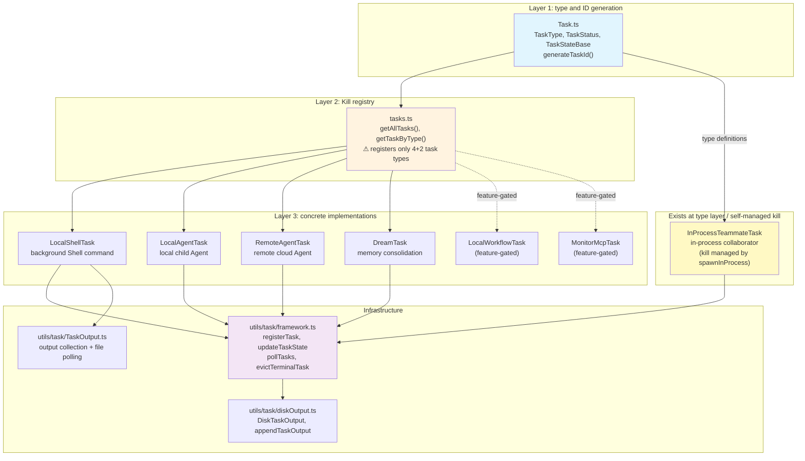

# Chapter 16: Task Model and TaskType Lineage: The Concurrent Execution Engine for Agents

> This is chapter 16 of the *Deep Dive into Claude Code Source* series. We will take a close look at how Claude Code uses one unified task system to manage every kind of asynchronous work, from background Shell commands to parallel multi-Agent collaboration.
>
> Quick reference: see [Appendix E: TaskType Lineage](appendix/E.md) for a side-by-side table of wire literals, feature flags, and registration paths.

## Why Does Claude Code Need a Task System?

In the previous chapters, we have already seen the Agent system (chapter 14) and the built-in Agent (内置 Agent) design patterns (chapter 15). One key question remains unresolved: **when the model launches multiple Agents, multiple background Shell commands, or even a "dreaming" memory-consolidation task at the same time, how are all of these concurrent units of work managed consistently?**

Imagine a real scenario: in Coordinator mode, the main Agent dispatches three Workers at once to investigate different parts of the codebase, and each Worker may start its own background Shell commands. At that point, the system needs to:

1. **Track the full lifecycle of every task** (`pending` -> `running` -> `completed`/`failed`/`killed`)
2. **Terminate tasks safely** (including cleaning up child processes and releasing file handles)
3. **Collect and forward task output** (notify the main Agent when a task completes)
4. **Isolate task state** (one task's failure should not cascade into other tasks)
5. **Show background task progress in the terminal UI** (the bottom status-bar indicator such as "2 local agents, 1 shell")

This is the problem the task system solves. It is Claude Code's **concurrent execution engine**, bringing all asynchronous work under one type-safe framework with complete lifecycle semantics.

---

> **In-chapter guide**: §1 architecture overview (`Task` interface + `TaskState` type system) -> §2 `framework.ts` and output-management infrastructure -> §3 detailed task types -> §3.5 model-side entrypoints (six `Task*Tool`s) -> §4 task notification mechanism -> §5 three Agent collaboration modes -> §6 `createSubagentContext()` context isolation -> §7 portable patterns. §3.5 is a later "source-reading pitfall" section that clarifies that `AppState.tasks` and the `TodoV2` system in `utils/tasks.ts` are two systems with the same name but different substance.

## 1. Architecture Overview: The `Task` Interface and `TaskState` Type System

### 1.1 Core Abstraction: A Three-Layer Separation

The task system uses a clean three-layer separation architecture:



**Layer 1** (`Task.ts`) defines the types shared by all tasks: `TaskType`, `TaskStatus`, `TaskStateBase`, and the ID-generation logic.

**Layer 2** (`tasks.ts`) is the kill-dispatch registry. Its pattern mirrors `tools.ts`: `getAllTasks()` returns all registered task-type instances, and `getTaskByType()` looks up an implementation by type. One important caveat: **not every `TaskType` is registered here**. Today, `getAllTasks()` contains only `LocalShellTask`, `LocalAgentTask`, `RemoteAgentTask`, `DreamTask`, and two feature-gated tasks. `InProcessTeammateTask` exists in the `TaskType` union and the `TaskState` union, is registered into AppState through `registerTask()`, and is displayed in the UI layer (pill and panel), but its kill logic is handled directly by `killInProcessTeammate()` (`utils/swarm/spawnInProcess.ts`) rather than by the generic `getTaskByType()` dispatch in `tasks.ts`. This means `stopTask.ts` throws an `unsupported_type` error for the `in_process_teammate` type.

**Layer 3** contains the concrete task implementations. Each task type has its own directory, state type, lifecycle logic, and `kill` method.

### 1.2 `TaskType` and the State Machine

The task system defines seven wire task types, but only six are registered in the `tasks.ts` kill dispatch table. The two sets are not one-to-one, which is an easy source-reading pitfall, so the mapping is worth making explicit up front:

| TaskType | ID prefix | Registered in `getAllTasks()` | Gate | kill path |
| --- | --- | --- | --- | --- |
| `local_bash` | `b` | Yes | default | `LocalShellTask.kill` |
| `local_agent` | `a` | Yes | default | `LocalAgentTask.kill` |
| `remote_agent` | `r` | Yes | default | `RemoteAgentTask.kill` |
| `dream` | `d` | Yes | default | `DreamTask.kill` |
| `local_workflow` | `w` | Yes (conditional) | `feature('LOCAL_WORKFLOW')` | `LocalWorkflowTask.kill` |
| `monitor_mcp` | `m` | Yes (conditional) | `feature('MONITOR_MCP')` | `MonitorMcpTask.kill` |
| `in_process_teammate` | `t` | No | swarm mode | Managed directly by `killInProcessTeammate()`; **does not go through** `getTaskByType()` |

In other words: **the `TaskType` union has seven literals**, while **`getAllTasks()` returns at most six** (four default + two feature-gated). `in_process_teammate` sits in the middle: the type layer and UI layer (pill / panel / message mirror) are fully implemented, but kill is driven directly by `utils/swarm/spawnInProcess.ts:killInProcessTeammate()`. Therefore, the generic `stopTask.ts` path returns `unsupported_type` for it.

```typescript
// Task.ts:6-14
export type TaskType =
  | 'local_bash'          // background Shell command
  | 'local_agent'         // local child Agent
  | 'remote_agent'        // remote cloud Agent
  | 'in_process_teammate' // in-process collaborator (Swarm mode)
  | 'local_workflow'      // workflow script (feature-gated)
  | 'monitor_mcp'         // MCP monitoring task (feature-gated)
  | 'dream'               // memory consolidation (automatic dreaming)
```

Each type has a unique ID prefix. IDs are generated in the form `prefix + 8 random characters`:

```typescript
// Task.ts:79-87
const TASK_ID_PREFIXES: Record<string, string> = {
  local_bash: 'b',           // b3k9m2x7p
  local_agent: 'a',          // a7f2h8k3m
  remote_agent: 'r',         // r9n4p6q1s
  in_process_teammate: 't',  // t2j5l8n0q
  local_workflow: 'w',
  monitor_mcp: 'm',
  dream: 'd',
}
```

All tasks share the same state machine, with only five statuses:

```
pending -> running -> completed
                  -> failed
                  -> killed
```

The `isTerminalTaskStatus()` function determines whether a task is in a terminal state (`completed`/`failed`/`killed`). This is used throughout the system to prevent messages from being injected into dead tasks, trigger cleanup logic, and so on.

### 1.3 The Minimal `Task` Interface

The `Task` interface is extremely small. It has **only one method**:

```typescript
// Task.ts:72-76
export type Task = {
  name: string
  type: TaskType
  kill(taskId: string, setAppState: SetAppState): Promise<void>
}
```

The source comment explains directly why it is this minimal:

> What getTaskByType dispatches for: kill. spawn/render were never called polymorphically (removed in #22546). All six kill implementations use only setAppState — getAppState/abortController were dead weight.

In other words, `spawn` and `render` were initially methods on the `Task` interface, but during the system's evolution, the maintainers found that they were never called polymorphically. Task creation differs too much from one task type to another to fit a unified interface. Only `kill` needs polymorphic dispatch: `stopTask.ts` finds the implementation with `getTaskByType(task.type)` and then calls `taskImpl.kill()`. Therefore, the interface converged to only `kill`. Note that not every `TaskType` is registered in `tasks.ts` (see §1.4), so unregistered types return `unsupported_type` when stopped through `stopTask()`.

This is a **minimal design that emerged from practice**. It was not designed this way up front; unused abstraction was removed during refactoring.

### 1.4 The Registry: Mirroring the `tools.ts` Pattern

```typescript
// tasks.ts:22-32
export function getAllTasks(): Task[] {
  const tasks: Task[] = [
    LocalShellTask,
    LocalAgentTask,
    RemoteAgentTask,
    DreamTask,
  ]
  if (LocalWorkflowTask) tasks.push(LocalWorkflowTask)
  if (MonitorMcpTask) tasks.push(MonitorMcpTask)
  return tasks
}
```

Notice that `LocalWorkflowTask` and `MonitorMcpTask` use the `feature()` gate + conditional `require()` pattern, the same compile-time DCE mechanism introduced in chapter 1. In external builds, the code for these two task types is removed completely.

---

## 2. Infrastructure Layer: `framework.ts` and Output Management

### 2.1 `framework.ts`: The Task "Operating System"

`utils/task/framework.ts` is the core infrastructure of the task system. It provides CRUD operations shared by every task type.

**`registerTask()`** registers a task in AppState:

```typescript
// utils/task/framework.ts:77-117
export function registerTask(task: TaskState, setAppState: SetAppState): void {
  let isReplacement = false
  setAppState(prev => {
    const existing = prev.tasks[task.id]
    isReplacement = existing !== undefined
    // Carry forward UI-held state on re-register (resumeAgentBackground
    // replaces the task; user's retain shouldn't reset)
    const merged =
      existing && 'retain' in existing
        ? {
            ...task,
            retain: existing.retain,
            startTime: existing.startTime,
            messages: existing.messages,
            diskLoaded: existing.diskLoaded,
            pendingMessages: existing.pendingMessages,
          }
        : task
    return { ...prev, tasks: { ...prev.tasks, [task.id]: merged } }
  })
  // ...
}
```

There is a subtle detail here: when `resumeAgentBackground` re-registers an existing task, it preserves the user's `retain` flag (keep showing it in the UI), `startTime` (keep panel ordering stable), and `messages` (keep already-viewed conversation history). This is a **user-experience-oriented state merge** strategy.

**`updateTaskState()`** is the generic update operation:

```typescript
// utils/task/framework.ts:48-72
export function updateTaskState<T extends TaskState>(
  taskId: string,
  setAppState: SetAppState,
  updater: (task: T) => T,
): void {
  setAppState(prev => {
    const task = prev.tasks?.[taskId] as T | undefined
    if (!task) return prev
    const updated = updater(task)
    if (updated === task) {
      // Updater returned the same reference (early-return no-op). Skip the
      // spread so s.tasks subscribers don't re-render on unchanged state.
      return prev
    }
    return { ...prev, tasks: { ...prev.tasks, [taskId]: updated } }
  })
}
```

This function's **referential-equality optimization** is worth noting. If the updater returns the same reference, meaning no update is needed, it skips the spread operation and avoids triggering unnecessary React re-renders. This is the same pattern as the `Object.is` checks in the Store discussed in chapter 33.

**`evictTerminalTask()`** evicts terminal tasks early:

```typescript
// utils/task/framework.ts:125-144
export function evictTerminalTask(taskId: string, setAppState: SetAppState): void {
  setAppState(prev => {
    const task = prev.tasks?.[taskId]
    if (!task) return prev
    if (!isTerminalTaskStatus(task.status)) return prev
    if (!task.notified) return prev
    // Panel grace period — blocks eviction until deadline passes.
    if ('retain' in task && (task.evictAfter ?? Infinity) > Date.now()) {
      return prev
    }
    const { [taskId]: _, ...remainingTasks } = prev.tasks
    return { ...prev, tasks: remainingTasks }
  })
}
```

The eviction logic has two layers of checks. The first two apply to every task: (1) the task must be terminal (`completed`/`failed`/`killed`), and (2) it must already have been notified (`notified = true`). The third condition applies only to **tasks with panel-retention semantics**, meaning `LocalAgentTaskState` values that contain a `retain` field. If the `evictAfter` timestamp has not yet expired (default `PANEL_GRACE_MS = 30_000`, or 30 seconds), eviction is delayed so that completed Agents do not immediately disappear from the Coordinator panel. For `LocalShellTask`, `DreamTask`, and other tasks without a `retain` field, the first two conditions are enough for eviction.

### 2.2 `DiskTaskOutput`: A High-Performance Disk Write Queue

Background task output can be very large, up to 5 GB, so it needs a carefully designed disk-write mechanism. The `DiskTaskOutput` class is the core of that mechanism:

```typescript
// utils/task/diskOutput.ts:97-131
export class DiskTaskOutput {
  #path: string
  #fileHandle: FileHandle | null = null
  #queue: string[] = []
  #bytesWritten = 0
  #capped = false

  append(content: string): void {
    if (this.#capped) return
    this.#bytesWritten += content.length
    if (this.#bytesWritten > MAX_TASK_OUTPUT_BYTES) {
      this.#capped = true
      this.#queue.push(
        `\n[output truncated: exceeded ${MAX_TASK_OUTPUT_BYTES_DISPLAY} disk cap]\n`,
      )
    } else {
      this.#queue.push(content)
    }
    if (!this.#flushPromise) {
      this.#flushPromise = new Promise<void>(resolve => {
        this.#flushResolve = resolve
      })
      void track(this.#drain())
    }
  }
  // ...
}
```

The source contains an unusually serious comment that reveals the key memory-management constraint:

```typescript
// utils/task/diskOutput.ts:178-186
#writeAllChunks(): Promise<void> {
  // This code is extremely precise.
  // You **must not** add an await here!! That will cause memory to balloon
  // as the queue grows.
  return this.#fileHandle!.appendFile(this.#queueToBuffers())
}
```

Design points:

- **Write-queue pattern**: `append()` only pushes data into the `#queue` array; real I/O is driven by the asynchronous `#drain()` loop.
- **Immediate memory release**: `#queueToBuffers()` uses `splice(0, length)` to clear the array in place so that GC can reclaim memory as soon as possible.
- **5 GB disk cap**: once exceeded, the task writes a truncation notice to prevent filling the disk.
- **Safety guard**: `O_NOFOLLOW` prevents symlink attacks inside the sandbox, so an attacker cannot create a symlink to `/etc/passwd` and cause Claude Code to write to arbitrary files.

### 2.3 `TaskOutput`: Dual-Mode Output Collection

The `TaskOutput` class unifies two output-collection modes:

| Mode | Purpose | Data flow |
|------|------|--------|
| **File mode** | Bash commands | stdout/stderr write directly to a file descriptor (bypassing JS); progress is obtained by polling the tail of the file |
| **Pipe mode** | Hook scripts | data goes through `writeStdout()`/`writeStderr()`, is buffered in memory first, then spills to disk after 8 MB |

File-mode progress polling is especially interesting. It uses a **static registry + on-demand polling** architecture:

```typescript
// utils/task/TaskOutput.ts:53-56
static #registry = new Map<string, TaskOutput>()    // all registered outputs
static #activePolling = new Map<string, TaskOutput>() // currently polled outputs
static #pollInterval: ReturnType<typeof setInterval> | null = null
```

React components call `startPolling(taskId)` / `stopPolling(taskId)` to control which tasks need polling. When no task is being polled, the interval is cleared automatically, and `.unref()` ensures it does not keep the process alive. This is a **UI-driven, on-demand resource allocation** pattern.

---

## 3. Detailed Task Types

### 3.1 `LocalShellTask`: Background Shell Commands

This is the most basic task type, used to run background Bash commands. Its state type extends `TaskStateBase`:

```typescript
// tasks/LocalShellTask/guards.ts:11-32
export type LocalShellTaskState = TaskStateBase & {
  type: 'local_bash'
  command: string
  result?: { code: number; interrupted: boolean }
  completionStatusSentInAttachment: boolean
  shellCommand: ShellCommand | null
  isBackgrounded: boolean
  agentId?: AgentId   // which Agent created this task
  kind?: BashTaskKind // 'bash' or 'monitor'
}
```

The `agentId` field implements an important **lifecycle binding**: when an Agent exits, all Shell tasks it created are terminated too:

```typescript
// tasks/LocalShellTask/killShellTasks.ts:53-76
export function killShellTasksForAgent(
  agentId: AgentId,
  getAppState: () => AppState,
  setAppState: SetAppStateFn,
): void {
  const tasks = getAppState().tasks ?? {}
  for (const [taskId, task] of Object.entries(tasks)) {
    if (
      isLocalShellTask(task) &&
      task.agentId === agentId &&
      task.status === 'running'
    ) {
      killTask(taskId, setAppState)
    }
  }
  // Purge any queued notifications addressed to this agent
  dequeueAllMatching(cmd => cmd.agentId === agentId)
}
```

The comment reveals the motivation for this design: it **prevents 10-day `fake-logs.sh` zombies**. Without this cleanup mechanism, background processes started by an Agent can become zombie-like processes that keep running until the system reboots.

`LocalShellTask` also implements **stall detection** (`startStallWatchdog()`, `STALL_THRESHOLD_MS = 45_000`). For Shell tasks already running in the background, if there is no new output for more than 45 seconds, the system reads the tail of the output file and checks whether the last line matches known interactive prompt patterns, such as `(y/n)`, `Press any key`, or `Continue?`. If it matches, the system sends a `<task-notification>` telling the model that the task may be stuck waiting for interactive input, and recommends killing it and rerunning it with piped input. Note that this watchdog does not automatically background the task. Foreground-to-background conversion is a separate path handled by logic such as `registerForeground()` / `backgroundExistingForegroundTask()`.

### 3.2 `LocalAgentTask`: Local Child Agents

`LocalAgentTask` manages child Agents launched in the local process through `AgentTool`. Its state is much richer than Shell tasks:

```typescript
// tasks/LocalAgentTask/LocalAgentTask.tsx:116-148
export type LocalAgentTaskState = TaskStateBase & {
  type: 'local_agent'
  agentId: string
  prompt: string
  selectedAgent?: AgentDefinition
  agentType: string
  model?: string
  abortController?: AbortController
  result?: AgentToolResult
  progress?: AgentProgress
  isBackgrounded: boolean
  pendingMessages: string[]    // messages queued to be sent
  retain: boolean              // whether the UI should keep showing it
  diskLoaded: boolean          // whether conversation history has been loaded from disk
  evictAfter?: number          // panel display deadline
}
```

Several key designs stand out:

**`pendingMessages` queue**: the Coordinator sends follow-up instructions to a running Agent through the `SendMessage` tool. These messages cannot be injected directly into the Agent's conversation loop, because doing so would disrupt an in-progress API call. Instead, they are placed in the `pendingMessages` queue and consumed by `drainPendingMessages()` at a tool-round boundary.

**`retain` + `diskLoaded`**: when the user views an Agent's conversation history in the UI, `retain = true` prevents the task from being evicted. `diskLoaded` records whether the full conversation history has been loaded from the JSONL file on disk. Initially, only live streamed messages are appended.

**Progress tracking** (`ProgressTracker`):

```typescript
// tasks/LocalAgentTask/LocalAgentTask.tsx:41-57
export type ProgressTracker = {
  toolUseCount: number
  latestInputTokens: number      // API input_tokens are cumulative, so take the latest value
  cumulativeOutputTokens: number  // output_tokens are per turn and must be summed
  recentActivities: ToolActivity[]
}
```

The comment points out a common token-accounting pitfall: Claude API `input_tokens` are **cumulative**, including all prior context, while `output_tokens` are **per turn**. If both are summed naively, the input-token count is severely overestimated.

### 3.3 `RemoteAgentTask`: Remote Cloud Agents

`RemoteAgentTask` manages Agent sessions that run in the Anthropic cloud through the Teleport protocol. It does not execute code locally. Instead, it **polls the event stream of a remote session**:

```typescript
// tasks/RemoteAgentTask/RemoteAgentTask.tsx:22-59
export type RemoteAgentTaskState = TaskStateBase & {
  type: 'remote_agent'
  remoteTaskType: RemoteTaskType  // 'remote-agent' | 'ultraplan' | 'ultrareview' | ...
  sessionId: string
  command: string
  title: string
  todoList: TodoList
  log: SDKMessage[]
  isLongRunning?: boolean
  pollStartedAt: number
  isUltraplan?: boolean
  ultraplanPhase?: Exclude<UltraplanPhase, 'running'>
}
```

The `ultraplanPhase` field drives the UI status indicator. The bottom pill shows `◇ ultraplan` while running, or `◆ ultraplan ready` when waiting for user approval. The implementation lives in `pillLabel.ts`:

```typescript
// tasks/pillLabel.ts:43-52
if (n === 1 && first.type === 'remote_agent' && first.isUltraplan) {
  switch (first.ultraplanPhase) {
    case 'plan_ready':
      return `${DIAMOND_FILLED} ultraplan ready`
    case 'needs_input':
      return `${DIAMOND_OPEN} ultraplan needs your input`
    default:
      return `${DIAMOND_OPEN} ultraplan`
  }
}
```

### 3.4 `InProcessTeammateTask`: In-Process Collaborators

This is the most complex task type. It is used for multi-Agent collaboration in Swarm/Team mode. Unlike `LocalAgentTask` (background Agents), in-process teammates **run inside the same Node.js process** and use `AsyncLocalStorage` for context isolation.

It is worth noting that although `InProcessTeammateTask` fully exists in the type system (`TaskType`/`TaskState` union) and the UI layer (pill indicator, panel, message appending), it is **not registered in the `getAllTasks()` registry in `tasks.ts`**. It implements the `Task` interface, including the `kill` method, but its lifecycle is driven directly by `killInProcessTeammate()` in `utils/swarm/spawnInProcess.ts`, not by the generic `stopTask.ts` -> `getTaskByType()` dispatch path. This is an architectural state where "the type layer is ready, but the registry layer has not been fully unified."

```typescript
// tasks/InProcessTeammateTask/types.ts:22-76
export type InProcessTeammateTaskState = TaskStateBase & {
  type: 'in_process_teammate'
  identity: TeammateIdentity    // agentName@teamName
  prompt: string
  model?: string
  selectedAgent?: AgentDefinition
  abortController?: AbortController
  currentWorkAbortController?: AbortController  // aborts only the current turn
  awaitingPlanApproval: boolean
  permissionMode: PermissionMode  // independent permission mode
  messages?: Message[]
  pendingUserMessages: string[]   // users can send messages directly to a teammate
  isIdle: boolean                 // waiting for work vs processing
  shutdownRequested: boolean
  onIdleCallbacks?: Array<() => void>  // notify leader when it becomes idle
}
```

Several design decisions are worth calling out:

**Dual `AbortController`s**: `abortController` terminates the entire teammate, while `currentWorkAbortController` aborts only the current piece of work, allowing the teammate to receive a new task.

**Message UI cap**:

```typescript
// tasks/InProcessTeammateTask/types.ts:101
export const TEAMMATE_MESSAGES_UI_CAP = 50
```

The comment cites a real incident analysis (BQ analysis, 2026-03-20): one whale session launched 292 Agents in 2 minutes and reached 36.8 GB RSS. The root cause was that `task.messages` retained a full conversation copy for every Agent. The fix was to cap the UI message mirror at 50 messages, while keeping the complete conversation on disk.

### 3.5 `DreamTask`: Memory Consolidation

`DreamTask` is the most unusual task type. It is not triggered directly by the user. Instead, the system starts it automatically when a session is idle as a **memory consolidation** process:

```typescript
// tasks/DreamTask/DreamTask.ts:25-41
export type DreamTaskState = TaskStateBase & {
  type: 'dream'
  phase: DreamPhase        // 'starting' | 'updating'
  sessionsReviewing: number
  filesTouched: string[]   // modified file paths (incomplete)
  turns: DreamTurn[]       // latest 30 turns
  abortController?: AbortController
  priorMtime: number       // used to roll back the consolidation lock
}
```

The `kill` implementation for `DreamTask` has a special recovery mechanism: when the user terminates dreaming, it rolls back the mtime of the consolidation lock so that the next session can retry. This prevents the problem where "a dream is interrupted and the system never dreams again."

### 3.6 `LocalMainSessionTask`: Backgrounding the Main Session

This is a special variant. It is created when the user presses `Ctrl+B` twice to move the currently executing query into the background. It reuses `LocalAgentTaskState` (`agentType = 'main-session'`) and is essentially a way to detach the main-thread `query()` loop from the foreground and let it keep running in the background:

```typescript
// tasks/LocalMainSessionTask.ts:338-478
export function startBackgroundSession({ messages, queryParams, ... }): string {
  const { taskId, abortSignal } = registerMainSessionTask(description, setAppState)

  void runWithAgentContext(agentContext, async () => {
    try {
      for await (const event of query({ messages: bgMessages, ...queryParams })) {
        if (abortSignal.aborted) {
          // aborted: send termination notification
          return
        }
        bgMessages.push(event)
        // update progress
      }
      completeMainSessionTask(taskId, true, setAppState)
    } catch (error) {
      completeMainSessionTask(taskId, false, setAppState)
    }
  })
  return taskId
}
```

---

## 3.5. Model-Side Entrypoints: Six `Task*Tool`s and the Distinction Between Two Kinds of "Task"

At this point, the source contains a painful naming collision that needs to be clarified first: **the word "task" means two completely different things in Claude Code**.

One is the **`TaskState`** system discussed throughout this chapter: the seven wire literals in `Task.ts`, corresponding to "which processes / Agents / sessions are running in the background." Fundamentally, this is a runtime process-supervision model. The other is **`TodoV2`** in `utils/tasks.ts`, corresponding to "how I plan to break down this conversation turn into steps." Fundamentally, it is a todo board that helps the model organize its own thinking.

The two systems barely intersect in code: they have different literals, different state machines, different persistence paths, and different UI rendering entrypoints. But both expose tools whose names start with `Task` to the model, so readers new to the source can easily mistake them for the same system.

There are exactly six task-related directories under `tools/`. They split cleanly into two groups:

| Tool directory | System served | Entrypoint source | Enablement gate |
|---|---|---|---|
| `tools/TaskStopTool/` | `TaskState` | `tools/TaskStopTool/TaskStopTool.ts:39-131` | Enabled by default (alias: `KillShell`) |
| `tools/TaskOutputTool/` | `TaskState` | `tools/TaskOutputTool/TaskOutputTool.tsx:144-308` | Enabled by default (aliases: `AgentOutputTool` / `BashOutputTool`), marked deprecated |
| `tools/TaskCreateTool/` | `TodoV2` | `tools/TaskCreateTool/TaskCreateTool.ts:48-138` | `isTodoV2Enabled()` |
| `tools/TaskGetTool/` | `TodoV2` | `tools/TaskGetTool/TaskGetTool.ts:38-128` | `isTodoV2Enabled()` |
| `tools/TaskListTool/` | `TodoV2` | `tools/TaskListTool/TaskListTool.ts:33-116` | `isTodoV2Enabled()` |
| `tools/TaskUpdateTool/` | `TodoV2` | `tools/TaskUpdateTool/TaskUpdateTool.ts:88-406` | `isTodoV2Enabled()` |

### 3.5.1 `TaskStop` / `TaskOutput`: Observing and Terminating `TaskState`

These two tools do not create tasks. Tasks are created implicitly by business tools, such as backgrounding in `BashTool` or spawning child Agents through `AgentTool`. Their responsibilities are only twofold: **let the model actively kill a running background task, and read its output**.

The `call()` method of **`TaskStopTool`** is a thin shell. The real logic is delegated entirely to `stopTask()` in `tasks/stopTask.ts:38-100`:

```typescript
// tools/TaskStopTool/TaskStopTool.ts:107-130
async call({ task_id, shell_id }, { getAppState, setAppState }) {
  const id = task_id ?? shell_id        // backward compatibility with the old KillShell name
  const result = await stopTask(id, { getAppState, setAppState })
  return { data: {
    message: `Successfully stopped task: ${result.taskId} (${result.command})`,
    task_id: result.taskId,
    task_type: result.taskType,
    command: result.command,
  }}
}
```

Internally, `stopTask()` does three things in sequence: it finds the matching `Task` implementation through `getTaskByType()` based on `task.type`, calls that implementation's `kill()`, and then decides whether to send a notification. The final step has two branches:

- **`local_bash` follows the "notification suppression" branch**: when bash is killed, it would normally go through the notification queue, but exit code 137 itself carries no useful information. The source sets `notified` directly to true here, skips the XML notification, and instead emits a compact event for SDK consumers through `emitTaskTerminatedSdk()`.
- **Agent tasks are not suppressed**: the `AbortError` catch branch sends a notification containing `extractPartialResult(agentMessages)`. That is the meaningful "partial product" payload and must not be dropped.

The source comment states the tradeoff directly:

> Bash: suppress the "exit code 137" notification (noise). Agent tasks: don't suppress — the AbortError catch sends a notification carrying extractPartialResult(agentMessages), which is the payload not noise.

**`TaskOutputTool`** takes a different posture: it has been marked deprecated from the beginning. Two declarations make this clear:

- The `description()` in `tools/TaskOutputTool/TaskOutputTool.tsx:157-159` returns `'[Deprecated] — prefer Read on the task output file path'`.
- The first line of `prompt()` in `tools/TaskOutputTool/TaskOutputTool.tsx:172-181` says `DEPRECATED: Prefer using the Read tool on the task's output file path instead.`

In other words, the source authors recommend that the model use the general `Read` tool to read the `TaskState.outputFile` path, rather than calling a specialized tool to pull logs. But `TaskOutputTool` still has to remain because the old aliases `AgentOutputTool` and `BashOutputTool` live in historical transcripts. Removing them would break older sessions during resume with a "tool not found" error.

It still supports two invocation modes (`tools/TaskOutputTool/TaskOutputTool.tsx:208-282`): `block=true`, a blocking mode that waits until the task reaches a terminal state and then returns final output; and `block=false`, a polling mode that immediately returns the current status and accumulated output fragment.

### 3.5.2 `TaskCreate` / `Get` / `List` / `Update`: A Separate Parallel `TodoV2` System

The remaining four tools all include `task` in their names, but they **do not touch** `AppState.tasks` at all. They call the `TodoV2` interface exposed by `utils/tasks.ts` (`createTask` / `getTask` / `listTasks` / `updateTask` / `blockTask` / `deleteTask`). Behind the scenes, tasks are persisted as JSON files keyed by `taskListId`, and each task contains fields such as `subject`, `description`, `status`, `owner`, `blocks`, `blockedBy`, and `metadata`.

**The state machine is also different**: `TodoV2` uses the literals `pending` / `in_progress` / `completed`, and updates may also set `deleted`. `TaskState` uses `pending|running|completed|failed|killed`. The two sets of literals do not overlap, and their model-facing semantics are different: the former is "progress of todo items," while the latter is "lifecycle of background processes."

The four tools divide symmetrically into CRUD responsibilities:

- **`TaskCreateTool`** (`tools/TaskCreateTool/TaskCreateTool.ts:80-129`) creates a todo and runs `executeTaskCreatedHooks()`. If a hook throws a blocking error, the newly created task is rolled back with `deleteTask()`. After creation, it also switches the UI `expandedView` to `tasks`, forcing the panel open for the user.
- **`TaskListTool`** (`tools/TaskListTool/TaskListTool.ts:65-90`) reads the list only. It filters out internal tasks marked with `metadata._internal`, and removes already completed IDs from each task's `blockedBy` list to avoid noise such as "blocked by a completed task."
- **`TaskGetTool`** (`tools/TaskGetTool/TaskGetTool.ts:73-97`) fetches one task by ID and returns the full `description` / `blocks` / `blockedBy` fields.
- **`TaskUpdateTool`** (`tools/TaskUpdateTool/TaskUpdateTool.ts:123-363`) performs updates and is the heaviest part of this system. Besides changing fields, it runs `executeTaskCompletedHooks()` when `status = completed`; in swarm mode, it automatically assigns a task newly moved to `in_progress` to the current agent; and when the `owner` field changes, it writes a `task_assignment` message to the new owner's mailbox (`utils/teammateMailbox.ts`) so the assigned teammate sees it on the next turn.

The end of `TaskUpdateTool` also embeds a **verification reminder**:

```typescript
// tools/TaskUpdateTool/TaskUpdateTool.ts:334-349
if (
  feature('VERIFICATION_AGENT') &&
  getFeatureValue_CACHED_MAY_BE_STALE('tengu_hive_evidence', false) &&
  !context.agentId &&
  updates.status === 'completed'
) {
  const allTasks = await listTasks(taskListId)
  const allDone = allTasks.every(t => t.status === 'completed')
  if (
    allDone &&
    allTasks.length >= 3 &&
    !allTasks.some(t => /verif/i.test(t.subject))
  ) {
    verificationNudgeNeeded = true
  }
}
```

The trigger condition is: the main-thread agent (`!context.agentId`) marks every item in a todo list with 3+ entries as completed in one go, and **none** of those entries has a subject matching `/verif/i`. When that happens, the tool result appends a prompt requiring the agent to explicitly spawn a `subagent_type = VERIFICATION_AGENT_TYPE` child Agent for verification before wrapping up. This is a structural constraint against "self-reviewed summaries." It lives in the tool layer rather than the prompt, so the model cannot evade it.

### 3.5.3 Why Put Both Systems in the Same Chapter?

They share almost no code, but they do share one **word**: task. The first hurdle in reading the source is understanding that `AppState.tasks` and `utils/tasks.ts` are not the same thing. The former is created implicitly by business tools and observed explicitly through `TaskStop` / `TaskOutput`; the latter is written actively by the model itself through the four `Task*Tool`s. Putting them in the same chapter is precisely how this conceptual line only has to be crossed once.

---

## 4. Task Notification Mechanism: Message Passing from Background Work to the Main Loop

When a background task completes, how does it notify the main Agent or Coordinator? Claude Code does this through an XML-based `<task-notification>` protocol. Importantly, **notifications are not sent centrally by the framework layer; instead, they are distributed across the implementations of each task type**.

### 4.1 Notification Protocol: The Shared XML Skeleton

All task notifications share a base set of XML tags:

```xml
<task-notification>
  <task-id>a7f2h8k3m</task-id>
  <tool-use-id>toolu_01X...</tool-use-id>
  <output-file>/tmp/.claude/session123/tasks/a7f2h8k3m.output</output-file>
  <status>completed</status>
  <summary>Agent "Investigate auth bug" completed</summary>
</task-notification>
```

Each task type appends its own extension fields to this skeleton. For example, `enqueueAgentNotification()` in `LocalAgentTask` adds `<result>` (the Agent's final text response) and `<usage>` (token/tool-call statistics):

```typescript
// tasks/LocalAgentTask/LocalAgentTask.tsx:249-257
const resultSection = finalMessage ? `\n<result>${finalMessage}</result>` : ''
const usageSection = usage
  ? `\n<usage><total_tokens>${usage.totalTokens}</total_tokens>` +
    `<tool_uses>${usage.toolUses}</tool_uses>` +
    `<duration_ms>${usage.durationMs}</duration_ms></usage>`
  : ''
```

`LocalShellTask` notifications include exit-code information, while `RemoteAgentTask` may include `<worktree>` information. The framework-layer `enqueueTaskNotification()` (`framework.ts:274-289`) does define a notification-sending function, but today it is mainly driven by polling-style `generateTaskAttachments()`. The source comment explicitly says:

> Completed tasks are NOT notified here — each task type handles its own completion notification via `enqueuePendingNotification()`. Generating attachments here would race with those per-type callbacks, causing dual delivery.

This means completion notification is **decentralized**. Each task type is responsible for sending notifications in its own lifecycle code. The framework-layer `generateTaskAttachments()` currently mainly handles output-offset updates for running tasks and AppState eviction for terminal tasks.

### 4.2 Message Queue and Priority

All notifications are eventually written into the command queue of `MessageQueueManager` through `enqueuePendingNotification()`, with `'later'` priority:

```typescript
// utils/messageQueueManager.ts:142-149
export function enqueuePendingNotification(command: QueuedCommand): void {
  commandQueue.push({ ...command, priority: command.priority ?? 'later' })
  notifySubscribers()
}
```

The queue's priority design ensures that user input is not starved by system messages:

| Priority | Purpose | Processing time |
|--------|------|---------|
| `'now'` | urgent command | processed immediately |
| `'next'` | user input | processed on the next turn |
| `'later'` | task notification | processed after user input |

### 4.3 Duplicate-Notification Protection

Every task notification uses the `notified` flag as an atomic check to prevent duplicate notifications from the two paths of `TaskStopTool` (model call) and natural task completion. This pattern is implemented separately in each task's notification function rather than being centralized in the framework layer:

```typescript
// tasks/LocalAgentTask/LocalAgentTask.tsx:227-237
let shouldEnqueue = false
updateTaskState<LocalAgentTaskState>(taskId, setAppState, task => {
  if (task.notified) return task
  shouldEnqueue = true
  return { ...task, notified: true }
})
if (!shouldEnqueue) return
```

---

## 5. Agent Collaboration Models: Three Concurrency Modes

The task system supports three different Agent concurrency and collaboration modes.

### 5.1 Fork Subagent: A Context-Inheriting Fork

Fork Subagent is the newest collaboration mode. The child Agent inherits the full conversation context of its parent Agent and executes a specific instruction on top of it.

The `buildForkedMessages()` function in `forkSubagent.ts` constructs a carefully designed message structure that ensures the API request prefixes for all forked child Agents are byte-identical, maximizing Prompt Cache hits:

```typescript
// tools/AgentTool/forkSubagent.ts:107-168
export function buildForkedMessages(
  directive: string,
  assistantMessage: AssistantMessage,
): MessageType[] {
  // 1. Preserve the full assistant message (all tool_use blocks)
  const fullAssistantMessage = { ...assistantMessage, ... }

  // 2. Create a tool_result with the same placeholder for each tool_use
  const toolResultBlocks = toolUseBlocks.map(block => ({
    type: 'tool_result',
    tool_use_id: block.id,
    content: [{ type: 'text', text: 'Fork started — processing in background' }],
  }))

  // 3. Only the final directive text block differs
  // Result: [...history, assistant(all_tool_uses), user(placeholder_results..., directive)]
  // Only the last text block differs by directive -> maximizes cache hits
  return [fullAssistantMessage, toolResultMessage]
}
```

Forked child Agents also receive a strict identity prompt:

```
STOP. READ THIS FIRST.
You are a forked worker process. You are NOT the main agent.
RULES (non-negotiable):
1. Your system prompt says "default to forking." IGNORE IT — that's for the parent.
   You ARE the fork. Do NOT spawn sub-agents; execute directly.
```

This prompt solves a recursion risk. A forked child Agent inherits the parent Agent's system prompt, which contains the instruction to "prefer forking." Without explicitly telling it "you are already the fork," it may try to fork again and cause infinite recursion.

### 5.2 Coordinator Mode: A Dedicated Orchestrator

Coordinator mode turns the main Agent into a **pure orchestrator**. It does not use file read/write tools directly; instead, it manages a Worker team through `AgentTool`, `SendMessage`, and `TaskStopTool`.

```typescript
// coordinator/coordinatorMode.ts:36-41
export function isCoordinatorMode(): boolean {
  if (feature('COORDINATOR_MODE')) {
    return isEnvTruthy(process.env.CLAUDE_CODE_COORDINATOR_MODE)
  }
  return false
}
```

The Coordinator system prompt is a complete "manager's manual" of around 370 lines. It includes Worker capability descriptions, the task workflow (Research -> Synthesis -> Implementation -> Verification), prompt-writing guidance ("never say 'based on your findings' — you must understand the research results yourself and then give concrete instructions"), and a decision framework for when to Continue versus Spawn Fresh.

### 5.3 In-Process Teammate (Swarm Mode)

Swarm mode allows multiple Agents to run in parallel inside the same Node.js process, using `AsyncLocalStorage` for identity isolation. Each teammate has its own:

- Permission mode, which can be switched independently with `Shift+Tab` while viewing it
- `AbortController`, so it can be terminated independently
- Message queue, so the user can send messages directly to a specific teammate

```typescript
// tasks/InProcessTeammateTask/types.ts:13-20
export type TeammateIdentity = {
  agentId: string      // "researcher@my-team"
  agentName: string    // "researcher"
  teamName: string
  color?: string
  planModeRequired: boolean
  parentSessionId: string
}
```

---

## 6. Context Isolation: The Design of `createSubagentContext()`

> **Cross-reference**: the full interface design of `createSubagentContext()` is covered in detail in section 4 of [chapter 14](./14-agent-system-and-subagent-invocation.md). This section focuses on its special considerations in **concurrent task scenarios**.

All Agent collaboration modes rely on `createSubagentContext()` to create isolated execution contexts. This function is defined in `utils/forkedAgent.ts` and is the safety cornerstone of the entire concurrency system:

```typescript
// utils/forkedAgent.ts:345-462
export function createSubagentContext(
  parentContext: ToolUseContext,
  overrides?: SubagentContextOverrides,
): ToolUseContext {
  return {
    // Mutable state: cloned by default to preserve isolation
    readFileState: cloneFileStateCache(
      overrides?.readFileState ?? parentContext.readFileState,
    ),
    nestedMemoryAttachmentTriggers: new Set<string>(),
    dynamicSkillDirTriggers: new Set<string>(),
    toolDecisions: undefined,

    // contentReplacementState: cloned instead of created from scratch
    // Reason: cache-sharing forks need the same replacement decisions for
    // parent tool_use_id values. A fresh state would make different decisions,
    // producing a different online prefix and causing a cache miss.
    contentReplacementState: overrides?.contentReplacementState ??
      (parentContext.contentReplacementState
        ? cloneContentReplacementState(parentContext.contentReplacementState)
        : undefined),

    // AbortController: override > share parent's > new child linked to parent
    abortController: overrides?.abortController ??
      (overrides?.shareAbortController
        ? parentContext.abortController
        : createChildAbortController(parentContext.abortController)),

    // Task registration must pass through to the root store
    setAppStateForTasks:
      parentContext.setAppStateForTasks ?? parentContext.setAppState,

    // UI callbacks: child Agents cannot control the parent UI
    addNotification: undefined,
    setToolJSX: undefined,
    setStreamMode: undefined,
    // ...
  }
}
```

The most subtle design here is the **`setAppStateForTasks` pass-through mechanism**. Even when a child Agent's `setAppState` is set to `() => {}` as a no-op for isolation, its `setAppStateForTasks` still points to the root Store's `setAppState`. This lets background Bash tasks started by child Agents register correctly in the global AppState instead of disappearing into an isolated no-op black hole.

The source comment states the consequence of not doing this directly:

> Task registration/kill must always reach the root store, even when setAppState is a no-op — otherwise async agents' background bash tasks are never registered and never killed (PPID=1 zombie).

---

## 7. Portable Design Patterns

### Pattern 1: Minimal Polymorphic Interface + Registry

Keep only the methods that **truly need polymorphic dispatch** in the interface (`kill` in this case). Other operations (`spawn`, `render`) are exposed by each implementation on its own. Combined with the registry pattern (`getAllTasks()` + `getTaskByType()`), this produces an extensible type system.

**Applicable scenarios**: any system that needs to manage multiple variants, such as plugins, strategies, or handlers. The key is to **discover the true polymorphic point from practice**, rather than designing too much abstraction ahead of time.

### Pattern 2: Pass-Through AppState Access

When isolating child contexts, distinguish between "mutations that must be isolated" and "infrastructure operations that must pass through to the root." `setAppState = () => {}` implements mutation isolation, while `setAppStateForTasks` implements task-registration pass-through.

**Applicable scenarios**: any multi-Agent or multi-tenant architecture where child entities need to register global resources, such as timers, background tasks, or cleanup callbacks, without being allowed to affect parent-entity state.

### Pattern 3: Priority Message Queue

Use a three-level priority queue, `'now' > 'next' > 'later'`, to ensure user interaction is not starved by system messages while task notifications are consumed at the right time. The queue itself is React-aware through `useSyncExternalStore`, but it also exposes direct APIs for non-React code.

**Applicable scenarios**: any interactive application that mixes user input and system events. The key is to make priority a first-class part of the queue design, not an after-the-fact patch.

---

---

## Next Chapter Preview

[Chapter 17: Coordinator, Cron, and Scheduled Execution: Keeping Sessions Moving When Nobody Presses Enter](./17-coordinator-cron-and-scheduled-execution.md)

Now we change perspective: if nobody is watching this REPL at all, can the work still move forward? We will look at how `coordinator/`, `ScheduleCronTool`, and `useScheduledTasks` keep sessions moving when nobody presses Enter.

---
*For the full series, follow https://github.com/luyao618/Claude-Code-Source-Study (a free star would be appreciated).*
