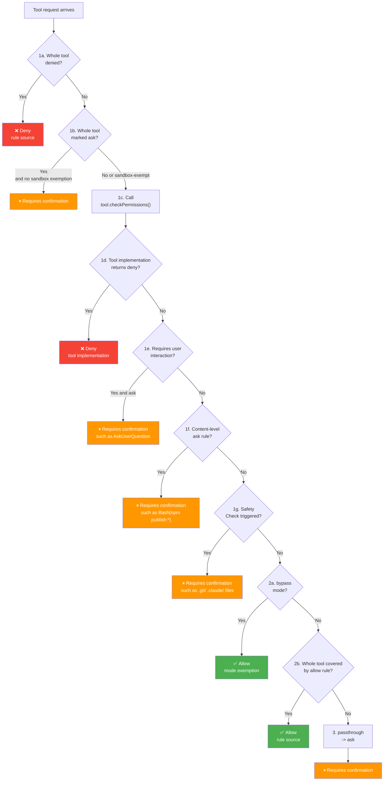
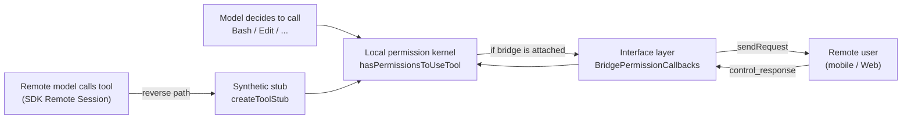
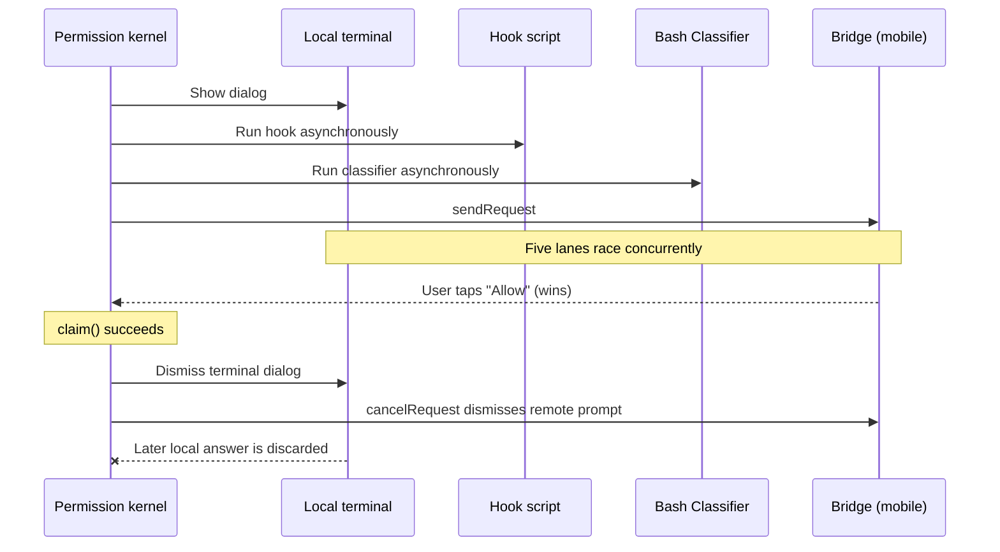

# Chapter 19: Permission System and Remote Permission Back-Propagation (权限回灌) — AI Safety's Last Line of Defense

> This chapter is chapter 19 of the *Deep Dive into Claude Code Source* series. We will examine the full architecture of the permission system: from permission modes, rules, and the decision pipeline to AI Classifier-assisted judgment, showing how a production-grade AI Agent balances automation against safety.

## Why is the permission system the most critical module in an AI product?

Traditional CLI tools have a simple permission model: whatever command the user types is executed, and responsibility rests entirely with the user. An AI Agent changes that paradigm: **the model autonomously decides which operations to perform**. When the user says, "help me refactor this project," the model may decide to delete files, run shell commands, or modify configuration. Those operations sit at wildly different risk levels.

This means the permission system in an AI product faces unique challenges:

1. **Unpredictable operations**: the user cannot know in advance which tools the model will call or which arguments it will pass.
2. **A wide risk spectrum**: from reading a file, which is harmless, to `rm -rf /`, which is catastrophic, every operation goes through the same tool interface.
3. **The tension between efficiency and safety**: prompting for confirmation every time drives users mad, but full automation creates security risk.

Claude Code's permission system resolves this tension with **multiple layers of defense plus progressive trust**. This chapter analyzes it from three layers:

1. **Permission Mode**: the user's global trust level.
2. **Permission Rules**: fine-grained `allow` / `deny` / `ask` rules.
3. **Permission Pipeline**: the complete decision flow inside `hasPermissionsToUseTool()`.

---

> **Chapter guide**: §1 Permission modes (global trust level) -> §2 Rule system (`allow` / `deny` / `ask`) -> §3 `hasPermissionsToUseTool()` decision pipeline -> §4 Auto Mode and AI Classifier -> §5 File path validation -> §6 Dangerous permission detection -> §7 Headless Agent -> §8 Transferable patterns -> §9 Remote permission back-propagation. §1-§6 form the "local permission chain," descending layer by layer from mode to rules, decision logic, and fallback classifier. §9 is the final segment that exposes this chain to mobile and Web through Bridge IPC.

## 1. Permission Modes: The User's Global Trust Level

### 1.1 Seven permission modes

Claude Code defines seven permission modes, representing different levels of trust in AI operations:

```typescript
// types/permissions.ts:16-22
export const EXTERNAL_PERMISSION_MODES = [
  'acceptEdits',
  'bypassPermissions',
  'default',
  'dontAsk',
  'plan',
] as const

// types/permissions.ts:28-29
export type InternalPermissionMode = ExternalPermissionMode | 'auto' | 'bubble'
export type PermissionMode = InternalPermissionMode
```

The semantics of each mode are as follows:

| Mode | Trust level | Behavior |
|------|-------------|----------|
| `default` | Lowest | Every non-read-only operation requires user confirmation. |
| `plan` | Read-only | Only reading and searching are allowed; write operations require confirmation. |
| `acceptEdits` | Medium | File edits inside the working directory are automatically allowed; other operations still require confirmation. |
| `bypassPermissions` | High | Skips most permission checks, although safety checks still apply. |
| `dontAsk` | Special | Does not show confirmation dialogs; operations that require confirmation are automatically denied. |
| `auto` | Internal | Uses an AI Classifier to automatically judge operation safety; Anthropic-internal only. |
| `bubble` | Internal | Defined in the type system but not part of the user-reachable runtime mode set. |

Note that `auto` mode is gated at compile time by `feature('TRANSCRIPT_CLASSIFIER')`. In external builds, the code for this mode is completely removed by DCE:

```typescript
// types/permissions.ts:33-36
export const INTERNAL_PERMISSION_MODES = [
  ...EXTERNAL_PERMISSION_MODES,
  ...(feature('TRANSCRIPT_CLASSIFIER') ? (['auto'] as const) : ([] as const)),
] as const satisfies readonly PermissionMode[]
```

### 1.2 Mode switching: the Shift+Tab cycle

Users can cycle between modes with Shift+Tab. The switching order is not a simple linear sequence; it is dynamically determined by **user type and availability**:

```typescript
// utils/permissions/getNextPermissionMode.ts:34-78
export function getNextPermissionMode(
  toolPermissionContext: ToolPermissionContext,
): PermissionMode {
  switch (toolPermissionContext.mode) {
    case 'default':
      // Internal users skip acceptEdits and plan; auto mode replaces them.
      if (process.env.USER_TYPE === 'ant') {
        if (toolPermissionContext.isBypassPermissionsModeAvailable) {
          return 'bypassPermissions'
        }
        if (canCycleToAuto(toolPermissionContext)) {
          return 'auto'
        }
        return 'default'
      }
      return 'acceptEdits'

    case 'acceptEdits':
      return 'plan'

    case 'plan':
      if (toolPermissionContext.isBypassPermissionsModeAvailable) {
        return 'bypassPermissions'
      }
      // ...
      return 'default'

    // ...
  }
}
```

The typical switching path for external users is `default -> acceptEdits -> plan -> default`, possibly with `bypassPermissions` added. For internal users, it is simplified to `default -> bypassPermissions -> auto -> default`.

---

## 2. Rule System: Fine-Grained `allow`, `deny`, and `ask`

Permission mode is a coarse-grained global control, while the rule system provides **fine-grained control for specific tools and operations**.

### 2.1 Rule data structure

Each permission rule consists of three parts:

```typescript
// types/permissions.ts:75-79
export type PermissionRule = {
  source: PermissionRuleSource       // Where the rule comes from
  ruleBehavior: PermissionBehavior   // allow | deny | ask
  ruleValue: PermissionRuleValue     // Which tool/operation to match
}

// types/permissions.ts:67-70
export type PermissionRuleValue = {
  toolName: string       // Tool name, such as "Bash", "FileEdit", "mcp__server1"
  ruleContent?: string   // Optional content match, such as "npm install", "python:*"
}
```

There are eight possible rule sources. One important nuance is that the order defined by `PERMISSION_RULE_SOURCES` is the **search/traversal order**, not a strict "higher priority overrides lower priority" semantic. Functions such as `getAllowRules()` and `getDenyRules()` traverse all sources, `flatMap` them into one array, and return the **first matching** rule during lookup:

```typescript
// permissions.ts:109-114
const PERMISSION_RULE_SOURCES = [
  ...SETTING_SOURCES,  // userSettings, projectSettings, localSettings,
                       // flagSettings, policySettings (later overrides earlier)
  'cliArg',            // Command-line argument --allowedTools
  'command',           // Slash command settings
  'session',           // Temporary authorization from the user in the current session
] as const satisfies readonly PermissionRuleSource[]
```

`SETTING_SOURCES` itself uses a "later sources override earlier ones" merge semantic, explicitly documented in `utils/settings/constants.ts:6`. In other words, `policySettings` > `flagSettings` > `localSettings` > `projectSettings` > `userSettings`. Permission rule matching, however, scans a flattened array of rules from all sources and returns the first match. This differs subtly from the override semantics of settings.

### 2.2 Rule storage format

Rules are stored in `settings.json` using the format `ToolName(ruleContent)`:

```json
{
  "permissions": {
    "allow": [
      "Bash(npm install:*)",
      "Bash(git status)",
      "FileEdit",
      "mcp__server1"
    ],
    "deny": [
      "Bash(rm -rf:*)",
      "Bash(curl:*)"
    ],
    "ask": [
      "Bash(npm publish:*)"
    ]
  }
}
```

Rule parsing is handled by `permissionRuleValueFromString()`, which supports escaped parentheses:

```typescript
// utils/permissions/permissionRuleParser.ts:93-133
export function permissionRuleValueFromString(
  ruleString: string,
): PermissionRuleValue {
  const openParenIndex = findFirstUnescapedChar(ruleString, '(')
  if (openParenIndex === -1) {
    return { toolName: normalizeLegacyToolName(ruleString) }
  }
  // ... parses "Bash(npm install)" => { toolName: 'Bash', ruleContent: 'npm install' }
  const toolName = ruleString.substring(0, openParenIndex)
  const rawContent = ruleString.substring(openParenIndex + 1, closeParenIndex)
  const ruleContent = unescapeRuleContent(rawContent)
  return { toolName: normalizeLegacyToolName(toolName), ruleContent }
}
```

Note that `normalizeLegacyToolName()` maps old tool names to new ones. For example, `Task` becomes `Agent`, and `KillShell` becomes `TaskStop`, ensuring old configuration does not break. Another easy-to-miss detail is that both `Bash()` and `Bash(*)` are normalized to `{ toolName: 'Bash' }` with no `ruleContent`, meaning they are tool-wide rules equivalent to `Bash` (`permissionRuleParser.ts:124-127`).

### 2.3 Multi-source rule loading and enterprise governance

Rules are loaded from multiple configuration sources, but enterprise administrators can use `allowManagedPermissionRulesOnly` to restrict the disk-loading phase to managed rules only. One nuance: this restriction applies to `loadAllPermissionRulesFromDisk()`. Rules passed during initialization through CLI `--allowedTools` / `--disallowedTools` are still written into the context's `cliArg` source. Later, `syncPermissionRulesFromDisk()` cleans up non-policy sources when settings change:

```typescript
// utils/permissions/permissionsLoader.ts:120-133
export function loadAllPermissionRulesFromDisk(): PermissionRule[] {
  // Enterprise governance mode: use only rules from policySettings.
  if (shouldAllowManagedPermissionRulesOnly()) {
    return getPermissionRulesForSource('policySettings')
  }

  // Normal mode: load from all enabled sources.
  const rules: PermissionRule[] = []
  for (const source of getEnabledSettingSources()) {
    rules.push(...getPermissionRulesForSource(source))
  }
  return rules
}
```

### 2.4 Three matching modes for shell commands

Permission rules for the Bash tool support three matching modes, parsed by `parsePermissionRule()`:

```typescript
// utils/permissions/shellRuleMatching.ts:25-37
export type ShellPermissionRule =
  | { type: 'exact'; command: string }      // Exact match: "git status"
  | { type: 'prefix'; prefix: string }      // Prefix match: "npm:*" (legacy syntax)
  | { type: 'wildcard'; pattern: string }   // Wildcard match: "git *"
```

Wildcard matching is implemented by `matchWildcardPattern()`. It converts `*` into the regular-expression fragment `.*` and supports `\*` for literal asterisks:

```typescript
// utils/permissions/shellRuleMatching.ts:90-154
export function matchWildcardPattern(
  pattern: string, command: string, caseInsensitive = false,
): boolean {
  // 1. Handle \* and \\ escape sequences.
  // 2. Escape regex special characters.
  // 3. Convert * to .*
  // Special optimization: when the pattern ends with ' *' and has only one wildcard,
  // make the trailing space-and-args optional, so 'git *' matches both 'git add' and 'git'.
  const unescapedStarCount = (processed.match(/\*/g) || []).length
  if (regexPattern.endsWith(' .*') && unescapedStarCount === 1) {
    regexPattern = regexPattern.slice(0, -3) + '( .*)?'
  }
  const regex = new RegExp(`^${regexPattern}$`, flags)
  return regex.test(command)
}
```

---

## 3. Decision Pipeline: The Complete `hasPermissionsToUseTool()` Flow

This is the core of the permission system. Every time the model requests tool use, the request goes through the full decision pipeline inside `hasPermissionsToUseTool()`. This pipeline has two parts: the **inner decision** (`hasPermissionsToUseToolInner`) and the **outer wrapper**.

### 3.1 Decision result types

The pipeline can return three possible decisions:

```typescript
// types/permissions.ts:241-246
export type PermissionDecision =
  | PermissionAllowDecision   // behavior: 'allow' — allow execution
  | PermissionAskDecision     // behavior: 'ask'   — require user confirmation
  | PermissionDenyDecision    // behavior: 'deny'  — deny directly
```

In addition, a tool's internal `checkPermissions()` can return `passthrough`, meaning "I have no opinion; let the generic permission system decide":

```typescript
// types/permissions.ts:251-266
export type PermissionResult =
  | PermissionDecision
  | {
      behavior: 'passthrough'
      message: string
      // ...
    }
```

### 3.2 Inner decision pipeline: 7 steps

`hasPermissionsToUseToolInner()` is the heart of permission checking, and it runs in a strict priority order:



The corresponding code (`permissions.ts:1158-1319`) is:

```typescript
async function hasPermissionsToUseToolInner(
  tool, input, context,
): Promise<PermissionDecision> {
  let appState = context.getAppState()

  // === Phase 1: rule checks (deny > ask > tool-internal > safety) ===

  // 1a. The whole tool is blocked by a deny rule.
  const denyRule = getDenyRuleForTool(appState.toolPermissionContext, tool)
  if (denyRule) {
    return { behavior: 'deny', /* ... */ }
  }

  // 1b. The whole tool is marked by an ask rule.
  const askRule = getAskRuleForTool(appState.toolPermissionContext, tool)
  if (askRule) {
    // Special case: Bash in sandbox mode can be skipped.
    const canSandboxAutoAllow = tool.name === BASH_TOOL_NAME
      && SandboxManager.isSandboxingEnabled()
      && SandboxManager.isAutoAllowBashIfSandboxedEnabled()
      && shouldUseSandbox(input)
    if (!canSandboxAutoAllow) {
      return { behavior: 'ask', /* ... */ }
    }
  }

  // 1c. Delegate to the tool implementation for checks; each tool can have its own permission logic.
  let toolPermissionResult: PermissionResult = { behavior: 'passthrough', /* ... */ }
  try {
    const parsedInput = tool.inputSchema.parse(input)
    toolPermissionResult = await tool.checkPermissions(parsedInput, context)
  } catch (e) { /* ... */ }

  // 1d. The tool implementation returns deny.
  if (toolPermissionResult?.behavior === 'deny') return toolPermissionResult

  // 1e. The tool requires user interaction, and this is not skipped even in bypass mode.
  if (tool.requiresUserInteraction?.() && toolPermissionResult?.behavior === 'ask') {
    return toolPermissionResult
  }

  // 1f. Content-level ask rules, such as Bash(npm publish:*), are not skipped in bypass mode either.
  if (toolPermissionResult?.behavior === 'ask'
    && toolPermissionResult.decisionReason?.type === 'rule'
    && toolPermissionResult.decisionReason.rule.ruleBehavior === 'ask') {
    return toolPermissionResult
  }

  // 1g. Safety check: writes to dangerous paths such as .git/, .claude/, .vscode/, etc.
  // bypass mode does not skip this step.
  if (toolPermissionResult?.behavior === 'ask'
    && toolPermissionResult.decisionReason?.type === 'safetyCheck') {
    return toolPermissionResult
  }

  // === Phase 2: mode checks ===

  // 2a. bypassPermissions mode: skip the remaining checks.
  appState = context.getAppState()  // Re-fetch the latest state!
  const shouldBypassPermissions =
    appState.toolPermissionContext.mode === 'bypassPermissions'
    || (appState.toolPermissionContext.mode === 'plan'
      && appState.toolPermissionContext.isBypassPermissionsModeAvailable)
  if (shouldBypassPermissions) {
    return { behavior: 'allow', /* ... */ }
  }

  // 2b. The whole tool is covered by an allow rule.
  const alwaysAllowedRule = toolAlwaysAllowedRule(appState.toolPermissionContext, tool)
  if (alwaysAllowedRule) {
    return { behavior: 'allow', /* ... */ }
  }

  // === Phase 3: default -> ask ===
  // Convert passthrough to ask so the user can decide.
  return toolPermissionResult.behavior === 'passthrough'
    ? { ...toolPermissionResult, behavior: 'ask' }
    : toolPermissionResult
}
```

**Key design decision**: steps 1f and 1g run **before** step 2a, the bypass check. This means:

- User-configured `ask` rules still trigger confirmation **even in bypass mode**.
- Safety checks protecting dangerous paths such as `.git/` and `.claude/` **are not skipped in bypass mode**.

But safety checks are not an impenetrable wall. In **auto mode**, safety check results are handled according to their `classifierApprovable` property (`permissions.ts:526-548`). A safety check marked `classifierApprovable: true`, such as sensitive file paths under `.claude/` or `.git/`, continues into the Classifier flow, where the Classifier sees the full context and decides whether allowing the operation is safe. A check marked `classifierApprovable: false`, such as a Windows path bypass attempt, must still go through manual confirmation even in auto mode.

In addition, inside `checkWritePermissionForTool()` for file-writing tools, session-level `.claude/**` allow rules can take effect **before** the safety check (`filesystem.ts:1252-1300`). This lets the user temporarily authorize Claude to edit its own configuration in the current session. The exemption is strictly limited to the `session` source, must match the `.claude/` prefix, and forbids `..` path traversal.

This is a defense-in-depth design. `bypass` mode skips the generic "ask by default when no rule is configured" behavior, not security barriers that the user intentionally set. But "depth" does not mean "absolutely impossible to bypass"; each layer has precise exemption conditions.

### 3.3 Outer wrapper: mode-level transformations

`hasPermissionsToUseTool()` is the outer wrapper. It applies mode-level transformations to `ask` decisions returned by the inner layer:

```typescript
// permissions.ts:473-956 (simplified)
export const hasPermissionsToUseTool = async (tool, input, context, ...) => {
  const result = await hasPermissionsToUseToolInner(tool, input, context)

  // Reset consecutive denial count on allow.
  if (result.behavior === 'allow') { /* ... */ return result }

  // Apply mode transformations to ask results.
  if (result.behavior === 'ask') {
    const mode = appState.toolPermissionContext.mode

    // dontAsk mode: ask -> deny (no dialog, direct rejection)
    if (mode === 'dontAsk') {
      return { behavior: 'deny', message: DONT_ASK_REJECT_MESSAGE(tool.name) }
    }

    // auto mode: ask -> call the AI Classifier to decide.
    if (mode === 'auto') {
      // ... see the next section
    }

    // headless/background agent: ask -> try Hook first, otherwise deny.
    if (appState.toolPermissionContext.shouldAvoidPermissionPrompts) {
      const hookDecision = await runPermissionRequestHooksForHeadlessAgent(...)
      if (hookDecision) return hookDecision
      return { behavior: 'deny', message: AUTO_REJECT_MESSAGE(tool.name) }
    }
  }

  return result
}
```

---

## 4. Auto Mode: AI Classifier-Assisted Safety Judgment

Auto mode is the most technically substantial part of the permission system. It uses a **separate AI model** to judge whether the operation requested by the main model is safe.

### 4.1 Three fast paths to avoid unnecessary Classifier calls

Classifier API calls are expensive, so before calling it, the system first checks three fast paths:

```typescript
// permissions.ts:600-686 (simplified)

// Fast path 1: acceptEdits simulation.
// If the operation would be allowed in acceptEdits mode, such as file edits inside the working directory, allow it directly.
if (tool.name !== AGENT_TOOL_NAME && tool.name !== REPL_TOOL_NAME) {
  const acceptEditsResult = await tool.checkPermissions(parsedInput, {
    ...context,
    getAppState: () => ({
      ...state,
      toolPermissionContext: { ...state.toolPermissionContext, mode: 'acceptEdits' },
    }),
  })
  if (acceptEditsResult.behavior === 'allow') {
    // Allow directly without calling the Classifier.
    return { behavior: 'allow', decisionReason: { type: 'mode', mode: 'auto' } }
  }
}

// Fast path 2: safe tool allowlist.
if (classifierDecisionModule.isAutoModeAllowlistedTool(tool.name)) {
  return { behavior: 'allow', /* ... */ }
}

// Fast path 3: not covered by fast paths -> call the Classifier.
const classifierResult = await classifyYoloAction(context.messages, action, ...)
```

The safe tool allowlist is defined in `classifierDecision.ts`:

```typescript
// utils/permissions/classifierDecision.ts:56-80
const SAFE_YOLO_ALLOWLISTED_TOOLS = new Set([
  FILE_READ_TOOL_NAME,      // File reading: read-only operation
  GREP_TOOL_NAME,           // Search: read-only
  GLOB_TOOL_NAME,           // File lookup: read-only
  TODO_WRITE_TOOL_NAME,     // TODO management: metadata
  TASK_CREATE_TOOL_NAME,    // Task creation: metadata
  ASK_USER_QUESTION_TOOL_NAME,  // Ask the user a question: UI interaction
  ENTER_PLAN_MODE_TOOL_NAME,    // Enter Plan mode: mode switch
  // ...
])
```

### 4.2 Denial Tracking: consecutive-denial circuit breaker

When the Classifier denies operations repeatedly, the system's behavior depends on the runtime environment (`permissions.ts:984-1058`):

- **Interactive CLI**: fall back to manual user approval with a confirmation dialog, rather than rejecting forever in a loop.
- **Headless mode** (background Agent or remote invocation): throw an `AbortError` directly to terminate the whole Agent, because no user can approve it and retries would only waste tokens.

```typescript
// utils/permissions/denialTracking.ts:1-45
export type DenialTrackingState = {
  consecutiveDenials: number
  totalDenials: number
}

export const DENIAL_LIMITS = {
  maxConsecutive: 3,    // 3 consecutive denials -> fall back to user prompt (CLI) or abort (headless)
  maxTotal: 20,         // 20 total denials -> fall back to user prompt (CLI) or abort (headless)
} as const

export function shouldFallbackToPrompting(state: DenialTrackingState): boolean {
  return (
    state.consecutiveDenials >= DENIAL_LIMITS.maxConsecutive ||
    state.totalDenials >= DENIAL_LIMITS.maxTotal
  )
}
```

Every time the Classifier allows an operation, the consecutive-denial count is reset:

```typescript
export function recordSuccess(state: DenialTrackingState): DenialTrackingState {
  if (state.consecutiveDenials === 0) return state  // Return the same reference when there is no change (optimization).
  return { ...state, consecutiveDenials: 0 }
}
```

### 4.3 Fail-closed strategy when the Classifier is unavailable

When the Classifier API call fails, the system uses a GrowthBook Feature Flag to control whether it should fail closed (deny) or fail open (fall back to user confirmation):

```typescript
// permissions.ts:845-876
if (classifierResult.unavailable) {
  if (getFeatureValue_CACHED_WITH_REFRESH(
    'tengu_iron_gate_closed', true, 30 * 60 * 1000,
  )) {
    // Fail closed: deny the operation.
    return { behavior: 'deny', message: buildClassifierUnavailableMessage(...) }
  }
  // Fail open: fall back to normal permission handling (ask the user to confirm).
  return result
}
```

---

## 5. File-System Path Validation: Multi-Dimensional Safety Checks

File operations are among the most common operations performed by an AI Agent, and path validation is one of the most complex parts of the permission system.

### 5.1 The five-step `isPathAllowed()` validation

```typescript
// utils/permissions/pathValidation.ts:141-263 (simplified)
export function isPathAllowed(
  resolvedPath, context, operationType, precomputedPathsToCheck?,
): PathCheckResult {
  // 1. Deny rules first (highest priority).
  const denyRule = matchingRuleForInput(resolvedPath, context, permissionType, 'deny')
  if (denyRule) return { allowed: false, decisionReason: { type: 'rule', rule: denyRule } }

  // 2. Internally editable paths: plan files, scratchpad, agent memory.
  if (operationType !== 'read') {
    const internalEditResult = checkEditableInternalPath(resolvedPath, {})
    if (internalEditResult.behavior === 'allow') return { allowed: true, /* ... */ }
  }

  // 2.5. Safety checks for writes: Windows paths, Claude config files, dangerous files.
  if (operationType !== 'read') {
    const safetyCheck = checkPathSafetyForAutoEdit(resolvedPath, ...)
    if (!safetyCheck.safe) return { allowed: false, /* ... */ }
  }

  // 3. Working-directory check.
  if (pathInAllowedWorkingPath(resolvedPath, context, ...)) {
    if (operationType === 'read' || context.mode === 'acceptEdits') {
      return { allowed: true }
    }
  }

  // 3.7. Sandbox write allowlist: extra writable directories outside the working directory.
  if (operationType !== 'read' && !isInWorkingDir
    && isPathInSandboxWriteAllowlist(resolvedPath)) {
    return { allowed: true, /* ... */ }
  }

  // 4. Allow rules.
  const allowRule = matchingRuleForInput(resolvedPath, context, permissionType, 'allow')
  if (allowRule) return { allowed: true, /* ... */ }

  // 5. Default deny.
  return { allowed: false }
}
```

### 5.2 Path safety validation: preventing TOCTOU attacks

Before path validation, `validatePath()` performs multiple safety checks to **prevent TOCTOU vulnerabilities between shell expansion and validation**:

```typescript
// utils/permissions/pathValidation.ts:373-463
export function validatePath(path, cwd, toolPermissionContext, operationType) {
  const cleanPath = expandTilde(path.replace(/^['"]|['"]$/g, ''))

  // SECURITY: block UNC paths, which may leak credentials.
  if (containsVulnerableUncPath(cleanPath)) {
    return { allowed: false, reason: 'UNC network paths require manual approval' }
  }

  // SECURITY: reject tilde variants such as ~user, ~+, and ~-.
  // expandTilde only handles ~ and ~/; other variants can make validation diverge from the shell execution path.
  if (cleanPath.startsWith('~')) {
    return { allowed: false, reason: 'Tilde expansion variants require manual approval' }
  }

  // SECURITY: reject paths containing shell expansion syntax.
  // $VAR, ${VAR}, $(cmd), and %VAR% are literals during validation but expand during shell execution.
  if (cleanPath.includes('$') || cleanPath.includes('%') || cleanPath.startsWith('=')) {
    return { allowed: false, reason: 'Shell expansion syntax requires manual approval' }
  }

  // SECURITY: write operations do not allow glob patterns.
  // Write tools use literal paths, but validation only checks the glob's base directory, which could bypass checks.
  if (GLOB_PATTERN_REGEX.test(cleanPath) && (operationType === 'write' || 'create')) {
    return { allowed: false, reason: 'Glob patterns are not allowed in write operations' }
  }
  // ...
}
```

### 5.3 Dangerous deletion path detection

`isDangerousRemovalPath()` prevents catastrophic deletion of the root directory, home directory, system directories, and similar paths:

```typescript
// utils/permissions/pathValidation.ts:331-367
export function isDangerousRemovalPath(resolvedPath: string): boolean {
  // Wildcard deletion: *, /path/*
  if (forwardSlashed === '*' || forwardSlashed.endsWith('/*')) return true
  // Root directory
  if (normalizedPath === '/') return true
  // Windows drive root: C:\, D:\
  if (WINDOWS_DRIVE_ROOT_REGEX.test(normalizedPath)) return true
  // Home directory
  if (normalizedPath === normalizedHome) return true
  // Direct children of root: /usr, /tmp, /etc
  if (dirname(normalizedPath) === '/') return true
  // Direct children of Windows drive roots: C:\Windows, C:\Users
  if (WINDOWS_DRIVE_CHILD_REGEX.test(normalizedPath)) return true
  return false
}
```

---

## 6. Dangerous Permission Detection: The Safety Gate at Auto Mode Entry

When the user switches to Auto mode, the system **automatically strips dangerous allow rules** with `stripDangerousPermissionsForAutoMode()` (`permissionSetup.ts:510-555`). This is because Auto mode relies on the Classifier to judge safety. If allow rules exist that bypass the Classifier, the model could execute dangerous operations without review.

Dangerous permission detection covers three classes of tools (`isDangerousClassifierPermission()`, `permissionSetup.ts:272-285`):

1. **Bash**: `isDangerousBashPermission()` detects script interpreters, package runners, shells, and similar entries.
2. **PowerShell**: `isDangerousPowerShellPermission()` additionally detects PowerShell-specific code execution entrypoints such as `iex`, `Invoke-Command`, `Start-Process`, and `Add-Type`.
3. **Agent/Task**: `isDangerousTaskPermission()` treats **any** Agent allow rule as dangerous, because a child Agent can bypass the Classifier through a delegation attack.

Using Bash as an example:

```typescript
// utils/permissions/permissionSetup.ts:94-147
export function isDangerousBashPermission(
  toolName: string, ruleContent: string | undefined,
): boolean {
  if (toolName !== BASH_TOOL_NAME) return false

  // Tool-level allow (no content) = allow all commands -> dangerous!
  if (ruleContent === undefined || ruleContent === '' || ruleContent === '*') {
    return true
  }

  // Check dangerous patterns: python:*, node:*, bash:*, ssh:*, sudo:*, etc.
  for (const pattern of DANGEROUS_BASH_PATTERNS) {
    if (content === lowerPattern) return true       // Exact match
    if (content === `${lowerPattern}:*`) return true // Prefix syntax
    if (content === `${lowerPattern}*`) return true  // Wildcard
    if (content === `${lowerPattern} *`) return true // Space wildcard
    if (content.startsWith(`${lowerPattern} -`) && content.endsWith('*')) return true
  }
  return false
}
```

Stripped rules are temporarily stored in `strippedDangerousRules` and restored by `restoreDangerousPermissions()` when the user exits Auto mode. A user's `Bash(python:*)` rule in default mode is not permanently lost.

The dangerous pattern list includes every entrypoint that can execute arbitrary code:

```typescript
// utils/permissions/dangerousPatterns.ts:18-42
export const CROSS_PLATFORM_CODE_EXEC = [
  'python', 'python3', 'python2',   // Script interpreters
  'node', 'deno', 'tsx',
  'ruby', 'perl', 'php', 'lua',
  'npx', 'bunx',                     // Package runners
  'npm run', 'yarn run', 'pnpm run', 'bun run',
  'bash', 'sh',                      // Shells
  'ssh',                             // Remote execution
] as const

export const DANGEROUS_BASH_PATTERNS: readonly string[] = [
  ...CROSS_PLATFORM_CODE_EXEC,
  'zsh', 'fish', 'eval', 'exec',
  'env', 'xargs', 'sudo',
  // Internal users also include: gh, curl, wget, git, kubectl, aws, gcloud, etc.
]
```

---

## 7. Permission Handling for Headless Agents

Agents running in the background, such as forked child Agents or remotely invoked Agents, have no UI and cannot show confirmation dialogs. The permission system provides a dedicated path for this scenario:

```typescript
// permissions.ts:400-471
async function runPermissionRequestHooksForHeadlessAgent(
  tool, input, toolUseID, context, ...
): Promise<PermissionDecision | null> {
  // Try to obtain a decision through PermissionRequest Hooks.
  for await (const hookResult of executePermissionRequestHooks(
    tool.name, toolUseID, input, context, ...
  )) {
    if (hookResult.permissionRequestResult?.behavior === 'allow') {
      // Hook allows -> proceed (and persist the permission update).
      return { behavior: 'allow', /* ... */ }
    }
    if (hookResult.permissionRequestResult?.behavior === 'deny') {
      // Hook denies -> if interrupt is set, abort the whole Agent as well.
      if (decision.interrupt) {
        context.abortController.abort()
      }
      return { behavior: 'deny', /* ... */ }
    }
  }
  // No Hook provided a decision -> return null, and the caller auto-denies.
  return null
}
```

This design lets enterprise users implement custom permission policies through Hook scripts, such as calling an internal approval system or sending a Slack notification.

---

## 8. Transferable Design Patterns

### Pattern 1: Defense in Depth

Permission checking is not a single-layer allow/deny switch. It is a multi-layer pipeline. Each layer has its own responsibility: deny rules -> tool-internal checks -> safety checks -> mode checks -> allow rules. **The key is that some layers, such as safety checks and content-specific `ask`, still apply in high-trust modes, but they also provide precise exemption conditions**. For example, a `classifierApprovable` safety check in auto mode is evaluated by the Classifier rather than rejected with a blanket rule.

**Where it applies**: any system that needs safety controls. Separate "high-risk safety rules" from "configurable trust levels," but design precise exemption interfaces for each layer's "non-skippable" rules so the system does not become too rigid to work.

### Pattern 2: Progressive Trust plus Fast Paths

Auto mode does not call the expensive Classifier API for every operation. It first filters out most safe operations through three fast paths: acceptEdits simulation -> safe tool allowlist -> only then the Classifier. This lets the Classifier handle only the edge cases that genuinely need judgment.

**Where it applies**: any system that uses AI for safety judgment. Align judgment cost with risk level. Low-risk operations should be allowed quickly by rules; high-risk operations should use expensive reasoning resources.

### Pattern 3: Denial Tracking and Circuit Breaking

After three consecutive denials or 20 total denials, the circuit breaker trips. Interactive scenarios fall back to user confirmation, while headless scenarios abort directly. This prevents the Agent from falling into a useless "try -> denied -> retry" loop. It is a simple but effective **circuit-breaker pattern**: when an automated system keeps failing, choose the appropriate degradation strategy based on the runtime environment.

**Where it applies**: any AI Agent automatic decision system. When automatic judgment keeps failing, it should not retry forever. If a human is present, degrade to manual intervention; if nobody is present, stop decisively.

---

## 9. Remote Permission Back-Propagation: How Mobile and Web Approve Local Tools

The first eight sections all assume that the "question" and the "answer" happen on the same computer: the model wants to run a tool, the local CLI shows a dialog, and the user presses yes or no in the terminal. The newer version adds a more interesting scenario. You pull out your phone at a cafe, and claude.ai sends a notification: "Allow `rm node_modules` to run on your laptop?" You tap allow, and a few seconds later the tool really runs on the computer at home.

Think of this path as a dedicated internal channel. The local CLI sends the permission question out, and the person on the remote side is allowed to answer it. Three new integration points make this channel possible, and this section breaks them down one by one.

### 9.1 Three new integration points: interface layer, local coordinator, and back-propagation entrypoint

The division of roles across the whole back-propagation path can be sketched as follows:



The source code for the three integration points is short. You can understand their roles this way:

The first point is the **interface layer**, located at `bridge/bridgePermissionCallbacks.ts:1-43`. This file is only 43 lines long and defines the minimum protocol for the channel: how to send a question, how to receive an answer, and how to cancel a prompt. Notably, it does not use a bare `as` to cast messages into business types. Instead, it defines a type guard to validate whether the response packet is valid. With cross-process messages, once you trust that "the other side will send the right thing," runtime bugs become silent. This caution is necessary.

The second point is the **local coordination layer**, located at `hooks/useReplBridge.tsx:369-585`. It "holds the fort" locally: every outbound question gets a `requestId`, and when the remote response arrives, the code finds the original waiting continuation by ID. After setup, it stores the channel reference in global state, so the permission kernel can retrieve it directly when needed.

The third point is the **reverse back-propagation entrypoint**, located at `remote/remotePermissionBridge.ts:1-78`. The first two files solve the problem of "a local tool wants to ask a remote user." This file solves the reverse problem: a remote model calls a tool in the cloud, but the local CLI must show a confirmation dialog for it, even though the local side may not know what the tool looks like and does not have the complete conversation context. Its solution is to create a minimal trustworthy object on the spot and put it into the local confirmation queue. §9.5 expands on this.

### 9.2 Entry routing: injection and switches

Whether the bridge can take effect comes down to one line of code in `hooks/useCanUseTool.tsx:165`:

```typescript
bridgeCallbacks: feature("BRIDGE_MODE") ? appState.replBridgePermissionCallbacks : undefined,
```

This has two intentions. First is **conditional injection**: only when the application layer has actually set up the intercom can the permission kernel receive non-null `bridgeCallbacks`. Second is **compile-time gating**: `feature("BRIDGE_MODE")` is a constant, so in external builds the bundler cuts out this entire branch, along with the `replBridgePermissionCallbacks` field, leaving no remote protocol surface at all. Permission dialogs for external users run entirely locally. This uses the same idea as the `auto` mode discussed in §1, which is also gated by a compile-time feature flag: optional capabilities are safer when they do not exist at all than when they merely rely on runtime null checks.

### 9.3 Multi-lane race: first answer wins

Now we can answer the most interesting question in the whole chapter: **the same permission request may have five paths trying to provide an answer at the same time**: the local terminal user, the mobile user, a user in a third-party channel such as Telegram / iMessage / Discord, a PermissionRequest Hook script, and the Bash classifier. Whoever responds first wins, and all other paths are invalidated immediately.

But "first response wins" is not as simple as it sounds. Consider this incorrect implementation:

```typescript
if (!isResolved()) {
  await doSomething()   // <- Dangerous: someone else may resolve during this window.
  resolve(answer)
}
```

The `await` between the `isResolved()` check and the `resolve()` write gives other lanes a complete window to cut in. If two paths both reach `resolve()`, the final answer depends on timing luck.

`PermissionContext.ts:75-94` closes that door with a small function named `claim()`. It performs an **atomic check-and-mark**:

```typescript
// Simplified semantic sketch: claim is an atomic "check then mark".
let claimed = false
function claim(): boolean {
  if (claimed) return false
  claimed = true
  return true
}
```

The rule is that every lane must call `claim()` before calling `resolve()`. The winning lane continues; the losing lane returns directly. The comment is intentionally explicit:

> Use this in async callbacks BEFORE awaiting, to close the window
> between the `isResolved()` check and the actual `resolve()` call.

After the bridge is added, the timing of a typical permission request looks roughly like this:



The two cancellation lines in the diagram are important. Once any lane wins, it must proactively notify **all still-waiting lanes**: "stop asking; we already have an answer." Otherwise, the remote user would be left with an orphaned prompt. The local tool may already have finished running, while the user is still staring at an allow/deny dialog. This is the confusing "ghost prompt" problem. `interactiveHandler.ts:92-298` implements this rule: the five lanes listed above, plus the `recheckPermission` path discussed in §9.4, make six possible winners in total, and every one of them performs an explicit cancellation.

### 9.4 A counterintuitive detail: `recheckPermission` must claim too

One scenario looks like it should not need arbitration: while the user is looking at the dialog, external state changes. For example, the mobile side switches the permission mode from `default` to `acceptEdits`, and an operation that previously needed confirmation should now be automatically allowed. `useReplBridge` actively calls a callback named `recheckPermission`, asking the permission kernel to run `hasPermissionsToUseTool()` again and see whether the operation is now automatically approved.

Intuitively, this should be a safe "follow-up" action. But the code still calls `claim()` one more time at the final step:

```typescript
// interactiveHandler.ts:204-231 (excerpt sketch)
async recheckPermission() {
  if (isResolved()) return
  const fresh = await hasPermissionsToUseTool(/* ... */)
  if (fresh.behavior === 'allow') {
    if (!claim()) return       // <- Key point: claim again after await.
    bridgeCallbacks?.cancelRequest(bridgeRequestId)
    resolveOnce(ctx.buildAllow(/* ... */))
  }
}
```

Why? Because `hasPermissionsToUseTool()` is awaited. While the local side waits for the result, the mobile user may tap "Allow" directly, and the remote response may arrive first. Without claiming again, the local side would call `resolveOnce`, and the local and remote paths would each believe that "I won," producing two mutually exclusive decisions for one permission request.

Abstract that into a **consistency rule for remote permission back-propagation**:

> Any local decision that introduces an `await` in the middle of a network round trip must atomically `claim` again as its final step.

### 9.5 Reverse back-propagation: turning remote tool calls into local dialogs

§9.3 covered "a local tool wants to ask a remote user." This section reverses the direction: a remote model in the cloud calls a tool and wants the owner of the local CLI to approve it. That is the job of `remote/remotePermissionBridge.ts`.

What is the difficulty? At this moment, the local CLI has almost nothing: no `AssistantMessage` context, and maybe not even the implementation of this tool, especially for remote MCP tools. But the local permission confirmation queue requires a full `Tool` object and an `AssistantMessage` before it will accept work.

The solution is to create a minimal trustworthy stub on the spot. `createToolStub()` assembles a tiny `Tool`; the three key fields are:

```typescript
// remote/remotePermissionBridge.ts:53-78 (excerpt)
{
  isReadOnly: () => false,        // Always run the full permission pipeline.
  needsPermissions: () => true,   // Always require user confirmation.
  call: async () => ({ data: '' }) // Placeholder: local side never actually executes it.
}
```

These three lines each carry a small responsibility:

- `isReadOnly: false` and `needsPermissions: true` are a **double lock**. Because the local side does not recognize the tool, it treats it as "must be decided by the user" instead of risking a false read-only classification for some remote MCP tool, echoing the interface contract in `Tool.ts(needsPermission)`.
- `call: () => ({ data: '' })` is a **placeholder function**. The local side will never actually run it. Real execution happens in the remote container. The local side's job ends when the user clicks allow. The decision is sent back through the SDK control channel, and the remote executor takes over.

`createSyntheticAssistantMessage()` then supplies a minimal conversation context. Its `message.id` is shaped like `remote-${requestId}`, making logs traceable to remote confirmations. The three entrypoints `hooks/useRemoteSession.ts:338-340`, `hooks/useDirectConnect.ts:94-96`, and `hooks/useSSHSession.ts:98-100` all do the same thing: when they receive a remote permission request, they call these two factories, put the result into the local `ToolUseConfirm` queue, and from that point on the standard local confirmation flow handles it.

The payoff is direct: the file-system safety checks from §5, the dangerous permission detection from §6, and the headless fallback from §7 **do not need separate implementations for remote sessions**. The inner `hasPermissionsToUseTool()` pipeline treats the stub tool like any other tool. "Remote fact -> minimal trustworthy local stub -> reuse the complete local safety pipeline" is the most valuable sentence in the whole reverse back-propagation design.

### 9.6 Three handler branches: `interactive`, `coordinator`, and `swarmWorker`

One final question remains. In addition to ordinary interactive confirmation, coordinator worker processes and swarm child agents also need to handle permissions, but they have no terminal UI at all. What happens then?

The newer design splits permission confirmation by role into three independent handlers, all located under `hooks/toolPermission/handlers/`:

| Handler | Lines | Used by | Characteristics |
|---------|-------|---------|-----------------|
| `interactiveHandler.ts` | 536 | Main agent | Main multi-lane race path, including the full bridge / hook / classifier set. |
| `coordinatorHandler.ts` | 65 | Coordinator process | Runs only hook -> classifier and has no UI; falls back to the main flow if that path cannot decide. |
| `swarmWorkerHandler.ts` | 159 | Swarm child agent | Tries classifier first; otherwise forwards the request to the leader through the mailbox. |

All three handlers share the same `PermissionContext` (see `PermissionContext.ts:96-348`). This context is an immutable object frozen with `Object.freeze`. It bundles constant fields such as the tool, input, and synthetic message, plus a set of methods for recording decisions, running hooks, and building `allow` / `deny` results. All three handlers work with this same context.

This sharing provides a practical benefit: the tricky pieces related to remote permission back-propagation, such as injecting `bridgeCallbacks`, arbitrating with `claim()`, and canceling with `cancelRequest`, **only need to be written once inside `interactiveHandler`**. `coordinator` and `swarmWorker` do not copy-paste them. Their specialized paths, such as sequential hook execution or mailbox forwarding, are also naturally decoupled from the remote protocol. That is the clarity gained by replacing "runtime branching" with "separate handler files."

---

## Next Chapter Preview

[Chapter 20: Hooks System — Extending AI Behavior with Shell Commands](./20-hooks-system.md)

We will dive into the full implementation of the Hooks system, showing how 27 `HOOK_EVENTS`, four hook command types, and modules such as `stopHooks` and `notifs/` let users inject custom logic at key points in the AI lifecycle.

---
*For all content, follow https://github.com/luyao618/Claude-Code-Source-Study (and a free star would be appreciated).*
