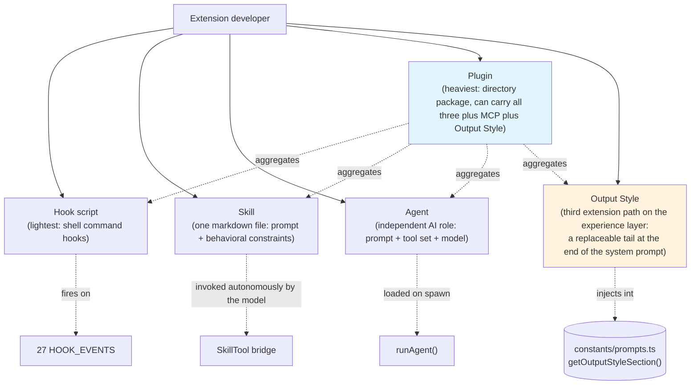

# Chapter 21: Skill / Plugin / Output Style — Three extension points, understood through the source

> This is Chapter 21 of *Deep Dive into Claude Code Source*. The previous twenty chapters dissected Claude Code's internal architecture; now it is time to "run the analysis in reverse" — from the perspective of an extension developer, understand how to author custom Agents, Skills, Plugins, and Hook scripts. The distinctive value of this chapter is that every configuration field and every behavioral convention can be traced back to a concrete implementation in the source.

## Why understand the extension points?

The core of Claude Code is an AI Agent runtime. But every team and every project has different needs — some want to automate a code-review workflow, some need to integrate an internal toolchain, some want to constrain the agent to a narrow task.

Claude Code provides four layers of extension, from lightest to heaviest:

```
Hook script → Skill file → Agent definition → Plugin package
```

- **Hook**: runs a shell command when a specific event fires (before or after a tool call, at session start or end).
- **Skill**: a single Markdown file that defines a prompt plus behavioral constraints; the model can invoke it autonomously.
- **Agent**: a Markdown file that defines an independent AI role (its own prompt, tool set, and model).
- **Plugin**: a complete directory package that can ship Skills, Agents, Hooks, and MCP servers together.

Beyond these four "behavior-side" extensions, there is one more easily overlooked "experience-side" extension path — **Output Style**. It does not change which tools the model can call, and it does not inject prompts inside the loop. Instead, it appends a `# Output Style: ...` block at the end of the system prompt (`constants/prompts.ts:151-157`), making "what voice to speak in" explicit to the model. It can also let Claude Code selectively omit the default "coding assistant task checklist" section when assembling the system prompt (the switch in `getSimpleDoingTasksSection()` at `constants/prompts.ts:564-567`). A Plugin can carry an Output Style along with it, but Output Style can also live standalone under `.claude/output-styles/` and be used on its own. So after walking through the first four, this chapter dedicates a section to Output Style and puts it back on the same map as Skill and Plugin.

This chapter walks through each of these extension points, showing how to author them and how they are discovered, parsed, and executed in the source.

---

> **Chapter roadmap**: §1 Custom Skills → §2 Custom Agents → §3 Plugin system architecture → §4 Hook scripts → §5 MCP Skill bridging → §6 Output Style as the third extension path → §7 Worked examples → §8 Transferable patterns. The chapter is organized by "extension point from lightest to heaviest": Skill → Agent → Plugin → Hook → MCP → Output Style. After the first six sections, §7 is a walkthrough you can copy directly.

## Big picture: four extension layers plus the Output Style third path



---

## 1. Authoring custom Skills

### 1.1 Directory layout and discovery

The standard form of a Skill is a directory containing a `SKILL.md` file:

```
.claude/skills/
└── my-review/
    └── SKILL.md
```

In the source, Skill discovery starts at `loadSkillsFromSkillsDir()` (`skills/loadSkillsDir.ts:407-480`). It scans every subdirectory under the given path and reads the `SKILL.md` file inside each one:

```typescript
// skills/loadSkillsDir.ts:424-445
const results = await Promise.all(
  entries.map(async (entry): Promise<SkillWithPath | null> => {
    // Only support directory format: skill-name/SKILL.md
    if (!entry.isDirectory() && !entry.isSymbolicLink()) {
      return null
    }
    const skillDirPath = join(basePath, entry.name)
    const skillFilePath = join(skillDirPath, 'SKILL.md')
    let content: string
    try {
      content = await fs.readFile(skillFilePath, { encoding: 'utf-8' })
    } catch (e: unknown) {
      if (!isENOENT(e)) {
        logForDebugging(`[skills] failed to read ${skillFilePath}: ${e}`)
      }
      return null
    }
    // ...parse frontmatter and create command
  }),
)
```

Key discovery rules:
- **Only the directory form is supported.** A standalone `.md` file directly under `/skills/` is not loaded.
- The directory name is the Skill name (`entry.name`).
- Symbolic links are supported (`entry.isSymbolicLink()`).

The Skill search scope is defined by `getSkillDirCommands()` (`loadSkillsDir.ts:638-804`), which loads five sources in parallel, ordered from highest to lowest priority:

| Source | Path | SettingSource |
|------|------|--------------|
| Enterprise managed policy | `<managedPath>/.claude/skills/` | `policySettings` |
| User level | `~/.claude/skills/` | `userSettings` |
| Project level (walking upward) | `.claude/skills/` (from CWD up to HOME) | `projectSettings` |
| Additional directories | directories passed via `--add-dir` | `projectSettings` |
| Legacy command directory | `.claude/commands/` (also supports the single-file form) | per source |

### 1.2 Main frontmatter configuration fields

The core of `SKILL.md` is the YAML frontmatter. All field parsing is centralized in `parseSkillFrontmatterFields()` (`loadSkillsDir.ts:185-265`):

```markdown
---
name: "Security Review"
description: "Review code changes for security issues"
allowed-tools: Bash(git diff:*), Bash(git log:*), FileRead
argument-hint: "<branch-name>"
arguments: branch
when_to_use: "When the user asks for a security review of code changes"
version: "1.0"
model: sonnet
effort: high
context: fork
agent: general-purpose
user-invocable: true
paths: "src/**/*.ts, lib/**/*.js"
shell: bash
hooks:
  PostToolUse:
    - matcher: Bash
      hooks:
        - type: command
          command: "echo 'Tool used'"
---

# Security Review Skill

Review the code changes on the given branch...
```

Each field maps to a specific source location:

| Field | Type | Default | Source location |
|------|------|--------|---------|
| `name` | string | undefined (the display name `displayName`; does not affect the Skill identifier — the identifier is always the directory name `entry.name`) | `loadSkillsDir.ts:238-240` — `displayName` |
| `description` | string | extracted from the first line of the Markdown body | `loadSkillsDir.ts:208-214` |
| `allowed-tools` | string / string[] | `[]` | `loadSkillsDir.ts:242-245` |
| `argument-hint` | string | undefined | `loadSkillsDir.ts:246-249` |
| `arguments` | string / string[] | `[]` | `loadSkillsDir.ts:249-251` |
| `when_to_use` | string | undefined | `loadSkillsDir.ts:252` |
| `version` | string | undefined | `loadSkillsDir.ts:253` |
| `model` | string | inherits from the parent | `loadSkillsDir.ts:221-226`; `'inherit'` maps to undefined |
| `effort` | string / int | undefined | `loadSkillsDir.ts:228-235` |
| `context` | `'fork'` | `undefined` (i.e. inline) | `loadSkillsDir.ts:260` |
| `agent` | string | undefined | `loadSkillsDir.ts:261` |
| `user-invocable` | boolean | `true` | `loadSkillsDir.ts:216-219` |
| `paths` | string / string[] | undefined | `loadSkillsDir.ts:159-178` |
| `shell` | `'bash'` / `'powershell'` | bash | `loadSkillsDir.ts:263` |
| `hooks` | HooksSettings | undefined | `loadSkillsDir.ts:136-153` |
| `disable-model-invocation` | boolean | `false` | `loadSkillsDir.ts:255-257` |

### 1.3 Two execution modes: Inline vs Fork

A Skill's `context` field controls its execution mode — an important architectural choice.

**Inline mode** (default): the Skill's Markdown content is expanded into a user message and injected into the current conversation context. The model processes the Skill's instructions within the same token budget. This is implemented in `SkillTool.call()` (`tools/SkillTool/SkillTool.ts:634-643`):

```typescript
// tools/SkillTool/SkillTool.ts:634-643
const processedCommand = await processPromptSlashCommand(
  commandName, args || '', commands, context,
)
// ...returns newMessages, injected into the current conversation
```

**Fork mode** (`context: fork`): the Skill runs inside an isolated Sub-Agent with its own token budget and conversation context. This is implemented via `executeForkedSkill()` (`SkillTool.ts:122-289`), which internally calls `runAgent()` to start a child agent:

```typescript
// tools/SkillTool/SkillTool.ts:222-237
for await (const message of runAgent({
  agentDefinition,
  promptMessages,
  toolUseContext: { ...context, getAppState: modifiedGetAppState },
  canUseTool,
  isAsync: false,
  querySource: 'agent:custom',
  model: command.model as ModelAlias | undefined,
  availableTools: context.options.tools,
  override: { agentId },
})) {
  agentMessages.push(message)
}
```

**Choosing between them**:
- Simple prompt augmentation → Inline (lightweight, shares context).
- Complex tasks that need many tool calls → Fork (isolated token budget, does not pollute the main conversation).

### 1.4 Variable substitution and embedded shell commands

Skill content goes through variable substitution at execution time. This happens inside `createSkillCommand().getPromptForCommand()` (`loadSkillsDir.ts:344-398`):

```typescript
// loadSkillsDir.ts:349-369
finalContent = substituteArguments(finalContent, args, true, argumentNames)

// Replace ${CLAUDE_SKILL_DIR} with the skill's own directory
if (baseDir) {
  finalContent = finalContent.replace(/\$\{CLAUDE_SKILL_DIR\}/g, skillDir)
}

// Replace ${CLAUDE_SESSION_ID} with the current session ID
finalContent = finalContent.replace(
  /\$\{CLAUDE_SESSION_ID\}/g, getSessionId(),
)
```

Available variables:

| Variable | Meaning | Use |
|------|------|------|
| `$1`, `$2`, ... | positional arguments | values passed when the user invokes the Skill |
| `${CLAUDE_SKILL_DIR}` | absolute path of the Skill's own directory | reference scripts or data files that ship with the Skill |
| `${CLAUDE_SESSION_ID}` | current Session ID | log correlation, naming temporary files |
| `${named_arg}` | named argument | named arguments declared via `arguments:` |

In addition, Skills support embedded shell commands — via `` !`command` `` or a ` ```! ` code block, a shell command is executed at Skill load time and its output is embedded into the prompt. There is an important security restriction here: **MCP-sourced Skills do not execute shell commands** (`loadSkillsDir.ts:374-396`):

```typescript
// loadSkillsDir.ts:374
if (loadedFrom !== 'mcp') {
  finalContent = await executeShellCommandsInPrompt(
    finalContent, { ...toolUseContext }, `/${skillName}`, shell,
  )
}
```

### 1.5 Conditional Skills (paths filtering)

The `paths` frontmatter lets you create Skills that "only activate when specific files are being operated on". This is implemented in `activateConditionalSkillsForPaths()` (`loadSkillsDir.ts:997-1058`), using the `ignore` library (gitignore-style matching):

```typescript
// loadSkillsDir.ts:1012-1038
const skillIgnore = ignore().add(skill.paths)
for (const filePath of filePaths) {
  const relativePath = isAbsolute(filePath)
    ? relative(cwd, filePath)
    : filePath
  if (skillIgnore.ignores(relativePath)) {
    // Activate this skill
    dynamicSkills.set(name, skill)
    conditionalSkills.delete(name)
    activatedConditionalSkillNames.add(name)
  }
}
```

For example, a Skill that activates only when `.proto` files are touched:

```markdown
---
description: "Validate protobuf changes"
paths: "**/*.proto"
---
Check that the protobuf changes follow our style guide...
```

### 1.6 Dynamic Skill discovery

Beyond the load-on-startup path, Claude Code also discovers Skills nested in subdirectories while files are being operated on. `discoverSkillDirsForPaths()` walks upward from a file path looking for `.claude/skills/` directories (`loadSkillsDir.ts:861-915`):

```typescript
// loadSkillsDir.ts:876-908
while (currentDir.startsWith(resolvedCwd + pathSep)) {
  const skillDir = join(currentDir, '.claude', 'skills')
  if (!dynamicSkillDirs.has(skillDir)) {
    dynamicSkillDirs.add(skillDir)
    try {
      await fs.stat(skillDir)
      // Check if gitignored...
      newDirs.push(skillDir)
    } catch { /* Directory doesn't exist */ }
  }
  const parent = dirname(currentDir)
  if (parent === currentDir) break
  currentDir = parent
}
```

In practice, this means subpackages inside a monorepo can carry their own Skills; when the model operates on a file inside that subpackage, the relevant Skills are discovered and registered automatically.

---

## 2. Authoring custom Agents

### 2.1 Directory layout and discovery

Agent definitions live under `.claude/agents/`; each `.md` file defines one agent:

```
.claude/agents/
├── test-runner.md
└── db-migration.md
```

Agent discovery happens in `getAgentDefinitionsWithOverrides()` (`tools/AgentTool/loadAgentsDir.ts:296-393`). It calls `loadMarkdownFilesForSubdir('agents', cwd)` to scan `agents/` directories at every layer, then calls `parseAgentFromMarkdown()` on each file.

### 2.2 Full frontmatter field reference

An Agent's frontmatter is richer than a Skill's; the parser is `parseAgentFromMarkdown()` (`loadAgentsDir.ts:541-755`):

```markdown
---
name: test-runner
description: "Run tests and fix failures. Iterates until all tests pass."
tools: Bash, FileRead, FileEdit, FileWrite
disallowedTools: AgentTool
model: sonnet
effort: high
permissionMode: default
maxTurns: 30
color: green
background: false
memory: project
isolation: worktree
mcpServers:
  - slack
  - custom-server:
      type: stdio
      command: node
      args: ["./server.js"]
skills: commit, review
initialPrompt: "Read the test configuration first"
hooks:
  Stop:
    - matcher: ""
      hooks:
        - type: command
          command: "echo 'Agent stopped'"
---

You are a test runner agent. Your job is to...
```

Each field maps to a specific source location:

| Field | Type | Required | Source location |
|------|------|------|---------|
| `name` | string | ✅ | `loadAgentsDir.ts:549` — `agentType` |
| `description` | string | ✅ | `loadAgentsDir.ts:550` — `whenToUse`; supports `\n` escapes |
| `tools` | string / string[] | ❌ | `loadAgentsDir.ts:660` — allowlist |
| `disallowedTools` | string / string[] | ❌ | `loadAgentsDir.ts:677-680` — denylist |
| `model` | string | ❌ | `loadAgentsDir.ts:569-573`; `'inherit'` uses the parent model |
| `effort` | string / int | ❌ | `loadAgentsDir.ts:624-632` |
| `permissionMode` | string | ❌ | `loadAgentsDir.ts:635-644` |
| `maxTurns` | int | ❌ | `loadAgentsDir.ts:648-654` |
| `color` | string | ❌ | `loadAgentsDir.ts:567` — terminal display color |
| `background` | boolean | ❌ | `loadAgentsDir.ts:576-591` |
| `memory` | `'user'` / `'project'` / `'local'` | ❌ | `loadAgentsDir.ts:594-605` |
| `isolation` | `'worktree'` | ❌ | `loadAgentsDir.ts:608-621` — runs in an isolated git worktree |
| `mcpServers` | array | ❌ | `loadAgentsDir.ts:693-708` — reference by name or define inline |
| `skills` | string | ❌ | `loadAgentsDir.ts:684` — comma-separated list of Skill names |
| `initialPrompt` | string | ❌ | `loadAgentsDir.ts:686-689` — prepended to the first user turn |
| `hooks` | HooksSettings | ❌ | `loadAgentsDir.ts:711` |

### 2.3 Three tool-restriction strategies

Agents have three strategies for tool control, applied as three filtering layers inside `runAgent()` (see chapter 14):

**Allowlist** (`tools`): only the listed tools are usable.
```yaml
tools: Bash, FileRead, FileEdit
```

**Denylist** (`disallowedTools`): the listed tools are forbidden; everything else is usable.
```yaml
disallowedTools: AgentTool, TaskTool
```

**Wildcard** (`tools: ['*']`): all tools are allowed (the built-in `general-purpose` agent uses this pattern).

In the source, parsing of `tools` goes through `parseAgentToolsFromFrontmatter()`, which handles both comma-separated strings and array forms.

### 2.4 The Agent memory system

When the `memory` field is set, the agent gets persistent memory. The memory directory is determined by `getAgentMemoryDir()` (`tools/AgentTool/agentMemory.ts:52-65`):

| Scope | Directory | Shared with |
|-------|------|---------|
| `user` | `~/.claude/agent-memory/<name>/` | every project |
| `project` | `.claude/agent-memory/<name>/` | the team (VCS-tracked) |
| `local` | `.claude/agent-memory-local/<name>/` | this machine only |

Memory content is injected at the tail of the agent's System Prompt via `loadAgentMemoryPrompt()` (`agentMemory.ts:138-177`):

```typescript
// agentMemory.ts:726-732
getSystemPrompt: () => {
  if (isAutoMemoryEnabled() && memory) {
    const memoryPrompt = loadAgentMemoryPrompt(agentType, memory)
    return systemPrompt + '\n\n' + memoryPrompt
  }
  return systemPrompt
},
```

When `memory` is enabled, the three tools `FileWrite`, `FileEdit`, and `FileRead` are auto-injected (even if absent from the `tools` allowlist) so the agent can read and write its memory files (`loadAgentsDir.ts:663-674`):

```typescript
if (isAutoMemoryEnabled() && memory && tools !== undefined) {
  const toolSet = new Set(tools)
  for (const tool of [FILE_WRITE_TOOL_NAME, FILE_EDIT_TOOL_NAME, FILE_READ_TOOL_NAME]) {
    if (!toolSet.has(tool)) {
      tools = [...tools, tool]
    }
  }
}
```

### 2.5 Six-level override priority

When multiple sources define an agent with the same name, `getActiveAgentsFromList()` deduplicates them in the following order (later sources override earlier ones) (`loadAgentsDir.ts:193-221`):

```typescript
// loadAgentsDir.ts:203-210
const agentGroups = [
  builtInAgents,    // 1. built-in agents (lowest priority)
  pluginAgents,     // 2. plugin agents
  userAgents,       // 3. user level (~/.claude/agents/)
  projectAgents,    // 4. project level (.claude/agents/)
  flagAgents,       // 5. feature flag
  managedAgents,    // 6. enterprise managed policy (highest priority)
]
```

So a project-level agent overrides a built-in of the same name, and enterprise policy can override anything.

### 2.6 MCP server integration

Agents can declare MCP server dependencies via the `mcpServers` field. Two forms are supported:

**Reference by name** (references an MCP server already defined in configuration):
```yaml
mcpServers:
  - slack
  - github
```

**Inline definition**:
```yaml
mcpServers:
  - my-server:
      type: stdio
      command: node
      args: ["./my-mcp-server.js"]
```

Parsing uses a Zod union schema (`loadAgentsDir.ts:63-68`):

```typescript
const AgentMcpServerSpecSchema = lazySchema(() =>
  z.union([
    z.string(), // Reference by name
    z.record(z.string(), McpServerConfigSchema()), // Inline as { name: config }
  ]),
)
```

---

## 3. Plugin system architecture

### 3.1 Plugin directory layout

A Plugin is the most complete extension form. In the source, the comments at `pluginLoader.ts:14-25` document the basic structure (`commands/`, `agents/`, `hooks/`); support for `skills/` and `output-styles/` is defined in the manifest schema (`utils/plugins/schemas.ts:484-523`) and in the `skillsPath` / `outputStylesPath` fields of the `LoadedPlugin` type (`types/plugin.ts:57-69`). The full layout:

```
my-plugin/
├── plugin.json          # optional manifest file
├── commands/            # slash commands
│   ├── build.md
│   └── deploy.md
├── skills/              # Skill directories
│   └── review/
│       └── SKILL.md
├── agents/              # Agent definitions
│   └── test-runner.md
├── hooks/               # Hook configuration
│   └── hooks.json
└── output-styles/       # custom output styles
    └── concise.md
```

### 3.2 Plugin manifest (plugin.json)

The Plugin manifest is validated by `PluginManifestSchema` (`utils/plugins/schemas.ts`). Each field under `userConfig` must include the three required properties `type`, `title`, and `description`, strictly validated by `PluginUserConfigOptionSchema` (`schemas.ts:587-621`). A complete example:

```json
{
  "name": "my-plugin",
  "description": "A useful plugin for my team",
  "version": "1.0.0",
  "author": {
    "name": "Your Name"
  },
  "commands": "./commands",
  "skills": "./skills",
  "agents": "./agents",
  "hooks": "./hooks/hooks.json",
  "mcpServers": {
    "my-server": {
      "type": "stdio",
      "command": "node",
      "args": ["./mcp-server/index.js"]
    }
  },
  "userConfig": {
    "apiKey": {
      "type": "string",
      "title": "API Key",
      "description": "API key for the external service",
      "required": true,
      "sensitive": true
    },
    "maxRetries": {
      "type": "number",
      "title": "Max Retries",
      "description": "Maximum number of retry attempts",
      "default": 3,
      "min": 0,
      "max": 10
    }
  }
}
```

### 3.3 Plugin command naming convention

Commands inside a Plugin are automatically prefixed with the Plugin name. The naming logic lives in `getCommandNameFromFile()` (`utils/plugins/loadPluginCommands.ts:60-97`):

```typescript
// Regular file: pluginName:commandBaseName
// e.g. my-plugin:build

// Skill form: pluginName:skillDirName
// e.g. my-plugin:review

// Nested directory: pluginName:namespace:commandBaseName
// e.g. my-plugin:sub:deploy
```

The nested-directory form only appears when the plugin organizes its command files into namespace layers — for example, `commands/sub/deploy.md` is registered as `my-plugin:sub:deploy`, with `/` in the relative path translated to `:` per level. A flat `commands/build.md` does not get a namespace segment.

### 3.4 Plugin variable substitution

Plugin commands support extra variables (`utils/plugins/loadPluginCommands.ts:340-377`):

| Variable | Meaning |
|------|------|
| `${CLAUDE_PLUGIN_ROOT}` | Plugin root directory path |
| `${CLAUDE_PLUGIN_DATA}` | Plugin data storage directory |
| `${CLAUDE_SKILL_DIR}` | Current Skill's directory (distinct from the Plugin root) |
| `${CLAUDE_SESSION_ID}` | Current Session ID |
| `${user_config.X}` | User configuration value (sensitive fields are automatically redacted) |

`${user_config.X}` has a security guard: configuration entries marked `sensitive: true` are replaced with a descriptive placeholder rather than the real value, because Skill content goes into the model prompt (`loadPluginCommands.ts:348-353`).

### 3.5 Plugin discovery and loading

Plugin loading is driven by `loadAllPlugins()` in `pluginLoader.ts`. There are two sources:

1. **Marketplace-installed Plugins**: configured in settings using the `plugin@marketplace` form.
2. **Session-level Plugins**: specified via the `--plugin-dir` CLI flag or the SDK's `plugins` option.

The load result is a `PluginLoadResult` containing three arrays (`types/plugin.ts:285-289`):

```typescript
type PluginLoadResult = {
  enabled: LoadedPlugin[]   // Plugins that are enabled
  disabled: LoadedPlugin[]  // Plugins that are disabled
  errors: PluginError[]     // errors from Plugins that failed to load
}
```

### 3.6 The LoadedPlugin data structure

Every successfully loaded Plugin is represented as a `LoadedPlugin` (`types/plugin.ts:48-70`), carrying all its paths and configuration:

```typescript
type LoadedPlugin = {
  name: string
  manifest: PluginManifest
  path: string               // Plugin root directory
  source: string             // source identifier (e.g. "my-plugin@my-marketplace")
  enabled?: boolean
  commandsPath?: string      // default commands directory
  commandsPaths?: string[]   // additional command paths
  commandsMetadata?: Record<string, CommandMetadata>
  agentsPath?: string        // default agents directory
  skillsPath?: string        // default skills directory
  hooksConfig?: HooksSettings
  mcpServers?: Record<string, McpServerConfig>
  settings?: Record<string, unknown>
}
```

---

## 4. Authoring Hook scripts

### 4.1 Hook configuration format

Hooks can be configured in three places: settings.json, Agent frontmatter, and Skill frontmatter. The format is a uniform three-level nested structure (see chapter 20):

```json
{
  "hooks": {
    "PreToolUse": [
      {
        "matcher": "Bash",
        "hooks": [
          {
            "type": "command",
            "command": "./scripts/pre-bash-check.sh"
          }
        ]
      }
    ],
    "PostToolUse": [
      {
        "matcher": "FileWrite|FileEdit",
        "hooks": [
          {
            "type": "command",
            "command": "./scripts/lint-check.sh"
          }
        ]
      }
    ]
  }
}
```

### 4.2 Four hook types

The source defines four persistable hook types (the `HookCommand` discriminated union in `types/hooks.ts`):

**Shell command hook** (the most common):
```json
{
  "type": "command",
  "command": "./scripts/check.sh",
  "timeout": 30000,
  "async": false
}
```

**Prompt hook** (LLM evaluation):
```json
{
  "type": "prompt",
  "prompt": "Review this code change for security issues",
  "model": "haiku"
}
```

**Agent hook** (multi-turn verification):
```json
{
  "type": "agent",
  "prompt": "Verify all tests pass",
  "tools": ["Bash", "FileRead"]
}
```

**HTTP hook** (web callback):
```json
{
  "type": "http",
  "url": "https://my-api.com/webhook",
  "method": "POST",
  "headers": { "Authorization": "Bearer ${API_TOKEN}" }
}
```

### 4.3 Hook input: JSON over stdin plus a few env vars

Input data for a shell hook is passed **as JSON over stdin**, not via environment variables. The source spells this out in `hooksConfigManager.ts` — for example the `PreToolUse` description is `"Input to command is JSON of tool call arguments"` (`hooksConfigManager.ts:32`), and `PostToolUse` is `"Input to command is JSON with fields 'inputs' (tool call arguments) and 'response' (tool call response)"` (`hooksConfigManager.ts:41`).

Inside `execCommandHook()`, the JSON data is written to the child process's stdin via `child.stdin.write(jsonInput + '\n', 'utf8')` (`utils/hooks.ts:1006`).

**The stdin JSON contents per event** (each event extends `BaseHookInput` with event-specific fields, defined in `entrypoints/sdk/coreSchemas.ts:414-420` and similar):

| Event | Fields in the stdin JSON |
|------|---------------------|
| `PreToolUse` | `tool_name`, `tool_input`, `tool_use_id` |
| `PostToolUse` | `inputs` (tool input), `response` (tool output) |
| `PostToolUseFailure` | `tool_name`, `tool_input`, `tool_use_id`, `error`, `error_type` |
| `Stop` / `SubagentStop` | `agent_id`, `agent_type`, `agent_transcript_path` (SubagentStop) |
| `SessionStart` | `source` (startup / resume / clear / compact) |
| `UserPromptSubmit` | the raw user prompt text |

Every event's `BaseHookInput` also includes the shared fields `session_id`, `transcript_path`, `cwd`, and `hook_event_name`.

**Example of reading the stdin JSON inside a hook script**:

```bash
#!/bin/bash
# Read JSON input from stdin
INPUT=$(cat)
TOOL_NAME=$(echo "$INPUT" | jq -r '.tool_name')
echo "Tool being called: $TOOL_NAME" >&2
```

**On the environment-variable side**, a hook only receives a small set of context variables (`utils/hooks.ts:881-926`):

| Environment variable | Meaning | Condition |
|---------|------|------|
| `CLAUDE_PROJECT_DIR` | project root directory | always set |
| `CLAUDE_PLUGIN_ROOT` | Plugin/Skill root directory | Plugin/Skill hooks only |
| `CLAUDE_PLUGIN_DATA` | Plugin data storage directory | Plugin hooks only |
| `CLAUDE_PLUGIN_OPTION_<KEY>` | user configuration value (including sensitive values) | Plugin hooks only |
| `CLAUDE_ENV_FILE` | path to an environment-injection file | only on SessionStart / Setup / CwdChanged / FileChanged |

Note that `CLAUDE_ENV_FILE` is set only for those specific events (not for all events), and a hook may write `KEY=VALUE` pairs into that file; those values are then injected into the environment of subsequent BashTool commands.

### 4.4 Exit-code semantics (vary by event)

A shell hook's exit code determines what Claude Code does next, but **the meaning of exit code `2` depends on the event** (`utils/hooks/hooksConfigManager.ts:29-263`):

| Exit code | Meaning |
|--------|------|
| `0` | success; continue normally (some events forward stdout to the model or display it in the transcript) |
| `2` | **depends on the event** (see below) |
| any other non-zero | non-blocking error — stderr is shown to the user, execution continues |

**Per-event semantics of exit code `2`**:

| Event | Behavior of exit code 2 |
|------|---------------|
| `PreToolUse` | show stderr to the model and **block the tool call** |
| `PostToolUse` | **show stderr to the model immediately** (rather than only in transcript mode) |
| `Stop` | show stderr to the model and **continue the conversation** (the model does not stop) |
| `SubagentStop` | show stderr to the sub-agent and **continue running the sub-agent** |
| `UserPromptSubmit` | **block prompt processing**, erase the original prompt, and show stderr to the user |
| `PreCompact` | **block compaction** |
| `TeammateIdle` | show stderr to the teammate and **block idle** (the teammate keeps working) |
| `TaskCreated` | show stderr to the model and **block task creation** |
| `TaskCompleted` | show stderr to the model and **block marking the task complete** |

The difference matters: the same exit code `2` means "block tool execution" in `PreToolUse` and "let the model keep talking" in `Stop` — completely different semantics.

### 4.5 Special handling for frontmatter hooks

When a hook is defined in Agent or Skill frontmatter, `registerFrontmatterHooks()` performs a special conversion (`utils/hooks/registerFrontmatterHooks.ts:18-67`):

```typescript
// registerFrontmatterHooks.ts:39-45
// For agents, convert Stop hooks to SubagentStop
let targetEvent: HookEvent = event
if (isAgent && event === 'Stop') {
  targetEvent = 'SubagentStop'
  logForDebugging(
    `Converting Stop hook to SubagentStop for ${sourceName}`)
}
```

This conversion is critical — an agent ending fires the `SubagentStop` event, not `Stop`. If you write a `Stop` hook in agent frontmatter, the source automatically converts it to `SubagentStop` so the hook actually fires instead of being silently dead.

These frontmatter hooks are registered as Session Hooks (via `addSessionHook()`) and are only effective for the lifetime of that Agent / Skill.

### 4.6 Async hooks

Hooks can declare asynchronous execution in two ways:

**At the configuration level**: set `"async": true` or `"asyncRewake": true` in the hook definition.
```json
{
  "type": "command",
  "command": "./scripts/long-running-check.sh",
  "async": true
}
```

**At the protocol level**: the hook script's first line of stdout outputs `{"async":true}` or `{"asyncRewake":true}`.

`asyncRewake` mode is the more interesting one: after the async hook finishes, if its exit code is `2`, the model is woken up and the hook's output is injected into the conversation. This fits long-running validation tasks (a CI/CD pipeline, for example).

---

## 5. MCP Skill bridging

MCP servers can publish Skills via the `skill://` resource protocol. These Skills are bridged into Claude Code's internal Skill system through `mcpSkillBuilders.ts`.

The bridging module uses an elegant dependency-injection pattern to break a circular dependency (`skills/mcpSkillBuilders.ts`):

```typescript
// skills/mcpSkillBuilders.ts:31-44
let builders: MCPSkillBuilders | null = null

export function registerMCPSkillBuilders(b: MCPSkillBuilders): void {
  builders = b
}

export function getMCPSkillBuilders(): MCPSkillBuilders {
  if (!builders) {
    throw new Error(
      'MCP skill builders not registered — loadSkillsDir.ts has not been evaluated yet',
    )
  }
  return builders
}
```

`loadSkillsDir.ts` registers the builders at module initialization (`loadSkillsDir.ts:1083-1086`), letting the MCP module reuse the same `createSkillCommand()` and `parseSkillFrontmatterFields()` to construct standard Skill objects — unifying the load and execution paths.

MCP Skills have one critical security restriction: **they do not execute embedded shell commands** (`loadSkillsDir.ts:374`), because MCP-sourced content is remote and untrusted.

---

## 6. Output Style: the third extension path on the experience layer

The previous five sections all revolved around the "behavior-side" line of Skill / Agent / Plugin / Hook — who injects a prompt, who calls a tool, who intercepts an event. But Claude Code hides another extension path called Output Style. At first glance it looks just like a Skill — both are `.md` files with frontmatter — but the two enter the conversation at very different points. A Skill injects content on the user/assistant side; an Output Style appends a `# Output Style: ...` style directive at the end of the system prompt (`constants/prompts.ts:151-157`) and optionally omits the default "task checklist" section produced by `getSimpleDoingTasksSection()` (`constants/prompts.ts:564-567`); the rest of the system sections — intro / system / actions / tools / tone / efficiency plus memory / env / language / MCP — are all kept as-is. The former adds to "what should happen this turn"; the latter only appends a style directive on top of the existing system prompt to adjust the output voice, without replacing or swapping out the system side.

### One file = one style

The discovery entry point for an Output Style is much simpler than for a Skill — one filename equals one style, and the whole loader is under a hundred lines. The source is `outputStyles/loadOutputStylesDir.ts:26-92`:

```typescript
// outputStyles/loadOutputStylesDir.ts:26-50
export const getOutputStyleDirStyles = memoize(
  async (cwd: string): Promise<OutputStyleConfig[]> => {
    const markdownFiles = await loadMarkdownFilesForSubdir(
      'output-styles', cwd,
    )
    const styles = markdownFiles
      .map(({ filePath, frontmatter, content, source }) => {
        const styleName = basename(filePath).replace(/\.md$/, '')
        const name = (frontmatter['name'] || styleName) as string
        // ...parse keep-coding-instructions / force-for-plugin
        return { name, description, prompt: content.trim(), source, ... }
      })
      .filter(style => style !== null)
    return styles
  },
)
```

Unlike the Skill convention of "directory + SKILL.md", an Output Style lives directly at `.claude/output-styles/*.md`: one file is one style, and the filename is the style name (unless the frontmatter defines a separate `name`). The entire `markdownFiles` array is produced by `loadMarkdownFilesForSubdir('output-styles', cwd)`, reusing the same layered-aggregation logic as Agents, so user-level `~/.claude/output-styles/` and project-level `.claude/output-styles/` are merged with the same priority order.

### Three fields, three semantics

An Output Style's frontmatter has few fields, but each maps to a specific behavior:

```markdown
---
name: "Concise"
description: "Reply in concise, no-preamble English"
keep-coding-instructions: false
---

You are an expert assistant. Reply in short, direct sentences ...
```

- **`name` / `description`** (`loadOutputStylesDir.ts:41-50`): `name` defaults to the filename; `description` is first read from the frontmatter, and if missing is extracted from the first paragraph of the body by `extractDescriptionFromMarkdown()`. `description` is the subtitle shown to the user in the `/output-style` picker.
- **`keep-coding-instructions`** (`loadOutputStylesDir.ts:52-62`): a boolean that decides whether Claude Code keeps the default "coding task checklist" (`getSimpleDoingTasksSection()`) in the system prompt. The check in the source covers only this one section: `constants/prompts.ts:564-567` includes `getSimpleDoingTasksSection()` only when `outputStyleConfig === null || keepCodingInstructions === true`; everything else — `getSimpleIntroSection`, `getSimpleSystemSection`, `getActionsSection`, `getUsingYourToolsSection`, `getSimpleToneAndStyleSection`, `getOutputEfficiencySection`, plus all dynamic memory / env / language / MCP sections (`constants/prompts.ts:491-529 / 560-576`) — is **kept as-is**. So the precise meaning of `keep-coding-instructions: false` is "when reskinning, also drop the task checklist", not "replace the entire system prompt".
- **`force-for-plugin`** (`loadOutputStylesDir.ts:64-70`): meaningful only for plugin-sourced Output Styles. If a non-plugin-sourced style declares this field, the loader logs a warning and ignores it. This explicitly limits "I want this style enabled by default after the plugin is installed" to plugin authors.

### Plugin-bundled Output Style: namespacing and force-for-plugin

A Plugin manifest also has an `outputStyles` field (`utils/plugins/schemas.ts:509`), letting the plugin carry its own style directory via a relative path like `./output-styles`. At runtime this is held by the `LoadedPlugin.outputStylesPath` and `outputStylesPaths` fields (`types/plugin.ts:64-65`).

When a Plugin's Output Style is loaded, it is automatically prefixed with the plugin name as a namespace — consistent with the "Plugin command naming convention" covered earlier (`utils/plugins/loadPluginOutputStyles.ts:53-55`):

```typescript
const baseStyleName = (frontmatter.name as string) || fileName
// Namespace output styles with plugin name, consistent with commands and agents
const name = `${pluginName}:${baseStyleName}`
```

The semantics of `force-for-plugin: true` are stronger than "recommend a default style": in `constants/outputStyles.ts:181-204`, `getOutputStyleConfig()` first picks out every style whose source is `plugin` and whose `forceForPlugin === true`, then **returns the first one directly**; only when no plugin forces a style does control fall through to the settings-query path at `constants/outputStyles.ts:206-208` (which reads `settings.outputStyle` or the default). In other words, as soon as one enabled plugin declares `force-for-plugin: true`, it **overrides** the user's choice in `/output-style`. If multiple plugins all force a style, the source logs a warning and uses the first one selected. This is parsed at `loadPluginOutputStyles.ts:64-70`, mirroring the warn-and-ignore behavior for non-plugin sources.

### How does it relate to Skill / Plugin?

Back to the question from the start of the chapter: how does Output Style relate to the previous four layers?

If a Skill gives the model "an instruction to consult for the current turn", an Output Style changes "what voice the model speaks in after each turn". Their lifetimes differ entirely — a Skill's injection usually lives only for the turn it is invoked in (or inside the forked sub-agent), whereas an Output Style, once switched on, persists through the entire session until the user switches again via `/output-style`.

A Plugin is the "package-and-distribute unit" for all three. A complete plugin can simultaneously ship commands, agents, skills, hooks, and outputStyles — these five make up the `PluginComponent` union in `types/plugin.ts:72-78`. The manifest can also declare `mcpServers` at the same level (it is not part of `PluginComponent`; it lands as the plugin's own MCP server configuration via `LoadedPlugin.mcpServers`, see `types/plugin.ts:67`). From an extension developer's standpoint:

- Want to add **an instruction for the current turn** → write a Skill;
- Want to add **an independent sub-role** → write an Agent;
- Want to **adjust the output voice of an entire session / append a style directive at the end of the system prompt** → write an Output Style;
- Want to **ship any of the above as a product** (with versioning, user config, and MCP services) → write a Plugin.

With that, the `output-styles/` entry in the plugin directory tree above is no longer just "rounding out the directory types" — it is the only entry point a plugin author has to influence "how the model speaks by default".

---

## 7. Worked examples

### Example 1: code review Skill

```
.claude/skills/review-pr/SKILL.md
```

```markdown
---
description: "Review current branch changes against main"
allowed-tools: Bash(git diff:*), Bash(git log:*), FileRead, Grep
when_to_use: "When the user wants a code review"
context: fork
effort: high
---

You are a code reviewer. Review all changes on the current branch
compared to main.

Steps:
1. Run `git diff main...HEAD --stat` to see changed files
2. For each changed file, read the diff and analyze:
   - Logic errors
   - Security issues
   - Performance concerns
   - Missing error handling
3. Provide a structured review with severity levels
```

### Example 2: a Test agent with memory

```
.claude/agents/test-fixer.md
```

```markdown
---
name: test-fixer
description: "Run tests, diagnose failures, and fix them. Remembers past patterns."
tools: Bash, FileRead, FileEdit, FileWrite
maxTurns: 50
memory: project
color: red
hooks:
  Stop:
    - matcher: ""
      hooks:
        - type: command
          command: "echo 'Test fixer completed' >> .claude/agent-logs/test-fixer.log"
---

You are a test fixing agent. Your workflow:
1. Run the test suite to identify failures
2. For each failure, diagnose the root cause
3. Apply the minimal fix
4. Re-run to verify the fix
5. Repeat until all tests pass

Important:
- Save patterns you learn to your memory for future reference
- Never modify test assertions to make tests pass
- If a fix requires API changes, document them clearly
```

### Example 3: a hook with CI verification

`.claude/settings.json`:

```json
{
  "hooks": {
    "PostToolUse": [
      {
        "matcher": "FileEdit|FileWrite",
        "hooks": [
          {
            "type": "command",
            "command": "cat | jq -r '.inputs.file_path // empty' | xargs -I{} npx eslint --fix {} 2>/dev/null || true"
          }
        ]
      }
    ],
    "Stop": [
      {
        "matcher": "",
        "hooks": [
          {
            "type": "command",
            "command": "npm test -- --bail 2>&1 | tail -20",
            "asyncRewake": true
          }
        ]
      }
    ]
  }
}
```

This configuration does two things:
1. After every file edit/write, extract the `file_path` field from the stdin JSON and run ESLint with --fix automatically.
2. When the agent is about to stop, run the test suite asynchronously; if the tests fail (exit code 2), wake the model to keep fixing them (note that exit code 2 on the `Stop` event means "continue the conversation").

### Example 4: a complete Plugin package

Packing the Skill / Agent / Hook / Output Style above into a single plugin gives a developer the minimum complete unit to deliver to a team:

```
team-toolkit/
├── plugin.json
├── commands/
│   └── stand-up.md
├── skills/
│   └── review-pr/
│       └── SKILL.md
├── agents/
│   └── test-fixer.md
├── hooks/
│   └── hooks.json
└── output-styles/
    └── concise-zh.md
```

`plugin.json` hardcodes every relative path and exposes a minimal user configuration via `userConfig`:

```json
{
  "name": "team-toolkit",
  "version": "1.0.0",
  "description": "Shared review / test / output kit for the team",
  "commands": "./commands",
  "skills": "./skills",
  "agents": "./agents",
  "hooks": "./hooks/hooks.json",
  "outputStyles": "./output-styles",
  "mcpServers": {
    "internal-search": {
      "type": "stdio",
      "command": "node",
      "args": ["./mcp-server/index.js"]
    }
  },
  "userConfig": {
    "githubToken": {
      "type": "string",
      "title": "GitHub Token",
      "description": "Used by the review-pr Skill to call the GitHub API",
      "required": true,
      "sensitive": true
    }
  }
}
```

`output-styles/concise-zh.md` applies a concise default style to plugin users (recall that `force-for-plugin` only takes effect on plugin sources and overrides the user's `/output-style` preference):

```markdown
---
name: "concise-zh"
description: "Concise Chinese replies, no pleasantries"
force-for-plugin: true
---

Answer in short, direct Chinese. Lead with the conclusion, then explain — skip courtesies.
```

> A Plugin-sourced Output Style is loaded by `loadOutputStyleFromFile()` at `utils/plugins/loadPluginOutputStyles.ts:36-85`. The frontmatter parser only reads `name`, `description`, and `force-for-plugin` (plus the body prompt); any other keys are ignored — for example, `keep-coding-instructions` has no effect on the plugin path, so if you want to preserve the system-reminder behavior, state it directly in the body.
>
> Line 55 also namespaces the style name as `${pluginName}:${baseStyleName}`, so the `concise-zh` style above is actually registered as `team-toolkit:concise-zh` after install.

After installation, the Plugin exposes `commands/stand-up.md` as `/team-toolkit:stand-up`, registers `skills/review-pr/` as `/team-toolkit:review-pr`, adds `agents/test-fixer.md` to the pool of callable agents, wires the hooks in `hooks/hooks.json` into the event bus, and automatically activates `team-toolkit:concise-zh` as the output voice — that is what it looks like when the previous four extension points are combined and pushed through the full Plugin distribution flow.

---

## 8. Transferable design patterns

### Pattern 1: Markdown-as-Config plus frontmatter conventions

Claude Code uses Markdown frontmatter as the configuration format for Agents and Skills, with the body as the prompt content. The benefits of this pattern:
- **Human-readable**: Markdown files preview directly in any editor.
- **Version-control friendly**: plain text, clean diffs.
- **Progressive complexity**: the simplest Skill needs only a body; complex configuration is added incrementally through frontmatter.

**Where it applies**: any system that needs a "configuration + content" hybrid (CMS templates, documentation generation rules, AI prompt management).

### Pattern 2: a write-once registry breaks circular dependencies

The pattern in `mcpSkillBuilders.ts` — a dependency-free leaf module serving as a registry, producers writing at module initialization, consumers reading at runtime. This avoids A→B→C→A cycles while keeping type safety.

**Where it applies**: any module graph with a circular dependency, particularly when "the bundler cannot resolve dynamic import paths" (such as Bun's bunfs environment).

### Pattern 3: multi-source aggregation plus priority-based deduplication

Claude Code's extension systems (Agent, Skill, Plugin) all follow the same pattern:
1. Load from multiple sources in parallel.
2. Sort by priority (built-in < Plugin < user < project < enterprise policy).
3. Dedupe by name; higher priority overrides lower.
4. Use realpath to deduplicate symlinks and duplicate paths.

**Where it applies**: any system that needs multi-layer configuration merging (VS Code's settings hierarchy, npm's config chain, Kubernetes overlays).

---

## Next chapter

[Chapter 22: Feature Flag and compile-time optimization — building two products from one codebase](./22-feature-flag-and-compile-time-optimization.md)

We will reveal how Claude Code maintains both an internal and an external product from one codebase: how `feature()` compile-time constant folding, the build-time `USER_TYPE` define, `MACRO.*` value injection, and GrowthBook A/B testing collaborate on different time axes.

---
*For all content, please follow https://github.com/luyao618/Claude-Code-Source-Study (a free star would be appreciated)*
