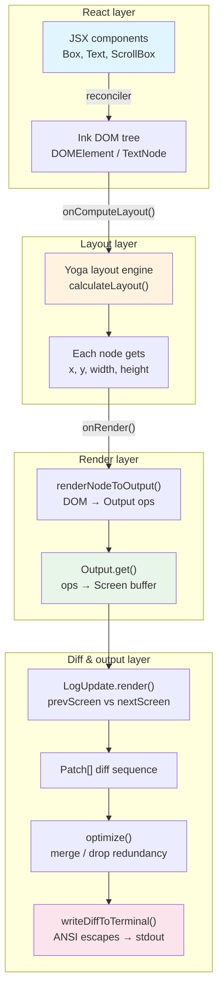

# Chapter 26: Ink Framework Deep Customization — Running React in the Terminal

> This chapter is the 26th installment of *Deep Dive into Claude Code Source*, and the opening of the "Terminal UI and Multimodal Input" section. The preceding chapters walked through the two hidden tracks of the network layer (Bridge IPC, plus DirectConnect and Upstream Proxy); from this chapter onward our focus returns to the CLI's local side: when a user hits enter and sees a frame on screen, how exactly does a React tree become ANSI bytes on the terminal?
>
> This chapter dives into Claude Code's forked Ink framework (the `ink/` directory — 96 `.ts` / `.tsx` files, 19,842 lines) and shows how a complete React rendering engine is built inside a terminal: a custom Reconciler, Yoga layout, a double-buffered render pipeline, virtual scrolling, mouse events, text selection, and other deep customizations. This revision also pulls the view over to `native-ts/`, the directory that ships alongside `ink/`: the team rewrote three native modules that originally went through WASM / NAPI (`yoga-layout` / `color-diff` / `file-index`) as pure-TypeScript implementations. Ink's layout engine is the first of those three.
>
> **Terminology primer**: a handful of ANSI / terminal-protocol acronyms appear repeatedly in this chapter — **DECSTBM** (DEC Set Top/Bottom Margin, CSI `r`, defines the scroll region's top and bottom edges so the terminal scrolls with a hardware instruction instead of repainting the whole screen), **DEC 2026** ("Synchronized Output", CSI `?2026h/l`, wraps a frame's many writes inside a BSU/ESU block so the terminal flushes atomically and avoids half-frame flicker), **OSC 8** (the OSC `8;params;URI ST` sequence that tags a stretch of text as a clickable hyperlink, supported by iTerm2 / WezTerm), **DA1** (Primary Device Attributes, CSI `c`, the "introduce yourself" query that every terminal since VT100 answers — used here as a capability-probe sentinel), and **BiDi** (Bidirectional Text, the visual-reordering algorithm for RTL characters such as Arabic and Hebrew embedded in LTR text). They will not be expanded again later.

## Why Fork Ink?

Ink (Ink) is an open-source framework that lets you write terminal UIs with React components. Upstream Ink works for simple CLI tools — but Claude Code is not a simple CLI. It needs:

- **Full-screen mode**: a complete UI under the Alt Screen, not "append-style" output.
- **Virtual scrolling**: conversation history can run to thousands of lines and cannot all be rendered.
- **Mouse interaction**: clicks, drag-to-select text, scroll wheel.
- **60fps rendering**: a frame every 16ms during streaming output, with no flicker.
- **IME support**: CJK input methods require precise physical-cursor positioning.

Upstream Ink supports none of these. The Claude Code team forked Ink and applied extensive deep customization, eventually producing a feature-complete terminal React rendering engine.

---

## 1. Architecture Overview: From React to Terminal Pixels

The whole render pipeline is captured in this architecture diagram:



### Core flow in brief

1. The **React Reconciler** maps JSX changes onto the Ink DOM tree (`DOMElement`/`TextNode`).
2. **Yoga** runs Flexbox layout on the DOM tree.
3. **renderNodeToOutput** walks the DOM tree and produces write/blit/clip operations.
4. **Output.get()** applies those operations to the Screen buffer (a two-dimensional character grid).
5. **LogUpdate.render()** diffs the Screens of the previous and next frames into a minimal Patch sequence.
6. The **optimizer** merges redundant patches.
7. The result is serialized into ANSI escape codes and written to stdout.

---

## 2. Reconciler: Bridging React and the Terminal DOM

### 2.1 A Custom React Reconciler

`reconciler.ts` uses the `react-reconciler` library to create a custom React Reconciler — the same underlying mechanism `react-dom` uses, except the target is not the browser DOM but Ink's terminal DOM.

```typescript
// ink/reconciler.ts:224-239
const reconciler = createReconciler<
  ElementNames,    // 'ink-root' | 'ink-box' | 'ink-text' | ...
  Props,           // Record<string, unknown>
  DOMElement,      // Ink's DOM element
  DOMElement,      // Container type
  TextNode,        // Text node
  ...
>({
  getRootHostContext: () => ({ isInsideText: false }),
  // ...
})
```

**Key idea**: a Reconciler defines how React operates on its "host environment". In the browser the host environment is the HTML DOM; in Ink, it's an in-memory set of lightweight DOM structures.

### 2.2 Ink DOM: Seven Element Types

Ink defines its own DOM element taxonomy (`dom.ts:18-27`):

```typescript
// ink/dom.ts:19-27
export type ElementNames =
  | 'ink-root'         // root node
  | 'ink-box'          // container (equivalent to HTML div)
  | 'ink-text'         // text container
  | 'ink-virtual-text' // nested text (Text inside Text)
  | 'ink-link'         // hyperlink
  | 'ink-progress'     // progress bar
  | 'ink-raw-ansi'     // pre-rendered ANSI content
```

Each `DOMElement` carries a rich set of state fields (`dom.ts:31-91`):

```typescript
export type DOMElement = {
  nodeName: ElementNames
  attributes: Record<string, DOMNodeAttribute>
  childNodes: DOMNode[]
  style: Styles
  yogaNode?: LayoutNode       // Yoga layout node
  dirty: boolean              // needs re-render?
  isHidden?: boolean          // hidden state
  _eventHandlers?: Record<string, unknown>  // event handlers

  // Scroll state (overflow: scroll)
  scrollTop?: number
  pendingScrollDelta?: number  // accumulated, unconsumed scroll delta
  scrollHeight?: number
  scrollViewportHeight?: number
  stickyScroll?: boolean       // auto-stick to bottom

  // Focus management
  focusManager?: FocusManager  // only ink-root owns it
  debugOwnerChain?: string[]   // debug-only component stack
} & InkNode
```

### 2.3 Dirty Marking and Render Scheduling

When React updates props or children, the Reconciler calls `markDirty()` to bubble a dirty flag up the entire ancestor chain:

```typescript
// ink/dom.ts:393-413
export const markDirty = (node?: DOMNode): void => {
  let current: DOMNode | undefined = node
  let markedYoga = false

  while (current) {
    if (current.nodeName !== '#text') {
      (current as DOMElement).dirty = true
      // Only mark yoga dirty on leaf nodes (ink-text / ink-raw-ansi)
      if (!markedYoga &&
        (current.nodeName === 'ink-text' || current.nodeName === 'ink-raw-ansi') &&
        current.yogaNode) {
        current.yogaNode.markDirty()
        markedYoga = true
      }
    }
    current = current.parentNode
  }
}
```

**Design points**:
- DOM-level `dirty` bubbling is O(depth) and very cheap.
- Yoga `markDirty()` is invoked only on leaf text nodes — only text nodes carry a `measureFunc` and therefore need re-measurement.
- Attribute mutations run a shallow equality check to avoid pointless dirty marks (`setStyle`, `setTextStyles`, and `setAttribute` all have guards).

### 2.4 React 19 Adapter

The Reconciler ships an adapter for React 19 (`reconciler.ts:425-506`):

```typescript
// React 19: commitUpdate receives new and old props directly, not an updatePayload
commitUpdate(node, _type, oldProps, newProps): void {
  const props = diff(oldProps, newProps)
  const style = diff(oldProps['style'], newProps['style'])
  // ... apply the diff
},

// React 19 required methods
maySuspendCommit: () => false,
preloadInstance: () => true,
startSuspendingCommit: () => {},
suspendInstance: () => {},
waitForCommitToBeReady: () => null,
```

---

## 3. Layout Engine: Abstracting and Adapting Yoga

### 3.1 The LayoutNode Abstraction

Claude Code does not call the Yoga API directly. It defines a `LayoutNode` interface as an abstraction layer (`layout/node.ts:93-152`):

```typescript
// ink/layout/node.ts:93-152
export type LayoutNode = {
  // Tree operations
  insertChild(child: LayoutNode, index: number): void
  removeChild(child: LayoutNode): void
  getChildCount(): number

  // Layout computation
  calculateLayout(width?: number, height?: number): void
  setMeasureFunc(fn: LayoutMeasureFunc): void
  markDirty(): void

  // Read computed layout
  getComputedLeft(): number
  getComputedTop(): number
  getComputedWidth(): number
  getComputedHeight(): number

  // Style setters (full Flexbox surface)
  setWidth(value: number): void
  setFlexDirection(dir: LayoutFlexDirection): void
  setDisplay(display: LayoutDisplay): void
  setOverflow(overflow: LayoutOverflow): void
  // ... 40+ methods
}
```

`YogaLayoutNode` in `layout/yoga.ts` is the only implementation of this interface, mapping the abstract types onto real Yoga constants:

```typescript
// ink/layout/yoga.ts:54-66
export class YogaLayoutNode implements LayoutNode {
  readonly yoga: YogaNode

  insertChild(child: LayoutNode, index: number): void {
    this.yoga.insertChild((child as YogaLayoutNode).yoga, index)
  }
  // ...
}
```

**Why have this layer of abstraction?** Upstream Yoga is C++, and the community-standard path is the `yoga-layout` WASM binding — but Claude Code **rewrote Yoga end-to-end in pure TypeScript**, landed at `native-ts/yoga-layout/` (see section 9 below). The `LayoutNode` interface lets `ink/layout/yoga.ts` care only about "layout semantics" without binding to any particular Yoga implementation: in theory, swapping the layout engine would not require touching the reconciler. In practice there is currently a single implementation, `YogaLayoutNode`, but what it points at is no longer WASM — it's a same-process JS object. The comment at `ink/layout/yoga.ts:302` puts it plainly: "no WASM loading, no linear memory growth, so no preload/swap/reset machinery is needed".

### 3.2 Text Measurement

Yoga's `measureFunc` is the heart of layout — it tells Yoga the actual dimensions of a text node under a given width constraint:

```typescript
// ink/dom.ts:332-374
const measureTextNode = function (
  node: DOMNode,
  width: number,
  widthMode: LayoutMeasureMode,
): { width: number; height: number } {
  const rawText = node.nodeName === '#text' ? node.nodeValue : squashTextNodes(node)
  const text = expandTabs(rawText)
  const dimensions = measureText(text, width)

  // Text narrower than container → no wrap needed
  if (dimensions.width <= width) return dimensions

  // Undefined mode + contains newline → use natural width (avoid inflating height)
  if (text.includes('\n') && widthMode === LayoutMeasureMode.Undefined) {
    return measureText(text, Math.max(width, dimensions.width))
  }

  // Wrap required
  const textWrap = node.style?.textWrap ?? 'wrap'
  const wrappedText = wrapText(text, width, textWrap)
  return measureText(wrappedText, width)
}
```

### 3.3 When Layout Runs

Layout computation happens during React's commit phase (`reconciler.ts:247-258`), triggered by `resetAfterCommit`:

```typescript
// ink/ink.tsx:239-258 (onComputeLayout callback)
this.rootNode.onComputeLayout = () => {
  if (this.isUnmounted) return
  if (this.rootNode.yogaNode) {
    const t0 = performance.now()
    this.rootNode.yogaNode.setWidth(this.terminalColumns)
    this.rootNode.yogaNode.calculateLayout(this.terminalColumns)
    const ms = performance.now() - t0
    recordYogaMs(ms)
  }
}
```

**Sequence**: React commit → `resetAfterCommit` → `onComputeLayout()` (Yoga layout) → `onRender()` (render to terminal). This guarantees that `useLayoutEffect` can read the latest layout.

---

## 4. Render Pipeline: From DOM to Screen Buffer

### 4.1 Double Buffering + Frame Throttling

The `Ink` class (`ink.tsx`) keeps two Frame objects to implement **double buffering**:

```typescript
// ink/ink.tsx:99-100
private frontFrame: Frame    // currently displayed frame
private backFrame: Frame     // background buffer frame
```

Rendering is throttled to ~60fps (a 16ms interval) via `throttle`:

```typescript
// ink/ink.tsx:212-216 (scheduleRender)
const deferredRender = (): void => queueMicrotask(this.onRender)
this.scheduleRender = throttle(deferredRender, FRAME_INTERVAL_MS, {
  leading: true,   // fire immediately on the first change
  trailing: true   // fire once more after the interval
})
```

The reason for the **microtask delay**: `scheduleRender` is invoked from the Reconciler's `resetAfterCommit`, at which point React's layout effects have not yet run. Using `queueMicrotask` defers the render until after layout effects complete, ensuring that data from hooks like `useDeclaredCursor` (IME cursor positioning) takes effect within the same frame.

### 4.2 Screen: a 2D Character Grid

Screen is the terminal's virtual frame buffer. It uses three shared pools to store characters, styles, and hyperlinks in a memory-efficient way (`screen.ts`):

```typescript
// ink/screen.ts:21-53
export class CharPool {
  private strings: string[] = [' ', '']  // 0=space, 1=empty
  private ascii: Int32Array = initCharAscii() // ASCII fast lookup

  intern(char: string): number {
    // ASCII fast path: direct array lookup instead of Map.get
    if (char.length === 1) {
      const code = char.charCodeAt(0)
      if (code < 128) {
        const cached = this.ascii[code]!
        if (cached !== -1) return cached
        // ...
      }
    }
    // ...
  }
}
```

**Pool design points**:
- `CharPool`: string → integer ID mapping; ASCII characters index straight into an `Int32Array` (O(1)).
- `StylePool`: interns ANSI style sequences; `transition(fromId, toId)` caches the style-transition string between two states.
- `HyperlinkPool`: interns OSC 8 hyperlink URLs. `Ink.onRender()` calls `resetPools()` every 5 minutes to reset both `CharPool` and `HyperlinkPool`, preventing unbounded memory growth in long sessions (`ink.tsx:597-603`).

### 4.3 Output: an Operation Collector

`Output` (`output.ts`) turns the result of walking the DOM tree into a Screen buffer. It supports seven operations:

| Op | Meaning |
|------|------|
| `write` | Write text at `(x, y)`. |
| `blit` | Copy an unchanged region from the previous frame's Screen block. |
| `shift` | Scroll: shift rows (paired with DECSTBM). |
| `clip` / `unclip` | Push / pop a clip region (overflow: hidden/scroll). |
| `clear` | Clear a region (node removed or shrunk). |
| `noSelect` | Mark a region as not selectable (line numbers, diff markers). |

`Output.get()` executes these operations in order, ultimately producing a complete Screen buffer. Among them, `writeLineToScreen` (`output.ts:633-797`) is on the hot path and is extracted into a standalone function specifically to help JIT compilation:

```typescript
// ink/output.ts:633-651
function writeLineToScreen(
  screen, line, x, y, screenWidth, stylePool, charCache,
): number {
  // charCache: tokenize + grapheme-clustering results for the same line are reused across frames
  let characters = charCache.get(line)
  if (!characters) {
    characters = reorderBidi(
      styledCharsWithGraphemeClustering(
        styledCharsFromTokens(tokenize(line)),
        stylePool,
      ),
    )
    charCache.set(line, characters)
  }
  // ... write characters to Screen
}
```

**charCache** is the key optimization: during streaming output most lines do not change, so caching the tokenize + grapheme-clustering results avoids recomputing them every frame.

### 4.4 Blit Optimization: a Fast Path for Unchanged Subtrees

While walking the DOM tree, `renderNodeToOutput` (`render-node-to-output.ts`) takes a **blit** (block copy) shortcut for unchanged subtrees instead of rendering them again.

If a node's `dirty` flag is false, its layout position has not moved, and the previous frame's Screen buffer is trusted (`prevScreen` exists), the corresponding region of the previous frame's Screen is copied straight into the new Screen — an O(cells) TypedArray copy replaces an O(nodes) DOM walk plus text measurement.

Output internally tracks the ratio of blits to writes:

```typescript
// ink/output.ts:523-528
const totalCells = blitCells + writeCells
if (totalCells > 1000 && writeCells > blitCells) {
  logForDebugging(
    `High write ratio: blit=${blitCells}, write=${writeCells} ...`,
  )
}
```

**Layout-shift detection**: a global flag `layoutShifted` tracks whether any node's layout position/size differs from the cache. Steady-state frames (a spinner spinning, a clock ticking, text streaming into a fixed-height container) do not trigger a layout shift, in which case the narrow damage region lets the diff compare only the changed area instead of the full screen.

---

## 5. Diff Engine: Minimal Terminal Updates

### 5.1 LogUpdate: Screen Diff

`LogUpdate.render()` (`log-update.ts:123-467`) is the heart of the diff engine. It compares the Screen buffers of the previous and next frames and produces minimal update instructions (a Patch sequence):

```typescript
// ink/log-update.ts:123-131
render(prev: Frame, next: Frame, altScreen = false, decstbmSafe = true): Diff {
  if (!this.options.isTTY) {
    return this.renderFullFrame(next)  // non-TTY: full output
  }
  // ...
}
```

The diff uses `diffEach()` to compare the two Screens cell by cell, emitting cursor-move + character-write instructions only for cells that changed. Core optimizations include:

1. **Damage region scoping**: cells are only compared inside the `screen.damage` rectangle.
2. **SpacerTail / SpacerHead skipping**: the second column of a wide character (CJK, emoji) is automatically skipped.
3. **Empty-cell skipping**: empty cells are skipped when they do not overwrite existing content (avoiding trailing spaces that force a wrap).
4. **Style transition caching**: `StylePool.transition(fromId, toId)` returns a pre-computed ANSI escape string.

### 5.2 DECSTBM Hardware-Scroll Optimization

When a ScrollBox's `scrollTop` changes, log-update uses the terminal's hardware scroll region (DECSTBM):

```typescript
// ink/log-update.ts:166-185
if (altScreen && next.scrollHint && decstbmSafe) {
  const { top, bottom, delta } = next.scrollHint
  // Use DECSTBM + CSI S/T hardware scrolling instead of rewriting the whole region
  shiftRows(prev.screen, top, bottom, delta)
  scrollPatch = [{
    type: 'stdout',
    content: setScrollRegion(top+1, bottom+1) +
      (delta > 0 ? csiScrollUp(delta) : csiScrollDown(-delta)) +
      RESET_SCROLL_REGION + CURSOR_HOME,
  }]
}
```

**Constraint**: the `decstbmSafe` parameter controls whether this optimization is used. tmux does not support DEC 2026 synchronized output, and under tmux the intermediate state of a DECSTBM sequence is rendered (content has scrolled but edge rows have not yet been updated), causing visible jitter. In that case the code falls back to row-by-row rewriting.

### 5.3 The Patch Optimizer

`optimizer.ts` runs a single-pass optimization over the Patch sequence:

```typescript
// ink/optimizer.ts:16-93
export function optimize(diff: Diff): Diff {
  // 8 rules, single-pass:
  // 1. Remove empty stdout content
  // 2. Merge consecutive cursorMove
  // 3. Collapse consecutive cursorTo (keep only the last)
  // 4. Remove (0,0) cursorMove
  // 5. Concatenate adjacent style transitions
  // 6. Deduplicate consecutive hyperlinks pointing to the same URI
  // 7. Cancel out cursorHide/cursorShow pairs
  // 8. Drop clears with count=0
}
```

---

## 6. Deep Customizations Beyond Upstream Ink

### 6.1 Virtual Scrolling (ScrollBox)

`ScrollBox` (`components/ScrollBox.tsx`) is the most important custom component. It implements a terminal equivalent of the browser's `overflow: scroll`:

```typescript
// ink/components/ScrollBox.tsx:82-87
function ScrollBox({ children, ref, stickyScroll, ...style }: ...) {
  const domRef = useRef<DOMElement>(null)
  // scrollTo/scrollBy bypass React: mutate the DOM node's scrollTop directly,
  // mark dirty, call scheduleRender — zero reconciler overhead
  // ...
}
```

**Key design choices**:

- **Bypass React state**: `scrollTo` / `scrollBy` mutate the DOM node's `scrollTop` attribute directly, then trigger an Ink re-render via `markDirty()` + `scheduleRenderFrom()`. They do not go through the full React flow of `setState` → reconcile → commit, sidestepping reconciler overhead on every scroll-wheel event.
- **Microtask coalescing**: multiple `scrollBy` calls inside the same `discreteUpdates` batch accumulate into `pendingScrollDelta`, which is then collapsed into a single `scheduleRender` via `queueMicrotask`.
- **Per-frame drain**: a fast scroll wheel does not jump to the target in one step; each frame consumes only part of `pendingScrollDelta`, producing a smooth scrolling effect. There are two drain strategies in practice (`render-node-to-output.ts:106-176`): **xterm.js terminals** (VS Code and friends) use an adaptive staircase drain — small amounts (≤5 rows) are consumed in one shot, medium amounts move 2 rows per frame, large amounts (≥12) move 3 rows per frame, and beyond 30 rows the excess is snapped; **native terminals** (iTerm2, Ghostty, etc.) use a proportional drain — `max(4, floor(abs*3/4))` rows per frame, with large scrolls catching up over a logarithmic number of frames. Both strategies cap the per-frame consumption at `innerHeight - 1` rows, ensuring the DECSTBM hardware-scroll fast path remains effective.
- **Sticky scroll**: the `stickyScroll` attribute automatically sticks to the bottom and follows new content as it grows — exactly what streaming AI output needs.
- **Render-time clamp**: `scrollClampMin` / `scrollClampMax` keep a fast `scrollTo` from going past the range of already-mounted child nodes (React's asynchronous re-render may not yet have mounted new ones), preventing blank screens.

### 6.2 Event System: Two Dispatch Paths

Ink's event system has **two distinct dispatch paths** serving different event categories:

**Path one: the Dispatcher (keyboard, focus events)**

`events/dispatcher.ts` implements a DOM Level 3-style capture/bubble two-phase dispatch model. It is currently used for **keyboard events** and **focus events**. At `ink.tsx:1272`, keyboard input is dispatched via `dispatcher.dispatchDiscrete(target, event)`, and focus changes go through the same path (`ink.tsx:234`).

```typescript
// ink/events/dispatcher.ts:46-79
function collectListeners(target: EventTarget, event: TerminalEvent): DispatchListener[] {
  const listeners: DispatchListener[] = []
  let node: EventTarget | undefined = target
  while (node) {
    const isTarget = node === target
    const captureHandler = getHandler(node, event.type, true)
    const bubbleHandler  = getHandler(node, event.type, false)
    if (captureHandler) {
      listeners.unshift({ node, handler: captureHandler, phase: isTarget ? 'at_target' : 'capturing' })
    }
    if (bubbleHandler && (event.bubbles || isTarget)) {
      listeners.push({ node, handler: bubbleHandler, phase: isTarget ? 'at_target' : 'bubbling' })
    }
    node = node.parentNode
  }
  return listeners
}
```

The Dispatcher also maps event types to React Scheduler priorities (`dispatcher.ts:122-138`), which influences how React schedules state updates:

| Event type | React priority |
|---------|------------|
| keydown, keyup, click, focus, blur, paste | `DiscreteEventPriority` (synchronous) |
| resize, scroll, mousemove | `ContinuousEventPriority` (coalesceable) |
| Others | `DefaultEventPriority` |

**Path two: dispatchClick / dispatchHover (mouse events)**

Mouse clicks go through `dispatchClick()` in `hit-test.ts`. It **does not pass through the Dispatcher's capture/bubble machinery** — it walks up the `parentNode` chain directly, looking for `_eventHandlers.onClick` and invoking it (`hit-test.ts:49-89`). Mouse hover events likewise have their own `dispatchHover()`, based on an enter/leave diff model rather than bubbling.

### 6.3 Hit Testing and Mouse Interaction

`hit-test.ts` maps a click coordinate to a DOM node:

```typescript
// ink/hit-test.ts:18-41
export function hitTest(node: DOMElement, col: number, row: number): DOMElement | null {
  const rect = nodeCache.get(node)
  if (!rect) return null
  if (col < rect.x || col >= rect.x + rect.width ||
      row < rect.y || row >= rect.y + rect.height) {
    return null
  }
  // Post-order traversal: later-painted nodes are on top and win
  for (let i = node.childNodes.length - 1; i >= 0; i--) {
    const child = node.childNodes[i]!
    if (child.nodeName === '#text') continue
    const hit = hitTest(child, col, row)
    if (hit) return hit
  }
  return node
}
```

It uses `nodeCache` (the layout cache populated by `renderNodeToOutput` every frame) to do AABB hit-testing, and the reverse child traversal ensures that later-painted nodes (visually on top) win.

### 6.4 Text Selection

`selection.ts` implements a complete terminal text-selection system: an anchor + focus two-endpoint model, drag selection, double-click word selection, triple-click line selection, and selection preserved across scrolling.

```typescript
// ink/selection.ts:19-56
export type SelectionState = {
  anchor: Point | null           // drag start
  focus: Point | null            // current drag position
  isDragging: boolean
  anchorSpan: { lo: Point; hi: Point; kind: 'word' | 'line' } | null
  scrolledOffAbove: string[]     // selected text scrolled above the viewport
  scrolledOffBelow: string[]     // selected text scrolled below the viewport
  virtualAnchorRow?: number      // for restoring after scroll
  virtualFocusRow?: number
}
```

The selection is written into the Screen buffer as a style overlay (reverse video), and the diff engine treats it as ordinary cell changes — there is no separate overlay layer.

### 6.5 Terminal Querier: Capability Probing Without Timeouts

`terminal-querier.ts` implements an elegant terminal-capability query system that **does not rely on timeouts at all**:

```typescript
// ink/terminal-querier.ts:128-212
export class TerminalQuerier {
  private queue: Pending[] = []

  send<T>(query: TerminalQuery<T>): Promise<T | undefined> {
    return new Promise(resolve => {
      this.queue.push({ kind: 'query', match: query.match, resolve })
      this.stdout.write(query.request)
    })
  }

  flush(): Promise<void> {
    return new Promise(resolve => {
      this.queue.push({ kind: 'sentinel', resolve })
      this.stdout.write(SENTINEL)  // DA1 query, answered by every terminal
    })
  }
}
```

**Core idea**: after each batch of queries, send a DA1 (Primary Device Attributes) as a sentinel. DA1 has been supported by every terminal since VT100, and terminals reply in order. If a query's response arrives before the DA1 reply, the terminal supports it; if the DA1 reply arrives first, the terminal ignored the query (no support).

This is much more elegant than "wait 200ms for a timeout" — precise and wait-free.

### 6.6 Focus Management

`focus.ts` implements a browser-like focus system (`FocusManager`):

```typescript
// ink/focus.ts:15-132
export class FocusManager {
  activeElement: DOMElement | null = null
  private focusStack: DOMElement[] = []  // capped at 32

  focus(node: DOMElement): void {
    const previous = this.activeElement
    if (previous) {
      // Deduplicated push, so the stack does not grow unbounded under Tab cycling
      const idx = this.focusStack.indexOf(previous)
      if (idx !== -1) this.focusStack.splice(idx, 1)
      this.focusStack.push(previous)
      this.dispatchFocusEvent(previous, new FocusEvent('blur', node))
    }
    this.activeElement = node
    this.dispatchFocusEvent(node, new FocusEvent('focus', previous))
  }

  handleNodeRemoved(node: DOMElement, root: DOMElement): void {
    // When a node is removed, automatically restore the previous focus from the stack
    // ...
  }
}
```

**Highlight**: a focus stack with automatic restoration. When a node holding focus is removed, the manager pops the most recent stack entry that is still in the tree and makes it the new focus — critical in a conversation UI where tool results appear and disappear and permission dialogs close.

---

## 7. Performance: Chasing 60fps in the Terminal

### 7.1 line-width-cache

During streaming output, completed lines are immutable. `line-width-cache.ts` caches the `stringWidth` result for each line, avoiding remeasuring hundreds of unchanged lines every frame:

```typescript
// ink/line-width-cache.ts:1-24
const cache = new Map<string, number>()
const MAX_CACHE_SIZE = 4096

export function lineWidth(line: string): number {
  const cached = cache.get(line)
  if (cached !== undefined) return cached
  const width = stringWidth(line)
  if (cache.size >= MAX_CACHE_SIZE) cache.clear()  // wipe all; rebuild next frame
  cache.set(line, width)
  return width
}
```

**~50x fewer** `stringWidth` calls (according to the comment).

### 7.2 node-cache

`node-cache.ts` uses a WeakMap to cache the layout rectangle of every DOM node:

```typescript
// ink/node-cache.ts:10-18
export type CachedLayout = {
  x: number; y: number; width: number; height: number;
  top?: number  // yoga getComputedTop(), used for ScrollBox viewport culling
}
export const nodeCache = new WeakMap<DOMElement, CachedLayout>()
```

Used for:
1. **Blit decisions**: compare the cached position against the current position to decide whether a blit is allowed.
2. **Hit testing**: O(1) lookup of a node's rectangle when resolving a click coordinate.
3. **Cursor positioning**: `useDeclaredCursor` reads node rectangles to compute the physical cursor position.

### 7.3 Frame Timing and Debugging Tools

`FrameEvent` exposes fine-grained per-frame performance data (`frame.ts:38-71`):

```typescript
export type FrameEvent = {
  durationMs: number
  phases?: {
    renderer: number    // DOM → Yoga → Screen
    diff: number        // Screen → Patch[]
    optimize: number    // patch merging
    write: number       // patches → stdout
    yoga: number        // Yoga calculateLayout
    yogaVisited: number // layoutNode call count
    yogaMeasured: number // measureFunc call count (the expensive part)
    yogaCacheHits: number // cache hits
    yogaLive: number    // live Yoga nodes (growth = leak)
  }
  flickers: Array<{ reason: FlickerReason; ... }>
}
```

The `CLAUDE_CODE_COMMIT_LOG` environment variable enables commit-level logging: gaps > 30ms, reconciles > 20ms, or creates > 50 are auto-logged, making it easy to find sources of frame stalls.

### 7.4 Sync Output (DEC 2026)

Terminals that support the DEC 2026 synchronized-output protocol (iTerm2, WezTerm, Ghostty, VS Code, etc.) can wrap a whole frame update in a BSU/ESU block, and the terminal flushes the display atomically when the ESU arrives, completely eliminating flicker from partial updates.

`SYNC_OUTPUT_SUPPORTED` is computed **synchronously at module load time** (`terminal.ts:183`) using `isSynchronizedOutputSupported()`, which makes a heuristic decision based on environment variables (`terminal.ts:70-118`) — inspecting `TERM_PROGRAM`, `TERM`, `KITTY_WINDOW_ID`, `WT_SESSION`, `VTE_VERSION`, etc., to identify the terminal type. Under tmux it returns false directly (tmux does not implement DEC 2026; BSU/ESU pass through to the outer terminal, but tmux has already destroyed atomicity). This is a purely synchronous decision and **does not involve** the asynchronous query path of TerminalQuerier.

```typescript
// ink/terminal.ts:181-183
// Computed once at module load — terminal capabilities don't change mid-session.
export const SYNC_OUTPUT_SUPPORTED = isSynchronizedOutputSupported()
```

TerminalQuerier's DECRQM query mechanism is used to probe other terminal capabilities (such as the Kitty keyboard protocol), but the decision for DEC 2026 support goes through the environment-variable heuristic path.

---

## 8. Transferable Design Patterns

### Pattern 1: Pool + double-buffered render pipeline

Split rendering into two steps: "build the buffer" and "diff and output". Inside the buffer, use intern pools (`CharPool`, `StylePool`) to map frequently appearing characters and styles to integer IDs, so the diff stage only compares IDs instead of strings. Double-buffer swapping ensures the foreground display frame is not contaminated by background computation.

**Where it applies**: any UI system that needs high-frequency incremental updates (terminals, games, Canvas renderers).

### Pattern 2: An imperative fast path that bypasses React

For high-frequency operations (scroll-wheel scrolling), mutate the DOM attribute directly + call `markDirty()` + call `scheduleRender()`, sidestepping React's `setState` → reconcile → commit flow. React owns the declarative UI structure; the imperative path owns frame-rate-sensitive state updates.

**Where it applies**: React apps that need 60fps interactions (animation, drag, scroll), Canvas/WebGL integrations.

### Pattern 3: Sentinel-based capability probing

Use a query with a guaranteed response (DA1) as a sentinel, turning "wait for timeout" into "wait for confirmation". Send several queries in a batch and have a single sentinel adjudicate them. Precise, wait-free, and free of false positives.

**Where it applies**: any protocol that probes the peer's capabilities (terminals, SMTP EHLO, HTTP feature detection).

---

## 9. Pulling Native Modules Back Into the JS Process: the Three `native-ts/` Rewrites

If you only read `ink/`, you might assume that layout, color matching, and file search — the kinds of modules that "look like they should be C++/Rust" — still live in some native binding. In fact, Claude Code rewrote all of them as **pure TypeScript** inside the repo's `native-ts/` directory. There are three modules so far: `yoga-layout/` (2,712 lines), `color-diff/` (999 lines), and `file-index/` (370 lines), totaling 4,081 lines of TS. The three originally took three different "native forms" and the motivations for rewriting differed, but the landing posture is identical: keep the original API surface, drop the native dependency.

The comment at the top of `native-ts/yoga-layout/index.ts` lays out the trade-offs for the first rewrite: it aims to "match the API surface of `yoga-layout/load`, covering exactly the flexbox subset that Ink uses" — `flex-direction` / `flex-grow` / `flex-shrink` / `flex-basis` / `align-items` / `justify-content` / six-directional margin/padding/border/gap / `position: absolute` / `display: flex|none` / `measureFunc` are what Ink actually calls; multi-pass flex clamping, `flex-wrap`, `align-content`, `align-items: baseline`, `display: contents`, and `margin: auto` are "implemented just to stay aligned with the spec"; `aspect-ratio`, `box-sizing: content-box`, and RTL — "things Ink doesn't use" — are simply not implemented. `ink/layout/yoga.ts` imports directly from `'src/native-ts/yoga-layout/index.js'` — there is no WASM fallback retained inside Ink.

The second rewrite, `color-diff/`, replaces a Rust + NAPI module. The original Rust version used `syntect + bat` for syntax highlighting and the `similar` crate for word diff; the TS version switches to `highlight.js` (already pulled in by `cli-highlight`) plus the `diff` npm package's `diffArrays`. The rewrite is not perfectly semantically equivalent — the header comment is explicit: "hljs's syntax definitions have gaps: bare identifiers and operators like `=` and `:` have no scope, so they fall through to the default foreground color instead of the white/pink that syntect would have produced" — but the output shape (line numbers, markers, background, word-diff segments) is preserved. What this section is especially careful about is **lazy loading**: `highlight.js` registers 190+ syntaxes on first load and costs ~50MB / 100–200ms (slower on Windows), so the TS version keeps the `dlopen`-style approach the original NAPI wrapper used — `cachedHljs` only `require('highlight.js')` on the first render, keeping it out of the cold-start path via `StructuredDiff.tsx`'s import chain.

The third rewrite, `file-index/`, replaces `vendor/file-index-src` — a Rust NAPI module wrapping nucleo (the fzf-style fuzzy-search library from the helix-editor team). The TS version transcribes nucleo's scoring constants field by field: `SCORE_MATCH=16`, `BONUS_BOUNDARY=8`, `BONUS_CAMEL=6`, `BONUS_CONSECUTIVE=4`, `BONUS_FIRST_CHAR=8`, `PENALTY_GAP_START=3`, `PENALTY_GAP_EXTENSION=1`, so the output ordering matches the original module. The point most worth highlighting is that this rewrite chose to slice "by time" instead of "by count" — `CHUNK_MS = 4`, yielding to the event loop with an `await` every 4ms. Scoring 5k paths takes about 2ms on Apple Silicon (per the comment at the top of `native-ts/file-index/index.ts`), but an older Windows machine might need 15ms+; slicing by time keeps slow machines responsive too.

Stacked together, the design intent of `native-ts/` is uniform: **Claude Code is a long-session CLI, not a one-shot render job**. Every additional WASM / NAPI module is one more cold-start delay, one more cross-platform binary distribution problem, and one more chain of OOM / dlopen failures. Once those are moved back into the JS process, the entire CLI becomes a "pure npm package" again — installation goes back to "`npm i` and run", which is what the "no WASM loading" line at `ink/layout/yoga.ts:302` is really getting at. The cost is real: pure-TS Yoga is slower than C++ (the `recordYogaMs` per-frame stat mentioned in section 7 is precisely there so the team can keep an eye on whether that cost is still acceptable on real hardware), highlight.js covers a few fewer tokens than syntect, and a pure-JS fuzzy search eats more CPU than Rust — but all of those have been traded for "pure-TS code that can be hot-fixed inside a long session". That is why this section pulls the view from `ink/` over to `native-ts/`: the trade-offs around native modules are themselves an extension of Ink's render pipeline.

---

## Next Chapter Preview

[Chapter 27: Components and Design System — Componentization Practice for Terminal UI](./27-components-and-design-system.md)

We will dive into the 16 files under `components/design-system/` and unpack how a complete terminal UI design system is built — from the theme system to base components to tool UI protocols.

---
*Full content lives at https://github.com/luyao618/Claude-Code-Source-Study (a free star is always appreciated)*
