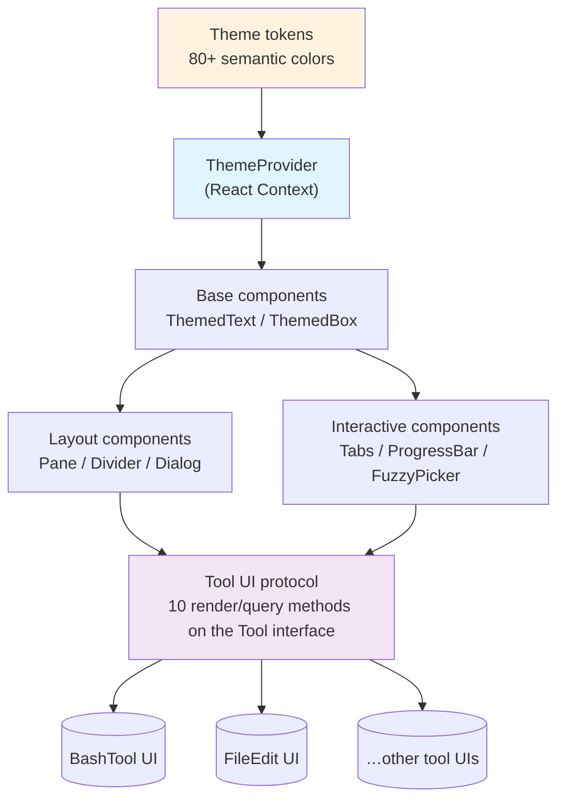

# Chapter 27: Components and Design System — Component-Driven Practice for Terminal UI

> This chapter dives into Claude Code's `components/design-system/` directory and unpacks how a full terminal-UI design system is built — from the theme system, through base components, all the way to the tool UI protocol.

## Why does a terminal application need a design system?

When all you do is print a few lines with `console.log`, you do not need a design system. But the moment your terminal app has **streaming output, parallel multi-tool progress bars, permission confirmation dialogs, tabbed panels, fuzzy search pickers, and dark/light theme switching**, the picture changes entirely.

That is exactly the level of complexity Claude Code faces. Its UI is not a static dump of information; it is a **highly dynamic interactive surface**. Chapter 26 showed how the forked Ink framework runs React inside a terminal; this chapter looks one layer up, at how the team built a **reusable, component-driven design system** on top of that framework.

> Convention: in this book, "chapter" and "篇" are the same concept, and all cross-references are written as "Chapter N".

This design system answers three core questions:
1. **Where do colors come from?** — a theme system with 6 themes × 80+ semantic color tokens.
2. **How are components composed?** — 15 design-system components plus 1 color utility function, with clear separation of responsibilities.
3. **How is tool UI unified?** — a UI protocol formed by 10 render/query methods on the `Tool` interface.

---

## Overview: the five layers from token to tool UI



---

## 1. Theme system: 80+ semantic color tokens

### 1.1 The Theme type: a semantic contract for color

Color management for a terminal application is harder than for the web. The web has CSS variables and a mature design-token ecosystem; the terminal has only ANSI escape sequences. Claude Code's answer is to define a `Theme` type that acts as a **semantic contract for color (颜色的语义化契约)**:

```typescript
// utils/theme.ts:4-89
export type Theme = {
  // Brand colors
  claude: string           // Claude orange
  claudeShimmer: string    // lighter variant for shimmer effects
  permission: string       // permission confirmation color (blue/violet family)
  planMode: string         // Plan mode color

  // Text colors
  text: string             // primary text
  inverseText: string      // inverted text
  inactive: string         // inactive / disabled
  subtle: string           // subtle hint
  suggestion: string       // suggestion highlight

  // Semantic colors
  success: string          // success (green)
  error: string            // error (red)
  warning: string          // warning (amber)

  // Diff colors (4 gradients + 2 word-level highlights)
  diffAdded: string
  diffRemoved: string
  diffAddedDimmed: string
  diffRemovedDimmed: string
  diffAddedWord: string
  diffRemovedWord: string

  // Agent palette (8 colors, used to distinguish multiple parallel agents)
  red_FOR_SUBAGENTS_ONLY: string
  blue_FOR_SUBAGENTS_ONLY: string
  green_FOR_SUBAGENTS_ONLY: string
  yellow_FOR_SUBAGENTS_ONLY: string
  purple_FOR_SUBAGENTS_ONLY: string
  orange_FOR_SUBAGENTS_ONLY: string
  pink_FOR_SUBAGENTS_ONLY: string
  cyan_FOR_SUBAGENTS_ONLY: string

  // Rainbow colors (for the ultrathink keyword animation, 7 colors + 7 shimmers)
  rainbow_red: string
  rainbow_red_shimmer: string
  // ...
}
```

A few design decisions worth highlighting:

**Naming as constraint.** The "shouty" name `red_FOR_SUBAGENTS_ONLY` is no accident. The `Theme` type itself only declares the field as a `string` (see `utils/theme.ts:40-47`); the constraint does not live in the type system. It lives in the field name: this color should only be used to visually distinguish subagents — do not reach for red anywhere else. Compared to hiding the rule in a comment, a name like this is caught by the human eye during code review — when `theme.red_FOR_SUBAGENTS_ONLY` shows up in a non-agent context, the mismatch is immediately visible.

**Shimmer pairing.** Almost every primary color has a matching `*Shimmer` variant (a lighter version). These are reserved for shimmer animations — alternating between the two colors produces the flicker effect.

**80+ fields.** The full `Theme` type has more than 80 color fields, covering everything from diff highlighting to rate-limit progress bars.

### 1.2 Six themes: from True Color down to 16-color ANSI

```typescript
// utils/theme.ts:91-98
export const THEME_NAMES = [
  'dark',
  'light',
  'light-daltonized',
  'dark-daltonized',
  'light-ansi',
  'dark-ansi',
] as const
```

The six themes combine along two axes:

| Axis | Options | Notes |
|------|---------|-------|
| Brightness | dark / light | follows the terminal background color |
| Color capability | standard / daltonized / ansi | 24-bit RGB / color-blind friendly / 16 colors only |

**Standard themes** use explicit RGB values (e.g. `'rgb(215,119,87)'`). A source comment makes the reason explicit:

```typescript
// utils/theme.ts:112-115
/**
 * Light theme using explicit RGB values to avoid inconsistencies
 * from users' custom terminal ANSI color definitions
 */
```

A user may have remapped their terminal's "red" to pink, so relying on ANSI-named colors is not safe.

**ANSI themes** use named colors like `'ansi:red'` and `'ansi:blueBright'`, targeting terminals that do not support True Color.

**Daltonized (color-blind friendly) themes** are the most noteworthy — they do not simply tweak saturation, they **rewire the semantic mapping**:

```typescript
// utils/theme.ts:380-381
// Color-blind friendly mode: success is no longer green, it switches to blue
success: 'rgb(0,102,153)',   // Blue instead of green for deuteranopia
```

For users with red–green color blindness, "success = green" is indistinguishable from error. The daltonized theme maps `success` to blue and keeps `error` pure red — blue versus red provides enough contrast for deuteranopia users.

### 1.3 Auto theme: detecting terminal brightness at runtime

```typescript
// utils/theme.ts:103-109
export const THEME_SETTINGS = ['auto', ...THEME_NAMES] as const

/**
 * A theme preference as stored in user config. `'auto'` follows the system
 * dark/light mode and is resolved to a ThemeName at runtime.
 */
export type ThemeSetting = (typeof THEME_SETTINGS)[number]
```

User config may pick `'auto'`, but actual rendering requires a concrete `ThemeName`. That resolution happens inside `ThemeProvider`:

```typescript
// components/design-system/ThemeProvider.tsx:81
const currentTheme: ThemeName =
  activeSetting === 'auto' ? systemTheme : activeSetting
```

The thing `auto` detects is the **terminal's actual background color**, not the operating system's appearance setting — a dark terminal running on a light-mode macOS should still resolve to `'dark'`. The mechanism has two steps (`utils/systemTheme.ts`):

1. **Synchronous guess.** At startup, read the `$COLORFGBG` environment variable (the rxvt-style `fg;bg` format that some terminals such as iTerm2 and Konsole set), and decide brightness from the ANSI color index (0–6 and 8 are dark, 7 and 9–15 are light).
2. **Asynchronous correction.** `watchSystemTheme` inside `ThemeProvider` issues the OSC 11 terminal query to fetch the real background-color RGB, applies the ITU-R BT.709 relative-luminance formula to decide brightness (`luminance > 0.5` is light), and corrects the module-level cache.

When the user changes their terminal's light/dark scheme mid-session, the OSC 11 watcher catches the change and updates the UI.

### 1.4 Apple Terminal compatibility: 256-color fallback

```typescript
// utils/theme.ts:616-619
const chalkForChart =
  env.terminal === 'Apple_Terminal'
    ? new Chalk({ level: 2 }) // 256 colors
    : chalk
```

Apple Terminal does not correctly handle 24-bit color escape sequences, so a downgraded `chalk` instance restricted to 256-color mode is created just for it. This kind of **per-terminal special-casing** is common practice in terminal app development.

---

## 2. ThemeProvider: the React Context bridge

The React layer of the theme system is `ThemeProvider` plus `useTheme`. It follows the classic Context pattern but adds a few terminal-specific twists:

```typescript
// components/design-system/ThemeProvider.tsx:43-116
export function ThemeProvider({ children, initialState, onThemeSave }) {
  const [themeSetting, setThemeSetting] = useState(
    initialState ?? defaultInitialTheme
  )
  const [previewTheme, setPreviewTheme] = useState<ThemeSetting | null>(null)
  const [systemTheme, setSystemTheme] = useState<SystemTheme>(...)

  // Preview takes precedence over the saved setting
  const activeSetting = previewTheme ?? themeSetting

  // 'auto' → resolve to a concrete ThemeName
  const currentTheme: ThemeName =
    activeSetting === 'auto' ? systemTheme : activeSetting

  const value = useMemo(() => ({
    themeSetting,
    setThemeSetting,
    setPreviewTheme,  // theme picker preview
    savePreview,      // confirm preview
    cancelPreview,    // cancel preview
    currentTheme,     // the theme actually used for rendering (never 'auto')
  }), [...])

  return <ThemeContext.Provider value={value}>{children}</ThemeContext.Provider>
}
```

**Preview mechanism.** The `previewTheme` state lets the theme picker (`ThemePicker`) preview a theme **live** as the user moves up and down the list, without touching the persisted config. Pressing Enter (`savePreview`) writes the choice to the config file; pressing Esc (`cancelPreview`) restores the previous theme.

**Three hooks** expose different granularities of the API (the actual return values are below):

| Hook | Returns | Use case |
|------|---------|----------|
| `useTheme()` | `[ThemeName, (setting: ThemeSetting) => void]` | regular components get the resolved render theme; the setter accepts `ThemeSetting` (including `'auto'`) |
| `useThemeSetting()` | `ThemeSetting` | UI such as `ThemePicker` that needs `'auto'` as a distinct option |
| `usePreviewTheme()` | `{ setPreviewTheme, savePreview, cancelPreview }` | `ThemePicker` driving the full live-preview → confirm → cancel flow |

Note that the first value returned from `useTheme()` is always a resolved `ThemeName` (never `'auto'`), but the setter accepts `'auto'` — passing `'auto'` triggers the `systemTheme` watcher to re-detect terminal brightness.

---

## 3. Base components: ThemedText and ThemedBox

### 3.1 A unified entry point for color resolution

`ThemedText` and `ThemedBox` are the **two cornerstone components** of the entire design system. Their single core responsibility is resolving a Theme key into the actual color value.

```typescript
// components/design-system/ThemedText.tsx:66-74
function resolveColor(
  color: keyof Theme | Color | undefined,
  theme: Theme
): Color | undefined {
  if (!color) return undefined
  // Raw color values pass through
  if (color.startsWith('rgb(') || color.startsWith('#') ||
      color.startsWith('ansi256(') || color.startsWith('ansi:')) {
    return color as Color
  }
  // Theme key → actual color value
  return theme[color as keyof Theme] as Color
}
```

`resolveColor` supports **two input channels**: it accepts both Theme keys (e.g. `'success'`) and raw color values (e.g. `'rgb(0,255,0)'`). That lets components enjoy theming while still being able to bypass the theme when necessary.

On top of that, `ThemedText` adds two extra capabilities:

```typescript
// components/design-system/ThemedText.tsx:80-108
export default function ThemedText({
  color, backgroundColor, dimColor, bold, italic, ...
}: Props) {
  const [themeName] = useTheme()
  const theme = getTheme(themeName)
  const hoverColor = useContext(TextHoverColorContext)

  // Color priority: explicit color > hoverColor > dimColor
  const resolvedColor = !color && hoverColor
    ? resolveColor(hoverColor, theme)
    : dimColor
      ? (theme.inactive as Color)
      : resolveColor(color, theme)

  return <Text color={resolvedColor} ...>{children}</Text>
}
```

**`TextHoverColorContext`.** This is a color cascade that crosses Box boundaries. On the web, the CSS `color` property is inherited automatically. In Ink, styles do not inherit across `Box` components. `TextHoverColorContext` patches this — a parent sets a hover color, and every uncolored `ThemedText` in the subtree picks it up.

**`dimColor` is not ANSI dim.** A source comment makes this explicit: `dimColor` actually uses `theme.inactive`, not the ANSI dim attribute. The reason is that ANSI dim and bold cannot both take effect simultaneously (on some terminals), but `inactive` color plus bold can.

### 3.2 A color utility for non-React situations

Not every use of color happens inside a React component. Log output, asciichart charts, and similar callers need to use theme colors outside React:

```typescript
// components/design-system/color.ts:9-30
export function color(
  c: keyof Theme | Color | undefined,
  theme: ThemeName,
  type: ColorType = 'foreground',
): (text: string) => string {
  return text => {
    if (!c) return text
    // Raw color passes through
    if (c.startsWith('rgb(') || ...) {
      return colorize(text, c, type)
    }
    // Theme key lookup
    return colorize(text, getTheme(theme)[c as keyof Theme], type)
  }
}
```

This is a **curried function**: pass in the color and theme first to get back a `string → string` colorizer. That lets you precompute the colorizer once and reuse it inside a hot loop.

---

## 4. Layout components: Pane, Divider, Dialog

### 4.1 Pane: the standard container for slash commands

```typescript
// components/design-system/Pane.tsx:33-76
export function Pane({ children, color }: PaneProps) {
  // Inside a Modal, skip our own Divider (to avoid a double border)
  if (useIsInsideModal()) {
    return (
      <Box flexDirection="column" paddingX={1} flexShrink={0}>
        {children}
      </Box>
    )
  }
  return (
    <Box flexDirection="column" paddingTop={1}>
      <Divider color={color} />
      <Box flexDirection="column" paddingX={2}>
        {children}
      </Box>
    </Box>
  )
}
```

`Pane` is the standard container for every slash-command screen (`/config`, `/help`, `/plugins`, and friends). Its design is **context-aware**: when rendered inside a Modal it automatically drops the Divider, because the Modal already provides its own border. The source comment spells out the reasoning in detail and even references issue #23592 to justify why `flexShrink={0}` is required.

### 4.2 Divider: a full-width separator

```typescript
// components/design-system/Divider.tsx:66-148
export function Divider({ width, color, char = '─', padding = 0, title }) {
  const { columns: terminalWidth } = useTerminalSize()
  const effectiveWidth = Math.max(0, (width ?? terminalWidth) - padding)

  if (title) {
    // ─────────── Title ───────────
    const titleWidth = stringWidth(title) + 2
    const sideWidth = Math.max(0, effectiveWidth - titleWidth)
    const leftWidth = Math.floor(sideWidth / 2)
    const rightWidth = sideWidth - leftWidth
    return (
      <Text color={color} dimColor={!color}>
        {char.repeat(leftWidth)} <Text dimColor>{title}</Text> {char.repeat(rightWidth)}
      </Text>
    )
  }
  return <Text color={color} dimColor={!color}>{char.repeat(effectiveWidth)}</Text>
}
```

`Divider` supports a centered title (e.g. `─── 3 new messages ───`) and properly computes ANSI character widths (using `stringWidth` instead of `title.length`, since ANSI escape sequences take no visible width).

### 4.3 Dialog: confirmation / cancellation modal

```typescript
// components/design-system/Dialog.tsx:30-137
export function Dialog({
  title, subtitle, children, onCancel,
  color = 'permission',
  hideInputGuide, hideBorder,
  inputGuide, isCancelActive = true,
}) {
  const exitState = useExitOnCtrlCDWithKeybindings(...)

  // Configurable key bindings
  useKeybinding('confirm:no', onCancel, {
    context: 'Confirmation',
    isActive: isCancelActive,
  })

  // ...
  if (hideBorder) return content
  return <Pane color={color}>{content}</Pane>
}
```

Several design highlights:

- **`isCancelActive` switch.** When a TextInput is embedded inside a Dialog, the Dialog's Esc/n shortcut needs to be temporarily disabled; otherwise typing `'n'` would be captured as a cancel. This is a common case of **keyboard shortcut conflict management** in terminal UI.
- **`hideBorder` support.** When a Dialog is nested inside a `Pane`, it can hide its own border to avoid a double border.
- **Default `color='permission'`.** Permission confirmation is the most common Dialog scenario, so blue/violet becomes the default.

---

## 5. Interactive components: Tabs, ProgressBar, FuzzyPicker

### 5.1 Tabs: a three-layer focus collaboration model

The `Tabs` component is the most complex one in the design system. It implements a **three-layer focus collaboration model** — the Header is the default layer; Content registers itself as the second layer through `useTabHeaderFocus()`; and `navFromContent` hands the switching authority further down to Content (the third layer):

```
┌─ ① Header focused (default layer) ───┐
│  Model  [Config] Permissions  Stats  │  ← Tab/←/→ switch tabs
├──────────────────────────────────────┤
│  ② Content focused (opt-in second)   │  ← ↓ to enter (requires useTabHeaderFocus registration)
│  (Select list, form, etc.)           │  ← ↑ to return to Header
│  ③ navFromContent=true (third layer) │  ← Tab/←/→ still switch tabs while Content is focused
└──────────────────────────────────────┘
```

The source has three actual layers of control (`Tabs.tsx`):

**Layer 1: default Header navigation.** `initialHeaderFocused` defaults to `true`, and Tab/←/→ switch tabs inside the Header. For Select/list content that only uses ↑/↓, there is no key conflict, so this default behavior works out of the box.

**Layer 2: opt-in blur/focus collaboration.** Content components register an opt-in by calling the `useTabHeaderFocus()` hook, which enables the ↓ key to exit the Header into the content. `registerOptIn` uses a reference count (`optInCount`), and ↓ only takes effect while `optInCount > 0` — older Tab content does not know about the two-layer focus model, so forcibly enabling ↓-to-exit-Header would trap the user in the content (the old content never registered an ↑ to return).

**Layer 3: `navFromContent` grants extra control.** The `navFromContent` prop lets the content area also use Tab/←/→ to switch tabs while focused. This is extra control granted on top of the opt-in — some content (such as an enum-value cycle) already uses ←/→ for itself, so this option must stay off there; but for plain text Tab content, turning it on lets the user switch tabs without first pressing ↑ to return to the Header.

### 5.2 ProgressBar: Unicode subblock progress bar

```typescript
// components/design-system/ProgressBar.tsx:26
const BLOCKS = [' ', '▏', '▎', '▍', '▌', '▋', '▊', '▉', '█']
```

The progress bar uses 9 Unicode block characters to achieve **sub-character precision**. One character of width is divided into 8 levels (1/8 character precision):

```typescript
// ProgressBar core logic
const whole = Math.floor(ratio * width)    // fully filled character count
const remainder = ratio * width - whole     // fractional tail
const middle = Math.floor(remainder * BLOCKS.length) // mapped to 0–8
segments = [
  BLOCKS[8].repeat(whole),     // █████
  BLOCKS[middle],              // ▌ (partial fill)
  BLOCKS[0].repeat(empty),     // blank
]
```

That is 8× more precise than a simple `[====    ]` style progress bar.

### 5.3 Other key components

| Component | Responsibility |
|-----------|----------------|
| `ListItem` | select-list item: focus indicator (❯) + selected marker (✓) + scroll indicator (↓↑) + disabled state |
| `StatusIcon` | status icon: success ✓ / error ✗ / warning ⚠ / info ℹ / pending ○ / loading … |
| `FuzzyPicker` | fuzzy search picker: SearchBox + list + preview panel + adaptive height |
| `LoadingState` | async loading state: Spinner + message + optional subtitle |
| `Byline` | metadata separator: `Enter to confirm · Esc to cancel` (auto-filters null children) |
| `KeyboardShortcutHint` | keyboard shortcut hint: `Enter to confirm` (optional parenthesization and bold) |
| `Ratchet` | monotonically increasing height lock: keeps the maximum height when content shrinks, preventing layout jitter |

The `Ratchet` (棘轮) component deserves a special mention — its name comes from the mechanical ratchet, which can only turn in one direction. In a terminal, if a component's height changes frequently (for example, the number of lines fluctuating during streaming output), the content underneath keeps jumping. `Ratchet` records the historical maximum height and locks it as `minHeight`, ensuring height only ever grows.

---

## 6. Tool UI protocol: the 10 render/query methods on the Tool interface

Another key dimension of the design system is the **tool UI protocol (工具 UI 协议)** — `Tool.ts:566-694` defines the render and query methods every tool must or may implement. The full list:

```typescript
// Tool.ts:566-694 (complete protocol, not simplified)
interface Tool {
  // ── Required ──
  // Render the tool call (note: input is Partial because parameters may be incomplete during streaming)
  renderToolUseMessage(
    input: Partial<Input>,
    options: { theme: ThemeName; verbose: boolean; commands?: Command[] }
  ): React.ReactNode

  // ── Result rendering (optional) ──
  // Render the tool execution result. options carries rich context:
  // tools (the tool collection), isTranscriptMode, isBriefOnly, input (the original request)
  renderToolResultMessage?(
    content: Output,
    progressMessages: ProgressMessage[],
    options: {
      style?: 'condensed'; theme: ThemeName; tools: Tools
      verbose: boolean; isTranscriptMode?: boolean
      isBriefOnly?: boolean; input?: unknown
    }
  ): React.ReactNode

  // ── Progress and status (optional) ──
  renderToolUseProgressMessage?(...)  // live progress while running
  renderToolUseQueuedMessage?()       // queued, waiting to run

  // ── Exception rendering (optional) ──
  // Custom UI when the user rejects (e.g. file edit tool shows the rejected diff)
  renderToolUseRejectedMessage?(input, options): React.ReactNode
  // Custom UI when execution errors out (e.g. search tool shows "File not found")
  renderToolUseErrorMessage?(result, options): React.ReactNode

  // ── Grouped rendering (optional) ──
  // Multiple parallel calls of the same tool merged into one grouped render (non-verbose mode only)
  renderGroupedToolUse?(toolUses: Array<{
    param: ToolUseBlockParam
    isResolved: boolean; isError: boolean; isInProgress: boolean
    progressMessages: ProgressMessage[]
    result?: { param: ToolResultBlockParam; output: unknown }
  }>, options): React.ReactNode | null

  // ── Metadata and search (optional) ──
  renderToolUseTag?(input)            // tag next to the tool call (timeout, model, etc.)
  isResultTruncated?(output): boolean // whether non-verbose output is truncated (controls expand affordance)
  extractSearchText?(out): string     // plain-text extraction for the transcript search index
}
```

Compared with the simplified "conceptually 6 methods" view, the actual protocol spans four dimensions — **normal, exception, aggregated, and search-index** — for a total of 10 methods. A few important design principles:

**Partial Input.** `renderToolUseMessage` receives `Partial<Input>`, not `Input`. The reason is that during streaming, tool parameters may not have arrived yet — for example, BashTool may have received the `command` field while `timeout` is still in flight. The component must handle incomplete input gracefully.

**verbose mode.** Most render methods accept a `verbose` parameter. Non-verbose mode shows condensed information (e.g. only the filename); verbose mode shows the full information (e.g. a complete diff). `isResultTruncated` tells the UI framework whether to show a "click to expand" affordance.

**Rich options context.** `renderToolResultMessage`'s `options` carries more than just `theme` and `verbose`: it also passes `tools` (the current tool collection), `isTranscriptMode` (whether we are inside a transcript replay), `isBriefOnly` (brief mode), and `input` (the original call parameters, so the result summary can reference the request). This lets a tool's UI adapt to the rendering scenario.

**theme pass-through.** Render methods take `ThemeName` directly rather than reading from Context. That lets tool UIs render outside the React tree (such as transcript export).

**Fallback degradation.** Both `renderToolUseRejectedMessage` and `renderToolUseErrorMessage` are optional; when omitted, the generic `<FallbackToolUseRejectedMessage />` and `<FallbackToolUseErrorMessage />` components take over. Only tools that need custom exception-state UI (such as the file edit tool showing the rejected diff) need to implement them.

**Search index coordination.** `extractSearchText` provides plain text extraction for transcript search — it must return text consistent with what `renderToolResultMessage` actually renders (the source uses `transcriptSearch.renderFidelity.test.tsx` to catch phantom text and under-count drift).

---

## 7. Portable design patterns

### Pattern 1: semantic color tokens + naming-based constraints

Define colors as semantic tokens (`success`, `error`) rather than `green`, `red`. For colors with restricted usage, apply a "shouty" naming scheme (`_FOR_SUBAGENTS_ONLY`) to prevent misuse at the type-level inspection layer.

**When to apply.** Any application that needs theming. On the web, the equivalent is CSS custom properties / design tokens.

### Pattern 2: Preview-Save-Cancel tri-state

Selection UI (themes, models, etc.) should use a preview/save/cancel tri-state: apply changes live during preview but do not persist; only commit on confirmation; on cancel, revert. This prevents users from accidentally modifying configuration while browsing options.

**When to apply.** Any selection control inside a settings panel.

### Pattern 3: Opt-in interaction registration

When a new interaction behavior (such as two-layer focus) may conflict with older components, use an opt-in registration mechanism: only components that actively call the hook activate the new behavior, while older components keep the original behavior. This is safer than opt-out (default on, must be explicitly turned off).

**When to apply.** Backward-compatible interaction upgrades, progressive feature migration.

---

## Next chapter preview

[Chapter 28: Keybindings, Vim Mode and Voice Input — Three Interpretations of the Terminal Input Layer](./28-keybindings-vim-and-voice-input.md)

We will look at the keybindings/, vim/, and voice/ subsystems together, and see how "which key was pressed" — handed up by Ink — is interpreted at this layer as "what this key press means".

---
*For the full content please visit https://github.com/luyao618/Claude-Code-Source-Study (a free star is much appreciated)*
