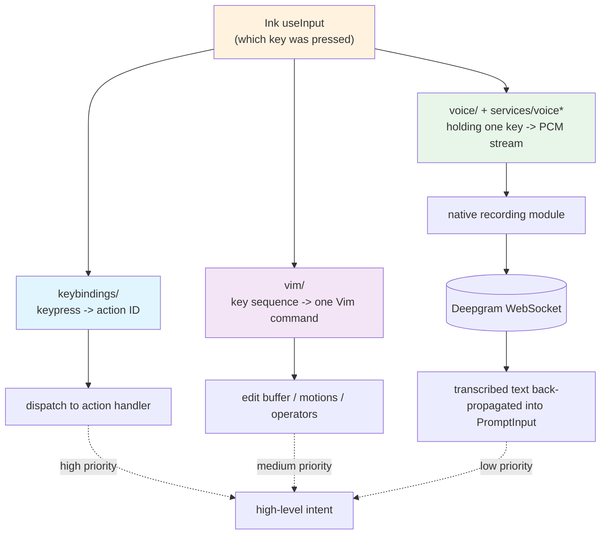

# Chapter 28: Keybindings, Vim Mode, and Voice Input - Three Interpretations at the Terminal Input Layer

> This is chapter 28 of *Deep Dive into Claude Code Source*. We discuss the `keybindings/`, `vim/`, and `voice/` subsystems together because they solve different sides of the same problem: **Ink tells us "which key was pressed"; this layer must answer "what does this keystroke mean?"**

## Why Cover These Three Pieces Together?

When you open a terminal, type `claude`, bring up the REPL, and then press any key, more than one path may be involved behind the scenes. Ink feeds raw key events upward. The upper layer must decide whether to treat that keypress as "the user typed a character into the editor", dispatch it as a "shortcut" to some action, or feed it to the microphone as "I am holding Space to record right now".

The three interpretation modes share the same Ink input stream, while each maintains its own state. That is the "input layer" this chapter unpacks.

Viewed against the book's spine:

- Chapter 26 covered Ink's rendering and component system;
- Chapter 27 covered components and the design system;
- Chapter 28 fills in the glue layer between "raw keypresses" and "high-level intent".

The directories for the three subsystems are separate, but their commonality is clear: they all sit on top of Ink's `useInput`, and they all have to bypass Ink's default "one keypress produces one character" semantics.

```
keybindings/         # 14 files - keypress -> action ID
vim/                 # 5 files  - key sequence -> one complete Vim command
voice/, services/voice*, hooks/useVoice* # holding one key -> a PCM stream
```

This chapter proceeds in three parts: Keybindings first, because it is infrastructure for the other two; then the Vim state machine; finally Voice streaming, one of the few subsystems that leaves the React render loop, bypasses Ink, and talks directly to Node child processes, native modules, and WebSocket connections.

---

## Overview: One Key Stream Interpreted by Three Subsystems



---

## 1. Keybindings: A Priority-Aware Keystroke Resolver

### 1.1 Why Does This Deserve Its Own Subsystem?

If all you need is "press Ctrl+C to exit", two lines of `useInput` checks are enough; you do not need a dedicated subsystem. But Claude Code now faces a different situation:

- **The same key must perform different actions in different contexts.** For example, `escape` means "cancel the just-entered content" in the chat box, "close the panel" when a tool card is open, and "switch back to NORMAL" in Vim INSERT mode.
- **Some keys may be overridden by users, while others must stay hard-coded.** `Ctrl+C` cannot be rebound to "insert image", or users could lock themselves in.
- **Some keys are chords rather than one-shot presses.** You must press `Ctrl+X` and then `Ctrl+E` to trigger the external editor.
- **Cross-platform key names must be normalized.** Option on macOS and Alt on Linux should be treated as the same modifier.
- **Ink has its own odd handling for modifiers.** The classic example is `Esc`, which Ink marks as `meta: true`; the upper layer must erase that illusion.

None of these is large in isolation, but together they require a parsing layer that translates "raw keypress" into "action ID". That is why the `keybindings/` directory exists: it contains 14 ts/tsx files, each solving one of the problems above.

### 1.2 Eighteen Contexts and One Default Binding Table

Open `keybindings/schema.ts`, and the top of the file is a list of 18 context names:

```typescript
// keybindings/schema.ts:12-32
export const KEYBINDING_CONTEXTS = [
  'Global', 'Chat', 'Autocomplete', 'Confirmation', 'Help',
  'Transcript', 'HistorySearch', 'Task', 'ThemePicker', 'Settings',
  'Tabs', 'Attachments', 'Footer', 'MessageSelector', 'DiffDialog',
  'ModelPicker', 'Select', 'Plugin',
] as const
```

Each context is a sub-state that answers "where are you standing right now" in the chat UI: if you are typing text in the chat box, that is `Chat`; if the autocomplete menu is open, that is `Autocomplete`; if a permission confirmation dialog is in front, that is `Confirmation`.

Immediately after that, `KEYBINDING_ACTIONS` enumerates a long list of action identifiers in the same file (`schema.ts:64-172`): from simple ones like `app:exit` / `chat:cancel`, to `chat:cycleMode` / `chat:modelPicker`, and then to `voice:pushToTalk`, `history:search`, and `autocomplete:accept`. Each action ID is a string, paired with zod validation through `KeybindingBlockSchema` / `KeybindingsSchema` (`schema.ts:177-229`).

The zod layer exists for user overrides. JSON from user settings must pass through a schema before entering the system; otherwise, a minor typo can make the REPL throw a runtime error that is hard to trace.

The default binding table lives in `keybindings/defaultBindings.ts`. This file deliberately keeps "what the default key is" and "what action it maps to" in one place, instead of scattering defaults across a dozen `useInput(...)` calls as some projects do. Reading it gives you a quick overview of the key experience Claude Code wants to provide. A few cross-platform details are worth calling out:

```typescript
// keybindings/defaultBindings.ts:15
// Windows terminals consume Ctrl+V clipboard paste, so use alt+v instead.
const IMAGE_PASTE_KEY = getPlatform() === 'windows' ? 'alt+v' : 'ctrl+v'

// keybindings/defaultBindings.ts:21-30
// Older Windows Terminal in non-VT mode consumes modifier-only chords such as shift+tab.
const SUPPORTS_TERMINAL_VT_MODE =
  getPlatform() !== 'windows' ||
  (isRunningWithBun()
    ? satisfies(process.versions.bun, '>=1.2.23')
    : satisfies(process.versions.node, '>=22.17.0 <23.0.0 || >=24.2.0'))
const MODE_CYCLE_KEY = SUPPORTS_TERMINAL_VT_MODE ? 'shift+tab' : 'meta+m'
```

The `Chat` context also binds two undo keys to the same action (`ctrl+_` and `ctrl+shift+-`), because different terminals report the "underscore" key differently. The external editor is a real chord, `ctrl+x ctrl+e`, which requires pressing `Ctrl+X` first and then `Ctrl+E`. The push-to-talk key `space` is bound to `voice:pushToTalk` in the `Chat` context, and it only takes effect when `feature('VOICE_MODE')` is true.

The whole default table is under 100 lines, but it already concentrates the entire CLI key experience into one file. Later, `loadUserBindings.ts` layers user customizations on top of it.

### 1.3 Ink's Key Model and Normalization

This is the trickiest layer, and the one most likely to go wrong in PR review.

Ink calls the key handler with an object for each keypress, containing three boolean bits, `ctrl` / `meta` / `shift`, plus an `input` string. There are two problems.

**Problem one: modifier names are inconsistent.** Ink has no `alt`; it folds Alt into `meta`. At the same time, the real Cmd key on macOS is also folded into `meta`. In other words, when Ink gives you `meta: true`, it may mean "Alt was pressed" or "Cmd was pressed". If this ambiguity leaks into the configuration file as-is, users cannot clearly express what they want to bind.

The `modifiersMatch` function in `keybindings/match.ts:60-79` explicitly collapses that distinction:

```typescript
// keybindings/match.ts:60-79
function modifiersMatch(
  inkMods: InkModifiers,
  target: ParsedKeystroke,
): boolean {
  if (inkMods.ctrl !== target.ctrl) return false
  if (inkMods.shift !== target.shift) return false

  // Alt and meta both map to key.meta in Ink, so merge them for comparison.
  const targetNeedsMeta = target.alt || target.meta
  if (inkMods.meta !== targetNeedsMeta) return false

  // Super (cmd/win) is a distinct modifier and can only be distinguished with the kitty protocol.
  if (inkMods.super !== target.super) return false
  return true
}
```

That means in most scenarios, `alt+v` and `meta+v` are equivalent. This is why `IMAGE_PASTE_KEY` is written as `alt+v` on Windows and `ctrl+v` elsewhere, rather than specially using `meta+v` on macOS.

**Problem two: Ink marks Escape as meta.** Some terminals report the next key after Escape as an Alt-modified key; this is historical baggage from xterm, and Ink inherits it. The observable behavior is that pressing Escape by itself gives you `input: ''` plus `meta: true`, where `meta` is fake. `match.ts` adds a targeted patch for this case:

```typescript
// keybindings/match.ts:96-102
if (key.escape) {
  return modifiersMatch({ ...inkMods, meta: false }, target)
}
```

Clearing that fake meta is necessary; otherwise pressing Escape in Vim INSERT mode would never match the default `escape` binding. The patch is short, but it is a hidden prerequisite for the entire Vim subsystem to work correctly.

### 1.4 Resolution: Single Keystrokes and Chords

`keybindings/resolver.ts` is where the system decides "what action, if any, did this keypress match?" It maintains two paths.

**Single-keystroke resolution.** `resolveKey` receives the active context list and the fully merged binding table, then returns the action this keypress should be dispatched to, or `unbound`:

```typescript
// keybindings/resolver.ts:32-61 (core loop)
const ctxSet = new Set(activeContexts)
let match: ParsedBinding | undefined
for (const binding of bindings) {
  if (binding.chord.length !== 1) continue
  if (!ctxSet.has(binding.context)) continue
  if (matchesBinding(input, key, binding)) match = binding  // last-wins
}
```

The rule is simple: **last-wins**. The active contexts are first converted into a `Set`, then used to filter `bindings`. The filtered ordered array is scanned for exact matches, and the later entry wins.

There is no separate "lookup by context priority" process. `Global` bindings always appear at the beginning of `DEFAULT_BINDINGS`, so if any later, more specific context binds the same key, that concrete binding overrides `Global`.

**Chord resolution.** `resolveKeyWithChordState` is more complex because a chord has an intermediate state: the first key has already been pressed, and the system is waiting for the second. That intermediate state is stored in `pendingChord`.

```typescript
// keybindings/resolver.ts:187-221 (excerpt)
const testChord = pending ? [...pending, currentKeystroke] : [currentKeystroke]
const ctxSet = new Set(activeContexts)
const contextBindings = bindings.filter(b => ctxSet.has(b.context))

// Collect all longer chords prefixed by testChord.
const chordWinners = new Map<string, string | null>()
for (const binding of contextBindings) {
  if (binding.chord.length > testChord.length &&
      chordPrefixMatches(testChord, binding)) {
    chordWinners.set(chordToString(binding.chord), binding.action)
  }
}

// If any non-null longer chord is waiting, return chord_started.
if (hasLongerChords) return { type: 'chord_started', pending: testChord }
```

Why use a `Map` keyed by the chord string? Because if a user null-unbinds a chord at lower priority, the same chord name must no longer cause its prefix to enter the waiting state. The map deduplicates by chord string and preserves the last-wins result, solely so prefix detection respects the user's intent to unbind.

The chord system has no second path that "collects chord winners by context priority". All priority semantics are folded into the same rule: **later entries in the `bindings` array override earlier ones; bindings from higher-priority contexts naturally beat lower-priority ones because of last-wins**.

### 1.5 The `false` Protocol in `useKeybinding`

`keybindings/useKeybinding.ts` is the bridge that connects this resolution layer to React components. Each component registers a mapping from "context + action" to a handler inside its render scope, for example `useKeybinding('chat:send', handler, { context: 'Chat' })`.

Two design points are worth highlighting.

**The first is context stacking.** At any moment, the "active contexts" are not limited to the one declared by the component itself:

```typescript
// keybindings/useKeybinding.ts:54-60
const contextsToCheck: KeybindingContextName[] = [
  ...keybindingContext.activeContexts,
  context,
  'Global',
]
const uniqueContexts = [...new Set(contextsToCheck)]
const result = keybindingContext.resolve(input, key, uniqueContexts)
```

For example, suppose the chat panel contains an `Autocomplete` candidate box. The candidate box registers with `context: 'Autocomplete'`, while the provider's `activeContexts` already contains `'Chat'`. The resulting `uniqueContexts` is `['Chat', 'Autocomplete', 'Global']`.

After this array is passed to `resolver.ts`, it is only used to build a `Set` for filtering bindings. It does **not** mean "find the first match in array order". The actual winner is still decided by the last-wins rule over the `bindings` array itself. Concrete contexts appear after `Global` in `DEFAULT_BINDINGS`, so they naturally beat `Global`.

**The second design point is the handler return value's `false` protocol.**

```typescript
// keybindings/useKeybinding.ts:65-72
case 'match':
  keybindingContext.setPendingChord(null)
  if (result.action === action) {
    if (handler() !== false) {
      event.stopImmediatePropagation()
    }
  }
  break
```

After `useKeybinding` matches the action it registered for, it calls the handler. If the handler returns `false`, the framework does **not** call `event.stopImmediatePropagation()`, and the same Ink input event continues to later registered `useInput` / `useKeybinding` handlers.

Note that the framework does not continue looking for another binding inside `resolve`. `false` controls event propagation, not "keep resolving the next binding". The semantic offered to callers is "I conditionally take over this keypress". For example, a panel may respond to `escape` only when it has content; if it has no content, it returns `false` and lets the lower handler receive `escape`.

### 1.6 Which Keys Cannot Be Rebound?

`keybindings/reservedShortcuts.ts` is short but interesting. It divides "keys users must never be allowed to bind" into three tiers:

| Tier | Keys | Reason |
|------|------|--------|
| `NON_REBINDABLE` | `ctrl+c`, `ctrl+d`, `ctrl+m` | Terminate / EOF / Enter - rebinding these would make the REPL unusable |
| `TERMINAL_RESERVED` | `ctrl+z`, `ctrl+\` | Suspend / quit signal - leave them to the terminal |
| `MACOS_RESERVED` | `cmd+q`, `cmd+w`, `cmd+tab`, and 7 others | macOS consumes them system-wide; the terminal never receives them |

This layer is not about features; it is about "do not give users a chance to lock themselves in." Every user-defined binding must pass through this gate before being written back to disk.

### 1.7 User Customization, Guarded by a Feature Flag

User-defined bindings are loaded in `keybindings/loadUserBindings.ts`. This file is heavier than it may look: it has to read the file, watch for changes, and gate everything behind a feature flag.

The outermost gate is `isKeybindingCustomizationEnabled`, which reads the Statsig feature flag `tengu_keybinding_customization_release`. When this flag is off, custom binding files are not loaded even if users wrote them. That is the standard approach during a new feature ramp.

After the feature gate passes, file loading mixes synchronous and asynchronous work:

- On first startup, `loadKeybindingsSyncWithWarnings` reads once synchronously so the REPL has user bindings from its first frame.
- After that, chokidar starts a watcher for writes to the user's configuration file.
- The watcher has a `FILE_STABILITY_THRESHOLD_MS = 500` debounce; editors often emit multiple write events while saving large files, so the system waits until events stop for 500 ms before reloading.
- On reload, if the custom binding count is greater than 0, telemetry is emitted with a "at most once per day" throttle.

The merged binding table layers user entries on top of defaults with one simple rule: a user binding's `(context, action)` pair overrides the default entry with the same `(context, action)`. Chords are first-class too. Users can rebind a chord or unbind one by mapping it to the special value `null`. The `chordWinners` map explicitly preserves `null` while collecting candidates, which means even if a user "unbinds" a chord in a lower-priority context, the same chord in a higher-priority context will no longer take effect.

---

## 2. Vim: Connecting 11 States into an Editor

### 2.1 Why Vim Deserves Its Own Section

There are two common ways to implement Vim mode in a terminal input box.

One is to add a keymap to a textarea: whichever key is pressed runs the corresponding code. That works for single-character commands like `i` / `a` / `x`, but once you support compound commands with counts, motions, and text objects such as `3dw` / `gg` / `cit`, it turns into a mess.

The other approach is to build an explicit state machine, making "I am halfway through typing a command" a first-class intermediate state, so every keypress is a state transition. Claude Code takes this second path:

```typescript
// vim/types.ts:59-75
export type CommandState =
  | { type: 'idle' }
  | { type: 'count'; digits: string }
  | { type: 'operator'; op: Operator; count: number }
  | { type: 'operatorCount'; op: Operator; count: number; digits: string }
  | { type: 'operatorFind'; op: Operator; count: number; find: FindType }
  | { type: 'operatorTextObj'; op: Operator; count: number; scope: TextObjScope }
  | { type: 'find'; find: FindType; count: number }
  | { type: 'g'; count: number }
  | { type: 'operatorG'; op: Operator; count: number }
  | { type: 'replace'; count: number }
  | { type: 'indent'; dir: '>' | '<'; count: number }
```

The whole Vim subsystem hangs off a simpler outer state variable:

```typescript
// vim/types.ts:49-51
export type VimState =
  | { mode: 'INSERT'; insertedText: string }
  | { mode: 'NORMAL'; command: CommandState }
```

INSERT mode has no state machine; it is ordinary text input. NORMAL mode carries the 11-variant sub-state machine above. Mode switches happen through `Escape` and keys like `i` / `a` / `o`.

The table below maps each of the 11 variants to a minimal input sequence, making it easy to reproduce them while reading:

| # | Variant | Trigger sequence | Meaning |
|---|---------|------------------|---------|
| 1 | `idle` | (initial) | No key has been pressed in NORMAL mode |
| 2 | `count` | `3` | A count prefix has been entered; wait for the next action |
| 3 | `operator` | `d` | An operator has been entered; wait for a motion |
| 4 | `operatorCount` | `d3` | A count is entered after the operator, eventually as in `d3w` |
| 5 | `operatorFind` | `df` | Operator + `f`/`F`/`t`/`T`; wait for the next character, as in `df,` |
| 6 | `operatorTextObj` | `di` | Operator + `i`/`a`; wait for a text object, as in `diw` or `ci"` |
| 7 | `find` | `f` | `f`/`F`/`t`/`T` in NORMAL mode; wait for the target character |
| 8 | `g` | `g` | `g` prefix; wait for the next key, as in `gg` |
| 9 | `operatorG` | `dg` | Operator + `g` prefix, as in `dgg` |
| 10 | `replace` | `r` | `r` prefix; wait for the replacement character |
| 11 | `indent` | `>` or `<` | Indent operator; wait for a motion, as in `>>` or `<j` |

### 2.2 From `idle` to a Complete Command

`vim/transitions.ts` is this state machine's dispatch table. The `transition` function is a switch that dispatches to the matching `fromXxx` function by current state name:

```typescript
// vim/transitions.ts:59-87 (simplified skeleton)
export function transition(state, input, ctx) {
  switch (state.type) {
    case 'idle':            return fromIdle(input, ctx)
    case 'count':           return fromCount(state, input, ctx)
    case 'operator':        return fromOperator(state, input, ctx)
    // operatorCount / operatorFind / operatorTextObj / find /
    // g / operatorG / replace / indent - same-shaped dispatch, 11 cases total
  }
}
```

The file consists of 11 `fromXxx` functions plus two shared handling fragments, `handleNormalInput` and `handleOperatorInput`.

Trace `3dw` as an example:

1. The start state is `idle`. Pressing `3` makes `fromIdle` enter the `/[1-9]/` branch and return `{ type: 'count', digits: '3' }`.
2. The state is now `count`. Pressing `d` makes `fromCount` parse `digits` into `count = 3`, then call the shared `handleNormalInput('d', 3, ctx)`. There, `isOperatorKey('d')` matches and returns `{ next: { type: 'operator', op: 'delete', count: 3 } }`.
3. The state is now `operator`. Pressing `w` makes `fromOperator` call `handleOperatorInput('delete', 3, 'w', ctx)`, where `SIMPLE_MOTIONS.has('w')` matches and returns `{ execute: () => executeOperatorMotion('delete', 'w', 3, ctx) }`.
4. `executeOperatorMotion` (`operators.ts:42-54`) takes the current cursor position, calls `resolveMotion('w', cursor, 3)` to get the target cursor, then calls `getOperatorRange` to get the delete range, and finally calls `applyOperator('delete', from, to, ctx)`. It also records this operation into `RecordedChange` for `.` replay.

`3d3w` adds one extra segment. From the `operator` state, pressing `3` enters the `/[0-9]/` branch and transitions to `operatorCount`, collecting the second count. When `w` is pressed, `fromOperatorCount` multiplies the two counts, `state.count * motionCount`, producing `9`, and then calls `handleOperatorInput('delete', 9, 'w', ctx)`. This matches real Vim semantics: `3d3w` is equivalent to `d9w`, deleting 9 words.

For `di(`, pressing `i` from `operator` matches `isTextObjScopeKey('i')` and enters the `operatorTextObj` sub-state. Pressing `(` then makes `fromOperatorTextObj` find `(` in `TEXT_OBJ_TYPES` and call `executeOperatorTextObj('delete', 'inner', '(', 1, ctx)`, so `findTextObject` finds the surrounding pair of parentheses and deletes the content inside.

For `df,`, pressing `f` from `operator` matches `FIND_KEYS.has('f')` and enters `operatorFind`. Pressing `,` then makes `fromOperatorFind` call `executeOperatorFind('delete', 'f', ',', 1, ctx)`, moving the cursor to the next comma and deleting the range.

Each of the 11 state variants corresponds to a specific "half-typed" intermediate state. But by now the shape should be visible: the fan-out of the state machine is converged inside the two shared fragments, `handleNormalInput` and `handleOperatorInput`. Each concrete `fromXxx` function is short, usually 10 to 30 lines. The whole state table fits into one readable file.

### 2.3 Count Limits and Overflow

Vim allows one-shot operations like `9999dd`, but it must not let users hold down `9` until a string overflows into an astronomical number. `types.ts:182` defines `MAX_VIM_COUNT = 10000`:

```typescript
// vim/transitions.ts:272
const newDigits = state.digits + input
const count = Math.min(parseInt(newDigits, 10), MAX_VIM_COUNT)
```

`fromCount` and `fromOperatorCount` apply this clamp every time they append a new digit. The limit prevents both OOM and a fat-fingered user from freezing the whole REPL by holding a number key.

### 2.4 Dot-Repeat: A Ref Outside the State Machine

In Vim, the `.` command means "repeat the most recent change". The state machine itself is side-effect-free: it only describes "given the current state and next key, where does the state go, and should an action run?" To make `.` work, the code needs an external opening that records the most recent change.

`vim/types.ts:92-119` defines `RecordedChange`, a discriminated union listing all repeatable modification types: `operator` / `operatorFind` / `operatorTextObj` / `x` / `replace` / `toggleCase` / `join` / `indent` / `openLine`, and others. At the end of each concrete operator function, the code calls `ctx.recordChange({ ... })` once to push the just-executed operation into a ref.

When `.` is pressed, `fromIdle` reaches the `'.'` branch through `handleNormalInput` and calls `ctx.onDotRepeat?.()`. The upper-level hook `hooks/useVimInput.ts:109-173` implements `replayLastChange`: it reads the latest `RecordedChange` and dispatches back to the corresponding execute function by type.

Characters typed in INSERT mode are not written into `RecordedChange` one by one. Instead, they are committed as a whole in `switchToNormalMode`: when leaving INSERT, the accumulated `insertedText` is packaged as `{ type: 'insert', text }` (`hooks/useVimInput.ts:61-68`). Later, when `.` replay hits the `'insert'` branch, `replayLastChange` calls `cursor.insert(change.text)` to replay the whole inserted segment. All NORMAL-mode modifications plus this INSERT sequence can be reproduced by `.`.

### 2.5 Does Escape Bypass Keybindings?

If you read through the Vim subsystem, you will notice something odd: `Escape` for switching back to NORMAL is not in Keybindings. It is hard-coded directly in the `useInput` callback in `hooks/useVimInput.ts:189-195`, rather than being registered as `vim:enterNormal` and dispatched by the Keybindings system.

A source comment explains why: Escape must take effect immediately in INSERT mode, and its meaning is "clear all intermediate state and return to a stable baseline" - exactly what users want when they press Escape in a panic. Handling it directly in the hook closest to Ink input, bypassing the key parsing layer, ensures no upper-level registered handler consumes Escape first.

This is a deliberate choice not to unify everything. The Keybindings system is infrastructure, but infrastructure does not have to cover every key indiscriminately. Escape is the authoritative key for INSERT/NORMAL switching; hard-coding it is safer than sending it through a registry.

### 2.6 A Few Small Details

- Arrow keys are mapped to hjkl in NORMAL mode: up/down map to j/k, and left/right map to h/l. `useVimInput.ts:265-268` performs this translation before input enters the state machine.
- Backspace is also mapped to `h` in NORMAL mode, but only when the state machine is waiting for a motion. Otherwise, pressing Backspace at `idle` does nothing, avoiding accidental deletion.
- Double-character whole-line commands such as `dd` / `cc` / `yy` have a dedicated branch in `fromOperator`: if the second key is the same letter as the first operator, the code goes straight to `executeLineOp` without entering the motion flow.
- `gg` / `gj` / `gk` are handled in the `g` state. `5gg`, a counted `g`, takes a separate "jump to line N" path.

Overall, the Vim subsystem's structure is: the state machine decides intent, operator functions decide side effects, and `hooks/useVimInput.ts` connects it to the Ink input stream. The responsibilities are cleanly separated across the three layers.

---

## 3. Voice: From a Held Space Key to Deepgram

### 3.1 What Makes Voice Special

Voice is the least "input-subsystem-like" subsystem in this chapter. Its "input" is a PCM stream recorded from the microphone. Its final output is a text segment returned by the backend STT service, which is inserted into the chat box. The path in between includes:

1. A feature gate, so it can be turned off under control.
2. An authentication gate, allowing only Anthropic OAuth.
3. A recording pipeline, with native / arecord / SoX fallback tiers.
4. A WebSocket streaming path, with heartbeat and finalize protocol.
5. A UI state machine for holding Space, covering short press / long press / cancellation timing.
6. A language normalization layer, covering 20 BCP-47 language codes.

No single segment is complex, but if any segment in the middle fails, "hold Space to speak" fails in the form of "nothing happened". These failures often take an afternoon to reproduce, so every segment has telemetry and fallback paths.

### 3.2 Two Gates: Feature + Authentication

`voice/voiceModeEnabled.ts` is only a few dozen lines, but it is Voice's master switch:

```typescript
// voice/voiceModeEnabled.ts:16-54 (simplified)
export function isVoiceGrowthBookEnabled(): boolean {
  return feature('VOICE_MODE')
    ? !getFeatureValue_CACHED_MAY_BE_STALE('tengu_amber_quartz_disabled', false)
    : false
}
export function hasVoiceAuth(): boolean {
  if (!isAnthropicAuthEnabled()) return false
  return Boolean(getClaudeAIOAuthTokens()?.accessToken)
}
export const isVoiceModeEnabled = () => hasVoiceAuth() && isVoiceGrowthBookEnabled()
```

The first gate is the GrowthBook feature `tengu_amber_quartz_disabled`. Note the word `disabled`: this is an inverted kill switch, where true means "turn Voice off". If Voice has an online incident and needs emergency shutdown, operations can flip this flag to true without shipping a new version.

The second gate checks the authentication type: the current session must use Anthropic OAuth, not an API key, Bedrock, or Vertex. This restriction is not only a business boundary. It is also a privacy boundary: Voice STT uses Deepgram paid through the Anthropic backend, and audio streams are not allowed to go through third-party proxies.

The Keybindings section mentioned that the default `space -> voice:pushToTalk` binding is guarded by `feature('VOICE_MODE')`. That `feature('VOICE_MODE')` ultimately checks the conjunction of these two gates.

The React side wraps this group of checks once more: `hooks/useVoiceEnabled.ts` combines "whether the user enabled voice in settings", "whether authentication is available", and `isVoiceGrowthBookEnabled()` into one boolean exposed to upper-level components. In other words, settings, authentication, and kill switch logic are gathered into one hook so callers do not have to reimplement the same conspiracy everywhere.

### 3.3 Recording Pipeline: Three Fallback Tiers

In `services/voice.ts`, `startRecording` (`voice.ts:335-396`) is the recording entrypoint. It chooses an implementation by platform and dependency availability, in a fixed order:

```typescript
// services/voice.ts:335-396 (simplified skeleton)
export async function startRecording(...): Promise<boolean> {
  const napi = await loadAudioNapi()
  if (napi.isNativeAudioAvailable() && napi.startNativeRecording(...)) return true
  if (process.platform === 'win32') return false  // no fallback on Windows
  if (process.platform === 'linux' && hasCommand('arecord')
      && (await probeArecord()).ok) return startArecordRecording(...)
  return startSoxRecording(...)  // third-tier fallback
}
```

**The first tier is cpal**, a native recording module written in Rust and exposed to Node through N-API. `loadAudioNapi` (`voice.ts:24-36`) performs lazy loading through `dlopen`: it does not load the module at process startup, only when the user first holds Space to start recording. There are two reasons. First, it does not affect REPL cold-start time. Second, if the user never uses Voice, that `.node` file never enters the process address space.

**The second tier is arecord**, Linux's ALSA command-line recorder. But installing arecord does not guarantee it can run; in some container or WSL environments, ALSA is installed but no audio device exists. `probeArecord` (`voice.ts:75-118`) performs a 150 ms race: it starts an arecord child process and waits for either an error/exit or for it to still be alive after 150 ms, which means it can really run, then kills it immediately. The result is memoized and probed only once per process lifetime.

`linuxHasAlsaCards` (`voice.ts:130-139`) is the precondition for arecord. It reads `/proc/asound/cards` directly; if the file only contains `--- no soundcards ---`, the system has no audio device and there is no point running the arecord probe. This is an early-return optimization that avoids the 150 ms probe delay.

**The third tier is SoX's `rec` command**, used as a fallback for macOS / Linux users who have sox installed.

All three tiers normalize output to the same parameters:

```typescript
// services/voice.ts:40-45
const RECORDING_SAMPLE_RATE = 16000   // 16 kHz
const RECORDING_CHANNELS = 1          // mono
// Signed 16-bit Little-Endian PCM
const SILENCE_DURATION_SECS = "2.0"
const SILENCE_THRESHOLD = "3%"
```

Whichever tier wins, downstream code receives the same byte-stream shape. SoX's `rec` supports automatic stop-on-silence parameters: if volume stays below the 3% threshold for 2 consecutive seconds, recording stops automatically. Native cpal uses a different path, where the upper hook layer checks with `FOCUS_SILENCE_TIMEOUT_MS = 5000`.

### 3.4 WebSocket Streaming: Heartbeat + Dual Finalize

`services/voiceStreamSTT.ts` is the segment that streams PCM bytes to the backend STT service.

```typescript
// services/voiceStreamSTT.ts:36-47
const VOICE_STREAM_PATH = '/api/ws/speech_to_text/voice_stream'
const KEEPALIVE_INTERVAL_MS = 8_000

export const FINALIZE_TIMEOUTS_MS = {
  safety: 5_000,
  noData: 1_500,
}
```

The WebSocket uses the `/api/ws/speech_to_text/voice_stream` path. It runs on the Anthropic backend, which proxies to Deepgram. The client goes through Anthropic's backend instead of connecting to Deepgram directly so the third-party API key stays server-side, while Anthropic keeps an authentication, rate-limiting, audit, and billing insertion point for audio requests. After the connection is established, the client starts sending PCM frames and maintains two timers:

- **Heartbeat**: send a ping every 8 seconds so middleboxes do not close the idle connection.
- **Finalize timers**: two timers are involved. `noData: 1500` ms means that if no new PCM arrives for 1.5 seconds, the client proactively sends finalize so the server wraps up and returns the recognition result for the current frame. `safety: 5000` ms means that after the user releases the key, finalize is sent as a 5-second backstop no matter what, preventing edge cases where `noData` never fires and the session hangs. Heartbeat and finalize are independent in the same event loop: heartbeat cares about connection liveness, while finalize cares about the semantic boundary of this "hold - speak - release" round. Splitting them into two timers instead of combining them into one state machine is appropriate because their failure modes are completely different: when heartbeat fails, the connection may still be alive but the network is jittery; when finalize fails, the connection is alive but the user is already waiting for a result.

`FinalizeSource` lists five sources for settlement:

```typescript
// services/voiceStreamSTT.ts:60-65
export type FinalizeSource =
  | 'post_closestream_endpoint'  // normal finish: server returns an endpoint packet after CloseStream
  | 'no_data_timeout'            // zero packets after CloseStream: fallback for silent drops
  | 'safety_timeout'             // 5-second backstop
  | 'ws_close'                   // settled when the WebSocket actively closes
  | 'ws_already_closed'          // connection already closed when finalize is called
```

This union is mainly for telemetry. The backend cares how the session ended, so the client reports one of these five buckets. The fingerprint for silent drops, `no_data_timeout`, gets its own bucket for tracking.

It is worth pausing on the presence of `no_data_timeout`. It is not an exception path; it is one of the normal fallback paths. A clean STT protocol should be "client sends CloseStream -> server returns endpoint -> client receives it and settles", but in a distributed system this handshake can easily drop at the final step: the server might close the stream directly because of an internal timeout without returning a packet, or the endpoint packet might arrive just before the WebSocket close event but lose the race to an earlier close event in Node's event loop. `no_data_timeout` is an explicit "I waited 2 seconds and the server said nothing, so I declare completion locally" path. It downgrades end-to-end uncertainty from protocol failure into a normal billing path. This lesson will reappear in section 5's transferable patterns: **whenever a network protocol's terminal event can be lost, the client must use a local timer to retract it into a state transition it controls**.

The server-side language model is selectable. Deepgram defaults to Nova 2; the rollout introduced Nova 3, controlled by the `tengu_cobalt_frost` feature flag (`voiceStreamSTT.ts:157-165`). The same audio can differ by 5% in recognition accuracy between the two models, but Nova 3 costs more server-side, so it is ramped gradually.

### 3.5 The UI Timing of Holding Space

`hooks/useVoice.ts` is Voice's core React hook. This file is the hardest to read, not because it is complex, but because it handles an interaction that looks simple and is actually subtle: holding Space to speak.

Consider these user behaviors:

1. **A real hold**: the user presses Space, hears the cue, starts speaking, and releases 2 seconds later.
2. **A tap**: the user only wants to insert a space character and releases immediately.
3. **Fast repeats**: the user presses, releases, presses, releases. Are they trying to speak twice, or is it a typo?
4. **Pressed but silent**: the user presses Space and gets distracted for 5 seconds. Is that a cancellation or a technical failure?

To distinguish these cases, `useVoice.ts` maintains several timers:

| Timer | Value | Purpose |
|-------|-------|---------|
| `RELEASE_TIMEOUT_MS` | 200 ms | A press within 200 ms after release is treated as bounce within the same hold |
| `FIRST_PRESS_FALLBACK_MS` | 2000 ms | If no audio arrives 2 seconds after press, treat this press as not having started |
| `REPEAT_FALLBACK_MS` | 600 ms | xterm key auto-repeat reports "holding" as repeated presses; merge repeats within 600 ms into the same hold |
| `FOCUS_SILENCE_TIMEOUT_MS` | 5000 ms | If recording sees 5 seconds of continuous silence, proactively finalize |

Together, these four constants turn the seemingly simple "hold Space" interaction into a relatively robust state machine. Remove any one of them, and users will report either "I pressed it and nothing happened" or "I tapped it and it kept listening".

There is also a UI feedback detail: while recording, the status bar shows a volume level meter. `computeLevel` (`useVoice.ts:185-197`) computes RMS from the latest PCM frame, applies a square root for curve compression, and maps it into `AUDIO_LEVEL_BARS = 16` buckets. The square root makes the perceived scale closer to logarithmic, matching how humans perceive loudness.

### 3.6 Twenty Languages and Fallback to English

Voice supports 20 language base codes (`hooks/useVoice.ts:93-114`, `SUPPORTED_LANGUAGE_CODES`):

```typescript
// hooks/useVoice.ts:93-114
const SUPPORTED_LANGUAGE_CODES = [
  'en', 'es', 'fr', 'ja', 'de', 'pt', 'it', 'ko', 'hi', 'id',
  'ru', 'pl', 'tr', 'nl', 'uk', 'el', 'cs', 'da', 'sv', 'no',
]
```

This layer is a subset of the GrowthBook `speech_to_text_voice_stream_config` allowlist. If the client sends a code outside the allowlist, the server closes the connection directly. Note that this list has **no** regional variants such as `en-US` / `en-GB`, and **no** Chinese such as `zh-CN` / `zh-TW`. Recognition is keyed at the base-code layer.

`normalizeLanguageForSTT` (`useVoice.ts:121-134`) maps the user's system language setting into a code the STT service understands. After lowercase and trim, an exact match is used directly. If the value is not in the allowlist but appears in `LANGUAGE_NAME_TO_CODE`, that mapping is used. Failing that, the code splits on `-` and checks the base substring against the allowlist, for example `en-NZ` -> `en`. If nothing matches, it falls back to `DEFAULT_STT_LANGUAGE` and attaches the original input to `fellBackFrom` so the upper layer can notify the user.

Falling back to English is not arrogance: Deepgram has the highest accuracy on English, and after an English fallback the user can at least tell that "some unrecognized speech happened" instead of getting no feedback at all.

### 3.7 Three Slash Commands Hand Control Back to the User

The user-facing "control panels" for these three subsystems are three same-named slash commands, living in `commands/keybindings/`, `commands/vim/`, and `commands/voice/`:

| Command | File | What it does |
|---------|------|--------------|
| `/keybindings` | `commands/keybindings/keybindings.ts` | Prints the current merged binding table and the user binding file path; provides a reset subcommand to clear user customizations |
| `/vim` | `commands/vim/vim.ts` | Toggles the persisted Vim-mode setting, so the next `useVimInput` startup decides by the new value whether to install the 11-variant state machine |
| `/voice` | `commands/voice/voice.ts` | Toggles `settings.voiceEnabled`, the "user intent" bit in the combined check inside `useVoiceEnabled.ts` |

The three commands themselves are short. The real logic lives in the table, state machine, and combined predicate covered earlier. Slash commands merely expose the thinnest possible "toggle / inspect current state" surface for users to type directly in the REPL.

---

## 4. Putting the Three Pieces Together: Why the "Input Layer" Deserves a Chapter

By this point, a common shape should be clear: **all three subsystems wrap Ink's raw key events in a layer of semantic interpretation**.

| Subsystem | Semantic interpretation | Source of complexity |
|-----------|-------------------------|----------------------|
| Keybindings | Keypress -> action ID | Cross-context stacking, chords, user overrides |
| Vim | Key sequence -> one complete Vim command | "Half-typed" intermediate states in the 11-variant state machine |
| Voice | Duration of holding one key -> an audio stream | Millisecond-level timing, three-tier recording fallback, dual finalize |

Each subsystem decides the semantics of "what does pressing a key mean at this moment?" But all of them first pass through the same Ink input stream. In other words, Ink gives "what key was pressed"; the subsystems in this chapter give "what that means".

Because this semantic interpretation is implemented independently in three places, a few interesting coordination issues arise:

- Voice's `space` binding is registered through Keybindings.
- Vim's Escape deliberately bypasses Keybindings and is written directly in `useVimInput.ts`.
- When the Vim state machine is active, whole batches of keys are swallowed and never enter Keybindings.

These are compromises at subsystem boundaries. Understanding these compromises brings you closer to the real shape of Claude Code's input layer than understanding any single state machine in isolation.

---

## 5. Transferable Design Patterns

The three subsystems in this chapter offer four patterns that other CLI / TUI projects can borrow directly.

### Pattern 1: Context Stacking + Last-Wins Instead of an Explicit Priority Table

Claude Code's keybindings have no "priority number" and no explicit "context priority order" table. All bindings are placed into an array in occurrence order. Active contexts are only used for filtering, and the winner is decided entirely by array order: `Global` comes first, concrete contexts come later, and user customizations come last.

**Applicable scenario**: any configuration system that needs layered overrides, such as "base default + product override + user override". Appending by array order is much more stable than reallocating priority numbers every time a new layer is added.

### Pattern 2: Make "Half-Typed" Input an Explicit First-Class State

The 11 variants of the Vim state machine are essentially intermediate results for "half a command has been typed". Modeling these intermediate states explicitly as first-class states, and using TypeScript discriminated unions to force exhaustive switches, is much clearer than stuffing mutable variables and if-else chains into a keymap function.

**Applicable scenario**: any interaction where one complete user intent is accumulated across multiple keypresses: multi-step command-palette parameters, configuration wizards, Vim-style shortcuts, or form wizards.

### Pattern 3: Inverted Kill Switches + Multiple Fallbacks

Voice uses two "inverted" switches: the GrowthBook emergency shutdown `tengu_amber_quartz_disabled`, and the compile-time gate `feature('VOICE_MODE')`. It also layers a three-tier recording fallback chain (native -> arecord -> SoX) and two finalize timers (`noData` 1.5 s / `safety` 5 s).

**Applicable scenario**: any feature that must be remotely shut down online, depends on native client modules, and depends on an external service. Kill switches let operations stop bleeding without a release; fallback chains prevent the most common failures from becoming "nothing happened".

### Pattern 4: Let Infrastructure Have Local, Deliberate Exceptions

Keybindings is the infrastructure for key dispatch, but Vim's Escape deliberately bypasses it and lives directly in the `useInput` callback. Escape is the authoritative key for INSERT/NORMAL switching; no upper-level handler should be allowed to intercept it.

**Applicable scenario**: when a cross-cutting concern has become infrastructure, leave escape hatches for a few "authoritative paths" instead of chasing 100% uniformity. Infrastructure coverage is not better simply because it is higher.

---

## 6. Hands-On Example: Bind Yourself a Chord in 5 Minutes

The following example demonstrates several mechanisms from this chapter by adding a chord binding for yourself.

**Goal**: bind `ctrl+k ctrl+t` to `app:toggleTodos`, replacing the original single-key `ctrl+t` binding.

**Step 1: Write a custom binding file in user settings**

```jsonc
// ~/.claude/keybindings.json
{
  "$schema": "...",
  "bindings": [
    {
      "context": "Global",
      "bindings": {
        // Unbind the original default with null.
        "ctrl+t": null,
        // Rebind with a chord.
        "ctrl+k ctrl+t": "app:toggleTodos"
      }
    }
  ]
}
```

**Step 2: Understand what will happen**

1. On startup, `loadKeybindingsSyncWithWarnings` synchronously reads this file. The `isKeybindingCustomizationEnabled` gate must be open first; otherwise, the file is ignored.
2. This user binding is appended after the default `DEFAULT_BINDINGS` array.
3. When you press `ctrl+t`, `resolveKey` hits your `null` entry, returns `unbound`, and the event is swallowed. It will **not** be mistakenly dispatched to the old binding.
4. When you press `ctrl+k`, `resolveKeyWithChordState` finds the longer `ctrl+k ctrl+t` chord in `chordWinners`, returns `chord_started`, and sets `pendingChord`.
5. When you press `ctrl+t`, `testChord` becomes `[ctrl+k, ctrl+t]`, the exact match hits, and `app:toggleTodos` fires.

**Step 3: Common pitfalls**

- **Trying to bind `ctrl+c` to another action**: this fails because the `NON_REBINDABLE` gate in `reservedShortcuts.ts` blocks it.
- **Binding to a nonexistent action ID**: zod schema validation fails during load, and the file never enters the merged table.
- **The REPL does not react after saving**: the chokidar watcher has a 500 ms debounce; wait half a second.
- **`ctrl+k ctrl+t` is bound, but the single `ctrl+k` binding can still trigger another action**: this is normal. A single-key binding can coexist with a chord that shares the same prefix; dispatch of the single-key binding is merely delayed until the chord waiting state times out.

---

## Next Chapter

[Chapter 29: Buddy Pet - Keeping a Randomly Generated Little Animal Beside PromptInput](./29-buddy-pet.md)

We will look at the 6 source files under `buddy/`, how they quietly connect to the REPL, PromptInput, configuration, attachments, and the message stream, and how they finally squeeze out a small animal that blinks and speaks in bubbles.

---
*For the full series, follow https://github.com/luyao618/Claude-Code-Source-Study (a free star would be appreciated).*
