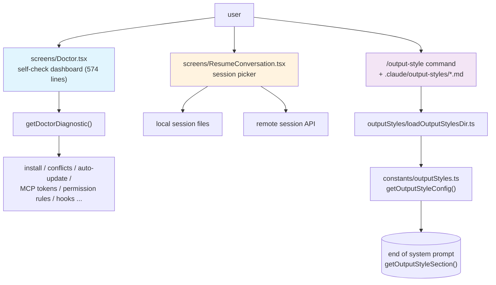

# Chapter 30: The Three `screens/` — Doctor, Output Style, and ResumeConversation

> This chapter is the last entry in the *Deep Dive into Claude Code Source* (源码学习) series devoted to the terminal UI family. Earlier chapters already covered three things in detail: how Ink ports React into the terminal, how the design system converges color and spacing, and how keyboard events are injected into the React tree. This one takes a different angle: when the CLI actually breaks, how does the user see for themselves "where the problem is"; and when the user wants to change the way the model talks, how can a single markdown file replace the model's opening voice?

## Why put these three screens in the same chapter?

The `screens/` directory contains only three files: `REPL.tsx` (the main turn), `ResumeConversation.tsx` (session resume), and `Doctor.tsx` (the self-check screen). The previous thirty-plus chapters have already taken the REPL apart thoroughly, so this chapter aims its lens at the remaining two `screens/` files — `Doctor.tsx` (**the user-facing self-check dashboard**) and `ResumeConversation.tsx` (**the session-resume picker**) — plus the **Output Style wardrobe system** which does not live under `screens/` but is just as user-facing and is driven by a set of markdown files (`outputStyles/loadOutputStylesDir.ts` + `constants/outputStyles.ts`). Together they make up the "three screens" promised in the chapter title.

On the surface they look unrelated: one is a 574-line diagnostic panel (`screens/Doctor.tsx`), one is a session picker (`screens/ResumeConversation.tsx`), and the other is a markdown-driven prompt-injection pipeline (`outputStyles/loadOutputStylesDir.ts` + `constants/outputStyles.ts`). But pulled back, they share a design idea that is rarely highlighted on its own — **exposing the CLI's "soft parameters" as something the user can directly see or directly replace**. Doctor lifts the run-time facts buried deep in the source — "how was I installed, what am I conflicting with, why isn't auto-update working, how many tokens are my MCP tools eating" — onto a single screen; ResumeConversation lays out "which of my previous sessions can I keep chatting with" on a single screen and lets the user pick; Output Style turns "the tail end of the system prompt that talks to the model" into `.claude/output-styles/*.md` files that the user can directly override. All three answer the same question: **as an AI CLI gets more and more complex, how do we let the user understand it and reshape it without reading the source?**

This chapter follows two threads. Section 1 walks the Doctor screen from `getDoctorDiagnostic()` all the way to the React tree, looking at how much a self-check screen actually checks under the hood. Section 2 walks Output Style from the moment a `.md` file is loaded to the moment it gets spliced into the system prompt, looking at which segment a "wardrobe system" actually changes. Section 3 returns to the `screens/` directory itself and fills in the "session picker" path through `ResumeConversation.tsx`, which has not previously appeared in this book. The last two sections extract the engineering patterns from this chapter and give a hands-on example you can copy verbatim.

---

## Overview: the three `screens/` and the `outputStyles` experience entrypoints



---

## 1. The Doctor screen: lay every diagnostic on one screen

### 1.1 The command entrypoint is paper-thin — just a facade

The `/doctor` command entrypoint is surprisingly short. `commands/doctor/index.ts` is only 12 lines:

```typescript
// commands/doctor/index.ts:4-10
const doctor: Command = {
  name: 'doctor',
  description: 'Diagnose and verify your Claude Code installation and settings',
  isEnabled: () => !isEnvTruthy(process.env.DISABLE_DOCTOR_COMMAND),
  type: 'local-jsx',
  load: () => import('./doctor.js'),
}
```

It does only three things: assign a name, read a kill switch (`DISABLE_DOCTOR_COMMAND` can turn it off), and defer the JSX module that does the real work until the first invocation. The `doctor.tsx` next to it is a one-line wrapper that forwards the slash command's `onDone` down to `<Doctor onDone={onDone} />`.

Why is the command layer so thin? Because Doctor is a **whole-screen `screen` driven entirely by a React tree**. It does not flow through the command system's result-display channel; instead it mounts components, runs effects, reads stores, and renders loading states inside its own `<Pane>`. The command module just "opens a door" — the full-screen UI behind that door is held up entirely by `screens/Doctor.tsx`. This is also the shape shared by all three files in `screens/`: the command ignites them, and they take responsibility for their own full-screen render cadence.

### 1.2 Effects before render: four things in parallel

When the `screens/Doctor.tsx` main component first paints, the opening `useEffect` (`Doctor.tsx:164-220`) launches four effects, each bound to a `setState`:

1. **Fire `getDoctorDiagnostic()` once**, drop the result into `diagnostic`, which holds **installation-layer facts** such as "am I npm-global or native? what version am I? do I have a multi-version conflict?".
2. **Compute `agentInfo`**, splicing the existence of `~/.claude/agents/` and project-level `.claude/agents/` together with the `active / all / failedFiles` triple from `agentDefinitions`.
3. **Run `checkContextWarnings()` once** to compute all four classes of warning in one pass: oversized CLAUDE.md, agent descriptions over the token threshold, MCP tools over the token threshold, and shadowed permission rules.
4. **If PID-based locking is enabled, run `cleanupStaleLocks` once and read the current `LockInfo[]`** — these are the native installer's concurrent-version locks, and Doctor sweeps the corpses for you on the way in.

The promise pre-warm in step 1 is worth stopping on. The snippet below is not the original source — it is the **memoization wrapper that React Compiler generates automatically**. `$[2]` is the component's memo cache slot (slot 2), `_temp6` is a callback hoisted to the outer scope and reused across renders, and the semantics of the whole `if` block is "if this slot has not been cached yet, call `getDoctorDiagnostic()` once and store the promise into it." The original author only wrote `const distTagsPromise = useMemo(() => getDoctorDiagnostic().then(handler), [])`, and the compiler expanded it into this explicit-slot form:

```typescript
// Doctor.tsx:124-131 (React Compiler output form)
let t2;
if ($[2] === Symbol.for("react.memo_cache_sentinel")) {
  t2 = getDoctorDiagnostic().then(_temp6);
  $[2] = t2;
}
const distTagsPromise = t2;
```

`_temp6`, the hoisted callback, picks between `getGcsDistTags` (native installs hit GCS) and `getNpmDistTags` (everything else hits the npm registry) based on `diag.installationType`, and on failure falls back to `{ latest: null, stable: null }`. Outside, this promise is wrapped by `<Suspense fallback={null}><DistTagsDisplay promise={distTagsPromise} /></Suspense>` and goes through React 18's `use(promise)` channel. The main screen never blocks on it, but once it lands the two lines "Latest version: ..." / "Stable version: ..." slip into the layout without ceremony. Doctor does a lightweight concurrency split between "the diagnostic body" and "version lookup", and it is one of the most pleasant details in the code.

### 1.3 `getDoctorDiagnostic()`: re-derive "how was I installed"

`utils/doctorDiagnostic.ts` is the file that actually does the work behind the Doctor screen — 625 lines, split into four sections with very clear intent.

**Section one is installation-type recognition** — `getCurrentInstallationType()` (`doctorDiagnostic.ts:86-148`). It asks in order: is this dev mode? is this bundled mode? if bundled, was it installed by some system package manager — Homebrew / Winget / Mise / Asdf / Pacman / Deb / Rpm / Apk, detected one by one? is this npm-local? does the path fall under a known `npm-global` prefix? and finally, fall back to `npm config get prefix`. Whichever branch hits first returns an `InstallationType` enum value immediately. That enum is the first-principles split that every subsequent warning branch keys off of.

**Section two is multi-installation conflict detection** — `detectMultipleInstallations()` (`doctorDiagnostic.ts:205-315`). It walks through `~/.claude/local`, the `bin/claude` and orphaned `lib/node_modules/...` directory under the npm global prefix, and `~/.local/bin/claude` from the native install. The most interesting bit is the **concession to Homebrew double-install**: when the npm-global bin's realpath lands inside `Caskroom/` and the current process really does run from Homebrew, this copy is no longer counted as "another installation" — because it is just two entrypoints into the same Homebrew cask. The diagnostic screen refuses to issue a phantom warning for "looks like multiple installs but really is the same one", and that is a thoughtful engineering restraint.

**Section three is configuration warnings** — `detectConfigurationIssues()` (`doctorDiagnostic.ts:317-485`). This section is for the "installed but unusable" case: native install but `~/.local/bin` is not on PATH, in which case it produces the exact command to edit the right rc file based on the user's shell type; npm-local install but PATH has neither `claude` nor a valid alias; npm-global installed alongside a coexisting local install; npm-global install with no write permission, suggesting the user either reinstall node without sudo or switch to the native installer. The most unusual piece is the validation of `managed-settings.json`'s `strictPluginOnlyCustomization` field at the very top — the managed settings schema uses `.catch(undefined)` to absorb enum values that don't exist yet, but Doctor cannot let the administrator be unaware, so it reads the raw JSON itself, diffs it, and explicitly lists "you wrote N surface names I don't recognize".

**Section four is ripgrep status and the Linux glob warning**. ripgrep in Claude Code comes from three sources: bundled with the binary (bundled), shipped in a sibling vendor directory next to the install (vendor), or found on the system PATH (system path); these three sources map to the three literal values of the `ripgrepStatus` field, which is what the field table below means by "ripgrep tri-state". On Linux the sandbox's glob-pattern support is incomplete, and that gap is translated here into a fix suggestion the user can understand.

After folding these four sections together, the resulting `DiagnosticInfo` object (`doctorDiagnostic.ts:54-71`) is the entire data set the Doctor main screen consumes:

| Field | Meaning | Source |
|---|---|---|
| `installationType` | npm-global / npm-local / native / package-manager / development / unknown | `getCurrentInstallationType` |
| `version` | Version of the current process | Compile-time `MACRO.VERSION` |
| `installationPath` | Where the binary actually sits | `getInstallationPath` |
| `invokedBinary` | How this process was invoked | `process.argv[1]` or `execPath` |
| `configInstallMethod` | Install method recorded in config | `getGlobalConfig().installMethod` |
| `autoUpdates` | enabled, or disabled for some reason | `getAutoUpdaterDisabledReason` |
| `hasUpdatePermissions` | Whether npm-global has write permission | `checkGlobalInstallPermissions` |
| `multipleInstallations` | All other installs detected | `detectMultipleInstallations` |
| `warnings` | Prose-form issue/fix pairs | `detectConfigurationIssues` + Linux glob + residual native-npm |
| `packageManager` | If package-manager install, which one | `getPackageManager` |
| `ripgrepStatus` | ripgrep tri-state | `getRipgrepStatus` |

The Diagnostics block at the top of the Doctor screen (`Doctor.tsx:266-373`) is exactly the translation of those 11 fields into terse, branch-glyph-prefixed lines like `└ Currently running: ...` / `└ Path: ...` / `└ Search: ...`. It deliberately places warnings and recommendations side by side with the basic facts inside the same `Box`, so readers do not mistake warnings for "errors" — in Doctor's vocabulary, a warning means "installed and working, but you should look at this."

### 1.4 Context warnings: CLAUDE.md, agent, MCP, permission rules

Beyond the "install check" the Doctor screen has a second axis: **context-volume health**. This part is supplied by `utils/doctorContextWarnings.ts` — the logic is much shorter, but the intent is clear:

```typescript
// utils/doctorContextWarnings.ts:246-265
export async function checkContextWarnings(...): Promise<ContextWarnings> {
  const [claudeMdWarning, agentWarning, mcpWarning, unreachableRulesWarning] =
    await Promise.all([
      checkClaudeMdFiles(),
      checkAgentDescriptions(agentInfo),
      checkMcpTools(tools, getToolPermissionContext, agentInfo),
      checkUnreachableRules(getToolPermissionContext),
    ])
  return { claudeMdWarning, agentWarning, mcpWarning, unreachableRulesWarning }
}
```

Four checks run in parallel:

1. **Oversized CLAUDE.md**. `getLargeMemoryFiles()` filters memory files larger than `MAX_MEMORY_CHARACTER_COUNT` (40k chars) and lists them in descending size order.
2. **Agent descriptions totaling too much**. `getAgentDescriptionsTotalTokens()` concatenates `${agentType}: ${whenToUse}` for every non-built-in agent and roughly counts tokens; over `AGENT_DESCRIPTIONS_THRESHOLD` it warns and shows the top 5 in descending token order.
3. **MCP tools totaling too much**. `MCP_TOOLS_THRESHOLD` is 25_000; on trigger it groups by server name and shows the top 5. There is also a fallback here — when the real `countMcpToolTokens` cannot get hold of a model it degrades to `roughTokenCountEstimation` over character count.
4. **Unreachable permission rules**. `detectUnreachableRules` checks for the easy-to-write-wrong case where "a specific allow rule is shadowed by a tool-wide ask rule", and lays out the rule text plus a one-line "how to fix it" for each.

Doctor renders each of these four warnings as its own subsection prefixed with `figures.warning` (`Doctor.tsx:464-479`), with the details listed underneath in two levels of indentation. This "lead with a one-line statement, then list the evidence indented underneath" layout shows up in other commands as well; Doctor just pushes it to whole-screen scale.

### 1.5 Who else has been quietly taken over by Doctor

The bottom of the main screen embeds five more components that Doctor does not produce itself:

- `<SandboxDoctorSection />` — the health report from the sandbox subsystem itself;
- `<McpParsingWarnings />` — parse errors accumulated when loading `.mcp.json` and MCP server configs;
- `<KeybindingWarnings />` — duplicates or conflicts in the user's keybindings;
- `Environment Variables` block — checks whether `BASH_MAX_OUTPUT_LENGTH` / `TASK_MAX_OUTPUT_LENGTH` / `CLAUDE_CODE_MAX_OUTPUT_TOKENS` have been set to illegal values or clamped to the upper bound;
- `Version Locks` block — when PID lock is enabled, lists the live version locks and PID status.

The code for these five blocks is scattered across different modules, but they all obey the same implicit contract: **if you are willing to render a Doctor subsection yourself, just hang the component here.** The Doctor screen has therefore evolved from a "check my install" tool into **a subsystem-health bus for the whole CLI** — whoever's state is worth surfacing under `/doctor` just stuffs their component into Doctor.tsx's main `<Pane>`. This contract is not written as an interface, has no lifecycle — it is held together purely by convention.

The last piece is `<PressEnterToContinue />`, paired with `useKeybindings({ "confirm:yes": handleDismiss, "confirm:no": handleDismiss })`. Either confirmation key closes the whole screen via `onDone("Claude Code diagnostics dismissed", { display: "system" })` and pushes a system message back into the REPL stream.

---

## 2. Output Style: hand the tail of the system prompt to the user

### 2.1 Which segment does Output Style actually change?

To talk about the scope of "wardrobe change", you first have to go back to how the system prompt is assembled. `getSystemPrompt` (`constants/prompts.ts:444-577`) does three things in parallel: fetch the skill tool commands, fetch the current output style, fetch env info; then splices them into a multi-section system prompt. Output Style's position is determined by this small function:

```typescript
// constants/prompts.ts:151-157
function getOutputStyleSection(
  outputStyleConfig: OutputStyleConfig | null,
) {
  if (outputStyleConfig === null) return null
  return `# Output Style: ${outputStyleConfig.name}
${outputStyleConfig.prompt}`
}
```

In other words, when `outputStyle` is not the default, an extra `# Output Style: <name>` section is injected into the system prompt followed by its prompt body. At the same time, the intro line at the very top of prompts.ts also switches wording:

```typescript
// constants/prompts.ts:180
You are an interactive agent that helps users ${outputStyleConfig !== null
  ? 'according to your "Output Style" below, which describes how you should respond to user queries.'
  : 'with software engineering tasks.'}
```

That is the real scope of Output Style — **it changes the model's "persona opening" and its "specific reply style", but it does not swap out the tool list, the permission-prompt wording, or the BashTool safety contract.** All of those are unconditionally appended in separate sections of prompts.ts. Output Style is a **style-layer bypass**: it lets the user change "tone of voice" but does not let the user escalate privileges.

`getSimpleIntroSection(outputStyleConfig)` and the `outputStyleConfig === null || outputStyleConfig.keepCodingInstructions === true` branch (`constants/prompts.ts:564-566`) fill in the second detail. The `default` slot is mapped directly to `null` at `constants/outputStyles.ts:42`, so the left half of `=== null` preserves coding instructions; the built-in Explanatory and Learning are not `null`, but at `constants/outputStyles.ts:48` and `:61` respectively they set `keepCodingInstructions: true`, so the right half preserves them; only a user-authored output style that does not flip this switch will have the coding instructions removed wholesale. The cut here is very deliberate — by default, switching styles will not lose Claude Code's hard constraints as a coding agent.

### 2.2 Built-in Explanatory and Learning: write the prompt as code

The top of `constants/outputStyles.ts` maintains an `OUTPUT_STYLE_CONFIG` with three built-in shapes:

- `default`: value is `null`, meaning no extra prompt section is injected;
- `Explanatory` (`keepCodingInstructions: true`): appends `EXPLANATORY_FEATURE_PROMPT` to the end of the prompt, instructing Claude to insert teaching paragraphs framed by `★ Insight` boxes before and after writing code;
- `Learning` (`keepCodingInstructions: true`): appends a long passage of "invite the human to write 2-10 key lines of code" protocol, and requires Claude to drop a `TODO(human)` marker in the code before asking for the human's contribution.

Both built-in styles write the prompt as multi-line strings concatenated with `figures.bullet` / `figures.star` and import directly into `OUTPUT_STYLE_CONFIG`. This means the built-in output styles are locked in at TypeScript compile time — no extra disk or network access at run time.

### 2.3 User / project-level Output Style: grow a `.md` into a prompt

`outputStyles/loadOutputStylesDir.ts` is the entrypoint for user / project-level Output Styles — 98 lines, all built around a `memoize`d async function `getOutputStyleDirStyles(cwd)`. What it does breaks into three steps.

**Step one is finding the files**. `loadMarkdownFilesForSubdir('output-styles', cwd)` walks up the standard Claude config search order looking for `.claude/output-styles/*.md`: managed dir → user `~/.claude/output-styles` → project `.claude/output-styles`. This mechanism is the generic infrastructure already written for agents and commands by `markdownConfigLoader`; Output Style is just one more caller.

**Step two is parsing a single file**. The block at `loadOutputStylesDir.ts:35-78` splits each markdown into frontmatter + content:

```typescript
const fileName = basename(filePath)
const styleName = fileName.replace(/\.md$/, '')
const name = (frontmatter['name'] || styleName) as string
const description =
  coerceDescriptionToString(frontmatter['description'], styleName) ??
  extractDescriptionFromMarkdown(content, `Custom ${styleName} output style`)
const keepCodingInstructionsRaw = frontmatter['keep-coding-instructions']
const keepCodingInstructions =
  keepCodingInstructionsRaw === true || keepCodingInstructionsRaw === 'true'
    ? true
    : keepCodingInstructionsRaw === false || keepCodingInstructionsRaw === 'false'
      ? false
      : undefined
```

The filename without `.md` is the default style name, and the frontmatter may override it explicitly; the description can either be written in the frontmatter or extracted by the loader from the body — pushing the human-friendliness of markdown to its limit. A typical boolean field like `keep-coding-instructions` accepts both `true` / `'true'` / `false` / `'false'`, so users writing YAML by hand don't get blocked by strict typing.

**Step three is the stance on `force-for-plugin`**. There is a very careful judgment hidden here:

```typescript
// loadOutputStylesDir.ts:65-70
if (frontmatter['force-for-plugin'] !== undefined) {
  logForDebugging(
    `Output style "${name}" has force-for-plugin set, but this option only applies to plugin output styles. Ignoring.`,
    { level: 'warn' },
  )
}
```

`force-for-plugin` only takes effect for plugin-sourced output styles and is read by `loadPluginOutputStyles` on the other side. A `.md` written by the user, even if it sets this flag, gets ignored. Output Style refuses to grant user-level markdown the "force override" capability that only plugins should have — that is its restraint at the capability-tier boundary.

### 2.4 Priority merge: built-ins at the bottom, policy at the top

`constants/outputStyles.ts:137-175` is the merger. It layers output styles from every source from lowest to highest priority:

```typescript
// priority: built-in → plugin → user → project → managed (policy)
const styleGroups = [pluginStyles, userStyles, projectStyles, managedStyles]
for (const styles of styleGroups) {
  for (const style of styles) {
    allStyles[style.name] = { ... }
  }
}
```

The merge order is **later writes override earlier**: the built-ins lay down just the three entries (default / Explanatory / Learning); plugin then overlays one layer; user-level `~/.claude/output-styles/*.md` overlays the next; project-level `.claude/output-styles/*.md` after that; and finally the `policySettings` source written by enterprise managed settings has the highest priority. This block copies the priority semantics of the settings system directly, keeping output style and the configuration system aligned on "who can override whom".

The logic for choosing the one that actually takes effect is in `getOutputStyleConfig()` (`constants/outputStyles.ts:181-211`). It first sweeps every plugin source for styles with `forceForPlugin === true` — as soon as it finds the first one, it returns immediately, with a console debug log notifying the user; if multiple are force-flagged, the first wins and the rest are logged as ignored. Without a forced one, it falls back to the `outputStyle` field in settings (defaulting to `default`).

Two design choices in this priority chain are worth pausing on:

1. **The plugin's force-override is a "startup-time hard decision", but the debug log lets you see it.** It does not silently take over — it writes to the debug channel. Combined with the Doctor screen or panels like `/status`, you can reverse-engineer "which output style am I actually running right now".
2. **Enterprise managed settings hold the highest weight on output style.** This is consistent with the seven-tier settings model discussed elsewhere in this book — at enterprise deployment, a single `managed-settings.json` can pin the output style and not be overridden at the user level.

### 2.5 Why `/output-style` is now hidden

The last detail often puzzles people: in `commands/output-style/index.ts`, the command itself looks like this:

```typescript
// commands/output-style/index.ts:3-9
const outputStyle = {
  type: 'local-jsx',
  name: 'output-style',
  description: 'Deprecated: use /config to change output style',
  isHidden: true,
  load: () => import('./output-style.js'),
} satisfies Command
```

The `output-style.tsx` it actually loads has only six effective lines: it pops up "/output-style has been deprecated. Use /config to change your output style, or set it in your settings file. Changes take effect on the next session." — that's it.

This is a "kept for compatibility" placeholder on the evolution path of Output Style — in earlier versions `/output-style` was a real interactive selector, but style selection has since been folded into the unified `/config` screen. The command itself was not removed, because there are still users and scripts that type `/output-style`; deleting it would show them "unknown command", while keeping it lets us give an explicit migration pointer. `isHidden: true` keeps it out of `/help` and command autocomplete, but typing the exact name still hits it — this is Claude Code's uniform way of handling "feature relocations".

---

## 3. ResumeConversation: another easily overlooked screen

There are only three files under `screens/`. Doctor is taken apart, and the REPL has appeared repeatedly in Chapter 5 and Chapter 21. The remaining `ResumeConversation.tsx` has not had a dedicated treatment in this book before, but it is the only full-screen UI a user sees every time they run `claude --resume`, so this section fills it in.

### 3.1 What problem does it solve?

`claude --resume` lets you pick a previous session to continue. It looks like a file picker, but the real difficulty is in three places:

1. **Session storage is "bucketed by worktree"**. The current cwd, the current git worktree, other worktrees of the same repo, all projects across the whole machine — these are four different scopes. By default the UI only lists the "same-repo worktree" bucket first, letting the user expand on demand.
2. **Session logs have to be loaded progressively**. A long-time user may have thousands of logs on their machine; parsing them all eagerly would freeze startup.
3. **The selected session may not be resumable in place**. If the chosen session belongs to a different repo, the user has to jump into that directory before resuming — you cannot just keep another project's conversation going in the current directory.

`ResumeConversation` has to take care of all three in one screen.

### 3.2 Load pipeline: a little first, more later

The first thing the main component does on mount is call `loadSameRepoMessageLogsProgressive(worktreePaths)` (`ResumeConversation.tsx:126-136`). The `Progressive` suffix says the returned `result` carries two things: a batch of `logs` already parsed and ready to render, and an `allStatLogs` plus next-step cursor `nextIndex` for "not yet parsed but known to exist".

The `loadMoreLogs(count)` callback (`ResumeConversation.tsx:137-155`) is prepared for subsequent loads:

```typescript
void enrichLogs(ref.allStatLogs, ref.nextIndex, count).then(result_1 => {
  ref.nextIndex = result_1.nextIndex;
  if (result_1.logs.length > 0) {
    const offset = logCountRef.current;
    result_1.logs.forEach((log, i) => { log.value = offset + i; });
    setLogs(prev => prev.concat(result_1.logs));
    logCountRef.current += result_1.logs.length;
  } else if (ref.nextIndex < ref.allStatLogs.length) {
    loadMoreLogs(count);
  }
});
```

Two details are worth seeing. **First**, the `log.value` numbering of new entries is based on `logCountRef.current`, not on `logs.length`. This is because the callback handed to React's `setLogs` must keep pure-function semantics — it cannot read an external snapshot like `logs.length` while updating. `logCountRef` is a shadow that accumulates in step with `setLogs` — it splits "purity of a React state update" from "needing to compute an offset for business logic". **Second**, when an enriched batch comes back with zero entries after filtering, it automatically goes on to fetch the next batch — this prevents hidden (sidechain) logs from leaving the user stuck on a "loaded more, but nothing showed up" pseudo-deadlock.

### 3.3 After selection: switch session first, then render REPL

`onSelect(log)` is the part that does the real work. It first does a `checkCrossProjectResume` (`ResumeConversation.tsx:181-189`): if the user picked a session from a different repo and not from another worktree of the same repo, it copies "the command you should type" to the clipboard, switches to `<CrossProjectMessage>` saying "please go to that directory and run this command", and refuses to resume in place.

If it is a worktree of the same repo, it goes through `loadConversationForResume` to actually read out the message stream, then runs a chain of state transitions (`ResumeConversation.tsx:220-250`):

1. `switchSession(asSessionId(result.sessionId), ...)` — switch the global sessionId in `bootstrap/state.ts` to the picked session.
2. `renameRecordingForSession()` — rename the asciinema-style recording file too.
3. `resetSessionFilePointer()` — reset the sessionStorage write pointer to zero, so subsequent writes land in that session's log.
4. `restoreCostStateForSession(...)` — switch the "cost accumulator" to the historical value of that session as well, so `/cost` does not error.

Next, `restoreAgentFromSession(...)` restores the agent that was running on the main thread at the time; if `COORDINATOR_MODE` is on, it also reads a "mode mismatch" warning from `coordinatorMode.ts` and injects it at the head of the message stream, then re-fetches the agentDefinitions. Finally it puts `resumeData` into state — this render frame switches from `<LogSelector>` to `<REPL initialMessages={resumeData.messages} ... />`, and REPL takes over the screen. `ResumeConversation` retires gracefully from here on.

### 3.4 The `screen` contract it shares with Doctor

`ResumeConversation` and `Doctor` share no code in the source tree, but they embody the same writing convention at the `screen` layer:

- Each `screen` is a React component that **takes over the entire screen**, not one that reuses the REPL conversation container;
- The effects that bring this screen up are concentrated in `useEffect` / `useCallback` and never placed at module top level;
- There are only two ways to leave the screen: either `onDone(...)` back into the slash command, or `return <REPL ... />` to let the next screen take over;
- The file does not exceed a thousand lines, with "screen-level UI" and "business logic" cleanly split between `screens/` and `utils/`.

The three blocks under `screens/` together come in under six thousand lines, and they accommodate every "non-conversation screen" a CLI of Claude Code's scale needs — the REPL's 5005 lines are a separate matter, since the REPL is essentially the core of the whole book.

---

## 4. Patterns you can carry away

Doctor and Output Style each run their own show, but pulled back, they contribute the same set of engineering patterns you can lift straight out of Claude Code.

### Pattern 1: make the command a "facade", put the whole-screen UI in `screens/`

The slash command module is responsible only for "opening the door" — a `Command` object plus a lazy `load`. All code related to the full-screen UI moves into a dedicated `screens/<Name>.tsx`. This has two benefits: the command system never needs to perceive the complexity of the React tree; and the same `screen` block can be reused by multiple commands, key bindings, even external triggers.

**Applicable scenarios**: any CLI / TUI tool — whenever a command needs to take over the screen instead of just printing a line of text, this facade is worth using.

### Pattern 2: make the self-check screen a "subsystem health bus"

`Doctor.tsx` does not hard-code which blocks it displays — it allows any subsystem to hang in a component (`<SandboxDoctorSection />`, `<McpParsingWarnings />`, `<KeybindingWarnings />`, ...). This contract is not written as an interface and is held together purely by convention, but it brings the cost of "I want to display a health line under /doctor" down to "write a React component, import it into Doctor.tsx" — two lines of code.

**Applicable scenarios**: any complex application — as long as you already have a "user-facing health panel" like `/doctor` or `/status`, you can turn it into a bus and let new modules board it at zero cost.

### Pattern 3: use concurrent pre-warm + Suspense to fold "non-critical info" into the layout

The "latest version lookup" on the Doctor screen is a network call to the npm registry, and you cannot let it block the first paint. Doctor's approach: `memoize` a `distTagsPromise` at a React-Compiler-friendly location, hand it to `<Suspense fallback={null}><DistTagsDisplay promise={...} /></Suspense>`, and `use(promise)` unwraps it into the layout once it lands. This pattern fully decouples "the main screen is immediately viewable" from "additional info fills in in arrival order".

**Applicable scenarios**: any first-paint page that has "main info plus optional info from a remote".

### Pattern 4: user config goes through markdown + frontmatter; capability is tiered by source

Output Style does not ask users to write JSON — it uses `.md` + frontmatter. The frontmatter provides structured fields (`name` / `description` / `keep-coding-instructions`), and the body is the prompt itself. This format allows complex multi-line content (prompts are often hundreds of lines) without forcing users to memorize a schema.

More importantly, **capability tiering**: the same markdown written into the user-level directory vs the plugin directory vs the enterprise managed dir is allowed to do different things — `force-for-plugin` only takes effect for plugins, and managed settings have the highest priority. This pattern makes "delegating to users" and "keeping a bottom line" co-exist.

**Applicable scenarios**: any product where "users can supply custom prompts / templates / rules" — markdown is friendlier than JSON; any configuration that allows overrides from multiple sources can adopt this "source-as-permission" tiering.

### Pattern 5: keep deprecated commands as a "migration pointer"

`/output-style` no longer does anything but was not deleted — it just sets `isHidden: true` and prints a line of deprecation copy. This is a small, thoughtful gesture: deleting a command makes historical scripts and muscle memory error out instantly, while keeping it + the copy gently redirects users to the new entry.

**Applicable scenarios**: any product with a CLI / slash-command system that needs to relocate a feature.

---

## 5. Hands-on example: add a `/doctor`-style self-check screen to a CLI

Strung together, these patterns drop directly onto any Ink application. Below is a minimal skeleton — in only 80 lines it wires up "facade command + bus-style self-check screen + concurrent pre-warm".

**Step 1: command facade**

```typescript
// commands/checkup/index.ts
import type { Command } from '../../commands.js'

const checkup: Command = {
  name: 'checkup',
  description: 'Check the health of your installation',
  type: 'local-jsx',
  load: () => import('./checkup.js'),
}
export default checkup
```

**Step 2: whole-screen `screen`, open mount points**

```tsx
// screens/Checkup.tsx
import React, { Suspense, useEffect, useState } from 'react'
import { Box, Text } from 'ink'
import { runDiagnostic, fetchLatestVersion } from '../utils/checkup.js'
import { NetworkSection } from '../components/checkup/NetworkSection.js'
import { CacheSection } from '../components/checkup/CacheSection.js'

const versionPromise = fetchLatestVersion()  // concurrent pre-warm

function LatestVersion({ promise }: { promise: Promise<string> }) {
  const v = React.use(promise)
  return <Text>└ Latest version: {v}</Text>
}

export function Checkup({ onDone }: { onDone: () => void }) {
  const [diag, setDiag] = useState<null | Awaited<ReturnType<typeof runDiagnostic>>>(null)
  useEffect(() => { runDiagnostic().then(setDiag) }, [])

  return (
    <Box flexDirection="column">
      <Text>Diagnostics</Text>
      {diag ? <Text>└ Running: v{diag.version} ({diag.installType})</Text>
            : <Text dimColor>Loading…</Text>}
      <Suspense fallback={null}>
        <LatestVersion promise={versionPromise} />
      </Suspense>

      {/* Subsystem mount points: to add a health line, just add a component */}
      <NetworkSection />
      <CacheSection />

      <Text dimColor>Press enter to dismiss</Text>
    </Box>
  )
}
```

**Step 3: a third party adds a block**

A new module wants its status surfaced under `/checkup`? No need to touch `Checkup.tsx` — write a React component, import it, drop it inside the `<Box>`. This implicit contract is identical to the Doctor screen.

```tsx
// components/checkup/PluginsSection.tsx
export function PluginsSection() {
  // read the plugin store, render its own warning / fix
  return <Box>…</Box>
}
```

Just add it to the `<Box>` in `Checkup.tsx`. The subsystem author does not need to know the implementation of Diagnostics, and Diagnostics does not need to change a single line for the new module.

That is the core value of the Doctor screen — it does not solve problems; it gathers every subsystem's problems and lays them out for the user, and it **stays open** to whatever subsystems get added in the future. Output Style pushes the same idea in the other direction: it does not solve "what style the user wants" — it hands the definition of style to the user and stays restrained about abuse.

---

---

## Next chapter

[Chapter 31: Memory subsystem overview — the multi-layer architecture of AI memory](./31-memory-subsystem-overview.md)

We enter Part 8, "Memory, Extensions, and Summary", starting from the 8 files under memdir/ and `services/{SessionMemory, extractMemories, teamMemorySync}/`, and redraw the Memory system along four dimensions: session-level / project-level / team-level / long-term.

---
*Full content at https://github.com/luyao618/Claude-Code-Source-Study (a free star is welcome)*
