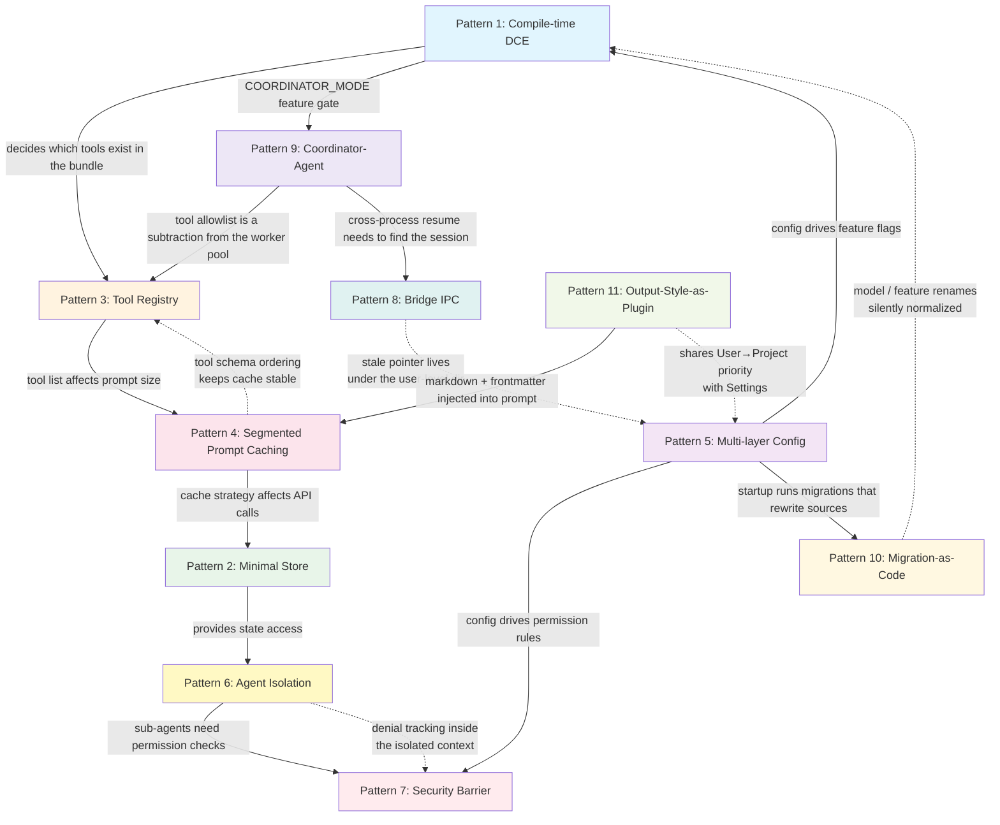

# Chapter 34: Architecture Patterns Summary — Design Patterns You Can Port to Your Own Project

> This is the closing chapter of *Deep Dive into Claude Code Source*. We distill 11 reusable architecture patterns from the source-code study (源码学习) of the previous 33 chapters. Each pattern is grounded in real Claude Code code, paired with the situations where it fits, and accompanied by the key points you need to keep in mind when porting it.

## Why this summary?

Over the past 33 chapters we have dissected every subsystem of Claude Code one by one — from the startup pipeline to the conversation main loop (对话主循环), from the tool system to the security barrier, from Prompt Cache to the MCP protocol, and on to Bridge IPC, Coordinator, Migration, and Output Style. Every chapter focused on the question "**how is this module designed**".

But the ultimate reason engineers read source is not to understand someone else's code; it is to **apply the good designs to their own projects**.

This chapter flips the perspective. Instead of dwelling on Claude Code's domain logic, we extract the **architecture patterns that travel across projects**. These 11 patterns span the full stack of design decisions — from compile-time optimization to runtime state management, from tool registration to security barriers, from cross-process bridging to configuration evolution.

> **Chapter primer**: This chapter is not organized module by module. Instead, it pulls out 11 design patterns that recurred across the previous 33 chapters. Patterns 1–3 are "compile-time and runtime infrastructure" (DCE / Store / tool registry); patterns 4–5 are "merge strategies for prompts and configuration"; patterns 6–7 are "agent isolation and the security barrier"; patterns 8–9 are "cross-process and multi-agent collaboration"; patterns 10–11 are "evolution and extension points". The final section gives a dependency graph that ties the 11 patterns together.

## Looking back: from the moment you typed `claude` to the end of this book

Before extracting the 11 patterns, let us retrace the entire pipeline of the last 33 chapters in a single paragraph — this is also the intrinsic motivation for organizing the book along the runtime lifecycle.

You type `claude` (chapters 1–2: entrypoint forms (入口形态) and startup pipeline (启动链路)), and the CLI completes its cold start in milliseconds. It reads seven layers of settings (chapters 3–4: configuration system and migration), and consolidates model preferences, permission rules, and CLAUDE.md memory into a runtime configuration. The REPL comes up; `QueryEngine` and the `query()` main loop start spinning (chapter 5); the System Prompt is assembled in cache-safe segments, with Output Style taking the tail end so it can be customized by you (chapter 6); the context compaction (上下文压缩) family schedules along six different pipelines invisibly behind the scenes (chapters 7–8); the `thinking` and `effort` dials tune reasoning depth to the right notch (chapter 9).

You hit Enter and speak. The model picks one tool out of a big pile: maybe `BashTool` runs a command (chapters 10–11), maybe `FileEdit` patches a file (chapter 12), maybe `WebFetch` grabs a fact (chapter 13); or the model realizes the task is bigger than that and spawns a sub-agent to work in parallel (chapters 14–15). The whole concurrent task set is uniformly managed by the `TaskType` lineage (谱系) (chapter 16), and may even keep going on its own after you leave, driven by Coordinator + Cron (chapter 17).

Every tool call passes through a permission decision chain — external tools registered through MCP go through the same Tool protocol (chapter 18); rule matching and the AI Classifier back each other up (chapter 19); 27 Hook event points let you inject custom logic (chapter 20). Users can flip the architecture around with the three extension points Skill / Plugin / Output Style (chapter 21). The same source is split at compile time by feature flags into an internal product and an external product (chapter 22).

The network layer shoulders the API requests through unreliable intermediaries (chapter 23), Bridge IPC exposes the local CLI to phones and browsers (chapter 24), and DirectConnect wires it to enterprise upstream proxies (chapter 25). On the terminal UI side, a forked Ink moves React into a black-and-white text terminal (chapter 26); the design system, Vim, Voice, Buddy, Doctor, and Output Style each manage a piece of the "make the CLI not feel like a CLI" experience (chapters 27–30). The last mile is the memory and command systems (chapters 31–32), and the state management and cross-process bridge (跨进程桥) that pin all those subsystems together (chapter 33).

Across the 33 chapters, you have walked the entire pipeline of a production-grade AI Agent product, from cold start to output to persistent memory. What this chapter does is extract the engineering trade-offs that kept recurring along the way — so that next time you build your own AI product, you can pull out the portable parts directly.

---

## Pattern 1: Compile-time DCE — One Codebase, Many Builds

### The problem

Your product needs to build multiple variants out of the same codebase — internal vs. external, free vs. paid, or customer-specific editions. The traditional approaches are either maintaining several branches (which leads to merge nightmares) or `if/else` checks at runtime (which forces every build to carry every variant's code).

### How Claude Code solves it

The trick is to use the Bun bundler's `feature()` function for compile-time Dead Code Elimination (DCE). The key technique is pairing `feature()` with `require()` rather than a static `import`:

```typescript
// tools.ts:25-28
import { feature } from 'bun:bundle'

const SleepTool =
  feature('PROACTIVE') || feature('KAIROS')
    ? require('./tools/SleepTool/SleepTool.js').SleepTool
    : null
```

At build time, `feature('PROACTIVE')` is replaced with either `true` or `false`. When it resolves to `false`, the bundler deletes the entire `require()` branch and the module tree that it depended on. This delivers **zero-cost feature gating** — the bundle for the external build contains literally no code for internal features.

The second dimension is `process.env.USER_TYPE`, which is replaced at build time with a string constant via `--define`:

```typescript
// tools.ts:16-19
const REPLTool =
  process.env.USER_TYPE === 'ant'
    ? require('./tools/REPLTool/REPLTool.js').REPLTool
    : null
```

The two layers of flags play different roles: `feature()` is the **feature-level** gate (covering dozens of feature areas), while `USER_TYPE` is the **identity-level** gate. Together they form a compile-time "feature matrix".

### Constraints you must respect

This pattern has an easily-overlooked critical constraint: **you cannot use a top-level static `import`**:

```typescript
// ❌ Wrong: a static import is unconditionally loaded by the module system; DCE cannot kick in
import { SleepTool } from './tools/SleepTool/SleepTool.js'

// ✅ Correct: require() is a runtime call; combined with constant folding, the bundler can drop it
const SleepTool = feature('PROACTIVE')
  ? require('./tools/SleepTool/SleepTool.js').SleepTool
  : null
```

At the same time, to keep TypeScript's type safety, use the `as typeof import(...)` pattern:

```typescript
// tools.ts:63-65
const getTeamCreateTool = () =>
  require('./tools/TeamCreateTool/TeamCreateTool.js')
    .TeamCreateTool as typeof import('./tools/TeamCreateTool/TeamCreateTool.js').TeamCreateTool
```

Another constraint comes from `QueryConfig` (`query/config.ts:12-14`) — it deliberately excludes `feature()` gates and only contains runtime gates:

```typescript
// query/config.ts:8-14
// Intentionally excludes feature() gates — those are tree-shaking boundaries
// and must stay inline at the guarded blocks for dead-code elimination.
export type QueryConfig = {
  sessionId: SessionId
  gates: {
    streamingToolExecution: boolean
    // ...
  }
}
```

If you hoist a `feature()` value into a configuration object, the bundler can no longer perform constant folding at the call site, and DCE breaks down.

### Porting notes

- **When it fits**: when you need to build multiple product variants from one codebase (SaaS multi-tenant, internal/external editions, platform-specific differentiation).
- **Prerequisite**: a bundler that supports compile-time constant substitution (Bun, esbuild `--define`, webpack `DefinePlugin`).
- **Core principle**: the flag must be inlined at the call site, never lifted into a variable; pair it with `require()` rather than `import`.

---

## Pattern 2: Minimal Store — 35 Lines Bridging React and Non-React

### The problem

In hybrid architectures (React for the UI, plain logic for the core), state management is a classic pain point. Redux/Zustand are too heavy; React Context binds the non-React side to the framework.

### How Claude Code solves it

The whole state-management core is just 35 lines (`state/store.ts`):

```typescript
// state/store.ts (full source)
type Listener = () => void
type OnChange<T> = (args: { newState: T; oldState: T }) => void

export type Store<T> = {
  getState: () => T
  setState: (updater: (prev: T) => T) => void
  subscribe: (listener: Listener) => () => void
}

export function createStore<T>(
  initialState: T,
  onChange?: OnChange<T>,
): Store<T> {
  let state = initialState
  const listeners = new Set<Listener>()

  return {
    getState: () => state,
    setState: (updater: (prev: T) => T) => {
      const prev = state
      const next = updater(prev)
      if (Object.is(next, prev)) return  // equality check, avoid spurious updates
      state = next
      onChange?.({ newState: next, oldState: prev })
      for (const listener of listeners) listener()
    },
    subscribe: (listener: Listener) => {
      listeners.add(listener)
      return () => listeners.delete(listener)
    },
  }
}
```

What makes this Store elegant:

1. **Zero dependencies**: it depends on no framework — not React, nothing. Pure TypeScript.
2. **`Object.is` equality check**: matches React's behavior exactly, avoiding spurious renders.
3. **`onChange` callback**: a single place for centralized side effects (permission sync, model persistence, cache invalidation, etc.).
4. **`subscribe` returns an unsubscribe function**: matches the interface contract of `useSyncExternalStore` exactly.

Bridging into React takes just one `useSyncExternalStore` call:

```typescript
// state/AppState.tsx:27,57
export const AppStoreContext = React.createContext<AppStateStore | null>(null)

// In the Provider, create a Store instance
const [store] = useState(() =>
  createStore(initialState ?? getDefaultAppState(), onChangeAppState)
)
```

React components grab the Store instance via Context and subscribe with `useSyncExternalStore`. Non-React code (such as `query.ts` and the tool-execution logic) calls `store.getState()` / `store.setState()` directly. **Both worlds share the same source of state, but neither is coupled to the other**.

### Porting notes

- **When it fits**: React + non-React hybrid architectures (CLI, Electron, SSR); cases where pure logic layers need to read or write UI state.
- **Core technique**: the Store interface is naturally compatible with `useSyncExternalStore` — `getState` + `subscribe` is exactly the external-store protocol React 18 expects.
- **Extension direction**: use the `onChange` callback to implement middleware patterns (logging, persistence, sync).

---

## Pattern 3: Tool Registry — Single Source + Three-Layer Conditional Registration

### The problem

When your system needs to manage 40+ pluggable modules (tools, plugins, handlers), how do you keep the registration logic centralized while supporting conditional filtering at compile time, load time, and runtime?

### How Claude Code solves it

Tool registration follows the "**single source + three-layer funnel**" pattern. All tools are registered in `getAllBaseTools()` in `tools.ts` — the only registration entry point:

```typescript
// tools.ts:193-251
export function getAllBaseTools(): Tools {
  return [
    AgentTool,                    // static import: always included
    BashTool,
    FileReadTool,
    // ...

    // Layer 1: compile-time DCE (feature flag)
    ...(SleepTool ? [SleepTool] : []),              // feature('PROACTIVE')
    ...(WebBrowserTool ? [WebBrowserTool] : []),     // feature('WEB_BROWSER_TOOL')

    // Layer 2: module-load time (environment variable)
    ...(process.env.USER_TYPE === 'ant' ? [ConfigTool] : []),
    ...(isEnvTruthy(process.env.ENABLE_LSP_TOOL) ? [LSPTool] : []),

    // Layer 3: runtime conditions
    ...(isTodoV2Enabled() ? [TaskCreateTool, ...] : []),
    ...(isWorktreeModeEnabled() ? [EnterWorktreeTool, ExitWorktreeTool] : []),
  ]
}
```

Cost climbs as you go down the funnel:

| Layer | When | Cost | Example |
|---|---|---|---|
| Compile-time DCE | Build time | Zero (code isn't in the bundle) | `feature('PROACTIVE')` |
| Module-load time | Process startup | Very low (env-var read) | `process.env.USER_TYPE === 'ant'` |
| Runtime | Every call | Low (function call) | `tool.isEnabled()` |

On top of `getAllBaseTools()`, `getTools()` layers an additional **deny-rule filter** plus an **`isEnabled()` runtime check**:

```typescript
// tools.ts:271-327
export const getTools = (permissionContext: ToolPermissionContext): Tools => {
  const tools = getAllBaseTools().filter(tool => !specialTools.has(tool.name))
  let allowedTools = filterToolsByDenyRules(tools, permissionContext)
  const isEnabled = allowedTools.map(_ => _.isEnabled())
  return allowedTools.filter((_, i) => isEnabled[i])
}
```

Finally, `assembleToolPool()` merges built-in tools with MCP tools, sorting by name to keep Prompt Cache stable:

```typescript
// tools.ts:345-367
export function assembleToolPool(
  permissionContext: ToolPermissionContext,
  mcpTools: Tools,
): Tools {
  const builtInTools = getTools(permissionContext)
  const allowedMcpTools = filterToolsByDenyRules(mcpTools, permissionContext)
  const byName = (a: Tool, b: Tool) => a.name.localeCompare(b.name)
  return uniqBy(
    [...builtInTools].sort(byName).concat(allowedMcpTools.sort(byName)),
    'name',  // built-in tools win; MCP tools with the same name are dropped
  )
}
```

### Builder pattern: safe defaults

Every tool is constructed via `buildTool()`, which supplies conservative safe defaults along the dimensions of **concurrency, read/write, and destructiveness**:

```typescript
// Tool.ts:757-769
const TOOL_DEFAULTS = {
  isEnabled: () => true,
  isConcurrencySafe: (_input?: unknown) => false,  // not concurrency-safe by default
  isReadOnly: (_input?: unknown) => false,          // not read-only by default
  isDestructive: (_input?: unknown) => false,
  checkPermissions: (input) =>                      // allow by default (the outer pipeline is the real gate)
    Promise.resolve({ behavior: 'allow', updatedInput: input }),
}

// Tool.ts:783-791
export function buildTool<D extends AnyToolDef>(def: D): BuiltTool<D> {
  return { ...TOOL_DEFAULTS, userFacingName: () => def.name, ...def } as BuiltTool<D>
}
```

When you add a new tool, you only define the methods that matter; the rest are backed by defaults. Note that the "conservative" stance here is layered: `isConcurrencySafe` defaulting to `false` means new tools run serially by default — concurrency is an explicit opt-in. But `checkPermissions` defaults to `allow`, because tool-level permission decisions are just one stage in the outer 7-step pipeline (see pattern 7); the real safety net is provided by the pipeline's deny rules, safety checks, and mode-level transformations.

(Those two default-value design decisions are arguably a footnote to the `buildTool` sub-pattern, but they directly shape the "tool registry's" safety posture toward newly onboarded tools, so they belong here.)

### Porting notes

- **When it fits**: any system that manages many pluggable modules (API routes, middleware, event handlers, AI tools).
- **Core principle**: one `getAll*()` function as the only registration entry point; layer all filtering logic on top of it.
- **Safety philosophy**: `TOOL_DEFAULTS` in `buildTool()` illustrates layered conservatism — defaults are conservative (`false`) on concurrency / read-only / destructiveness, while permission decisions are deferred to the outer pipeline.

---

## Pattern 4: Segmented Prompt Caching — Static / Dynamic Boundary

### The problem

When you call an LLM API, the System Prompt is sent on every request. For complex prompts containing many tool descriptions and behavior guidelines, that means enormous token cost. How do you keep the prompt dynamic while maximizing cache hit rate?

### How Claude Code solves it

Beyond the boundary itself, the System Prompt cache design actually has another level of distinction — it is really a **three-tier structure** (chapter 8 split it into "static / dynamic" so the cache-strategy storyline stays clean; this chapter splits the dynamic segment further into "session-memoized" and "per-turn volatile" sub-segments, to explain why "after the boundary" does not mean "cache is dropped every turn"). The boundary is marked by `SYSTEM_PROMPT_DYNAMIC_BOUNDARY` (`constants/prompts.ts:105-115`):

1. **Static segment** (before the boundary): content that is invariant across users and requests (introductions, coding conventions, tool-use guidelines, etc.); can be cached at the highest level with `scope: 'global'`.
2. **Memoized dynamic segment** (after the boundary, `systemPromptSection()`): contains user- and session-specific information (environment info, MCP instructions, CLAUDE.md content, etc.). **It cannot go through the global cache, but it is computed only once per session**, and cached until `/clear` or `/compact`.
3. **Volatile segment** (after the boundary, `DANGEROUS_uncachedSystemPromptSection()`): content recomputed on every API call. **Any change breaks the prompt cache**.

The key insight: after the boundary ≠ recomputed every turn. Most dynamic sections are registered with `systemPromptSection()` and computed once per session; only a tiny minority use `DANGEROUS_uncachedSystemPromptSection()` and are recomputed every turn.

The implementation centers on this pair of registration APIs (`constants/systemPromptSections.ts`):

```typescript
// constants/systemPromptSections.ts:20-38
export function systemPromptSection(
  name: string,
  compute: ComputeFn,
): SystemPromptSection {
  return { name, compute, cacheBreak: false }  // compute once, cache until /clear or /compact
}

export function DANGEROUS_uncachedSystemPromptSection(
  name: string,
  compute: ComputeFn,
  _reason: string,  // require a written reason for why per-turn recomputation is needed
): SystemPromptSection {
  return { name, compute, cacheBreak: true }
}
```

The function name itself is design documentation: the `DANGEROUS_uncached` prefix makes developers consciously aware, while writing the code, that "**I am making a decision that breaks the cache**". The `_reason` parameter is unused at runtime, but it forces developers to record the rationale — a kind of **code-level ADR (Architecture Decision Record)**.

The resolution logic is just as compact:

```typescript
// constants/systemPromptSections.ts:43-58
export async function resolveSystemPromptSections(
  sections: SystemPromptSection[],
): Promise<(string | null)[]> {
  const cache = getSystemPromptSectionCache()
  return Promise.all(
    sections.map(async s => {
      if (!s.cacheBreak && cache.has(s.name)) {
        return cache.get(s.name) ?? null  // cache hit, skip the compute
      }
      const value = await s.compute()
      setSystemPromptSectionCacheEntry(s.name, value)
      return value
    }),
  )
}
```

### Lazy construction: lazySchema

The same "defer the cost until it is actually needed" philosophy shows up in how tool schemas are built:

```typescript
// utils/lazySchema.ts (full source, just 8 lines)
export function lazySchema<T>(factory: () => T): () => T {
  let cached: T | undefined
  return () => (cached ??= factory())
}
```

Each tool's Zod schema can be complex, but is not needed at app startup. `lazySchema` defers construction to the first access, saving startup time while keeping subsequent access zero-cost.

### Porting notes

- **When it fits**: any application that calls LLM APIs; systems that need to manage complex configuration templates.
- **Core technique**: split your config / prompt into three tiers (global cache / session-memoized / per-turn volatile), not just static/dynamic. Content that is stable within a session can't go through the global cache, but can still be cached within an org scope.
- **API design**: use naming conventions (`DANGEROUS_*`) to mark high-risk operations at the code level — more persistent than comments.

---

## Pattern 5: Multi-Layer Config Merge — Priority Chain across 6 Settings Layers

### The problem

An enterprise application has to support many configuration sources: personal user preferences, project-level config, CI environment variables, enterprise security policies… How do you design a clear, predictable, debuggable merge system?

### How Claude Code solves it

The configuration system uses a 5 + 1 layer architecture, in increasing priority order (`utils/settings/constants.ts:7-22`):

```typescript
// utils/settings/constants.ts:7-22
export const SETTING_SOURCES = [
  'userSettings',      // ~/.claude/settings.json — user-global config
  'projectSettings',   // .claude/settings.json — project-shared config (committed to git)
  'localSettings',     // .claude/settings.local.json — project-local config (gitignored)
  'flagSettings',      // --settings CLI argument
  'policySettings',    // enterprise managed policy (MDM / remote API / managed-settings.json)
] as const
```

Together with a Plugin base layer (not a `SettingSource`; injected through `getPluginSettingsBase()`), that is 6 layers in total. **The array order is the merge priority — later sources override earlier ones**.

The merge uses lodash's `mergeWith` together with a custom merger — **arrays concatenate and dedupe; scalars overwrite**:

```typescript
// Merge semantics:
// - scalar fields: later source overrides earlier
// - array fields: concatenate, then dedupe (e.g., permission rule lists)
```

Policy Settings has 4 internal sub-priority layers (first-source-wins): remote API → MDM → managed-settings.json + drop-in directory → HKCU. The drop-in directory pattern (`managed-settings.d/*.json`) borrows the systemd / sudoers convention — different teams can drop policy fragments side by side without coordinating edits on a single file.

### The trust boundary

A key design point in the configuration system is the **trust boundary**. For high-risk operations (such as environment-variable injection), both `projectSettings` and `localSettings` **are not trusted**. The source-code `TRUSTED_SETTING_SOURCES` contains only three sources (`utils/managedEnv.ts:105-109`):

```typescript
// utils/managedEnv.ts:94-109
/**
 * Trusted setting sources whose env vars can be applied before the trust dialog.
 *
 * Project-scoped sources (projectSettings, localSettings) are excluded because they live
 * inside the project directory and could be committed by a malicious actor to redirect
 * traffic (e.g., ANTHROPIC_BASE_URL) to an attacker-controlled server.
 */
const TRUSTED_SETTING_SOURCES = [
  'userSettings',
  'flagSettings',
  'policySettings',
] as const
```

The reason: both `projectSettings` and `localSettings` live inside the project directory, modifiable by anyone with repo write access. Letting them set env vars like `ANTHROPIC_BASE_URL` before the trust dialog amounts to opening up an RCE (Remote Code Execution) attack surface. For project-scoped sources, only variables whitelisted in `SAFE_ENV_VARS` are applied.

```
env injection trust: policySettings = flagSettings = userSettings > projectSettings = localSettings (whitelist only)
```

### Change detection

Configuration changes are detected on three channels:
1. **chokidar file watcher**: reacts to local file changes in real time.
2. **30-minute MDM polling**: enterprise policy refreshed periodically.
3. **`internalWrites.ts` timestamp map**: filters out echo events from the process's own writes.

There is also a subtle detail: the 1700ms grace period for delete-and-recreate. Some editors save a file by deleting it and then creating it; without handling that gap, the system would misread it as "config deleted".

### Porting notes

- **When it fits**: any application that needs layered configuration (VS Code extensions, DevOps toolchains, enterprise SaaS).
- **Core principle**: define priorities with an ordered array of sources — instantly readable; keep merge logic separate from business logic.
- **Security consideration**: configuration sources inside the project directory (project / local) are untrusted for high-risk operations (env injection, etc.); only whitelisted safe variables are honored.
- **Forward-compatibility design**: use `.catch(undefined)`-style forward compatibility — unknown fields don't throw, they're simply ignored.

---

## Pattern 6: Agent Isolation — Context Clone + Shared Infrastructure

### The problem

In multi-agent systems, sub-agents need **isolated state** from the parent agent (to prevent mutual interference) but also **shared infrastructure** (to avoid zombie processes and duplicated resource creation). How do you reconcile these two opposing requirements?

### How Claude Code solves it

`createSubagentContext()` (`utils/forkedAgent.ts:345-462`) implements a "**isolate everything by default + opt-in to share explicitly**" pattern:

```typescript
// utils/forkedAgent.ts:307-344 (documentation comment)
/**
 * Creates an isolated ToolUseContext for subagents.
 *
 * By default, ALL mutable state is isolated to prevent interference:
 * - readFileState: cloned from parent
 * - abortController: new controller linked to parent
 * - getAppState: wrapped to set shouldAvoidPermissionPrompts
 * - All mutation callbacks (setAppState, etc.): no-op
 *
 * Callers can explicitly opt-in to sharing specific callbacks.
 */
export function createSubagentContext(
  parentContext: ToolUseContext,
  overrides?: SubagentContextOverrides,
): ToolUseContext {
  // ...
}
```

The concrete isolate/share decisions:

```typescript
// utils/forkedAgent.ts:376-461 (core logic)
return {
  // ① Mutable state — clone for isolation
  readFileState: cloneFileStateCache(
    overrides?.readFileState ?? parentContext.readFileState,
  ),
  nestedMemoryAttachmentTriggers: new Set<string>(),  // brand-new set
  toolDecisions: undefined,

  // ② AbortController — linked, not shared
  abortController: overrides?.abortController ??
    (overrides?.shareAbortController
      ? parentContext.abortController
      : createChildAbortController(parentContext.abortController)),

  // ③ State writes — no-op by default, opt-in to share
  setAppState: overrides?.shareSetAppState
    ? parentContext.setAppState
    : () => {},  // silently dropped, no effect on parent

  // ④ Infrastructure — always pierces through to the root Store
  setAppStateForTasks:
    parentContext.setAppStateForTasks ?? parentContext.setAppState,
  // ↑ critical: even when setAppState is a no-op, task register / cleanup
  //   must still reach the root Store; otherwise async-agent background
  //   bash tasks become PPID=1 zombies

  // ⑤ UI callbacks — sub-agents don't control the parent's UI
  addNotification: undefined,
  setToolJSX: undefined,
  setStreamMode: undefined,

  // ⑥ Tracing — safe to share (side-effect-free functional updates)
  updateAttributionState: parentContext.updateAttributionState,
}
```

A few details worth noting:

**Why is `contentReplacementState` cloned by default rather than newly created?** Because a cache-sharing fork processes messages from the parent thread (which contain the parent's `tool_use_id`). With a brand-new state, the sub-agent would make different replacement decisions for those IDs, producing different serialized bytes and breaking the prompt cache. Cloning guarantees decision consistency.

**Why does `localDenialTracking` get rebuilt when `setAppState` is not shared?** Because an async sub-agent's `setAppState` is a no-op, denial counts cannot be written to global state. Without local tracking, the denial circuit breaker never trips and the sub-agent retries denied operations indefinitely.

### Porting notes

- **When it fits**: any multi-agent / multi-thread / multi-tenant system that needs state isolation.
- **Core principle**: **isolate by default; sharing must be declared explicitly** — this is the same spirit as the "principle of least privilege" in security.
- **Infrastructure pass-through**: process/resource management operations must always reach the root level; they cannot be isolated.
- **Type-driven design**: the `SubagentContextOverrides` type lets every share option carry its own documentation comment — IDE autocomplete becomes the docs.

---

## Pattern 7: The Security Barrier — Permission Rule Chain

### The problem

An AI Agent can execute arbitrary code (Bash commands, file edits, network requests). How do you design a permission system that cannot be bypassed and yet doesn't ruin the user experience?

### How Claude Code solves it

Permission decisions follow a **multi-step decision pipeline**. The inner function `hasPermissionsToUseToolInner()` (`utils/permissions/permissions.ts:1158-1318`) defines the complete decision flow, and every step can short-circuit:

```
step 1a: tool-level deny rules → matched → reject (highest priority)
step 1b: tool-level ask rules → matched → require user confirmation
step 1c: tool.checkPermissions() → the tool's own permission logic (returns allow/ask/deny/passthrough)
step 1d: tool returned deny → reject
step 1e: requiresUserInteraction + ask → confirmation required even under bypass
step 1f: content-level ask rules (e.g. Bash(npm publish:*)) → bypass cannot skip these
step 1g: safety check (.git/, .claude/, etc. sensitive paths) → bypass cannot skip
step 2a: bypass mode → only after all of the above pass, the skip is allowed
step 2b: tool-level allow rules → matched → allow
step 3:  passthrough → falls through to ask, asks the user
```

The pipeline's design philosophy has two layers:

**Layer 1: deny first**. No matter how the following rules are configured, `deny` rules are always checked first (step 1a).

**Layer 2: bypass is not all-powerful**. Steps 1e–1g define three classes of **bypass-immune** ask decisions — tools that need user interaction, content-level ask rules explicitly configured by the user, and sensitive-path safety checks. These asks must surface confirmation dialogs even under `bypassPermissions` mode. This is an easily-overlooked but critical safety boundary: bypass only skips "default ask when no explicit rule matched"; it cannot override explicit safety constraints.

The outer `hasPermissionsToUseTool()` (`utils/permissions/permissions.ts:503-955`) applies **mode-level transformations** on top of the pipeline result, based on the current permission mode:

```
dontAsk mode → passthrough/ask becomes deny (cannot ask the user, so reject)
auto mode    → passthrough delegated to the Classifier API
headless mode → passthrough delegated to the Hook system
```

### Circuit breaker: Denial Tracking

To prevent agents from retrying denied operations endlessly, the system implements a circuit breaker:

```typescript
// 3 consecutive denials OR 20 total denials → fall back to user confirmation (CLI) or abort (headless)
```

This mechanism is especially important inside isolated sub-agent contexts — as pattern 6 explained, async sub-agents need `localDenialTracking` for the breaker to function.

### Multi-source rule system

Permission rules come from 8 sources: 5 Settings sources + cliArg + command + session. The traversal order is defined in `PERMISSION_RULE_SOURCES`:

```typescript
// utils/permissions/permissions.ts:109-114
const PERMISSION_RULE_SOURCES = [
  ...SETTING_SOURCES,   // userSettings, projectSettings, localSettings, flagSettings, policySettings
  'cliArg',
  'command',
  'session',
] as const satisfies readonly PermissionRuleSource[]
```

Note: this array defines **traversal order** (search ordering), not strict priority semantics. Inside the decision pipeline, deny and allow rules are processed separately; deny takes precedence over allow; within the same behavior, rules are matched in source-traversal order.

### Porting notes

- **When it fits**: any system needing fine-grained permission control (API gateways, CI/CD pipelines, automation tools).
- **Core principle**: deny first + a bypass-immune layer — security policies are never overridden by more permissive modes; explicit safety constraints (user-configured ask rules, sensitive-path checks) must be respected even under the most permissive bypass mode.
- **Mode layering**: separate the inner pipeline (rule matching) from outer transformations (mode adaptation); the same rule set behaves differently across modes.
- **Circuit-breaker protection**: especially important for automated systems — prevents agents from burning resources in infinite loops.

---

## Pattern 8: Bridge IPC — Bridging Two Lifecycles with a Crash-Recovery Pointer

### The problem

When a long-running local CLI process needs to be driven remotely by another endpoint (phone, web, desktop), you bump into a deceptively simple but truly nasty problem: **the two ends' lifecycles don't line up**. The CLI process may crash, get `kill -9`'d, or have its terminal closed; the remote end doesn't know. Next time the user wants to "continue that previous session", how do you find the right session?

### How Claude Code solves it

`bridge/bridgePointer.ts` uses an extremely lightweight JSON file plus the file's mtime as a heartbeat, compressing the problem into 200 lines of code.

```typescript
// bridge/bridgePointer.ts:42-50
const BridgePointerSchema = lazySchema(() =>
  z.object({
    sessionId: z.string(),
    environmentId: z.string(),
    source: z.enum(['standalone', 'repl']),
  }),
)
export type BridgePointer = z.infer<ReturnType<typeof BridgePointerSchema>>
```

When a bridge session starts, it writes `{sessionId, environmentId, source}` into `.../bridge-pointer.json`, and periodically "refreshes" — but **not** by changing the content; just by `writeFile`-ing once to bump mtime to the current time. On clean shutdown, the file is `unlink`ed.

```typescript
// bridge/bridgePointer.ts:40
export const BRIDGE_POINTER_TTL_MS = 4 * 60 * 60 * 1000
```

Next time `claude remote-control --continue` starts, `readBridgePointer()` (`bridge/bridgePointer.ts:83-113`) first `stat()`s for mtime; if it's older than 4h, it judges stale + deletes the file + returns null; otherwise it returns the content plus `ageMs` to the caller for the resume decision.

The elegance is in **using two native filesystem primitives (content + mtime) to carry two different things**:

- **Content** carries identity (sessionId / environmentId) — answers "which session am I restoring";
- **mtime** carries liveness — answers "is this pointer still valid".

Many IPC schemes would stuff a timestamp into the JSON too, writing a `lastRefreshedAt` field that requires re-serializing the entire object on every refresh. Here we let mtime do the work: refresh = write the same bytes = OS bumps mtime automatically. Zero compute overhead.

### Worktree-aware lookup: fast path + fanout

The bridge pointer is written under the "CWD at REPL start", but the user may later switch worktrees via `EnterWorktreeTool`. `--continue` looks for the pointer using the shell's current CWD — those two may not be the same directory.

```typescript
// bridge/bridgePointer.ts:129-184
export async function readBridgePointerAcrossWorktrees(dir: string): ...
```

The strategy is pragmatic: **`stat` the current directory first; return on hit** (the standard case); only on miss does it `git worktree list` to enumerate sibling worktrees, `stat()` and read pointers in parallel, and pick the one with the smallest `ageMs`. Fanout is capped at 50; beyond that it gives up on fanout and falls back to the current directory — covering the worktree-drift edge case without making "find your session" a slow path.

### Porting notes

- **When it fits**: any "long-running process + reconnectable remote" bridging scenario (CLI ↔ Web/Mobile, Daemon ↔ TUI control panel, local builder ↔ CI dashboard).
- **Core technique**: carry "identity" and "liveness" on two different storage primitives — avoid serialization overhead.
- **Crash-recovery philosophy**: clean shutdown deletes the file; a crash leaves it. The presence of the file is itself the "last shutdown wasn't clean" signal.
- **TOCTOU-friendly**: use `stat()` / `unlink()` / `readFile()` directly, swallowing ENOENT uniformly; don't write the two-step "if exists then read" logic.

---

## Pattern 9: Coordinator-Agent — Same Source, Two Roles

### The problem

When a system evolves from "single-agent serial work" to "multi-agent parallel work", the easiest trap is to **write a separate codebase for the coordinator**. Two prompts, two tool allowlists, two context-construction paths — and soon you get bugs like "the coordinator doesn't know which tools the workers have" or "workers can invoke coordinator-only SendMessage".

### How Claude Code solves it

`coordinator/coordinatorMode.ts` is just 369 lines and does only one thing: **flip the same Claude Code binary into coordinator or worker via one env var**.

```typescript
// coordinator/coordinatorMode.ts:36-41
export function isCoordinatorMode(): boolean {
  if (feature('COORDINATOR_MODE')) {
    return isEnvTruthy(process.env.CLAUDE_CODE_COORDINATOR_MODE)
  }
  return false
}
```

The outer layer uses `feature('COORDINATOR_MODE')` for compile-time gating (pattern 1's DCE); the inner layer uses an env var for runtime switching. This means **non-coordinator builds will see this code DCE'd by the bundler outright** — zero runtime cost.

### Role-aware tool filtering

`getCoordinatorUserContext()` (`coordinator/coordinatorMode.ts:80-109`) injects "which tools workers actually have" as plain text into the coordinator, so the coordinator knows what it can delegate when writing the worker prompt:

```typescript
// coordinator/coordinatorMode.ts:88-95 (excerpt)
const workerTools = isEnvTruthy(process.env.CLAUDE_CODE_SIMPLE)
  ? [BASH_TOOL_NAME, FILE_READ_TOOL_NAME, FILE_EDIT_TOOL_NAME]
      .sort().join(', ')
  : Array.from(ASYNC_AGENT_ALLOWED_TOOLS)
      .filter(name => !INTERNAL_WORKER_TOOLS.has(name))
      .sort().join(', ')
```

Note the subtraction: `INTERNAL_WORKER_TOOLS` (`TeamCreate / TeamDelete / SendMessage / SyntheticOutput`) are tools used by the coordinator itself and should not be invoked by workers. From the same tool pool, **subtract the parts that shouldn't be exposed to a given role**, rather than maintaining two separate allowlists for two roles.

### Consistency constraint between mode and session

```typescript
// coordinator/coordinatorMode.ts:49-78
export function matchSessionMode(
  sessionMode: 'coordinator' | 'normal' | undefined,
): string | undefined {
  // ...
  if (currentIsCoordinator === sessionIsCoordinator) return undefined
  if (sessionIsCoordinator) {
    process.env.CLAUDE_CODE_COORDINATOR_MODE = '1'
  } else {
    delete process.env.CLAUDE_CODE_COORDINATOR_MODE
  }
  // ...
}
```

When resuming an old session, if the current process's mode doesn't match the session's original mode, **flip the env var rather than erroring out**. Paired with `isCoordinatorMode()` reading live env every time (no caching), the flip takes effect immediately. This is a pragmatic trade-off: under the "just keep going" semantics of resume, forcing both ends to agree on mode is friendlier than making the user rewrite the launch command.

### Porting notes

- **When it fits**: any system needing "same core logic, different role behavior" (leader/follower, coordinator/worker, driver/runner).
- **Core principle**: flip the role via one boolean and let both code paths coexist in the same source — don't fork into two binaries.
- **Tool allowlist is subtraction**: subtract "what this role shouldn't have" from the union, rather than maintaining two hand-curated allowlists.
- **Role info must reach the prompt**: let the model know who it is and what it can delegate, otherwise the coordinator will hallucinate capabilities the worker doesn't have.

---

## Pattern 10: Migration-as-Code — Config Evolution Is Code Evolution

### The problem

Over the long evolution of a product, setting semantics, field names, and model aliases all change. "Delete a field, bump the version" sounds simple, but the real-world scenario is: old users' local config files may still hold a deprecated model name from three years ago, a feature flag that has been replaced, or a renamed subsystem key. You cannot let them fail to start after upgrading, and you cannot silently drop the old value either.

### How Claude Code solves it

The `migrations/` directory holds 11 independent migration scripts; each file is one small migration step in the configuration's evolution:

```
migrations/
├── migrateAutoUpdatesToSettings.ts
├── migrateBypassPermissionsAcceptedToSettings.ts
├── migrateEnableAllProjectMcpServersToSettings.ts
├── migrateFennecToOpus.ts
├── migrateLegacyOpusToCurrent.ts
├── migrateOpusToOpus1m.ts
├── migrateReplBridgeEnabledToRemoteControlAtStartup.ts
├── migrateSonnet1mToSonnet45.ts
├── migrateSonnet45ToSonnet46.ts
├── resetAutoModeOptInForDefaultOffer.ts
└── resetProToOpusDefault.ts
```

The filename itself carries the migration's semantics: `migrateSonnet45ToSonnet46` tells you that this rewrites `sonnet-4-5-…` into the `sonnet[1m]` / `sonnet` aliases.

Every migration follows the same contract:

```typescript
// migrations/migrateSonnet45ToSonnet46.ts:29-67 (excerpt)
export function migrateSonnet45ToSonnet46(): void {
  if (getAPIProvider() !== 'firstParty') return
  if (!isProSubscriber() && !isMaxSubscriber() && !isTeamPremiumSubscriber()) {
    return
  }
  const model = getSettingsForSource('userSettings')?.model
  if (model !== 'claude-sonnet-4-5-20250929' && ...) {
    return
  }
  const has1m = model.endsWith('[1m]')
  updateSettingsForSource('userSettings', {
    model: has1m ? 'sonnet[1m]' : 'sonnet',
  })
  // ... log telemetry
}
```

Notice every property of this function:

1. **Idempotent**: after one run, the old value no longer matches, so the next run just returns.
2. **Conservative scope**: only reads `getSettingsForSource('userSettings')` (not the merged view), only writes `userSettings` — project-level / local-level pins are untouched.
3. **Entry-condition gating**: check provider / subscription type / model string match first; only act after all three guards pass.
4. **Side-effect bookkeeping**: after writing, stamp the global config with a timestamp and emit telemetry, so that afterwards you can audit "which users were migrated when".

### Why no unified migration framework?

Many systems write migrations as a "version → version+1" version chain. Claude Code doesn't. The reason is that **config migrations are more granular than schema migrations**: model renames, bridge → remote-control renames, Pro default resets — none of these have a linear version relationship to each other; forcing them into a version chain would require ordering unrelated migrations and worrying about pseudo-problems like "what if the user jumps from 1.2 straight to 1.7".

11 independent functions, each only minding "should I run, and am I idempotent". Adding a new migration = one new file + one new line in the startup sequence; no existing migration is touched.

### Porting notes

- **When it fits**: any system whose "user config / project schema / database enum values" need to evolve over a long time horizon.
- **Core principle**: one file per migration; the filename carries the semantics; the function takes responsibility for its own entry condition and idempotency.
- **Don't abstract a framework too early**: config migrations are typically granular and independent; a version chain is over-engineering.
- **Observability**: each successful migration logs a timestamp + telemetry, so afterwards you can replay "why this user's config looks the way it does now".

---

## Pattern 11: Output-Style-as-Plugin — The Filesystem Directory as an Extension Point

### The problem

When you want to let users customize system behavior (persona, prompt templates, output style), the worst approach is to force them to edit source code or write a configuration DSL. Both raise the extension threshold to "programmer" level.

### How Claude Code solves it

Output Style uses markdown files plus frontmatter as the extension protocol; the whole loader is just 98 lines (`outputStyles/loadOutputStylesDir.ts`):

```typescript
// outputStyles/loadOutputStylesDir.ts:26-92 (excerpt)
export const getOutputStyleDirStyles = memoize(
  async (cwd: string): Promise<OutputStyleConfig[]> => {
    const markdownFiles = await loadMarkdownFilesForSubdir('output-styles', cwd)
    const styles = markdownFiles
      .map(({ filePath, frontmatter, content, source }) => {
        const fileName = basename(filePath)
        const styleName = fileName.replace(/\.md$/, '')
        const name = (frontmatter['name'] || styleName) as string
        const description = coerceDescriptionToString(...)
        // ...
        return {
          name, description,
          prompt: content.trim(),
          source, keepCodingInstructions,
        }
      })
      .filter(style => style !== null)
    return styles
  },
)
```

The user only needs to drop a `my-style.md` into `~/.claude/output-styles/` or the project's `.claude/output-styles/`:

```markdown
---
name: Concise answer
description: No explanations, just the answer
---
You must answer in the fewest words possible; no preamble, no pleasantries.
```

This file is auto-discovered by `loadMarkdownFilesForSubdir`. The filename serves as the default style name; frontmatter overrides metadata; the body becomes the prompt. **The user doesn't need to write a single line of code, doesn't need to restart, doesn't need any programming concept** — if they know markdown, they can extend Claude Code.

### Three details worth copying

1. **Filename as the default key**: `fileName.replace(/\.md$/, '')` is the styleName; the frontmatter `name` field merely overrides it. This means the minimum cost of "creating a new style" is "creating a file".
2. **Memoize load, clear to refresh**: `memoize(async cwd => ...)` keeps the directory scan to once per session, while `clearOutputStyleCaches()` provides an explicit invalidation point. This avoids the complexity of watching the filesystem and leaves the "when to refresh" decision to the upper layer.
3. **Project overrides User**: project-directory styles override user-level styles — same priority chain as Settings, CLAUDE.md, skills. Users only learn the mental model once.

### The same pattern shows up multiple times in Claude Code

- **Skills**: `.claude/skills/*.md`, same mechanism
- **Commands**: `.claude/commands/*.md`, same mechanism
- **CLAUDE.md memory**: project root + parent-directory walk + user-level
- **Hooks**: the `hooks` field in settings + file paths

These four extension points share the same mental model: "**drop a markdown into some `.claude/` subdirectory and it just works**". This kind of **protocol isomorphism** is the biggest UX win — learn once, use four times.

### Porting notes

- **When it fits**: any product that wants to give users "zero-code extension capability" (editor themes, AI personas, prompt templates, command scripts).
- **Core principle**: filesystem directory + markdown frontmatter > configuration DSL > code API.
- **Reuse the priority chain**: every extension point shares the same "User → Project → Local" priority chain; don't reinvent it per extension point.
- **Don't watch, memoize + clear**: watching is enormously complex (delete-recreate grace period, cross-platform fsevents differences); memoize + clear at known points is enough.

---

## The big picture: how the 11 patterns relate

These 11 patterns (compile-time DCE, minimal Store, tool registry, segmented prompt caching, multi-layer config, agent isolation, security barrier, Bridge IPC, Coordinator-Agent, Migration-as-Code, Output-Style-as-Plugin) do not exist in isolation; they form a collaboration network inside Claude Code. The graph below has many nodes and dense crossing edges — **you don't need to memorize every edge**. Treat it as an index that "looks up the neighbors of a pattern by number": each edge's semantics is in its label, and each node maps to a section above. Pick the pattern you care most about as the entry point (say, BRIDGE if you are building an IDE plugin, PERM if you are auditing permissions), then read two or three hops along the in/out edges.



- **Compile-time DCE** (pattern 1) decides which tool code is in the bundle and directly drives the **tool registry** (pattern 3); the same `feature()` gate also wraps the entire implementation of **Coordinator-Agent** (pattern 9).
- The **tool registry**'s ordering strategy directly serves the stability of **segmented prompt caching** (pattern 4); **Coordinator-Agent** also **subtracts** from this registry to derive the worker's tool allowlist.
- **Multi-layer config** (pattern 5) drives both permission rules and feature flags; **Migration-as-Code** (pattern 10) rewrites those config sources at startup (only `userSettings` is touched; project-level pins are untouched).
- **Minimal Store** (pattern 2) is cloned / passed through inside **agent isolation** (pattern 6); the denial tracking inside the isolated context feeds back into the **security barrier** (pattern 7).
- **Bridge IPC** (pattern 8) uses file mtime as heartbeat to bridge remote resume to local sessions; the pointer file itself sits under the user-level directory, sharing the same `.claude/` tree with Settings.
- **Output-Style-as-Plugin** (pattern 11) injects markdown frontmatter into the memoized segment of the system prompt, reusing pattern 4's cache strategy and pattern 5's User→Project priority — Skills / Commands / CLAUDE.md memory all take the same path.

---

## A closing note

Across these 34 chapters, we examined the trade-off logic behind engineering decisions in a real-world AI product comprising roughly 1900 files. Claude Code's source code reflects one core idea:

> **Good architecture is not the pursuit of the "correct" abstraction; it is finding a pragmatic balance among conflicting constraints.**

- Compile-time DCE balances "code maintainability" against "bundle size".
- The minimal Store balances "framework independence" against "React-integration convenience".
- Agent isolation balances "state safety" against "infrastructure sharing".
- The security barrier balances "fluid user experience" against "operation safety".
- Bridge IPC balances "rigorous session-recovery semantics" against "no extra service dependencies" — file mtime as heartbeat; clean shutdown deletes the file; a crash leaves it.
- Coordinator-Agent balances "coordinator / worker role separation" against "avoiding two codebases" — one source plus one env var.
- Migration-as-Code balances "long-term config evolution" against "avoiding over-abstraction" — 11 independent idempotent functions, no version chain invented.
- Output-Style-as-Plugin balances "zero-code user extension" against "protocol isomorphism" — one markdown file is one extension, and Skills / Commands / Memory share the same priority mental model.

The value of these patterns is not their originality — none of them, taken individually, is novel. Their value lies in **being validated as cooperating within the same production system**, proving their reliability at the scale of 1900 files and millions of API calls.

We hope these 11 patterns become part of your design toolbox for your next project.

---

*For full content, please check out https://github.com/luyao618/Claude-Code-Source-Study (a free star would be appreciated)*
